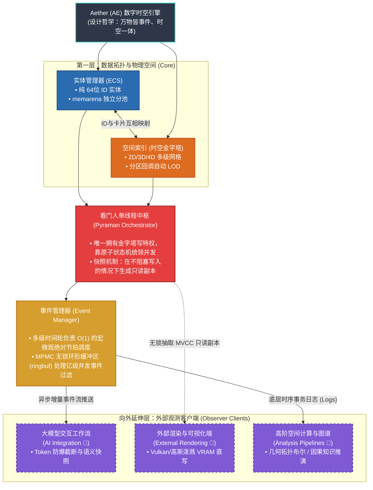
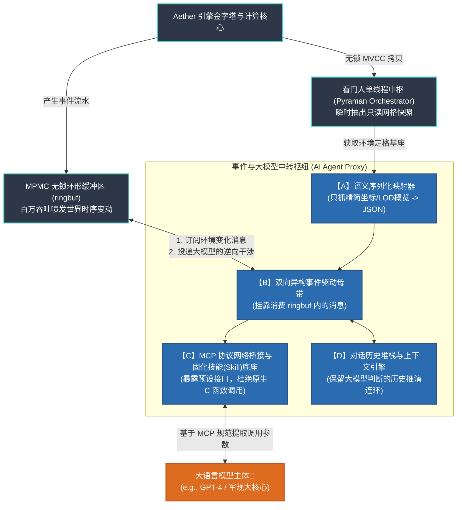

# Aether 时空内存引擎 - 完整技术白皮书

> 本文档由各分子文档合并生成，专供 NotebookLM / 大语言模型深度阅读与解析使用。

---


<!-- ============================================== -->
<!-- 文档来源: docs/01_philosophy/index.md -->
<!-- ============================================== -->

---
title: 架构哲学：世界模型索引器与数字时空引擎
description: 解析 Aether 五大物理运转模块协同与“世界模型”顶层架构哲学
sidebar_position: 1
---

# 概念总览与架构哲学 (Conceptual Overview)

> 核心价值观：“极简、透明、可控”
> 本节不涉及具体的 C 语言指针与并发代码，着重阐释基于此打造的 Aether (AE) 作为 **“底层世界模型索引器 (World Model Indexer)”** 的工程蓝图。

## 1. 顶层定位：高性能零依赖的时空内存引擎 (Spatiotemporal In-Memory Engine)

在业界对“引擎”一词的探讨中，许多开发者容易将 AE 与传统商用闭源引擎作平级对标，或者将其等同于传统磁盘型空间数据库（如 PostGIS），这实则是一种严重的层级错位。 传统游戏引擎往往是封装了材质、动画与垃圾回收的“生产平台管线”，而传统空间数据库在面对极高频并发计算时往往受限于磁盘 I/O。AE 的生态位是一个极其克制、不包含任何渲染绘制代码且**完全基于内存的高并发纯物理时空计算引擎**。

- **信创与极简部署**：引擎核心保持零第三方依赖，纯 C 语言铸造。这种极端极简主义赋予了 Aether 跨平台的绝对自由，极其轻量，能够无缝融入当前国家级“信创（IT Application Innovation）”操作环境与微型边缘计算节点。
- **低空经济的核心底盘**：在“莫干山实验室”等国家级重点课题（低空数智管控平台）中，AE 作为时空底座，全权接管包含 DEM 地形、航路、禁飞区、动态雷达气象流等海量多维“低空航图”数据的体素化吞吐，为飞行任务的高频审批与实时动态避障提供微秒级的内存计算支撑。
- **剥离视觉的观察者模式**：渲染引擎（不论是底层的 Vulkan，还是外置前端轻量级的 WebGL 库）在 AE 面前仅仅是一个通过快照接口读取数据的**观测客户端 (Observer Client)**。
- **拥抱 AI 的核心空间原语**：大模型 (LLM) 缺乏原生视觉感，但极度敏锐于离散金字塔网格。在 AE 架构中，大模型问答网络与图形渲染引擎是绝对平级的挂件，它们都仅仅是依赖时空图谱的**认知解读端 (Cognition Client)**。

## 2. 统一时空观：底盘与外挂管线协同图

AE 宇宙所有的物理规则推演与基础数据流转，全部被凝练成了底部 **5 个绝对解耦的内环大核心**，并以此向外衍生出 **3 大外部观测客户端 (Observer Clients)**：



### 1) 空间存放处：时空金字塔 (Spatial Index)
系统底层的“体素化”骨架，提供多层微观网格量化筛网 (2D/3D/4D)。无论对象大小皆有归属。这种被严格离散化的物理坐标格网，脱离了纯视觉光影范畴，天然地成为了**切合大模型 AI 进行空间实体认知、推理与寻路状态抽样的底层原生结构**。

### 2) 物体属性库：实体管理器 (ECS)
在世界层面彻底抛弃 OOP 的继承血统，物质只表现为一个被抽离的“纯粹 64位 ID”。所有附着于它的坐标、运动与生命数据，被水平拆解为“组件”，由自研 `memarena` 内存池按纯值类型在系统物理内存深处铺陈连通，以榨干多核缓存命中率。

### 3) 交通警察：看门人单线程中枢 (Pyraman Orchestrator)
系统独创的极限读写隔离屏障。在世界线上唯一拥有金字塔物理层真·写入特权的，仅有 Pyraman 单核线程。这从根源上斩断了各种锁争抢引发的树状死锁灾难。所有非此线程内的请求皆转为排队事件；而向外的环境输出探测，则依赖底层的**原子多版本快照机制 (MVCC Snapshot)**，无阻塞地扔出一份平行宇宙数据给外部的渲染与大模型探针。

### 4) 系统心脏节拍器：事件管理器 (Event Manager)
引擎的血管里流淌的只有**“事件”**。物理碰撞、AI 下达的全局指令，全数以指令包入列。它们借助**多级高精度时间轮**来精准执行微秒级的滴答节拍，并通过每秒亿级并发吞吐量的**MPMC 无锁环形缓冲区 (ringbuf)** 安全发往目标总线口。

### 5) 表现层与计算分析侧：完全解耦的外部观测客户端 (Observer Clients)
AE 只对极速且绝对正确的数据真相负责。由其底层快照管道倾泻而出的时空副本流，为外部世界留下了极其宽广的扩展纵深（这也是本文档 第 7 卷 与 第 8 卷 独立展开讲解的核心分工）：
- **外部渲染与可视化客户端 (External Rendering Clients)**：诸如基于 Vulkan 的图形层、VR 高斯泼溅前端等，全数被判定为绝对被动即插即用的专门影像投射器，它们仅靠从主存异步提取快照绘制画面，绝不干涉空间碰撞判定与系统回溯。
- **高阶空间分析管线 (Spatial Analysis Pipelines)**：诸如执行精细化拓扑挖孔裁剪的 `libclipper` 解析几何系统，或是以大模型 (LLM) 推演算法构建的 **关系语义知识大脑**，均作为各自独立的逻辑演算外设，悬浮在时空引擎物理底盘之外，按需消耗底层释放出的数据结论。

## 3. 核心设计哲学溯源

AE 引擎的底层架构并非围绕各类应用层功能（如材质流或地形系统）去作被动堆加，而是从底向上去构建出一套统一的物理规则世界观：

- **时空一体，重塑底层骨架 (Spatiotemporal Anatomy)**
  在基础定义上，引擎抛弃了传统三维引擎极其复杂的场景图派生树结构 (Scene Graphs)。系统将“空间”定义为覆盖多维架构的时空金字塔网格定位（2D/3D/4D），将“时间”锁定为纳秒级多层时间轮（Timing Wheel）的心跳节拍。空与时的坐标闭环，将复杂的空间实体关联问题降维为纯数学尺度的网格离散化处理，重塑了业务处理的数据骨架。
- **万物皆事件，让衍生状态自发运转 (Universal Event Driven)**
  传统的直接模块横向函数调用链（Function Calls）在内核中被彻底禁止。引擎视一切改变世界状态的行为（甚至仅是对网格局部的“观察查询”请求）为“事件”。借由百万级并发吞吐的无锁 MPMC 环形缓冲总线进行管道分发，使得模块仅凭订阅而非直接干涉执行。此举不仅在架构根源上斩断了交叉多线程带来的死锁塌方，还令一切系统运转状态变为了绝对可序列化的流水线（Transaction Log），从而天然具备了 **全态仿真回滚与时光回溯 (Snapshot Replay & Rollback)** 的极佳工程基础。
- **极简与业务解耦：去渲染核心化 (Coreless Decoupling)**
  作为一款运行时“引擎”，AE 最反直觉的特性是其架构内部彻底封死了所有的图形管元绘制代码。它退居幕后，只负责回答“在何时、何地、存在何种数据对象”这一唯一真理问题。这种纯净的时空底盘设计，使其借由看门人（Pyraman Orchestrator）向外界不断抛出无阻塞只读快照时，完全不再受制于外部消耗端（比如 Vulkan 显卡渲染器或是大模型推理节点）的技术栈更迭。这种剥离，保障了引擎内核在一切技术更替浪潮中保持着绝对的原生稳定性。
- **数据结构不可知论：零侵入式的扩展沙盒 (Data Structure Agnosticism)**
  在传统的空间系统（如 Unity 或 PostGIS）中，开发者往往被迫将自身复杂的业务对象序列化或强转为引擎规定的特定类和数据容器（如特定的 `Geometry` 或 `FVector`），这种削足适履引发了极度高昂的内存拷贝与对象污染。Aether 在此确立了霸道的“盲盒边界”：引擎不对外部对象的业务数据结构做出任何假设，它只需要一个绝对精简的 64 位 ID 和一个粗糙的外包框 (AABB) 就足以驱动亿级吞吐的网格预筛选；一旦底层触发空间事件边缘碰撞，引擎绝不尝试去解析对象内容，而是仅仅将纯粹的 ID 指针抛回给业务插件的回调函数 (Plugin Callback)。这种极致的界限感，让航空、智驾或军工客户在接入极速网格索引的同时，保留了 **100% 的内存控制权与数据结构自主权**，彻底实现了“Bring Your Own Algorithm/Data”。

## 4. 双时空坐标系融合 (GIS + Game)
系统通过统一的底层时空索引提供两种平行坐标系的原生转化支撑，实现大环境与微观状态的事件交织：
- **GIS 模式**：基于经纬度与相对高程，金字塔逻辑自动贴合大地坐标系体系，适配数字孪生与全球级宏观地形架构需求。
- **Game 模式**：基于笛卡尔三维坐标系计算向量，支持区域室内、开放场景等局部精度要求极高的场景。
- **跨域联动**：宏观 GIS 天文/天气触发事件可通过事件系统直接下沉转化为微观 Game 实体关联交互事件，完成跨尺度仿真。

## 5. 架构特性对照规范
以下为 AE 索引流中枢设计相较于全量封装平台（如 Unreal / Unity）的底层技术实现界线对比：

| 底层维度 | Aether 时空中枢（纯 C 结构体系） | 传统商业引擎平台 |
| --- | --- | --- |
| **状态推进机制** | 纯事件驱动，所有变化归结为系统状态机内的独立因果序列 | 大量依赖模块化组件之间的显式函数直接调用与深层代码耦合 |
| **存储管控** | 布局结构 100% 透明，一切分配交由底层池 (`memarena`) 接管 | 内存由内部封闭封装管理，高频涉及会导致 GC (垃圾回收) 中断抖动 |
| **空间形态** | 原生覆盖 2D/3D 并在同框架底层伸展 4D 时延索引架构 | 在传统 3D 之外独立构建时间轴管理（类似 4D）往往会演变出极重的业务重算与录制层 |
| **内部并发控制** | 原子标志、状态机搭配无锁管道，并发负载始终控制在用户态 | 使用高代价抢占互斥锁与 OS 级繁重任务分发框架 |
| **关键任务审计性** | 满足纯 C89/C11，避开黑盒环境宏汇编依赖，可胜任高规格审计 (DO-178C) | 含庞杂的第三级抽象环境或隐藏依赖，安全审查链极度封闭 |

## 6. 大模型协同：上下文窗口灾难 (Context Overflow) 治理机制
在尝试将超大规模空间系统（如城市级孪生环境）的物理坐标直接接入大语言模型 (LLM) 进行感知与控制决策时，原生网格系的全量输出势必会导致大模型出现 Context Token 瞬间溢出，并引发由于注意力失焦产生的过度“幻觉”。Aether 架构在此复杂场景下表现出了天然的统筹治理能力，利用自身的结构特质将海量空间信息转化为浓缩后的 JSON 语义集：

- **LOD 宏观截断与按需下翻 (Pyramidal LOD Filtering)**：大模型初始化时不需要直接面临千万级的底端叶子节点。系统可以通过空间金字塔先为 AI 推送顶段宏观层（如 Level 2/3）的广域状态提要（例如提供类似“A区域实体激增，B区域稳定”的高阶抽象信息）。当大模型推理确认关注焦点时，再通过反向发起 `pyramid_query` 实施视角的微观化下探索取，达到空间上的 **按需加载机制**，大幅节省 Token 带宽。
- **天然的矩阵空洞剔除 (Sparse Storage Padding)**：得益于金字塔底结合哈希桶结构的极端稀疏特质，一切不存在映射实体的无效空旷网格和坐标天空，均在向大模型转化串行序列化时被底层结构自动忽略。这从物理层上避免了大量无意义的空间假阳性 (False Positives) 灌入 AI 前端。
- **时间侧的增量事件投喂 (Incremental Event Streams)**：借助引擎底座强大的“万物皆事件”流体系机制，LLM 模型除了在初次接入时获得一份完整的空间状态基线副本，后续持续消耗的全是由 MPMC 管道喷发而出、极度微小的确定性差量信息（如 `ENTITY_MOVE` 实体相对位移增量事件）。这完美复刻契合了如今主流会话模型的增量轮次理解机制，从源头消除了高频的无用全量数据回送重绘。
- **硬件计算隔离保护 (Computation Decoupling)**：引擎底端严控了物理计算界限。对于密集的解析测量（包括图形布尔计算、雷达穿透拦截、相切判定），完全阻隔在底层的 C 代码管线闭环内部消化。最终上抛给大模型的仅仅是高纯度的语义结果快照（诸如 `{"event": "collision", "targets": ["id_1", "id_2"]}`）。模型处理的只剩归纳性的执行结论集，无需在浮点坐标系的算力迷宫内徒耗自身推理能力。


<!-- ============================================== -->
<!-- 文档来源: docs/02_quickstart/index.md -->
<!-- ============================================== -->

---
title: 快速上手与实战指南
description: 探索并配置极简的物理世界模拟闭环
sidebar_position: 2
---

# 快速上手与实战指南 (Quickstart & Practical Guides)

技术文档的成功与否很大程度上取决于其初期的学习曲线。本章节提供一套**渐进式的上手机制**。

## 为什么选择 Aether？(Value Propositions)

作为开发者或架构决策者，在刚接触 Aether 框架时，抛开底层复杂的数学原理，您和您的业务团队将直接获得以下 **4 大颠覆性的工程红利**：

### 1. 资产绝对保全：极其霸道的“零数据侵入”
**在 Aether**：我们极度克制，坚决不碰您的业务数据。您只需要把引擎当作一个“极速空间外挂”。**您的祖传机密算法原封不动**，接入 Aether 重构成本近乎为零。您无需继承任何引擎提供的臃肿基类对象。

**示例体会：完全解耦的数据推送**
```c
// 您的私有、极其复杂且涉密的业务数据对象（引擎甚至不知道它的存在）
struct SecretDrone {
    double ai_tensor_weights[500]; // 机密的神经网络权重
    char pilot_name[32];           // 业务飞手信息
};
struct SecretDrone my_drone;

// 将无人机的空间外包框传给引擎即可，用一个 64位 ID 建立绑定
uint64_t drone_id = 9527;
float bbox_min[3] = {10.0f, 20.0f, 100.0f};
float bbox_max[3] = {12.0f, 22.0f, 101.0f};

// Aether 引擎只接受空间坐标与 ID 锚点，它绝对不会去 Copy 哪怕 1-byte 您的 SecretDrone 结构！
ae_pyramid_insert_box(pyramid_ctx, drone_id, bbox_min, bbox_max); 
```

### 2. 人才结构降维：用“普通开发者的成本”写出“千万级高并发”
**在 Aether**：引擎在内核深处已经把所有极度复杂的并发调度处理得干干净净。向您释放的，是如同流水般清晰单向的“事件回调”。**从此，您的团队只需会写最简单的单线程业务逻辑，就能在宏大的城市级沙盘中斩获顶级算力**。

**示例体会：天下无锁的单线程回调处理**
```c
// 这就是你的一线业务开发者要写的全部代码（完全没有任何互斥锁 mutex 或原子等待的代码污染）
// 引擎内核已经把并发碰撞过滤干净了，只会极其安全地按序投递给你
void on_drone_collision(uint64_t id_A, uint64_t id_B) {
    // 根据安全传回的 ID，去您自己的内存地址里拉取回业务对象
    struct SecretDrone* drone_a = get_my_drone(id_A);
    struct SecretDrone* drone_b = get_my_drone(id_B);
    
    // 执行您的单线程紧急避让逻辑代码，毫无底层心智负担
    execute_avoidance(drone_a, drone_b); 
}

// 注册回调，剩下的高并发网格大逃杀检索全交给 Aether
ae_subscribe_event(EVENT_COLLISION, on_drone_collision);
```

### 3. 稳如磐石的系统沙盒：前端哪怕画风崩损，底层绝对不死机
**在 Aether**：我们确立了极度严苛的“黑盒读写界线”。无论是酷炫的虚幻/Vulkan 渲染框架，还是最前沿的大模型，在 Aether 面前都只能作为“只读旁观者”存在。这确保了主线物理推演**永远以全速且不受干扰的姿态运转**。

**示例体会：完全异步的无阻塞上帝快照**
```c
// 在引擎的另一侧扩展管网中，或者在另外一台负责 3D 渲染/AI 的微服务机器上：
// 渲染大屏不管卡顿到只有 10 帧，还是 AI 大模型因为网络原因思考了 5 分钟
// 它也只能通过此接口“抽走”那一瞬间的副本，Aether 的核心时空引擎依然向 800万次/秒 的吞吐上限狂奔
const ae_snapshot_t* read_only_world = ae_take_snapshot_async(engine_ctx);

// 渲染器基于快照慢慢画，哪怕崩溃了也绝不会拖死引擎的一丝一毫
vulkan_render_frame(read_only_world); 
```

### 4. 极致轻盈与信创自由：把“超算能力”塞进低端盒子里
**在 Aether**：零第三方庞杂依赖，纯正透明的 C 代码结构。从百万级服务器的云原生节点，到算力匮乏的无人机边缘计算板端，甚至是要求极度严苛的**纯国产化信创操作系统**，Aether 都能像水一样无缝渗入。

**示例体会：极致干净的集成部署**
```bash
# 不需要配置庞大的 Java JVM 虚拟机，也不需要动辄几十万行的构建树环境依赖
# 只要带上头文件，极简的动态链接库即可在任意环境（ARM/x86/MIPS）秒级起飞
gcc my_business_logic.c -laether_core -O3 -o my_server

# 零依赖包袱，直接在新安装的国产化“银河麒麟 OS”低空指令机里极其低调地运行
./my_server 
```

---

## 最小可行性示例 (Minimum Viable Example)
> 核心原则：“代码先行，解释在后”

本节将提供可直接利用 C Compiler (`gcc`/`clang`) 编译并观测到终端输出的代码闭环，流程紧扣以下步骤：

1. **初始化 `memarena` 内存池** (底层依赖注入)。
2. **建立基于事件的循环调度器** (Event Loop 构建)。
3. **创建 ECS 组件注册表** (无原型架构的数据布局骨架)。
4. **划分金字塔空间网格系统** (环境拓扑框架建立)。
5. **注入体素化物理对象** (构建极简的三维物体测试)。
6. **触发事件回调观测执行** (利用网格更新事件展示空间变换)。


<!-- ============================================== -->
<!-- 文档来源: docs/03_core_subsystems/01_spatial_grid.md -->
<!-- ============================================== -->

---
title: 空间网格与回调机制
description: 剖析金字塔层级、LOD 适配与彻底杜绝假阳性的几何映射机制
---

# 空间网格与体素化计算 (Spatial Grid)

> 🔗 **对应底层代码库：** `common/pyramid.h`, `common/pyramid2.c/h`, `common/pyramid3.c/h`, `common/pyramid4.c/h`

> Aether 的空间核心是一套多级网格空间索引结构，将世界坐标按尺寸自动分层存储，彻底抛弃传统四叉树或R树的遍历消耗，并原生地支持无限细节层次 (LOD)。

## 1. 核心层级拓扑与参数映射
在 Aether 的金字塔定义中，层索引 `l` 从 0（最粗顶层）向下递增。
第 `l` 层的世界范围在每个维度被均分为 $2^{l+1}$ 份。
以 2D 为例，网格数量依层级呈指数级增长：第 0 层 4 个网格，第 10 层高达 4,194,304 个。网格坐标系与世界坐标系方向绝对对齐。

系统底层原生支持不同物理维度体系的时空网格划分，并且各维度结构均共享同一套基础的**分区回调机制 (Partition Callback)**，使开发者免于处理维度更迭带来的数据复杂度：
- **2D 索引**：支撑底盘平面建图、UI 虚拟平面分布等基础二维场景。
- **3D 索引**：支撑三维世界地图、城市级立体建筑模型群落。
- **4D 索引**：在三维立体常数体系上进一步外拓时间维度。该架构直接用于统管时变对象（如载具物理重影位移、沉降状态的动态地形图幅）。支持系统级跨时延查询能力（例如处理类似请求：“拉取过去两小时内跨越此处三维坐标区间域的所有记录点位”）。

## 2. 自动层级选择算法 (Auto Level Selection)
插入图形时，Aether 并不要求死板的逐级检测，而是采用高阶统筹算法，计算图形外包矩形 (Extent) 在每一层覆盖的网格数 $c(l)$：
1. **逆向回溯**：从最底层向顶层遍历，记录 $c(l)$。当 $c(l) \le 4$ 时，进入判定。
2. **停止回溯条件**：若出现层索引 $m > n \ge l$ 且 $c(m) = c(n)$，表明网格覆盖数量首次停止减少，即确定 $n$ 为图形在金字塔中存储的最佳层级。
3. **顶层兜底**：若 $c(m) < c(n)$ 持续减少，则最终直接越区升至根节点第 0 层。

经过该算法后，图形占据的网格必定只有 **1个、2个或4个**。对于覆盖 4 个网格的情况（例如图形处于坐标交界处而占据的“假阳性网格”），在视锥查询或碰撞时，通过精确的相交测试将其剔除，从而确保检索的极高命中率。

## 3. 跨网格实体的“引用计数”牵引机制 (Cross-Grid Reference Counting)
在处理跨越极大空间范围的实体（如同横跨上百个网格的异形高架桥、超长的风筝线或航线）时，Aether 绝不采用“由于跨区所以将几何体硬性切断”的愚蠢机制。系统引入了极为优雅的“主卡片（Shared Card）”与“子卡片（Part Card）”解耦设计：

- **主卡片（Shared）**：存储图形核心数据的共享内存块，附带由底层架构自动维护的**引用计数（Reference Count）**。值得强调的是，引擎对主卡片内容保持“盲盒态”，不保存任何具体的三角形序列，只关心其大类与包围盒。
- **子卡片（Part）**：存放极为轻量的空间索引指针。当一个庞大图形覆盖多个底层叶子网格时，Aether 仅仅是在这数十个叶子网格中散播含有底层指针的子卡片，它们全部指向唯一的那个主卡片共享内存。

**局部受检，牵引全局**：当调用 `pyramid_insert` 插入异构大图形或在特定网格发生体素碰撞时。只要局部的某一个网格子卡片受检（诸如无人机在此网孔擦过了高架桥的某一边缘），引擎便能通过底层指针瞬间提拉起整个庞大实体的宏观轮廓进行全局结算分析。这使得金字塔在向下落盘与拆解过程中实现了绝对的**零冗余拼接、零数据多态拷贝 (Zero Data Copy)**，彻底终结了长跨度物件的更新和检索噩梦。

## 4. ID 逆向映射网络 (哈希桶基座复用)
为了极速响应引擎的更新与销毁事件，用户注入的 64 位 `real_id`（最高位 bit 63 保留做系统标志）必须能以 $O(1)$ 的时间复杂度逆向追踪到它所属的卡片位置表。

- **零额外内存的哈希底盘设计**：Aether 直接且极具架构美感地 **复用金字塔的“最底层细粒度网格”作为巨型分布式 Hash Bucket (哈希数据桶)**。
- 借由这千万量级（如 16,777,216 个网格）的巨无霸天然底层，库仅在存在对象存在的网格实体上按需创建哈希表链条结构（完美结合了 ECS 稀疏属性）。其庞大基数使得 Hash 冲突链长长期维持在 $\approx 1$，带来了极致稳定的 $O(1)$ 回查效率。

## 5. 多层架构的并发剥离界限
需要特别声明，金字塔底座本身：
> 不提供、也绝对不引入任何线程并发加锁的安全机制。

在这套“数字时空引擎”的整体架构图中，保护这堆空间数据的并发职责，已经被极其精准地剥离，并上移交给了外部的 **事件管理器** 以及 **MPMC 无锁环形缓冲区** 去统筹调度。这也是为什么它能够单线程跑出恐怖数值的绝对本源。

## 6. 体素计算与传统几何计算：融合架构范式
相较于传统引擎完全依赖高精度解析几何的方式，AE 的架构主张将“体素化离散计算”与“传统连续几何”分离，并基于各自优势建立共存调用关系：

- **体素化初筛 (Aether Grid)**：专职于宏观结构体系感知。依靠多尺度的离散状态网格执行系统极低吞吐开销内的碰撞排查、宽泛遮挡遮蔽计算和海量对象的高频移库处理。这种可结构化的矩阵点位张量也是提供给大语言模型 (LLM) 进行空间逻辑认知推演的高效标准接口。
- **极值几何定点 (Traditional Geometry)**：专职于高精度的微观物理轮廓计算。对于细致入微的布尔图形裁剪运算、实体轮廓外沿解析、线型求交与拓扑图矢量输出，底层通过脱耦合接口抛挂诸如 `libclipper` / `libtess2` 等连续几何计算库执行专项攻坚作业。

体素负责宏观与 AI 状态初选控制，解析几何负责边界物理拓扑定调。双体系实现各自领域内的资源利用最大化。

## 7. 架构剖析：空间索引库选型对照

与当前业界主流采用的四叉树 (Quadtree) 以及 R 树 (R-Tree) 相比，基于金字塔层级解决超大规模海量动态目标的差异化表现在于其结构映射机制：

| 特性维度 | Aether 金字塔索引 | 传统四叉树/八叉树 | R 树 (R-Tree) |
| --- | --- | --- | --- |
| **LOD 原生支持** | 层级自然对应细节空间跨度，自动具备剔除裁剪特性 | 需要额外去构建并维护多套并行的细节映射层 | 无直接的内置多层级 LOD 能力 |
| **动态坐标更新成本** | 借由 ECS 组件定位查引重刷，平推消耗锁定 **$O(1)$** | 频繁位置跨越会导致树重组爆发极高的时间开销 | 重构包裹树、拆页导致性能呈现震荡波谷 |
| **目标区域解构机制** | 特有**分区回调 (Partition Callback)**，自动裁解子级部分 | 将目标视作不可分割界限盒 (AABB Bounding Box) | 纯包裹，缺乏结构探视与拆分下发机制 |
| **实体生命域融合** | 每个网格单元实质作为一个 ECS 实体，实现原生逻辑连通 | 须通过外部逻辑 Handle 持有并关联构建跨域映射 | 绝对独立于 ECS 或主对象系统外挂执行 |


<!-- ============================================== -->
<!-- 文档来源: docs/03_core_subsystems/02_archetypeless_ecs.md -->
<!-- ============================================== -->

---
title: 无原型 ECS 与轻量内存池底座
description: 按类型分池存储架构及其背后的常数性能收益解析
---

# 无原型实体组件系统 (Archetype-less ECS)

> 🔗 **对应底层代码库：** `common/ecs.c/h`, `common/refcobj.h`

与开源界（如 `flecs`, `EnTT`）盛行的根据**原型 (Archetype) 匹配**进行实体连续迁移的做法截然不同。Aether 本着拒绝任何不可控操作的思想，设计了最为扁平化的结构底座。

## 1. 原型迁移成本风暴
传统 ECS 中动态增删改查组件需要巨大的结构体搬运开销，在千万级并发金字塔场景中将引发灾难般的灾难（Cache Thrashing 卡顿颠簸）。

## 2. “按类型分池连续存储”布局 (Type-specific Pools)
- **连续内存分配 (Contiguous Storage)**：放弃结构原型的聚类（即传统的 AOS），选择直接在 `memarena` 内给不同的组件分别开辟独立的数据池。同类组件形成紧密连续字节排布，确保遍历时的 CPU L1/L2 缓存命中率趋近满载。
- **极简状态位阵列**：抛弃繁复的特征移位运算，直接为每一个实体分配 1 字节标识位序列（1-byte Flag）用于判定目标组件装载与否。赋予或剥离一个组件时仅更改标记，执行复杂度收敛于绝对的 **$O(1)$**。
- **卡片引用与零开销复用**：系统层级开放主数据卡和子索引卡的引用计数共存能力（Reference Counting），使得在同类大体量逻辑模型之间切分模块时彻底杜绝了基础属性矩阵的多份重复拷贝。
- **关联迭代提升 (Sparse Sets)**：当数据产生高段疏离时，该体系能够支持调起稀疏集运算对实体序列执行过滤。其步进遍历的复杂度因此缩减至仅与 **$O(有效载荷数)$** 正相关。

## 3. 内存布局的透明度收益 (SIMD)
- 直接通过算得固定的偏移指针进行操作。
- 借助 SIMD 指令批量压制 `Transform Matrices` 和 `Draw Commands`，利用最极致的 C CPU Cache-Prefetching (缓存预取) 指令提升吞吐。


<!-- ============================================== -->
<!-- 文档来源: docs/03_core_subsystems/03_event_timing.md -->
<!-- ============================================== -->

---
title: 事件总线与分层时间轮
description: $O(1)$复杂度、八级联动的纳秒定时调度核心机制
---

# 事件驱动架构：事件总线与高精度时间轮 (Event Bus & Timing Wheel)

> 🔗 **对应底层代码库：** `common/taskwheel.c/h`, `common/hitimer.c/h`, `common/timeapi.c/h`

**"在 Aether 的宇宙中，一切物理规则的推演只通过投递标准格式的事件流水，彻底抛除阻塞式的跨界函数指令（Function Call）。"**

纯 C 环境缺乏原生协程与闭包能力。但在 AE 这种超高并发的时空引擎中，如果任由模块互相“发号施令”进行接口调用（例如：*物理判定模块一旦碰触即立刻拉起甚至挂起渲染管线的刷新重绘*），系统必将迅速退化为死锁横生的共享内存乱麻。

## 0. 架构本源：基于发布/订阅的事件流水账 (Event Ledger)

Aether 彻底改变了软件世界互相耦合的网状模型。我们将所有改变或探测时空状态的切点统统定格为 **“物理事件 (Events)”**（这甚至包括外部显卡只读了一次地图网格，也要提交 `VIEW_REQUEST` 对象）：

1. **统一的投递缓冲池**：任何模块（无论是 AI 下令还是物理惯性碰撞）都不再直接互控。这些意图全部打包为仅数十字节的 C 结构体变量，掷入单向的公共缓冲池中。
2. **旁观订阅式削峰 (Publish-Subscribe)**：依赖于无锁架构 MPMC (`ringbuf`)，各路负责善后的业务引擎不再排队等锁，而是像“提取新闻流水通稿”一样只订阅自己负责处理的事件码（例如物理系统仅捞取 `ENTITY_MOVE`）。这种零依赖的分流处理，是将数百万海量图元运转维持顺畅而绝无卡顿的底层奥义。
3. **原生时光回潮 (Native Time-Reversal)**：既然庞大脑海图的兴衰全是一条笔直、有序的时序事件账单，这就赋予了 AE 极具战略杀伤力的工程属性——只要针对事件执行**倒序重排流转队列 (Snapshot Reverse Replay)**，不仅能在海量复杂崩溃现场找到第一现场的 Bug 罪魁祸首，更能以极其廉价的开销在沙盘推演中完成无缝的“时光倒流”！

## 1. 核心循环节拍拆解
文档建议使用类似 `libuv` 的模型：
- **第一步**：捕获纳米级高精度时间节点。
- **第二步**：检索层次化时间轮清理到期任务事件。
- **第三步**：通过原子轮询探查无锁环缓冲 (Lock-free MPMC) 内待处理。
- **第四步**：派发网格解构带来的海量数据组件更新。
- **第五步**：收尾并执行积压数据的 ECS 组件属性的脏清理同步 (Dirty Mask Cleaning)。

## 2. 层次化定时器结构的设计优势
事件总线使用多级时间轮架构，通常按标准配置部署 8 级嵌套结构（每层部署固定的 256 卡槽位）。
- **静态时间复杂度收益**：彻底杜绝传统任务系统 `Min-Heap` (小顶堆) 在面对突发海量规模数据注册时产生的树重排结构损耗。所有事件的散列插入或到期核查操作皆稳固在 **$O(1)$**，具备硬实时的调度保障。
- **跨数量级跨度统筹**：微观层面上支持纳秒、微秒级的实时刷新回调定位，宏观层面上也能完美容纳需要静滞数月乃至跨年演进的大型物理休眠推演周期。
- **明确边界管理的事件句柄**：架构从“侵入式”链表节点设计剥离。开发者在触发调度前即可凭借池化分配独立掌控对应的事件管理句柄资源。不仅具有事件的触发效能，同时确保外部调用逻辑能够在未响应期通过该句柄精准实现事件的**安全撤销 (Cancel)、逻辑推迟或是重定义归组。**

## 3. 函数指针与上下文安全契约 (User Context Data)

```c
/**
 * @brief 空间体素状态更新事件通知回调函数。
 * 
 * @param event 包含发生坐标及触发因子的不可变事件数据状态。
 * @param user_data 开发者注入的自定义业务上下文地址。
 * 
 * @warning 该回调将在无锁队列的消费线程中由于事件触发而在独立的调度期中异步拉起。严禁阻塞式系统调用（如死锁互斥、原生阻塞 I/O）。
 */
typedef void (*voxel_update_cb_t)(const voxel_event_t *event, void *user_data);
```

所有权由调用栈明确掌控，以避免 `user_data` 指向已销毁的作用域局部栈内存和被 `memarena` 收回的地址，严防崩溃血崩。


<!-- ============================================== -->
<!-- 文档来源: docs/03_core_subsystems/04_concurrency_and_memory.md -->
<!-- ============================================== -->

---
title: 无锁并发与内存竞技场
description: MPMC环形缓冲与竞技场内存池的生命周期深度融合解析
sidebar_position: 4
---

# 无锁并发与内存竞技场 (Concurrency & Memory Arena)

> 🔗 **对应底层代码库：** `common/ringbuf.c/h`, `common/ringbufst.c/h`, `common/rwlock.c/h`, `common/memarena.c/h`, `common/memalign.c/h`, `common/mmaphuge.c/h`

在千万级以上空间事件高压突发的场景下，系统调用级别的互斥锁与内存分配碎片是灾难性的。Aether 跳出了传统的线程独立加锁与堆分配分离的平庸设计，将**控制流（MPMC 无锁环形缓冲区 (ringbuf)）**与**数据流（连续内存池分配器 (memarena) 生命周期转移）**无缝合拢，彻底打通一条坚不可摧、免受操作系统强制调度中断的钢铁总线基石。

## 1. 控制流基脉：MPMC 无锁环形缓冲区
与传统采用 `std::mutex` 或 `pthread_mutex_t` 对队列加锁的设计截然不同，这构成了真正的无锁输送带：
- **多生产者多消费者模型**：支持海量网格系统线程同时投递事件，以及消费线程进行纳秒级摄取。深入依赖 C11 标准原生的原子 Compare-And-Swap (CAS) 和 Acquire/Release 强内存顺序，保证在不进入内核态睡眠的情况下安全流转数据。
- **并发回退削峰 (Contention Backoff Strategy)**：针对高并发下极端的自旋碰撞 (Spin Contention)，在遭遇写冲突雪崩时运用指数退避 (Exponential Backoff) 和微架构级的 `pause` 汇编指令来降低功耗与总线发热，避免常规锁护送效应 (Lock Convoy)。
- **并发安全与线程死锁免疫**：传统架构在复杂的金字塔网格边界切换并触发跨层重排时极易死锁，而本系统由于事件状态流仅仅是环形槽位上的掩码状态机（Status Flags），其本质上是免疫线程死锁的。

## 2. 核心调度：看门人单线程中枢 (Pyraman Orchestrator) 与快照机制
传统引擎多线程频繁读写树状金字塔极易引发死锁与数据污染，Aether 为此独创了名为 **看门人单线程中枢 (Pyraman Orchestrator)** 的架构设计：
- **唯一的写特权收拢**：系统将并发瓶颈极限收拢，世界上“唯一拥有金字塔修改权限”的仅有 Pyraman 所在的单核心线程。外部所有的并发写意图均转化为事件流，投入 MPMC 无锁环形缓冲区 (ringbuf) 交收给看门人入库序列化。
- **主循环优先级层控**：为保障稳定性，看门人的执行周期严格遵循静态排程。主循环依次按固定的优先级轮询处理执行序列：**1. 外部事件队列 -> 2. 内部修改队列 -> 3. 时间轮定时器触发**，从底座确保紧急度隔离。
- **并发只读快照 (MVCC Snapshot)**：针对外部同时涌现的海量读取请求（如 AI 雷达扫描或外部渲染端取帧），看门人在处理到观察事件时，会瞬时生成一份“无锁只读世界副本”。通过只读引用计数发放给所有观察者，完全切断了读写干涉。

## 3. 数据流归宿：极简受控连续内存池分配器 (memarena)
系统级引擎运转时绝对禁止在基础业务环内直接调用原生的堆栈申请指令 (`malloc`/`free`)。所有的对象产生与回收须纳入完全客制化的基础内存器进行防碎片锁控：
- **微米级分配与尾栈隔离 (Tail-stack Recorder)**：内存分配策略取消前端头部存储，反而是在系统块的底尾反向建立栈区记录独立区块界线以及释放标识位（Flag）。巧妙利用此类“书籍与纸张页”般的上下记录拓扑，消弭了间接开销。配合底层的纯原子变量 (Atomic Variables) 替换互斥锁，单核心吞吐可在此死保 $\approx 8$ 纳秒（800万次+/秒）的坚固下限。
- **任意顺序解绑与状态回迁**：摒弃单纯的 LIFO 堆栈操作限制，该机制支持内存块打乱流水顺序独立触发标志挂牌与释放；系统底层依靠状态标识回退以及局部区块重编算法执行内存空间清洗，并逼近期内释放 $O(1)$。这种“后申请也能先释放”的特性极其贴合作业流。
- **双向多页池环网机制**：运用双向循环链表指针来整合不同类型的物理页区（Onion / Bitmap / Huge）。其内置惰性垃圾结构回收路由策略，为大体积实例数组（尤其是高频生成的时空体素网格）瞬间落盘确立连续空间匹配。
- **大页内存拦截与零碎片定海神针 (Huge Pages mmaphuge)**：当面对极度密集的空间数据（如亿级 DEM 体素格或全域动态气象）吞吐时，传统操作系统的 `malloc` 及 4KB 页表转换缓存 (TLB) 将遭遇灾难性的穿透未命中和内存碎片化。Aether 内嵌了透明的大页支持（基于底层 `mmap` 直接索取 2MB/1GB Huge Pages）。所有体素金字塔底层分配直接绕过 libc 堆区，由 `memarena` 以 Chunk 为单位按标准大页边界接管。这确保了在低空航图运行时物理内存绝对线性连续，永不碎片化。
- **跨存储层级极速周转流映射**：借助前述的严格连续内存池与大页管理，系统能以极度优雅的姿态在显存 (VRAM) 中创建等价存储结构，甚至通过网络 Socket 向外侧 `git-city` 等 JS 前端抛出体素对象时，达成免反序列化的极速零拷贝（Zero-copy）透传流转。

### 内存管理库选型性能对照
面对追求极致确定性的临时级内存突发频次（特别是单帧数百万量级绘制矩阵群瞬时派生与注销），`连续内存池分配器 (memarena)` 精简了泛用型开源管理器为支持复杂跨线程生命周期所作的深层架构，换取了绝对意义上低开销的小组件吞吐下限：

| 评估指标 (Release) | 连续内存池分配器 (memarena) | jemalloc | tcmalloc | mimalloc |
| --- | --- | --- | --- | --- |
| **基准单次分配用时** | **$\approx 8 ns$** | $\approx 12.3 ns$ | $\approx 9.8 ns$ | $\approx 10 ns$ |
| **空间释放回收机制** | 记录标记结合堆栈指针批量回退 | 依赖专属线程内缓存结构的渐进合并 | 基于线程级别的数据缓存区 | 融合局部乃至全局态的数据缓存列 |
| **无序释放限制条件** | 允许 (`free` 操作可打乱流水出入栈序列) | 支持 | 支持 | 支持 |
| **异构空间接手范围** | 允许承接硬性外部物理层（如直接捕获映射文件页、显存） | 需依赖系统抽象层的堆空间请求 | 依靠常规系统堆区分配 | 依靠常规系统堆区分配 |
| **库底层代码部署规模**| 精简至 $\approx 800$ 行规模，完全剥离系统抽象 | 远超 $25,000$ 行复合结构 | 超过 $18,000$ 行源码 | 超过 $12,000$ 行源码 |

## 4. 共生的绝对限制契约：高压生命周期所有权 (Memory Ownership)
当缺乏闭包和对象绑定的 C 环境进行无锁交互时，稍有不慎即会由于转移错误诱发 **Dangling Pointers** 与 **Double-free**。必须在 Doxygen 贯彻以下严格的生命周期语义契约：
- **3.1 分配持有 (Allocate & Own)**：获取对象的绝对所有权（如 `sys_arena_alloc()` 返回），开发者通过在循环尾帧进行水位线回撤 (Watermark Rollback, $O(1)$) 进行批量安全回收处理。
- **3.2 借用引用 (Borrow Reference)**：指针只读传递 (如 `void calc_bounds(const entity_t *e)`) 期间，底层严禁越权将其赋值储存于外部全局堆栈，禁止内部执行释放逻辑。其所有权仍在原始分配的 Arena 事件内。
- **3.3 转移消费 (Transfer Ownership)**：传入接口的值 (如 `void system_consume(data_t *d)`) 意味着它在业务调用栈中生命期即刻宣告逻辑终结。即使底层尚未触发批量释放，业务层流转也不再允许其被安全利用。


<!-- ============================================== -->
<!-- 文档来源: docs/03_core_subsystems/index.md -->
<!-- ============================================== -->

---
title: 核心子系统内核
description: 确立四座核心基石作为纯碎底盘计算内核的边界
sidebar_position: 1
---

# 核心子系统内核 (Core Engine Kernel)

本目录下的四份文档（空间网格、无原型 ECS、事件时序、无锁并发与内存）共同构成了 Aether 最底层的 **“计算内核 (Kernel)”**。

需要明确的是，这四项核心机制本身并__不__是一个可以直接对外暴露以供客户或大模型调用的应用服务。它们就像操作系统的基础内核一样，完全沉降于底层，只负责解决最硬核的技术泥潭：
- 极其严苛的物理内存分配与大页安全管控。
- 处理极高并发撞击的无锁队列环形调度。
- 将现实世界实体坐标进行离散体素化的纯净数学运算。
- 掌控微秒级物理事件流刷新的绝对节拍。

**内核的物理界线**：
Aether 计算内核中绝对**不包含**任何具体的网络通信协议栈代码、特定的业务审批逻辑（如航路如何验证），以及外层可视化的交互组件。

在真实的交付场景下，这套纯净高吞吐的运算内核会被紧密包裹，向外**封装成一个独立的宏观 Aether Server 服务**，继而才通过网络接口真正向外部的低空管控中心、大语言模型 (LLM) 以及前端呈现器提供服务响应能力。


<!-- ============================================== -->
<!-- 文档来源: docs/04_api_reference/01_plugin_abi_integration.md -->
<!-- ============================================== -->

---
title: 业务插件 API 与 ABI 集成规范
description: 梳理上层行业应用如何通过动态库与 C ABI 接口挂载业务逻辑，实现“核心引擎+业务插件”的商业部署标准
sidebar_position: 1
---

# 业务插件 API 与 ABI 集成规范 (Business Plugin Integration)

Aether (AE) 的极简架构要求核心引擎（底盘）必须保持绝对纯净，内部不应包含任何诸如“航路审批”、“特定飞行器载荷限制”等属于上层行业逻辑的代码。对于低空管控平台、天地行等商用形态，系统强力推行 **“核心引擎 + 业务插件 (Core Engine + Business Plugins)”** 的交付与扩展模式。

## 1. 赋予业务开发者的核心价值 (Developer Value Proposition)
我们在架构哲学中提到了“数据结构不可知论 (Data Structure Agnosticism)”，这并非一句空话。当用户（如军工企业、智驾算法团队）使用 Aether 框架开发业务时，它能带来极其震撼的工程价值：

- **Bring Your Own Data/Algorithm (带着你自己的数据和算法来)**：用户不需要把他们花费数年优化的 C++/Rust 专有算法推翻重写，也不需要强行继承引擎的任何 `Node` 或 `Entity` 基类。引擎只认 64 位 ID 和包围盒。用户的专有数据结构（如极度复杂的关联图谱、树结构）可以安安静静地躺在用户自己的内存空间里，引擎绝不越权解析。
- **白嫖千万级并发性能 (Free Concurrency Power)**：空间排序与初筛是 O(N²) 的算力黑洞。用户只需编写单线程的判定逻辑封装在插件里，Aether 底层的金字塔和 MPMC 无锁环形总线会自动把 1 亿个可能碰撞的对象，过滤成最终真正发生擦碰的 5 个有效事件 ID 交给插件。用户无需手写一行加锁代码，即刻获得世界级的并发性能。
- **涉密算法的“黑盒护城河” (Proprietary Black-Box)**：因为架构强制利用 C ABI 动态库 `.so` / `.dylib` 挂载，用户的专属机密算法只须被编译为动态链接库传入。Aether 绝对触碰不到业务源码。这种物理隔离完美契合了测绘局、国防单位“只交接接口、绝不交接核心源码”的合规底线。

## 2. 动态库注入与动态符号解析 (Dynamic Loading)

既然要彻底隔离核心态与业务态，Aether 在运行时仅仅是将包含业务逻辑的动态链接库（Linux 环境下的 `.so` 或是 macOS 的 `.dylib`）作为沙盒化模块挂入进程。

- **动态加载接口**：引擎通过 `dlopen()` 于冷启动或热更时将外部业务插件库挂载进主存。
- **强制的纯 C 接口 (Pure C ABI)**：无论是用 C、C++ 还是 Rust 编写的业务插件，其对外暴露的生命周期入口规范（例如 `plugin_init`, `plugin_step`, `plugin_shutdown`）必须强制使用 `extern "C"` 包装。这断绝了任何 C++ 函数名重整（Name Mangling）带来的找不到符号的问题，确保在各类信创国产化 OS 上达到 100% 的加载成功率。
- **无状态重定向**：利用 `dlsym()` 获取的函数指针被统一压入系统的钩子数组（Hook Array）中。引擎主体完全不关心调用块长什么样，只负责在时间轮的每一次 Tick 时刻唤醒它。

## 3. 事件驱动钩子与订阅机制 (Event-Driven Hooks)

Aether 的交互是事件驱动的。外部插件并不是肆意向系统抓取数据，而是通过订阅 `ringbuf` （MPMC 无锁环形缓冲区）上特定标签的事件，来实现其业务目的：

- **订阅特定状态通道**：插件可以通过 API（形如 `ae_subscribe_event(EVENT_WEATHER_UPDATE, weather_handler_cb);`）接管自己关注的具体业务流。
- **执行行业级运算**：当系统后台管线的双金字塔机制录入了一团新的台风云图并发出事件后，**管控平台防撞插件** 会接收到该事件。它将基于金字塔当前的只读快照（Snapshot）执行特定的民航规避航线规划算法，然后将生成的新规避航路化作一条条“修改事件（Mutation Events）”打回主引擎。
- **绝对的解耦安全**：因业务逻辑全在回调钩子内完成并以事件交还，如果某业务插件内的避障算法出现了无限死循环（Bug），引擎底层的 Pyraman 看门人中枢亦可通过看门狗机制掐断对其的回调，而绝不会令底层体素计算崩溃。

## 4. 内存所有权不可越界 (Memory Boundary Enforcement)

这是 API 集成规范中最不容逾越的红线：**“拿来即看，看后即丢，严禁插手”**。

在将系统状态通过引用的方式传递给插件（如 `void flight_check(const ae_snapshot_t* snap)`）时：
1. **必须修饰为 `const`**：所有传递给业务端插件的指针必须强制指向恒定常量操作，彻底杜绝插件层直接通过修改指针内容改变引擎内存。
2. **严禁调用 Free**：插件接收到的所有实体指针生命周期完全归属于引擎底层的 `memarena`。插件开发人员绝对不可对其调用 `free()` 试图施放内存，或者将其私自截留存入全局静态变量缓存。
3. **隔离分配的原则**：如果业务插件计算航线需要动态开辟大量的缓存节点，它必须使用自身代码里的系统堆 `malloc` 或是请求引擎为它单开一个临时的 `memarena` 挂载点。计算结束后必须自行兜底擦洗，永远不得污染基础引擎库池。

## 5. “先交付、后推广”的商业层对接

这套 ABI 规范不仅仅是技术防浪堤，更是 Aether 进行商业生态孵化的载体：
只要把引擎底座与 ABI 标准库封死，我们可以先向不同的下游客户无缝交付引擎本体。业务方利用这套开放标准（SDK）甚至可以独立用闭源的形式（不公开 `.so` 源码）开发他们独有的管控涉密规则，形成稳固互不干涉的盈利边界与信赖关系。


<!-- ============================================== -->
<!-- 文档来源: docs/04_api_reference/index.md -->
<!-- ============================================== -->

---
title: API参考手册与结构体字典
description: 带有完整内存所有权与并发警告的 Doxygen 标签标准规范
sidebar_position: 4
---

# API参考手册与结构体字典 (API Reference Dictionary)

Aether 的底层 API 并非供应用层随意调用的简单接口，每个函数都背负着严格的内存约定。为便于 VitePress 等框架通过文档生成器抓取分析，底层 C 注释要求极其严格。

## 结构化标签系统
所有暴漏给上层的头文件宏模块与内核代码均需依照以下风格维护：
- `@brief` 简明定义此句柄或流程的数学功能。
- `@param` 解析所有输入输出的结构。若涉及 `void *user_data`，务必描述其生命周期归属。
- `@return` 回传的数值判定标准（特别是无锁机制下原子操作成功的标志等）。
- `@warning` 提示开发者是否线程安全、是否可重入、或者会引发特定回调环从而不能阻塞。
- `@see` 引申相关的操作逻辑与架构约束手册章节路径。

## 查阅模式
*(此处将在开发进行时，利用脚本或 OpenClaw 导入自动化提取的 API Markdown 描述)*

## 核心引擎回调钩子 (Core Callbacks)
为了支撑大规模城市级数字孪生，开发人员必须通过引擎提供的挂载钩子向系统出让核心逻辑控制权。按开发实现优先级排序如下：

### 【优先级 1：生命周期与索引构建】（底层必须环节）
- **`partition_filter` (分区裁剪回调)**：图形插入阶段的核心关卡。用于判定跨越层级的复杂实体（如长条高架桥）如何跨网格拆分，是确立金字塔 LOD 子卡片存放阵列的关键函数。
- **`data_free_cb` (引用内存释放回调)**：挂接于基于引用计数的垃圾释放流。当某实体的一切子卡片游离或被剔除后，用于安全切断该实体占据的主卡片 (Shared Card) 内存块。

### 【优先级 2：广域体素网络认知】（面向宏观查询与 AI）
- **`pyramid_query` (范围盲查回调)**：体素阶段空间选框基石。用于飞速圈定某界限（例如城区半径）的所有可能挂载对象，下发包含空间假阳性 (False Positives) 在内的粗选列表。
- **`overlap_occupancy_cb` (体素碰撞判定回调)**：依托离散体素直接在网格层次对比碰撞，多用于智能驾驶的海量避障初选与大规模地形的视锥剔除遮挡推算。

### 【优先级 3：连续空间分析演算】（面向绝对精度标定）
- **`polygon_intersection_test` (精密求交回调)**：剥离体素查询出来的空间假阳性 (False Positives)，通过数学拓扑公式进行高精度的穿刺求交边界测试。
- **布尔运算/三角化回调群**：封装外部解析内核。无缝拉起 `libclipper` 进行实体的打洞裁剪操作，或调用 `libtess2` 将插入多边形构建成直接提交给渲染层所需的 VRAM 三角形索引阵列。

### 【优先级 4：业务扩展与边界保护层】（面向商业生态开发）
Aether 通过提供标准的 C 语言 ABI（应用二进制接口），确保了核心计算底座与特定行业应用逻辑（如天地行航图网络、国家低空管控平台的动态审批防撞策略）的强物理级别隔离。
- **专篇导航：[业务插件 API 与 ABI 集成规范 (Business Plugin Integration)](./01_plugin_abi_integration.md)**
  详细记载了上层商业闭源或开源业务动态库（`.so`/`.dylib`），如何遵循纯 C 原生规范与事件钩子（Hooks）标准，无损注册至引擎主循环，达成“先交付、后推广”的稳定工程接洽。


<!-- ============================================== -->
<!-- 文档来源: docs/05_benchmarks/index.md -->
<!-- ============================================== -->

---
title: 性能极限基准与落地指南 
description: 从高并发吞吐数据分析到工业级框架集成 (libtess2)
sidebar_position: 5
---

# 性能基准指标与架构落地验证 (Benchmarks & Enterprise Guides)

拒绝纸上谈兵。Aether 引擎之所以成为工业级技术堡垒，全赖其极致打磨的透明参数配置与压力监控模型。

## 1. 引擎极限吞吐量复现参数
- **软硬件边界**：编译预处理启用 (`-O3 -march=native -flto`)，依赖 CPU L1/L2 Cache 容量压测。
- **并发能力指标**：单线程处理静态场景超过 **800万次/秒** 的高并发吞吐量。

### 地理图形金字塔灌入挑战 (GIS Bounds)
在极致的系统测试表现中，曾在 1.2 秒内把 **744,450个纠缠与空间重叠的巨细不规则图形** ，绝无遗漏地高精度切割送入深入 11 层的巨网金字塔层内。这一测试中平均每秒可消化高达 62 万个实体图元。

### 城市级沙盘内存基准预测 (City-Scale Footprint)
得益于引擎完全建立在“零额外桶内存（哈希底盘复用）”的设计根基上，以及 `memarena` 对碎片的 $100\%$ 极速抑制：
- **CPU 配置预估**：得益于 `ringbuf` 高达 800万/s 的单核心事件列队吞吐率，普通 8至16核 现代主流工作站处理器即可轻松应对城市级千万实体的底层碰撞计算循环与多线程高并发查引。
- **内存堆栈需求估配 (RAM)**：在一个汇聚了数百万复杂建筑与上千万活动人员载具的跨级大都市金字塔运算中，仅仅需要 **32GB ~ 64GB** 便可将其彻底灌入缓存内（不含额外的业务材质图片属性）。
- **完全摘脱 GPU 算力锁死**：只要引擎不上挂诸如高斯泼溅或复杂客户端的三维渲染表现层，其基于体素与时序轮的核心运算链**绝对不需要任何外挂图形加速卡 (GPU)** 支持，彻底扫清了在纯云计算节点铺设的成本障碍。
## 2. 工程化高级实践 (第三方插件集成)

### 结合 libtess2 (实时多边形处理) 与 libclipper (布尔交并集)
高阶架构中，如何通过设计模式原生对接？
- 借助 Aether 网格原生的 **分区回调 (Partition Callback)** 机制作为挂载勾子。
- 在插入游戏层地形环境瞬间将其交出，经由外部的 `libtess2` 利用底端的零拷贝内存迅速构建三角面，再利用组件 Flag 无缝拉回 ECS 内供渲染驱动。
- 不需拷贝一次内存数据底盘。

## 3. 典型落地应用场景 (Architectural Scenarios)

由于彻底剥离了特定的渲染管线并保持了独立纯粹的时空数据处理能力，Aether (AE) 的适用范围可横跨多项系统工程：

### 1) 空间地理协同与数字孪生 (GIS & Collaboration)
通过多维度空间引擎支持百万级规模的大型静态环境与交通动态实体的统筹计算。系统内置的 **临时金字塔分支 (Temporary Pyramids)** 机制可为高并发的协同交互平台（如大世界编辑、多用户测绘）提供原生的沙盒隔离、版本控制与结构无损合并支撑。

### 2) 智能驾驶与 4D 仿真推演
高度聚焦于统一管理 LiDAR 传感器点云映射、快速刷新路网结构以及异质动态混合障碍物。通过将时间标量作为金字塔的第四维度索引，能够在仿真终端支撑海量路采数据的极速提取。系统级支持帧级精度的倒放、快进遍历乃至自动插值修正，确保了自动驾驶推演逻辑的数据一致性约束。

### 3) 高可靠工业指令流与航天测绘 (Mission-Critical Systems)
AE 在代码规范层面采用纯 C 无外部组件依赖的方式实现，全面剔除如 STL、Boost 库甚至隐藏的垃圾回收 (GC) 自动释放机制。配合无系统级调度锁挂起的队列响应模式，赋予了底座在边缘微型物联网或强硬态控制设备上完整的可分析性能评估指标体系。

### 4) 高斯泼溅与实时体积分析 (3D Gaussian Splatting)
面对渲染需求密集的动态高斯椭球运算集，AE 利用空间金字塔分层结构建立高效率的原生多分辨率索引 (LOD)。核心的“原子快照读导出机制”可将系统状态生成只读副本下发渲染池，能够为 VR/AR 提供长期稳定的坐标馈算帧基础，避免复杂逻辑锁死导致的时序延迟或撕裂抖动。


<!-- ============================================== -->
<!-- 文档来源: docs/06_ai_integration/01_llm_interaction_workflow.md -->
<!-- ============================================== -->

---
title: 大语言模型(LLM) 与空间引擎的对接工作流
description: 面向 Token 容量管理与实体认知的双栈通信结构示例
sidebar_position: 1
---

# 大语言模型 (LLM) 空间感知与交互工作流 (Prompt Framework)

本规范用于阐明 Aether (AE) 引擎如何作为“空间大脑”与外部的 LLM 进行通信。严格遵循 **按需加载 (LOD Pull)**、**只下发语义不传送坐标体素** 以及 **底层几何隔离计算 (Decoupled Geometry Math)** 的工程准则。通过建立此类工作流，可防止复杂的矢量拓扑数据结构将 LLM 的 Context 窗口撑爆，同时最大限度抑止由于注意力溢出导致的逻辑“幻觉”。

---

## 0. 事件驱动的 AI 代理结构图 (Agent Architecture)

要让大语言模型真正“看懂”并且“干预”一座全尺度的三维数字孪生城市，绝对不仅是投喂 JSON 那么简单，需要在引擎外部专门针对其“全逻辑重度、算力弱缺”的特性铺设独立适配中枢。



### 【代理架构的四大核心研发模块】
针对上述架构拓扑，研发人员必须彻底抽离引擎业务实现以下功能挂接：
1. **语义序列化模块 (Semantic Serializer)**：将 `Pyraman` 切出来的冷幽幽的 C 语言结构快照指针链，转换成只有宏观字典层级的纯粹语义 JSON（例如 `{"entity_102": {"type": "vehicle", "level": 3...}}`），坚决不要投喂详细的多边形阵列顶点群。
2. **双向引擎事件总线转接器 (Bi-directional Event Adapter)**：在无锁环境的尽头成为一名 `ringbuf` 的“旁观消费者”。当如 `polygon_intersection` 这种物理布尔测试引擎运算出交点后抛出 `CALCULATION_DONE` 标签，便要负责拦截后快速逆转化给大模型提示词 (Prompt)。
3. **基于 MCP 协议的原子化技能抽象 (MCP Protocol & Skills)**：引擎严禁大语言模型通过指针或原生命令直接刺探核心内存。所有的代理通信必须强制收敛于标准化的大模型上下文协议 (Model Context Protocol, MCP)。在该架构下，引擎向外部系统暴露出的是高度“原子化”与“无状态”的底层接口组件（如：单纯的“索引获取”、“面域缓冲查询”），确保计算逻辑符合单一职责原则。
4. **外部状态机与上下文缓存机制 (State Machine Memory)**：由于 Aether 引擎的主轴聚焦于底层物理推演与极速空间过滤，其本身不承载业务会话流的状态演化。对于具有时间跨度与因果递进关系的多轮策略链，其记忆沿革和上下文依赖由外部的代理中枢（AI Agent Proxy）统一维系与接管。
5. **多阶段无状态编排范式 (Stateless Orchestration Paradigm)**：这是架构解耦的要地。当大语言模型执行极强连贯性的复合任务流程（典型场景：首先根据经纬度锁定大厦 ID，随后构建周边 500 米圆形面缓冲区，继而检索该区划内的目标实例并整合报表出图）时，**此类长周期的中间状态和过程数据严禁下沉至 Aether 引擎持久化驻留**。Aether 仅受 MCP Server 唤醒执行那些可瞬间出清的原子级空间结算请求；多阶段步骤间的链式整合与中间态数据保存，须全盘交由外部 MCP Server 和语言模型的 Context 会话窗口进行承载，以此保障底层物理节点永不被业务流堆积致死。

---

## 阶段一：感知初始化与顶层宏观截断 (LOD Level 0-2)

在系统启动或大模型刚接入世界状态机时，不应向模型投喂千万级叶子节点数据，而是利用“金字塔”顶层提供高阶聚类信息字典构成的基线副本。

### **LLM 意图 (Prompt / Action)**
模型发起空间大盘概览请求，限定只读取金字塔顶层网络结构。
```json
{
  "action": "grid_macro_snapshot",
  "max_lod_depth": 2,
  "request_type": "entity_density"
}
```

### **Aether 返回基线 (Engine Target Output)**
得益于稀疏哈希表底座，未实例化的空网格直接不予序列化（Zero Padding）。只输出具备实体聚集的热点区块概况。
```json
{
  "status": "ok",
  "timestamp": 1782345600,
  "macro_sectors": [
    { "sector_id": "L2_X4_Y7", "entity_count": 5214, "event_heat": "high" },
    { "sector_id": "L2_X5_Y7", "entity_count": 12, "event_heat": "low" }
  ]
}
```
*此时，LLM 仅消耗了极少数 Token 即对整个虚拟空间的热点区域建立起完备认知。*

---

## 阶段二：焦点下探与局部精细拉取 (Attention Deep Dive)

当 LLM 根据阶段一的数据判定 `L2_X4_Y7` 区域存在异常并需要介入时，发起对该指定父层级网格范围的空间穿透查询。

### **LLM 意图 (Prompt / Action)**
发令引擎启动 `pyramid_query` 下游钩子。
```json
{
  "action": "pyramid_query",
  "target_sector": "L2_X4_Y7",
  "entity_class_filter": ["agent", "vehicle"],
  "radius_meters": 500
}
```

### **Aether 返回基线 (Engine Target Output)**
引擎利用看门人单线程中枢 (Pyraman Orchestrator) 瞬时切分出无锁副本，精准投递指定圆周内的实体状态属性包。
```json
{
  "sector": "L2_X4_Y7",
  "entities": [
    { "real_id": 10245, "type": "vehicle", "velocity_vector": [15.2, 0, 0] },
    { "real_id": 10246, "type": "agent", "state": "idle" }
  ]
}
```

---

## 阶段三：规避浮点灾难，委托硬件级别拓扑计算 (调用第 8 卷：空间分析管线)

大模型绝对不能直接处理海量的浮点网格距离或计算多边形穿透。当 AI 在阶段二发现了两架逼近的无人机时，它将通过调用本地预设的 Skill (MCP Tool)，把**深度的空间几何裁切与布尔运算**直接抛给 **第 8 卷 (Spatial Analysis Pipelines)** 中的 `libclipper` 等底层连续几何管线进行原生处理。

### **LLM 意图 (Prompt / Action)**
大模型不对空间关系作自我演算（如推演实体距离、碰撞可能），直接发出逻辑意图验证。
```json
{
  "action": "math_delegate_intersection",
  "parameters": {
    "subject_id": 10245,
    "target_id": 10246,
    "predict_time_window_sec": 3.0
  }
}
```

### **Aether 返回基线 (Engine Target Output)**
引擎利用网格的 $O(1)$ 查找迅速计算，上抛唯一的极简布尔结论。
```json
{
  "result_event": "imminent_collision",
  "time_to_impact": 1.2,
  "confidence": 1.0
}
```
*大模型接收后即可直接执行业务逻辑判断：“发出避让指令动作”，而未碰触一行三角剖分或射线求交测试公式。*

---

## 阶段四：自然轮次交互下的增量事件流维系 (Incremental Event Sync)

进入平稳维持期之后，LLM 不再执行全量轮询 (Polling)，而是订阅底座内的 MPMC 无锁环形缓冲区抛出的变化消息流。

### **Aether 异步推送 (Event Stream Push)**
```json
[
  { "time": 1782345601, "event": "ENTITY_MOVE", "id": 10245, "delta": [2.1, 0] },
  { "time": 1782345602, "event": "ENTITY_DESTROYED", "id": 10246 }
]
```
凭借极低开销的增差化信息投流，大语言模型在长期交互的 Context 环境中只需基于自身固有的记忆系统对状态集予以覆写，彻底阻断因大规模空间数据反复重投引发的时延顿挫。

---

## 阶段五：具象化核实与可视化渲染出图 (调用第 7 卷：外部渲染管线)

在实际业务（如向空管局参谋汇报航线规划）中，干巴巴的 JSON 往往缺乏直接说服力。此时大语言模型可以联动 **第 7 卷 (External Rendering Clients)** 提供的 2D/3D 渲染工具链，生成直观的可视化图片。

### **LLM 意图 (Prompt / Action)**
大模型在作出“航线需要调拨”的决策后，请求外围渲染插件截取当前交汇点的画面快照以向人类用户佐证：
```json
{
  "action": "trigger_visual_render",
  "target_sector": "L2_X4_Y7",
  "renderer": "cairo_2d",
  "highlight_entities": [10245, 10246],
  "output_format": "png_base64"
}
```

### **Aether 返回基线 (Engine Target Output)**
底层的看门人中枢将内存快照喂给 `Cairo` 或 `Vulkan` 节点，渲染器瞬间烘焙出一张只读的局部二维平面图或三维轴测图，并返回给大模型前端。
```json
{
  "status": "render_complete",
  "image_url": "data:image/png;base64,iVBORw0KGgoAAAANSUhEUgAAA...",
  "description": "已为您生成实体 10245 与 10246 当前的三维交汇预测截图。"
}
```
*通过挂载这种渲染工具，大模型不仅是一个“算力协调者”，更变成了一个能够随时“出图”、“上可视化大屏”的高级测绘汇报员。*


<!-- ============================================== -->
<!-- 文档来源: docs/07_external_rendering_clients/01_cairo_2d_rendering.md -->
<!-- ============================================== -->

---
title: Cairo 2D 矢量渲染接入
description: 面向 GIS 平面图与宏观态势大屏的 2D 极速光栅化挂载范式
sidebar_position: 1
---

# Cairo 2D 渲染客户端：矢量图形栅格化脱耦引擎

对于军规级的二位态势图大屏、GIS 路网切片以及宏观交通沙盘，3D 漫游视角往往会因为透视关系丢失信息的准确性。此时，基于 `Cairo` 这类工业级 2D 矢量渲染库的轻量化接入，构成了 Aether 引擎生态中不可或缺的的第一层外部观察端。

## 1. 原型原理：纯净数组的高效平铺

在传统的 2D 渲染管线中，渲染器由于和逻辑强绑定，在每一帧都在遍历深不可测的控件树（UI Tree）或场景节点。
Aether 将基于 `Cairo` 的渲染从这类嵌套地狱中解救了出来。

- **线性内存抽取 (Linear Memory Extraction)**：在 Aether 的平坦组件系统中，所有的 2D 矩形块、线段数据坐标 (`x, y, width, height, rotation`) 都是由 `memarena` 分配在极其紧凑的一维数组中的。
- **快照交接**：由于 Pyraman 的只读快照机制，在执行 2D 绘制期间，Cairo 只需从头到尾进行 `for` 循环推进。没有任何指针跳转 (Pointer Chasing) 会引发 CPU L1 缓存刷新未命中的阻塞。

## 2. 工程接入流：无损零拷贝架构

引擎提供了针对 `Cairo` 等通用 2D 绘图接口的原生缓冲转换：

1. **ECS 视锥抓取**：外围渲染循环线程主动提交屏幕对应的地理摄像机边界（例如某城市经纬度方框）。
2. **金字塔瞬间拆包**：引擎底层的 2D/3D 金字塔，通过 O(1) 的定址算法只抛出包含在此经纬度框内的组件 ID 列表。
3. **原生函数绘制挂载 (Graphics Context Plotting)**：通过连续内存映射，提取颜色、线宽信息供 `cairo_fill` 和 `cairo_stroke_preserve` 等 API 高速调用绘制。所有步骤绝不占用主时间轮的时间配片。

## 3. 回调集成与传统算法增强 (`libclipper` 联动)

如果界面需要高精度布尔绘制（比如画出一个被地块切去一角的湖泊），并不需要麻烦 Cairo 的软光栅核心。这是利用 Aether 中预先定义好的 **连续几何侧管线 (Analytic Topology)** 返回的结果集（例如已被切解成子块卡片的 `Polygon Part Cards`），Cairo 只需要负责按照切好后的绝对点位填色渲染，实现了高负载渲染任务向上层引擎彻底转移的结构美感。


<!-- ============================================== -->
<!-- 文档来源: docs/07_external_rendering_clients/02_vulkan_3d_rendering.md -->
<!-- ============================================== -->

---
title: Vulkan 与 3D 渲染架构
description: ECS 全量架构下基于 Vulkan 的数据驱动与 VRAM 直写间接绘制
sidebar_position: 2
---

# Vulkan 3D 渲染端：面向下一代间接绘制的 VRAM 直接投射

Aether 引擎由于剥离了内置渲染器，这意味着它在面对 Vulkan 这一类极度底层、要求数据“绝对精确铺陈”的高级图形 API 时，反而具备了传统引擎无法企及的“裸机对接 (Bare-Metal)”优势。

## 1. 为什么采用 Data-Oriented 渲染对接

传统面向对象 (OOP) 的渲染方式需要逐个游戏实体进行 `Update()` -> 拿矩阵 -> 告诉 GPU `SetUniform()` -> 触发 `Draw()`。当实体数量突破百万，这一流程的 CPU 开销将会引发灾难级的性能悬崖。

Aether 所提倡的 **面向数据 (Data-Oriented)** 与最新一代的 Vulkan API 在理念上达成了极其恐怖的完美契合：

- **组件池 (Component Pools)** 数据阵列全部是纯 C 语言的连续内存块（Struct of Arrays）。
- 这种绝对纯净的连续阵列，与 Vulkan / Direct3D 12 极力渴求的 **SSBO (Shader Storage Buffer Object)** 结构分毫不差！
  
渲染时甚至可以直接通过内存映射指令将这数以万计的变换矩阵热拷贝到显卡 VRAM 处，达到零解析损耗的数据喂送。

## 2. 核心架构范式：Vulkan 间接绘制 (Indirect Drawing) 挂载

Aether 给 Vulkan 的最佳实践方案即为 **“无锁式批量间接绘制”**：

1. **粗筛与快照 (Snapshot & Culling)**：渲染线程从 Pyraman（看门人引擎）拿到系统 15 毫秒前推演好的“世界绝对定格快照”。利用 3D 金字塔底层网格瞬间筛选出当前摄像机视锥内的上万个卡片实体 ID。
2. **GPU 绘制指令列装 (Command Assembly)**：将符合这批 ID 所对应的所有渲染参数通过 Aether 独有的“扁平哈希层”极速打包装入 Vulkan 预设好的连续内存。
3. **`vkCmdDrawIndirect` 终极释放**：由 GPU 端依据发送过去的间接指令缓冲（Indirect Buffer），自主分发成千上万个几何体的渲染流。CPU 仅仅在这里充当了向硬件发射坐标信号的快递员，绝不像传统游戏引擎一样深陷渲染树的轮回计算。

## 3. 避免双线竞争的只读协议

必须强调，外部 Vulkan 的帧率起伏不会引发 AE 框架“心脏骤停”。这套体系内，若是 Vulkan 因为某种重度着色器导致的渲染卡在 20 帧，AE 底层的事件循环依然以千万级高并发吞吐的物理基准坚定跑在自己所在的 CPU 独立线程集上，渲染端只管按照自己的步调，贪婪地索取它能拿到的“最新鲜”系统快照画面。


<!-- ============================================== -->
<!-- 文档来源: docs/07_external_rendering_clients/03_gaussian_splatting.md -->
<!-- ============================================== -->

---
title: 3D 高斯泼溅技术外接
description: 基于点云 LOD 与时空体素原生的千万级高斯椭球投射架构
sidebar_position: 3
---

# 动态 3D 高斯泼溅 (Gaussian Splatting) 挂载管线

随着计算机视觉与数字基建中三维捕捉的发展，处理高达数万个乃至上亿规模动态变化的高斯椭球（Gaussian Splats）成了行业挑战。传统的网格拓扑已经远远满足不了对巨量辐射点与位置的高频重组，而这恰好是 Aether 引擎极其擅长的主场领域。

## 1. 结构优势：为点集天生准备的金字塔与 ECS

由于 3D Gaussian Splatting 的本质是一根脱离拓扑网联结、单纯靠中心坐标、旋转缩放与颜色透明度属性堆叠渲染出来的海量点阵，这就为 Aether 引以自傲的连续内存组件池（Archetype-less ECS）留足了表演空间：

- **万物皆属性**：每一个高斯椭球在体系内仅仅就是一个 64位的实名表象 `ID`，背后被抽出来的所有颜色（球谐函数系数）组件，都通过 `memarena` 铺排于高速并发内存内。无论是位置偏移，还是亮度淡变逻辑都可以由 O(1) 指针平移秒杀级遍历修改。
- **空间点云筛取**：高斯泼溅对于多视角的相机计算极度依赖空间分块。Aether 现成的三维体素金字塔天然就是所有椭圆集合的视锥体外围检测过滤网 (Culling Array)。只有处在金字塔摄像机射线内的 LOD 粗筛层节点才会被传输给 `OpenGL` 和显卡 Shader 管线处理。

## 2. LOD 的多级分片与硬件加速应对

传统 3D 渲染可以依赖剔除小多边形。高斯点由于远视距的密集堆叠会呈现极其恐怖的显卡吞噬。
当引擎集成 Gaussian Splatting 渲染时：

1. 利用 Aether 的 **多级自动 LOD 层级索引特性**：可以为大规模地形（如城市级的 LiDAR 点云数据转化）在插入阶段利用空间降噪法合并小的高斯点。将大尺寸的主基调斑点存放于金字塔低精度节点（Level 4），而微小的点则沉淀于细节深层。
2. 动态加载快照数据：基于当前 VR 头显或大屏的位置追踪快照，从引擎单线程生成的只读副本（不锁底盘内存池），平滑流转各级高斯渲染缓冲区。即使某帧面对数千万粒子处理出现撕裂抖动，下层的核心事件流也不会发生时序偏离，物理世界的运行轨迹保持绝对稳定。


<!-- ============================================== -->
<!-- 文档来源: docs/07_external_rendering_clients/04_visual_debug_tools.md -->
<!-- ============================================== -->

---
title: 工具链支持：可视化调试巡检
description: 用于实时监控引擎网格分配与实体组件状态的诊断式渲染系统
sidebar_position: 4
---

# 工具链：可视化调试巡检客户端 (Visual Debug Toolchain)

再严谨的架构师在驾驭一座运转着上千万实体的模型引擎时，也必须面对“黑死内存排查、哈希堆堆叠、幽灵数据网格定位”等系统底层深渊。为此，Aether 引擎极度推荐并官方定义了属于渲染客户端的一个特化分支：**引擎状态可视化调试诊断端**。

作为一种衍生的特殊挂载前端，该调试系统将物理空间世界与代码级别的“数据流体”以色彩缤纷的 2D/3D 线框全息投影方式展示。

## 1. 原型原理：绝不“观测坍塌”的调试纪律

在传统的调试架构下，往往需要主游戏引擎“暂停”或加锁以便逐层展开树状堆栈。这种有悖于纯 C 高吞吐并发理念的做法往往会导致海量事件排流引发严重的二次踩踏。

**诊断探针的根本纪律——“快照抽取，无锁抽帧”：**
工具链与基于 Cairo 的 2D 监控屏幕本质上也是一种普通的被动 `Observer Client`。它从 Pyraman 那里夺走一个时刻副本后的任何绘制作图操作，都不会反作用于引擎的数据阵列。
这种零死锁的设计确保了开发者开启极其花哨的可视化调优模式，也做到了 $100\%$ 原生在线巡回，**不会像老旧引擎一样由于挂载大量调试标签而使得真实业务逻辑被强制拖慢甚至掩盖出问题的帧率尖峰。**

## 2. 诊断投影典型挂载：透视内部物理规则

这套独立的可视化系统往往会抽调引擎中特定的状态标志，为系统调优人员勾勒出金字塔和网格碰撞分布情况的红绿热力图：

### 2.1 网格与 LOD 体素全息展示
- **透明网格渲染**：利用线条框架直接勾勒金字塔所有级别的分割网孔位置以及其实际存在的区域重心。
- **空间容量热力报警**：针对分布在每一层各个槽区内的实体密集度（依据 `ID 回查映射链`的拉长值），可以实施深浅不同的警报颜色（如超高并发红圈、低活跃的蓝区），直观展示性能倾斜。

### 2.2 实体卡片（Entity Card）游联探测
- 可以通过点击或射线捕获特定网格的内包数据对象标识，拉出底层 `memarena` 对这一实体的“主卡片”及多张分发“子卡片”引用计算数状态。甚至呈现所有组件的池化阵列分配是否连续密集，用于追踪诸如死数据没有进行 GC 回收等内存漏洞。


<!-- ============================================== -->
<!-- 文档来源: docs/07_external_rendering_clients/index.md -->
<!-- ============================================== -->

---
title: 外部渲染与可视化客户端
description: 剥离渲染管线，基于无锁快照直写 VRAM 的被动观测架构
sidebar_position: 7
---

# 外部渲染与可视化客户端 (External Rendering Clients)

在 Aether (AE) 的原生架构理念中，**渲染与可视化管线被极其严格地定义为引擎边界之外的“被动观测者 (Passive Observers)”**。这种隔离剥开了传统游戏引擎底座中物理计算与画面刷新之间的严重资源抢占现象。

## 1. 核心解耦原则与 Headless 架构 (Decoupling Principles & Headless Computing)

Aether 服务器本质上是一个绝对的 **无头状态计算器 (Headless State Calculator)**。我们坚守“只负责高吞吐内存计算、彻底剥离三维渲染”的不可逾越之红线：

- **只读快照馈算 (Snapshot Ingestion)**：渲染端（无论是极速的 Node.js 库如 `git-city`，还是厚重的桌面级 Vulkan）永远不可穿透至金字塔内存进行干扰式读写。其获取时空环境的唯一途径，是从 `Pyraman`（看门人中枢）提取无锁的双金字塔（Active面）多版本并发副本。
- **结构化输出协议 (Structured Data Protocol)**：作为计算底盘，引擎向外部抛出的是高度致密、原生序列化的结构体（如纯正的体素矩阵、实体坐标集位移增量）。以低空管控平台为例，Aether 吐出结构化体素流，直接喂给类似 `git-city` 的外部专用体素前端进行快速上屏渲染，彻底砍掉了引擎内置光栅化的冗余包袱。
- **零副作用设计 (Zero-Side-Effect)**：图形渲染进程若遭遇帧数大跌、Web 容器卡顿或显示驱动崩溃休眠，绝对不应当阻塞 Aether 内部每秒百万级的核心事件流引擎推演。

## 2. 具体场景的渲染外挂管线

为了全面展现“被动快照”理念在各类渲染环境中的极致兼容性，Aether (AE) 对界面的挂载模式进行了具体的工程化分支讲解。详细的集成场景详见以下子专篇：

- **[2.1 Cairo 2D 矢量渲染接入](./01_cairo_2d_rendering.md)**
  适用于 GIS 平面大屏或宏观二维交通沙盘的轻量化无损零拷贝挂架。
- **[2.2 Vulkan 3D 体系架构](./02_vulkan_3d_rendering.md)**
  面向最高级的百万几何图形绘制阵列，探讨 Data-Oriented 设计如何与 VRAM 和 SSBO 直写打出极致的性能批处理。
- **[2.3 动态 3D 高斯泼溅技术](./03_gaussian_splatting.md)**
  如何用金字塔自动 LOD 和 ECS 元数据池优雅应对千万级纯点云点阵的高吞吐刷新。
- **[2.4 工具链：可视化调试巡检](./04_visual_debug_tools.md)**
  基于无锁抽帧原则搭建的不受污染、极度安全的引擎内部“实体碰撞与体素填充热力图”诊断外设。


<!-- ============================================== -->
<!-- 文档来源: docs/08_spatial_analysis_pipelines/01_voxel_perception.md -->
<!-- ============================================== -->

---
title: 离散体素侧与感知查定
description: 基于多层级金字塔查询回调的广域极速筛选感知管线
sidebar_position: 1
---

# 离散体素侧：高速查定初筛管线 (Voxel Perception)

在 Aether 处理数以亿计的空间对象碰撞查询时，如果所有的碰撞都完全抛给浮点连续几何去计算，即使是当今世界最强的处理器架构也会瞬间垮塌。因此，Aether 为空间分析确立了第一条防线——**离散体素感知管线**。

它通过高度极简的网格定址匹配机制锁定 $O(1)$ 的开销，直接接管了整个系统内 $99\%$ 宏观范畴内的查定过滤请求。

## 1. 核心回调函数注入：盲查与防碰撞 (Blind Query & Collision)

如同引擎“万物均需解耦”的理念，所有的体素宏观检索并不会在底层堵死，而是以回调函数 (`Callbacks`) 的形态返还给上层应用：

### 1.1 范围搜索提取器 (`pyramid_query_cb`)

在进行大规模的雷达扫描视野（如查找某街道 500 米半径内所有车辆）时，金字塔直接对空间框柱进行降维抓取。

```c
/**
 * @brief 广域离散体素查询匹配回调 (Voxel Search Callback)
 * 
 * @param card_id 命中的金字塔卡片（Shared Card / Part Card）标识，可能带有一定的矩阵假阳性
 * @param grid_x 命中当层网格的绝对法线空间 X 坐标
 * @param grid_y 命中当层网格的绝对法线空间 Y 坐标
 * @param user_data 供调用者（如 AI Agent 或防碰撞模块）存储检索结果列表的栈内存指引
 */
typedef void (*pyramid_query_cb)(uint64_t card_id, int grid_x, int grid_y, void *user_data);
```

### 1.2 体素重叠防碰撞报警 (`overlap_occupancy_cb`)

当两台智能驾驶机动车物理坐标迫近时，它们将自然而然地通过系统跌落进同一个 Level 的网格节点内，此时将以最高频的节拍触发该回调进行避障系统告警：

```c
/**
 * @brief 网格空间占用重叠监控钩子
 * 
 * @param host_entity_id 当前主视角的实体（例如：主查探车辆）
 * @param intruding_entity_id 侵入同一网格粒度层的肇事实体 ID
 * @param precision_level 发生重叠的金字塔网格 LOD 警告级别（极可能即将发生擦碰）
 */
typedef void (*overlap_occupancy_cb)(uint64_t host_entity_id, uint64_t intruding_entity_id, int precision_level);
```

## 2. 工程优势：向大模型 (LLM) 抛出定频状态集

之所以强调“体素化”而不是直接给 LLM 发送浮点，是因为现代神经网络张量天生就极其适配处理离散化矩阵。

1. **天然矩阵格式**：由于 `pyramid_query_cb` 抓取出来的数据自带 `grid_x` 和 `grid_y` 这些纯正交的整数属性。在传递给大语言模型时，根本无需重新降维投影，直接可以将其作为多维数组灌入 AI 推理链路。
2. **容错与鲁棒性增强**：哪怕系统在这个阶段扫除了少量的假阳性冗余包（把没撞上但靠得非常近的东西也带上了），在安全系统的宽泛扫描容忍度之内也是极度保险的决策。

此管线为接下来的“精细化连续几何分析（管线 2）”完美挡住了几乎所有的无运算价值数据。


<!-- ============================================== -->
<!-- 文档来源: docs/08_spatial_analysis_pipelines/02_analytic_topology.md -->
<!-- ============================================== -->

---
title: 连续几何定点与多边形拓扑网
description: 基于 libclipper 与体素阵列的双切分工作流协作指南
sidebar_position: 2
---

# 连续解析几何侧：拓扑裁切与布尔管线

Aether (AE) 引擎通过其底层架构将“粗颗粒度的碰撞预警”和“极其精密的轮廓解析”进行了绝对割裂。正如本篇所述的 **“连续几何侧管线”**，它是引擎专门为解决地理测绘、精密工业制造以及需要绝对法定边界（无容错率）的运算而预留出的“高精度手术台”。

## 1. 核心封装挂载：引擎的“高精度手术刀” (`clipper2`)

AE 不在金字塔索引的基础 C 代码里硬编码计算几何学公式。与之相反，其依靠高度解耦的 C 语言 API 接口，直接集成并封装了以 `clipper2` (即 `libclipper`) 等为代表的巅峰级多边形运算引擎。

这种深度集成的威力体现在：
- **动态几何布尔演算**：在复杂的拓扑状态机下，引擎通过管线可以直接唤起 `libclipper` 对多边形实体执行高级的合并 (Union)、相交 (Intersection)、挖洞 (Difference) 或者是弥合 (Xor) 操作。
- **不可撼动的精度**：传统物理引擎可能会使用穿模的判定球体（碰撞胶囊体）蒙混过关。而本级管线所导出的结果是**点对点的严格多边形轮廓顶点集**，随时可以提交给国土地理测绘认证程序。

## 2. 运行时机制：插入即裁剪与零数据拷贝

连续几何不仅是用于后知后觉的验算，在 AE 引擎中，它与时空网格 (Spatial Grid) 达成了底层的超高协同：

- **无缝融合分区回调 (Partition Callback)**：在外部系统向金字塔压入大规模多边形块阵列时，底层触发基于层级的回调机制。此时 `libclipper` 会在流转管道内拦截数据，立刻进行矢量运算操作。
  
  ```c
  /**
   * @brief 基于 Clipper2 的多边形分区裁切回调
   * 
   * @param subject_poly 待处理的源几何多边形矩阵
   * @param grid_level 当前正在探测的体素金字塔层级
   * @param user_data 用户上下文（包含交/并/差集状态标记）
   * @return bool 判定是否允许该多边形碎片继续向更微观的底层金字塔沉降
   */
  typedef bool (*clipper_partition_filter_cb)(const polygon_t *subject_poly, int grid_level, void *user_data);
  ```

- **子卡片原地落盘存储**：一块超大型的地图多段多边形，在经历 `libclipper` 的即时裁剪切割后，其切片出来的高精度边缘小块会以 **“分区子卡 (Part Card)”** 的数据形式，自动挂靠到极其精密的金字塔网格高层（Level 8 / 9...），而大片平坦的无聊空地多边形则被留在较低精度层（Level 3）。
- **零额外数据拷贝 (Zero-Copy)**：这极具美感的过程全部由连续内存池分配器 (`memarena`) 和引用指针原位完成。几何处理出来的结果不需要任何的数据搬迁，便和网格系统紧紧咬合，完成了极其强悍的三维索引化。

## 3. 跨域长条几何的“零切割”拓扑映射 (Cross-Grid Topology Mapping)

除了利用 `libclipper` 进行实时的多边形切割与沉降，对于横跨极大空间范围的连续实体（如长达数十公里的高架桥路网、超长的风筝线或飞行器航路段），AE 引擎在处理这类**跨网格连续几何问题**时，采取了极为优雅的“主子卡片引用拓扑”来替代传统的“物理切割”：

- **避免冗余拓扑断裂**：传统的空间系统在遇到一条横跨 100 个网格的高架桥时，通常会硬性将其几何体切割为 100 份物理碎片，这在后续进行连通性分析或动态形变时会引发灾难性的拓扑断裂噩梦。
- **引用指针的局部牵引**：AE 构建了“主卡片（Shared Card，持有高架桥的完整轮廓与元数据）”与散布在各个底层网格中的“子卡片（Part Card，仅持有一个极轻量的引用指针）”。
- **全局结算验证**：当无人机在某一个极小的局部网格内触发了碰撞检测，擦碰到了高架桥的某一个“子卡片指针”时。空间计算管线不需要重新拼接几何体，而是直接顺着指针提拉起那张唯一的“主卡片”，在瞬间获取整个宏观长条实体的全局状态。这种基于纯引用的拓扑映射，在向下落盘与拆解过程中实现了绝对的**零冗余拼接、零数据多态拷贝 (Zero Data Copy)**，是彻底解决长跨度几何空间分析问题的核心基石。

## 4. 架构哲学：体素计算与连续解析几何的互补协同模式

这两大管线（体素 VS 几何）并非竞争互斥，而是呈现**金字塔状的漏斗过滤接力配合**。在应对类似 AI 智驾运算乃至空军低空雷达标定时，它们展现出典型的错位分工定则：

| 协同阶段 | 工作管线域 | 具体执行载体 | 处理目标与作用说明 |
| --- | --- | --- | --- |
| **第一级：广域筛选 (Macro)** | **体素化碰撞管线（8.1 章节）** | 金字塔网格矩阵 | 利用 $O(1)$ 的坐标锁定，瞬间将方圆百里十万级的实体筛除 $99\%$ 的绝不相干对象。它只给出粗略的“包裹式胶囊盒（AABB）”可能会擦碰的嫌疑预警。 |
| **第二级：精密研判 (Micro)** | **连贯结合几何计算（本章 `libclipper`）** | C 闭包调用解析库 | 接过第一级剔除出来的个位数嫌疑实体（如无人机机翼、两辆逼近的卡车车角），执行严苛且极其耗时的浮点级布尔多边形咬合运算分析。 |
| **第三级：语义提取 (Output)** | **向外部系统 (e.g. LLM / AI)** | 事件总线推流 | 通过 MPMC 无锁环形缓冲区 (ringbuf) 将管线 2 打磨出的绝对结论（如：`"Polygon Hole Intersected"`）变成事件集，发射给认知大脑。 |

在这种模式下，**体素网格为几何管线挡住了千万倍的无谓的空间假阳性 (False Positives)；而几何管线为体素填平了离散算法不可调和的边界精确度缺陷。** 这两者的精巧互补，正是 AE 超越传统工业引擎的最深层护城河。


<!-- ============================================== -->
<!-- 文档来源: docs/08_spatial_analysis_pipelines/03_spatiotemporal_graph.md -->
<!-- ============================================== -->

---
title: 时空图谱推演与知识关联
description: 基于 MPMC 事件流日志构建时空大模型语义与因果推演的最高阶计算网络
sidebar_position: 3
---

# 图谱推演侧：时空演化关系推理管线 (Spatiotemporal Graph Reasoning)

当 Aether (AE) 引擎的空间矩阵成功挡下了十万级的粗糙碰撞（管线 1 体素化感知），并由底层的 C 语言算法库算出了绝对无误的穿孔坐标（管线 2 连续几何）后，空间计算来到了最为深奥、甚至已经超出了传统“引擎”定义的最终领域——**因果与时序的图谱关联推理**。

这一部分，即专家评估中所缺失的**“最高级空间知识图谱推理”**。它是数字孪生大语言模型 (LLM) 和高阶 AI 能够真正在沙盘战场中发挥“参谋长”作用的灵魂所在。

## 1. 原理：摒弃几何计算，建立因果事件网 (Event Causality Graph)

如果在这一阶段，仍然让大模型去背诵实体的浮点坐标，那么大模型将永远是个“瞎子”。AE 引擎如何破局？答案就在于引擎基座的核心本源：**万物皆事件**。

- **动态事件剥离**：传统 GIS 只有静止的“切片快照”。而在 AE 引擎中，环形缓冲区 (MPMC `ringbuf`) 以每秒百万级的吞吐量无时不刻在喷吐事件。这些事件（如：`A_ENTERED_GRID_X`，`B_COLLIDED_WITH_C`，`WEATHER_CHANGED_TO_RAIN`）就是组建时空图谱的最纯净原子。
- **空间向语义的升维**：外部挂靠的图谱数据库（如图栈 Neo4j 或者专门的向量检索树）全天候旁路订阅这些事件，并将这些孤立的“动作”连词成句，在图谱引擎内部形成：“由于下雨 (Weather Event) -> 导致 C 降速 (Status Event) -> 最终在网格 X 被 B 追尾 (Spatial Collision Event)” 这条包含严密因果逻辑有向无环图 (DAG)。

## 2. 交互形态：时空知识图谱节点构建 (Spatiotemporal Nodes)

在基于此管线所构建的空间知识图谱中，传统的 `(X, Y, Z)` 坐标体系已经被弱化，取而代之的是高度抽象的**拓扑节点 (Nodes)** 与 **关系边 (Edges)**：

1. **实体节点 (Entity Nodes)**：对应 ECS 中的单位（车辆、无人机、建筑物）。
2. **时空节点 (Spatiotemporal Nodes)**：某一层级的金字塔网格，或者某一个特定的历史时间片。
3. **关系断言 (Relational Edges)**：
   - *空间从属关系*：`[实体A] - {目前正位于} -> [L3_X5_Y7 网格区域]`
   - *时序动作关系*：`[无人机群] - {曾在此处悬停超过 5 分钟} -> [建筑物顶楼基站]`
   - *因果演化关系*：`[路网枢纽瘫痪] - {导致了} -> [东区物流延迟 4 小时]`

这种把“干巴巴的 C 语言坐标轴”变成了“主谓宾结构图谱”的管道，极其暴力地填补了人类自然语言库（Prompt）与冷酷的数字矩阵之间的翻译鸿沟。

## 3. 典型落地应用：打破孤岛的高维沙盘推演

当这套图谱推演管线跑通之后，它能实施那些仅靠“画多边形”永远做不到的战略层推断：

### 3.1 军事化自动合围推演 (Tactical Encirclement Analytics)
在大兵团沙盘推演中，引擎底部的体素网格只知道“红方有三个实体正在坐标 X 附近移动”。
一旦交给**图谱推演层**，系统会利用时间轴追溯这三个实体过去一小时的历史轨迹（借由事件队列倒查），并依据图谱模型判定：这是一种典型的“三点包抄掩护阵型”。进而向 LLM 发出语义突变警告，由 AI 统帅瞬间下达反制指令。这也是军用级别平台最看重的**高阶兵棋推演能力**。

### 3.2 城市路网长尾波及预测 (Long-Tail Traffic Causality)
如果在高架桥发生了连环车祸，低级引擎只能告诉交通灯“这里堵住了”。
利用**时空图谱库**，能够沿着网络边溯源（Edge Traversal）：车祸 -> 拥堵 -> 导致下游物流园区的卡车无法按时发车 -> 两天后南城区的生鲜供应链可能出现断货预警。这种穿透了时间厚度的“蝴蝶效应推演”，在 Aether 纯 C 严整的底层快照流之上，变得绝对可追溯且在数学上绝对成立。

---

**总结**：如果说金字塔体素（第一管线）给了引擎**“肉眼”**，连续几何裁切（第二管线）给了引擎**“手术刀”**，那么基于事件图谱的推演网络（第三管线），则是在物理世界之上给大模型架构安上了一个**“懂因果逻辑的时空大脑”**。至此，Aether 的三级空间分析管线架构实现了工程闭环。


<!-- ============================================== -->
<!-- 文档来源: docs/08_spatial_analysis_pipelines/04_dynamic_fields_double_pyramid.md -->
<!-- ============================================== -->

---
title: 双金字塔动态场解算管线
description: 基于主备金字塔切换的高频动态数据（如气象、雷达）实时解算机制
sidebar_position: 4
---

# 双金字塔动态场解算管线 (Dynamic Fields Double Pyramid)

在 Aether 处理传统静态空间数据（如静态地形 DEM、固定障碍物建筑物）的基础上，低空经济与航图管控平台提出了更加严苛的诉求：**高频动态场的实时解算**。这类数据（如分钟级乃至秒级的雷达扫掠、动态微气象、无人机群低空实时信标流）具有极高的更新频次。如果在同一个体素网格空间内频繁进行并发的读写操作，必将引发惨烈的锁争用（Lock Contention），从而拖垮整个引擎的高性能计算能力。

为了彻底解决高频动态数据带来的读写冲突泥潭，Aether 在空间分析管线中开创性地引入了 **“双金字塔 (Double Pyramid)”** 动态解算架构。该架构的本质是空间状态级别的读写分离与无锁原子切换。

## 1. 架构本质与核心组件

双金字塔架构在底层内存中同时维护着两套物理隔离且互为镜像的体素空间金字塔结构：

- **主金字塔 (Active Pyramid)**：当前生效的只读系统状态。专注于向外的所有计算请求，包括：宏观避障计算、各类寻路算法判定，以及向外部呈现（如向 `git-city` Node.js 三维快速体素渲染库输出当前帧的体素结构）。
- **备用金字塔 (Standby Pyramid) 或叫暗区 (Dark Side)**：隐藏在后台，专门用于“肆无忌惮”地吞吐新接收到的事件驱动数据。当新的天气流、人流或移动障碍物数据涌入时，引擎以极其暴力的速度在这个私有空间内执行体素化计算网格的脏写覆盖，完全不受前端查询读锁的干扰。

## 2. PING-PONG 级原子切换机制

双金字塔的精髓在于**切换的瞬间**。为了保证计算和对外输出的“极速且无缝”，系统不采用任何数据拷贝。

1. **并行推演**：前台基于 Active 面进行复杂的寻路和渲染调度；后台 Standby 面默默完成下一时空帧的体素质变。
2. **指针交换 (Pointer Swap)**：当 Standby 面的动态数据落盘完毕（一个 Tick 世代结束），Aether 在底层仅通过一个 C 语言级别的原子指针交换操作（Atomic Pointer Swap），以 $O(1)$ 的开销瞬间互换主备金字塔的引用指向。
3. **状态翻转**：原本的 Standby 网格瞬间成为新的 Active 状态开始服务前端查询；而原本老旧的 Active 网格则退居二线成为全新的 Standby，并立即被执行内存重置（或者增量擦除），准备迎接下一轮事件写入。

## 3. 计算与可视化渲染的深度解耦

这套极核管线在低空管控等场景中有着明确的工程价值界定——**只计算，不渲染**。

Aether 服务器本身完全是一个无头（Headless）状态计算器。借由 Active Pyramid 的快速固化状态，引擎可以极其从容地提取结构化的体素或拓扑状态位数据，并通过约定的极速序列化协议，倾倒给外部专注于渲染周期的引擎（如基于 JavaScript/WebGL 体系的 `git-city` 库）。

通过这种界线分明的解耦：
- Aether 始终保持极小的内存驻留和极高的 C 语言原生吞吐量。
- 外部如 `git-city` 等前端库可以完全放飞其三维体素速绘渲染优势，不用背负任何沉重的体素化数学分析逻辑。
- 两者通过双金字塔的主动吐出（Flush）机制实现“天作之合”的配合。

## 4. 商业级应用落地

此管线是支持诸如“莫干山实验室”低空数智平台国家级课题的核心底座机制：
- **实时航线重规避**：暴雨云团、禁飞区临时划定等动态数据在 Standby 层秒级成型并切换，主动切断现存航路上 Active 层的体素连通性。
- **群体突变响应**：大密度人流聚集警告直接从高频事件触发体素预警级别变色，并在外部三维应用中体现为颜色块的高亮，无需庞大的 GIS 复杂渲染即可令决策者“一眼望穿”。


<!-- ============================================== -->
<!-- 文档来源: docs/08_spatial_analysis_pipelines/index.md -->
<!-- ============================================== -->

---
title: 空间分析与计算管线
description: 拆分解析几何、体素碰撞感知与时空图谱的关系推理
sidebar_position: 8
---

# 空间分析与计算管线 (Spatial Analysis Pipelines)

Aether (AE) 引擎通过其唯一的时空底座，支撑了从底层量化碰撞、精细图形学到上层 AI 推理等跨度极大的空间计算需求。为了维持高密度执行效能并在不同的技术体系间确立界线定则，Aether 严格按照计算复杂度和业务诉求将空间能力切割为三条相互独立、层层递进的计算管线。

## 1. 离散体素侧：高速查定初筛管线 (Voxel Perception)
这是最贴近 Aether 物理内存基础的执行管线。它负责绝大多数海量实体的初始广域状态判别与动态聚类。

- **工作机制**：基于金字塔多级离散化网格系，完全忽略实体的复杂造型。它通过矩阵坐标运算以最低限度消耗（锁定 **$O(1)$** 级别定址开销）快速给出极简的系统判定集。
- **典型应用（基础与衍生扩展）**：
  - 大量对象的初步宏观防碰撞告警、雷达视域掩蔽覆盖过滤扫描。
  - 大批量的实体范围移动框选等要求以极致吞吐速度推进的**宽泛阶段预计算 (Broad Phase)**。
  - **射线检测 (Raycasting)** 与 **最近邻查询 (K-Nearest Neighbors)**：依靠网格天然的有序离散性向外延展探测以规避数学盲搜，直接对接 AI 与业务层寻路系统。
## 2. 连续几何侧：精密拓扑判定管线 (Analytic Topology)
区别于体素体系追求数量吞吐的做法，此管线针对传统空间测绘必须具备的**“绝对拓扑无损”**进行严密设计。引擎主体不再直接执行这部分高昂的硬件算力吞噬，而是借由隔离手段挂接专用调用底层库实现支撑。

- **工作机制**：在初选管线筛除多余的空间假阳性 (False Positives) 之后，系统将这少数焦点区域内的细部特征，解耦并外发至高度特化的连续解析几何组件（诸如集成进底部的 `libclipper` / `libtess2` 等基础算法库），对绝对精度的多边形顶点阵列进行矢量求交。
- **典型应用**：严谨的地块行政归属切割校验、微观级别带布尔状态的实体挖孔裁剪、或者精确的贴地轮廓描边切断验证。该体系唯有在法理精度界定标准必须收敛于零容错率的情况下执行。

## 3. 图谱推演侧：时空演化关系推理管线 (Spatiotemporal Graph Reasoning)
这一阶段彻底凌驾于数学欧几里得范畴的点线面浮点推算之上，其运算本质是：针对前文数级管线向外流转的海量原生 **事件事务日志 (Transaction Events)**，进发更深层次的关系链网络推演演算。

- **工作机制**：系统持续订阅并分析由底层 MPMC 无锁环形缓冲区 (ringbuf) 喷涌而出的绝对时序微观事件日志集。在此基础上抽出实体与空间内的抽象图语义网络（包含诸如 `触发因果链`、`先后次序关联` 以及 `共处于同一受限坐标系状态`）。此阶段高度依托外部所挂靠的高规格计算引擎（典型的如 Neo4j 或者依托向量表征介入的大语言模型 LLM 系统），利用系统算力回放预测波及影响深度。
- **典型应用**：宏观军演对抗沙盘中由底层排布演化推测出的部队战术合围意图提取分析；因特定区域降水量异动可能诱发的数周后长尾路网交通堵塞链阻断波及预测。正是这条高端解析管线确立了 Aether“脱离单纯坐标映射库步入推演核心底盘”这一最终架构核心理念。

## 4. 动态解算侧：双金字塔动态场读写管线 (Dynamic Fields Double Pyramid)
这是针对低空经济与航图管控平台中涌现的高频动态数据（如气象变化、雷达扫掠、人流涌动）专门设计的抗并发泥潭核心管线。区别于静态路网与行政区划的持久长存，这类动态场数据的生命周期极短且需要连续极速覆盖，这直接挑战了传统计算管线的锁争用（Lock Contention）极值。

- **工作机制**：在内存中物理隔离出两套互为镜像的体素空间金字塔（主 Active / 备 Standby）。前端的高频寻路查询与外部 Node.js 库 (`git-city`) 主导的三维体素极速渲染，完全绑定且只读消耗 Active 金字塔的状态。与此同时，后台引擎正肆无忌惮地吞吐事件驱动洪流，在 Standby 这一“暗区”内完成下一帧动态场的暴力写入。待一个计算周期终结，引擎通过 $O(1)$ 复杂度的原子指针安全交换（Pointer Swap），实现瞬间的状态乒乓翻转。
- **典型应用**：低空智联网中无人机机群面临实时暴雨云团、雷达盲区的秒级航点规避重规划；临时禁飞区生成的极速向外广播校验。它界线分明地捍卫了 Aether **“只坚守高吞吐内存计算、将三维渲染完全卸载给外部前端库”** 这一原则。


<!-- ============================================== -->
<!-- 文档来源: docs/09_service_and_toolchains/index.md -->
<!-- ============================================== -->

---
title: 服务封装与配套工具链
description: 论述纯粹底层内核是如何封装独立后端服务，并建立相关运维部署体系的
sidebar_position: 9
---

# 服务封装与配套工具链 (Service Integration & Toolchains)

正如 `03_core_subsystems` 决议中所固化的—— Aether 引擎代码是一套极致压榨硬件性能的计算“内核”。在面向外部开发团队（如莫干山实验室智网团队）交付时，必须将内核彻底包裹，向上层屏蔽掉晦涩难懂的指针与内存分配，将其打造成一个全天候独立运转的 **Aether Server 基础服务节点**。

## 1. 独立 Server 服务的暴露形态

Aether Server 作为守护进程（Daemon）常驻底座操作系统后台，为了适配截然不同的数据时效诉求，服务端外置了多协议的监听防波堤：

- **TCP / gRPC 高可靠查询端**：为业务规则层而设。例如低空管控平台发起一次具体的“航路穿越避障审批”，大语言模型 (LLM) 探究某个区域的资产拥挤度。这类查询需要稳健的多轮次信息回执交互，通过标准 gRPC 接口实现与各类语言的系统平滑兼容。
- **UDP 高频盲灌数据泵**：这专为超大规模流式动态数据（如全域范围秒级的民航雷达反射标点、气象流风速突变网格）留出的超级绿色通道。极度克制网络栈本身的握手开销耗时，数据块依靠 UDP 直接抛空打入 Aether 内核底层的双金字塔 Standby 备用暗区。 

## 2. 围绕 Server 运行的周边工具链 (Toolchains)

一旦 Aether 被升级为“基础服务节点”，就必须配备一套成熟的外围工具链生态来保障其持久性。服务不再只是冷冰冰的 C 代码编译输出，而涵盖：

- **启动进程与生命周期治理 (Bootstrap & Admin)**：类似集群管理的启停操控台命令面板 CLI。负责唤醒服务、热备份切片以及利用看门狗追踪引擎崩溃堆栈。
- **运维与水位监控探针 (Ops Logging)**：外围监听管道仪表盘。重点监测并记录最核心引擎指标：例如无锁 MPMC 事件消费队列有没有造成严重积压、系统所劫持的透明大页物理内存剩余容量红线等，提供给 DevOps 预防性告警支持。
- **空间数据导入引擎 (Data Importers)**：对于诸如国家级大比例尺 DEM 地形高程文件、几十万条永久限飞区拓扑多边形这类超大型基础静态环境数据，不可能通过高频网络请求缓慢发送。这必须依赖专门预处理的 C++ ETL 导入清洗系统链。导入工具负责预先将其进行庞大体面的体素化切割处理并持久化为专用序列化文件集，以供 Aether Server 在冷开机瞬时从磁盘全速拉进内核引擎主存中去。


