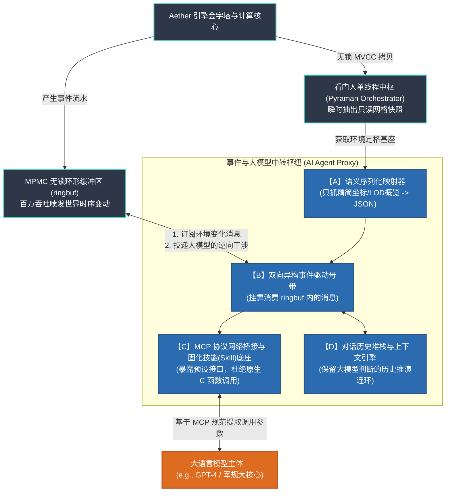

<!-- Source: docs/01_philosophy/01_process_philosophy.md -->

# 万物皆事件：Aether 引擎的底层设计逻辑

**技术白皮书 | 版本 1.1 | 2026年3月**

当我们试图构建一个能够承载低空经济、数字孪生以及高频军事仿真的“数字时空”时，面临的最大挑战往往不是算力不够，而是我们在最底层的**设计逻辑**上偏离了真实世界的运转规律。

本文将由浅入深地为您剖析：Aether (æ) 引擎的设计初衷是什么？它旨在解决传统并发计算中的哪些绝望难题？以及为什么最终它的内核会走向“万物皆事件”的哲学深水区。

---

## 1. 痛点：传统引擎遭遇的“并发幽灵”

在目前主流的商业引擎（如 Unity、Unreal）或传统的后端服务架构中，底层的数据模型几乎都根植于一个理所应当的观念：**“实体优先”**（Entity-First）。

按照这种观念，世界是由一个个持久不变的“实体”构成的（比如一架无人机、一栋大楼）。当实体发生移动或受损时，系统会通过“更新函数 (Update)”去临时修改这个实体的状态字段。时间与空间，只被当作装载这些实体的独立“容器”。

然而，这种设计在面临超大规模并发推演时，往往会引发灾难：
- **状态与过程割裂，无法溯源因果**：因为每一次系统 Tick 只是用新状态覆盖老状态（快照），所以如果一架飞机坠毁，系统无法从最后的静态参数里自然回放它坠毁的全因果链。
- **并发锁竞争 (Lock Contention)**：由于状态是挂在实体身上的，当风力运算模块、物理碰撞模块和玩家操作模块在同一瞬间试图修改同一个“无人机实体”时，系统必须被迫上锁（Mutex），结果就是海量并行的算力全部卡死在等锁上。
- **不确定的“黑盒”内存**：实体的反复创建与修改依赖于底层的内存回收机制（GC 或 `malloc/free`），在关键任务领域（如航区防撞系统中），哪怕引发一毫秒的内存碎步卡顿，也可能意味着一次灾难。

为了彻底解决高并发场景下的“状态冲突、锁争用与不可追溯”三大难题，Aether 选择从根源上改变世界观。

---

## 2. Aether 的答案：“状态即过程”与“万物皆事件”

Aether 的核心主张非常极客：**宇宙中根本不存在持久不变的固体。所谓的“无人机”或“风暴”，只是无数个瞬间的“事件”在时空中堆叠出来的结果。**

因此，Aether 引擎重写了数据结构协议的基础：
- **引擎里没有“活生生能够被随意改写”的实体对象。**
- 唯一真实存在的、且被底层调度器承认的单元，只有 **事件 (`event_t`)**。
- 一条“移动指令”是一个事件，一次“雷达扫掠”也是一个事件。当这架无人机移动了 10 米，并不是它的实体坐标被改写了，而是系统在连续这几毫秒内接连产出了 100 个微小的 `[相对位移事件]`。

通过把所有模块的通信统统转换为写下“事件明细账单”，各系统从此相安无事，再不用互相等锁。当需要知道无人机在哪时，系统通过结算这批事件立刻得出现在的位置。

---

## 3. 追根溯源：来自“怀特海过程哲学”的降维赋能

当我们把这种“万物皆事件”的工程直觉推向极致时，我们发现这早已在哲学界得到过最完美的演绎——这就必须提到著名的 **阿尔弗雷德·诺思·怀特海（A.N. Whitehead）的过程哲学（Process Philosophy）**。

相比于牛顿力学时代的“实体论”，过程哲学认为：“存在即是生成，实在即是事件”。Aether 完全借用了其哲学概念，并一一严丝合缝地翻译成了底座的 C 语言核心代码：

| 日常认知痛点 | 怀特海的哲学视角 | Aether 的工程实现 |
| :--- | :--- | :--- |
| **不要去抢着改数据了，把你们的意图记下来！** | **现实实有 (Actual Entity)**：宇宙的基本单位不是物质实体，而是瞬间构成、不断生灭的“事件”。 | **时间轮上的事件流 (`event_t`)**<br>引擎的基础单位是事件。系统中的万物流转完全依赖无锁环形队列 (MPMC) 进行独立的事件抛掷，互不干涉。 |
| **世界是依靠事件的影响力一点点串起来的。**| **摄入 (Prehension)**：前一个瞬间的事件，被后一个瞬间的事件感知并吸收，构成因果。 | **ECS 组件系统**<br>组件不再是附庸，它是承载“因果遗留物”的中枢。事件 A 发生后将痕迹写在组件上，事件 B 读这个组件就完成了接力。 |
| **发生过的事情不可推翻，可以永远被回溯审计** | **客观不朽 (Objective Immortality)**：事件一旦完结，它就成为不可更改的历史客观材料。 | **底层内存池 (`memarena`)**<br>无锁、免 GC 的顺序内存记录。事件一旦执行即留存入连续内存区，任意时刻的世界状态均可依靠重放事件账单 $100\%$ 重建，彻底实现军工级可审计。 |
| **空间和时间是算出来的，不是事先画好的大网。** | **广延连续体 (Extensive Continuum)**：时空不是用来装东西的静态容器，而是从事件与事物的关系和距离中派生出来的。 | **动态体素金字塔 (Pyramid Index)**<br>空间层不是硬盘里死板的面，而是根据各个事件携带的经纬度动态延展出的金字塔 L.O.D。哪里有事件，哪里就衍生出空间网格。 |

---

## 4. 极致架构带来的工程红利

为什么要花这么大力气去把晦涩的过程哲学融会贯通到 C 语言调度器里？因为只有逻辑上彻底严丝合缝，工程上的各项指标才能被解放到极致。这也是 Aether 选择如此架构带来的三大核心红利：

### 4.1 绝对的可审计性 (Auditability)与“时光倒流”
既然现在的状态是由过去的事件累积而成，那么这套系统天然支持回溯。在国防或航空追责的极高合规场景中，Aether 能够从底层内存顺着事件日志往回“拨时钟”，精准还原三小时前坠机前那一微妙级别的绝对全态。这是快照保存法永远无法企及的深度。

### 4.2 无锁的高效并发 (Lock-free Concurrency)
事件中枢（基于分层时间轮与 MPMC）实现了完美的解耦。无论是物理网格的检测、AI 决策的下发还是前端渲染的刷新，大家都是平行地往池子里投掷 `event_t`。由于没有人抢着改数据，CPU 大量原本用于等锁的周期被释放出换成了狂暴的吞吐量（实测事件流处理峰值超出 1,000,000 req/s）。

### 4.3 告别碎片的硬实时能力 (Hard Real-Time)
由于没有随生随灭的复杂树级对象，底座统一启用了 `memarena` 内存竞技场。不仅不需要垃圾回收（GC），甚至单次内存分配的时间固定为 $8\,ns$ 且永无碎片。这确保了在极度严苛的低延迟调度网中，Aether 系统不会出现哪怕半个指令周期的延迟抖动。

---

## 5. 结论

在构建数字宇宙的征途中，架构理念绝不仅仅是个装饰名词，它是一切代码的底层宪法。

Aether 没有走传统“实体”拼接的老路，而是将过程哲学的精髓注入算法骨骼中——**用“事件”代替实体，用“生成”解释存在**。这不仅是从思辨上走向自洽，更是从工程上跳出阻塞泥潭的破局之法。正是借此，Aether 才得以拥有超越传统方案的确定性能和纯净的审计逻辑，成为下一代可信时空基础引擎的最佳基座。

<!-- Source: docs/01_philosophy/02_identity.md -->

# 品牌与识别规范 (Brand & Identity)

Aether (æ) 引擎的视觉识别系统是其“物理世界格点化”核心哲学的符号缩影。

## 1. 核心标识：格点连字 (The Grid Ligature)

标识核心基于古英语连字 **`æ` (Ash Ligature)**，通过极简的 **7x5 离散网格** 比例建模。它象征着 Aether 作为“时空媒介”将离散的运算（Algorithms）与连续的环境（Environments）无缝耦合。

### 视觉资产 (Standard Assets)
*   **矢量图标 (Official)**: [logo.svg](./../assets/logo.svg)
*   **预览图**: 
*   **设计源文件**: [logo.ai](./../assets/logo.ai)

### 官方 ASCII 签名 (Standard Variant)
用于控制台输出、核心代码 Header 记录。基于 13x5（或等比扩展 7x5）的格点逻辑：

```text
  ████  ████
       █     █
 █████████████
 █     █     
   ████  ████
```

---

## 2. 设计规范

这套标识的核心在于 **143.26 单位** 的基础正方形网格（Grid Unit）。

*   **比例控制**：标识整体宽高比为 **7:5** (1002.84 / 716.31)。
*   **构造细节**：
    *   通过正方形格点的有序堆叠形成 `a` 与 `e` 的融合体。
    *   中心有一条贯穿各层、代表“时空一致性”的实体中轴线 (Crossbar)。

---

## 3. 色彩与应用场景

为了保持底层、高性能且及其克制的工程感，Aether 仅使用二元高对比度配色：

| 元素 | 颜色 | 建议环境 |
| --- | --- | --- |
| **Grid Black** | #000000 | 浅色文档、源码打印、浅色网页背景 |
| **Pure White** | #FFFFFF | 深色 IDE (Dark Mode)、终端控制台 |

### 应用指南
1.  **代码注释头**：建议每个核心子系统入口文件包含此 ASCII 签名。
2.  **CLI 欢迎语**：引擎 `init` 成功后应输出标准 Logo，代表系统物理空间已就绪。
3.  **禁止行为**：严禁对 Logo 进行非等比拉伸、阴影羽化或添加彩色渐变。

<!-- Source: docs/01_philosophy/03_ontology_paradigm.md -->

# Aether 时空本体论：受 Palantir 启发的数字世界模型

**技术白皮书 | 版本 1.1 | 2026年3月**

想象一下：如果我们在数据库里存入了十万条包含经纬度和速度的 JSON 记录，我们的系统就真的“懂得”什么是低空空管、什么是无人机物流了吗？

答案是：完全不懂。

传统系统里的数据仅仅是“死”的字符边界，但要让机器（尤其是最新一代的 AI 大语言模型）去接管并调度整座城市的交通、去指挥复杂的工业运转，机器需要的绝不是查询 `SELECT * FROM table`，它需要的是一本能看懂现实世界如何运转的**“说明书”**。

这本说明书，在计算机科学和哲学里，被称为 **本体论 (Ontology)**。

---

## 1. 印证之路：来自 Palantir 的成功启示

我们在打造 Aether 的高层逻辑抽象时，并未凭空捏造，而是深度受到了硅谷最神秘的企业——**Palantir Technologies** 其核心防御与企业系统架构设计范式的启发。

在过去十余年中，Palantir 之所以能在极度混乱的战场情报收集、全球疫情大流行追踪乃至极其复杂的航空制造供应链中大获成功，它最大的王牌不是某种炫酷的算法引擎，而是它确立的 **“Palantir Ontology (多分支本体模型)”**。

Palantir 的核心思路是：**将枯燥的、分散的底层数据库表，映射成不仅具备“语义关联”，还包含“规章约束”与可执行“行动操作”的业务对象。** 比如，雷达发来的一串比特流，在本体层会被转译为 `[敌意无人机]` 这一对象，系统知道它与 `[我方禁飞区]` 拥有“正要侵入”的物理关联，也知道针对它可以下达 `[拦截]` 这个动作方法。

既然这一范式已经在世界上最苛刻的军工和企业场景中被盖章认证，Aether 便毫不犹豫地将其引入了高频空间计算的领域，打造出了全实时的**Aether 时空本体模型 (Spatiotemporal Ontology)**。

---

## 2. Aether 如何构建“三层本体架构”？

如果你是开发者，当你把底层那些深奥的“指针、矩阵交叉、内存切片”包裹起来后，Aether 向外呈现给业务终端和 AI 大模型的，是一个极具条理性的**三层世界模型**：

### A. 语义层 (The Semantic Layer) —— 解决“世界是什么？”
不要再给业务系统或者 AI 输出干瘪的坐标库了。Aether 基于其底层网格与组件系统，将所有的输入源翻译成了人类与 AI 共识的术语：
- **万物皆对象 (Objects)**：一条从 MQTT 传来的传感器消息，被 Aether 提纯成了一个拥有载重、剩余电量、当前风阻系数的实体 ID。
- **空间链接 (Links/Relationships)**：利用金字塔格网，Aether 建立起了实时的动态关系——比如不仅知道你在哪，而且通过计算直接标记出“无人机 A 正在【伴飞】无人机 B”，或者“车辆 C 已经【驶入】拥堵地段”。

### B. 动力层 (The Kinetic Layer) —— 解决“能做什么？”
一个好的本体论不是只能看，还得能“摸”。Aether 的看门人中枢开放了行动类型（Action Types）定义：
- **定义行动**：在 Aether 中，用户除了写查询流，更能向底座注入像“强制调拨航向”、“冻结此空域”等动作。
- **业务反向控制 (Write-back)**：Aether 在推理出避让操作后，这套动力层可以直接与外部真实的 SAP 或无人机地面控制站握手，实现从“数字世界的模拟推演”向“物理世界的实际拉动”闭环。

### C. 动态层 (The Dynamic Layer) —— 解决“发生了什么变化？”
现实世界不是一站式落定的静态图，它是秒级甚至毫秒级生灭交退的。
- 如前面章节《万物皆事件》所述，Aether 所有的本体跃迁均通过无锁事件总线（MPMC）进行流转。
- 借由原子快照技术，确保了这个庞大的“数字孪生世界”与物理现实间毫秒级的不脱轨、不割裂，且能随时为业务全态执行“时空倒退”复盘。

---

## 3. 终极远景：为 AI 铺设“思考的轨道”

Aether 之所以坚决拥抱这套由 Palantir 引领的 Ontology 本体范式，其最终目的是为下一个十年准备出最坚硬的土壤——**原生集成通用人工智能**。

现在的大语言模型 (LLMs) 有着超强的大脑，但由于它们缺乏人类在低空空管、重型制造等特殊行业的运作常识语境（Context），所以很难独立执行调度。

Aether 时空本体论正是横亘在算力（GPU）和真实物理世界之间的**中间层语境**：
1. 它将复杂的坐标求交直接降维成了“在谁内部 / 即将撞击”的语义逻辑；
2. 它提供明确的、合乎物理法则的操作把手（`ae_action`）；
3. AI 代理只需调阅 Aether 的本体定义书，即可“懂行”地阅读物理实时态势，并通过下发标准的行为事件向现实世界打出真实指令。

当引擎不仅仅提供算力，更提供了认知现实的**“语法”**时，一个真正具备实操意义的空间大脑才初见端倪。

<!-- Source: docs/01_philosophy/index.md -->

# Aether 引擎：设计原则与架构导读 (Design Principles)

Aether (æ) 引擎的设计初衷是为大规模、高动态的低空三维空间提供一套**微秒级响应性能**、**确定性延迟**以及**时空状态绝对一致**的计算底座。不同于传统的 GIS 平台或游戏引擎，Aether 侧重于底层数理逻辑的表达与高性能内存寻址。

---

## 1. 核心准则：全量事件驱动 (Event-driven Architecture)
系统采用“一切状态皆事件”的异步流体系机制：
- **状态即反馈**：实体的位变、冲突、属性更迭均被抽象为标准的事件包 (Event Packet)。
- **O(1) 级调度**：借助内置的时间轮 (Timing Wheel) Pyraman 调度器，系统可在固定耗时内处理海量并发触发器。
- **确定性时序**：通过原子状态机确保事件发生的先后顺序在多线程环境下依然保持严格一致。

---

## 2. 三维空间逻辑：多维金字塔格网 (Spatiotemporal Voxel Grid)
Aether 通过金字塔式的分层格网构建环境拓扑：
- **分区回调 (Region Callback)**：金字塔逻辑根据空间密度动态调整索引深度，仅在有实体或有计算任务的区域开辟精细格网。
- **动态 LOD**：支持全城级 (20km+) 范围的宏观态势与局部 (10cm 级) 精细碰撞计算在同一坐标系内并存。
- **空间独立性**：各计算分片 (Shard) 进程间物理隔离，通过共享内存进行非阻塞数据交换。

---

## 3. 面向认知集成：AI 模型与大模型适配
系统架构在设计阶段即考虑了与 AI 推理侧的深度解耦：
- **增量更新机制 (Incremental Updates)**：模型仅需在初次接入时获得完整的空间快照。后续通过 MPMC 管道接收差量信息（如 `ENTITY_MOVE` 事件），有效降低了数据传输负载。
- **计算解耦保护 (Computation Decoupling)**：布尔计算、雷达交叉探测等密集计算在底层的 C 计算域完成，仅向外输出语义化的状态副本，减少了 AI 决策层的冗余计算负担。

---

## 4. 坐标系融合规范 (Geospatial & Cartesian Integration)
Aether 提供原生双坐标系转化能力：
- **GIS 模式**：基于经纬度与相对高程，自动对齐 WGS84 或国家坐标系，适用于宏观地形。
- **工程模式**：基于笛卡尔三维坐标，支持局部室内、封闭测试场的高精度向量运算。
- **跨尺度映射**：系统支持将宏观环境事件（如气象触发）下沉转化为局部实体的业务交互事件。

---

## 5. 架构特性对比
以下为 Aether (AE) 引擎与 Unreal/Unity 等通用图形渲染引擎在核心层的功能界线：

| 评估维度 | Aether (AE) 计算内核 | 通用渲染引擎 (UE/Unity) |
| :--- | :--- | :--- |
| **主引擎逻辑** | 物理推演、空间索引、事件决策 | 图形渲染、光影效果、视觉交互 |
| **内存管理** | 静态分配、Arena 连续内存池 | 动态堆栈管理、GC 垃圾回收机制 |
| **部署形态** | 纯 C 动态库、物理原生部署 | 多平台 Runtime 封装环境 |
| **性能指标** | 确保微秒级延迟一致性 | 追求视觉帧率 (FPS) 的平滑波动 |

---
**[注：本系统定位为“空间认知与计算内核”，渲染与业务管理建议通过适配层挂载。]**

<!-- Source: docs/02_quickstart/index.md -->

# Aether 引擎：核心内核与 Aether Server 部署指南

在真正将 Aether (æ) 引擎投入高频态势感知数字孪生前，开发者必须严谨地区分其两层分离的架构形态：即位于底座的 **Aether Kernel (纯计算内核)**，以及包裹着内核对外提供高并发网络能力的分布式节点组 **Aether Server (Ae Server)**。

本指南旨在帮助开发者理清集成边界，并通过正确的架构规范完成首批部署。

---

## 1. 架构边界定义 (Architecture Boundaries)

### 1.1 Aether Kernel (计算内核库 `libae.so`)
Aether Kernel 是一套**纯 C 语言编写、绝对无锁、无副作用**的高性能数学与内存时空解算库。它包含了 Aether 体系最硬核的四层地基：
- **`memarena` 内存竞技场**（彻底摒弃 `malloc`/`free` 的 O(1) 预分配策略）
- **Pyraman 调度中枢**（执行单核写权限，防范多线程死锁）
- **无锁事件环形队列 (MPMC `ringbuf`)**
- **空间计算网格与 ECS 数据列**

**局限与定位：** 核心内核本身没有任何网络通讯模块（如 TCP/UDP Socket），也不具备微服务寻址能力。它只负责将外部喂入的海量浮点坐标进行快速对齐、布尔计算与空间拓扑推理。

### 1.2 Aether Server (Ae Server 分布式服务算网)
为了让“干瘪”的 C 语言核心库能支撑现实世界数十万无人机的并发网卡撞击，我们在内核之上封装了 **Aether Server**。这套服务端程序利用硬件亲和性与高信噪比的 I/O 模型，使 Aether 具备了分布式跨节点协同的能力。它是低空空域基建集群的**实际部署单体**。

---

## 2. 方式一：集成 Aether Kernel (内嵌计算能力)

适用于对网络 IO 延迟极其敏感、且业务复杂度较低的嵌入式场景（如搭载于单体巡检飞行器内的边缘算力板），或者希望将 Aether 的空间能力强行嵌入既有大中台后台。

### 2.1 基础环境构建
内核依赖标准的 C11 环境。
```bash
# 引用头文件，将业务逻辑与 aether_core 动态库链接
gcc my_collision_plugin.c -laether_core -O3 -o my_standalone_engine

# 提升进程实时级别并启动
chrt -f 99 ./my_standalone_engine 
```

### 2.2 核心初始化生命周期
在纯内核代码架构中，需要通过主循环手动接管计算流序列：
1. **注入内存池 (`memarena_init`)**：获取物理内存块的起始页指针，挂起大页 (HugePages) 映射。
2. **初始化时空索引**：创建包含 LOD 参数的金字塔格网系统，指定 Hilbert 填充曲线与初始分辩率。
3. **注册事件钩子 (Event Hooks)**：使用 `dlopen/dlsym` 或直接注册回调函数，将外部的防撞插件逻辑挂载至 `ringbuf`。
4. **推进时光轮指示器 (Tick Tock)**：执行高精度时钟的滴答阻塞逻辑，以此激发事件派发器收割并消化脏数据模型。

---

## 3. 方式二：部署 Aether Server (构建集群网）

这是面临千万级并发场景（如全省无人驾驶航空器统一管控系统）的标准交付范式。在此部署模型下，开发者不再直接调用 `libae.so` 去创建内存，而是启动分布式的 Aether Server。

### 3.1 核心服务组件拆解
一个标准的 Aether Server 集群包主要下设三大物理进程拓扑：

#### 1. 强并发接入层：ST UDP Gateway
为了顶住现实物理传感器的高频轰炸信号，Aether Server 未采用传统基于 Epoll/Kqueue 的事件监听器实现，而是重构了基于 **State Threads (ST 协程)** 的 UDP 网关。
- **调度机制**：配合内核网络栈的 `SO_REUSEPORT`，达成数以万计硬件线程级网卡报文均衡派发到多条物理流水线，单并发信道上下文切换低至 **200ns** 级别。

#### 2. 分布式推演节点：AP (Aether Pyramid)
AP 节点便是包裹了 Aether Kernel 的物理实例执行体。
- **算力切分**：集群在逻辑上将空间战区切割，每个 AP 进程仅仅接管一部分空间（如浦东新区的一块地理体素）。
- **零拷贝通信**：通过与网关协同，AP 将自己池化内存中的事件投递窗口利用 `eventfd` 暴露给网络 Gateway 实现底层数据的零拷贝传输。

#### 3. 智能总线路由面：AS (Aether Sphinx)
当发生超大规模的交叉区域搜索（如多目标穿越了两个相邻 AP 的管控边界），AS 作为智能协调中枢。
- **Map-Reduce 范式**：承接海量并行的 `Fan-out`（向多个相关 AP 抛出检索）并在 AS 层进行数据结果集的 `Reduce`（剔除重复边界实体，执行降噪汇总）。

### 3.2 高性能工业部署建议 (Deployment Standard)
启动 Aether Server 不应被当作普通微服务对待：
1. **避免重度容器虚拟化**：Aether Server 需要绝对控制 `NUMA` 节点绑定与 `SCHED_FIFO` 优先级，Docker/K8s 的隔离网桥机制会严重拉高内存寻址开销与 UDP 包解析时长。我们建议采用裸金属 (Bare-metal) 宿主机直装部署。
2. **预挂载透明大页 (THP/HugePages)**：由于 Aether 的 Voxel 体素网格寻址极其庞杂，必需对内核释放 2MB 甚至 1GB 页宽权限，直接降解系统层带来的 TLB (转换检测缓冲区) 高频失效缺页中断。

---

## 4. 方式三：存量系统接入 (AE-EXT 协议适配层)

对于部分业务团队，核心诉求并非从零开始重构全栈，而是寄希望基于现有的成熟可视化与 GIS 体系进行算力升级。此时，团队可以利用 Aether Server 的 **AE-EXT (Aether Extension)** 协议翻译层进行无感挂载。

### 4.1 核心对接逻辑
现有三维可视化前端通常具有固定的寻址习惯。Aether 通过 AE-EXT 扩展层提供以下“协议翻译”能力：

*   **显式索引适配 (3DTiles/I3S)**：Aether 动态观测内存里的空间体素变化，并实时生成包含 LOD （多细节层次）和包围盒的 `tileset.json` 索引，推给前端客户端，使其通过标准 Bounding Volume Hierarchy 持续索要最新的动态坐标流。
*   **隐式格网回归 (OSGB)**：针对某些固化了寻址编号规则的地信客户端（如 PagedLOD），AE-EXT 严格模拟目标系统的全局格网目录偏置逻辑，让客户端完全按照自己的既定习惯，直接读取并显示 Aether 的实时算力结果。

**核心收益**：开发者能够实现“前台代码一行不改”。借助这套机制，仅需调整前端的网络资源寻址 URL 至 AE-EXT 节点，即可瞬间将原本基于静态离线资产切片的传统 GIS 服务，平滑跃迁至具备百万级目标实时推演能力的 Aether 动态空间计算管线。

---

## 总结
若旨在快速实验分析几何与拓扑函数，可以通过 C API 挂载 **Aether Kernel**；但若立足建立工业级全时态时空大脑，则应直接展开 **Aether Server** 架构，利用 AS与AP 矩阵直接吞吐数十万并发。而对历史包袱沉重的存量业务，利用 **AE-EXT** 协议代理接入则是最优解。

<!-- Source: docs/03_core_subsystems/00_mathematical_foundations.md -->

# 数学原理与形式化建模 (Mathematical Foundations)

Aether (æ) 引擎并非纯理论的数学抽象，而是将**集合论、图论、数理逻辑、泛函分析**等离散数学原理结合极简高性能工程手段，实现“数据-逻辑-行动”的全链路闭环形式化建模。

以下是支撑 Aether 引擎稳定运转的 7 个核心数学原理及其工程应用：

---

## 1. 集合论与实体建模 (Set Theory)
*   **数学基础**：定义全集 $U$ 为业务全空间，子集 $S_i$ 为具体的业务实体分类（如 $S_{truck}, S_{order}$）。
*   **AE 工程应用**：通过 **ECS (Entity Component System)** 实现。
    *   实体及其属性集 $P_i = \{(key, value)\}$。
    *   利用集合的**并、交、补运算**实现高效率的组件筛选与实体归纳。

## 2. 图论与空间拓扑关系 (Graph Theory)
*   **数学基础**：构建业务有向图 $G = (V, E)$，顶点集 $V$ 为业务实体，边集 $E$ 代表实体间的业务关系。
*   **AE 工程应用**：核心的 **æ Spatiotemporal Pyramid (时空网格索引)**。
    *   利用图论中的**最短路径、连通性分析、多层网格遍历**实现复杂的空间关系推理。
    *   解决“订单-货物-卡车-仓库”间复杂的资源调度调度分配问题。

## 3. 映射与函数式转化 (Mapping & Functions)
*   **数学基础**：定义映射函数 $f: D \to P$，将来自不同数据源 $D$ 的原始数据映射为统一的业务本体属性集 $P$。
*   **AE 工程应用**：实现 **数据孤岛治理 (Data Integration)**。
    *   通过复合映射 $f = f_n \circ f_{n-1}$ 完成数据清洗、格式统一及语义化标注。
    *   确保业务层面的操作能通过逆映射回写至原始数据系统。

## 4. 谓词演算与推理基础 (Predicate Calculus)
*   **数学基础**：利用命题逻辑与合取、析取、蕴含，将业务规则转化为可计算的逻辑表达式。
*   **AE 工程应用**：**规则引擎与 AI 确定性推理**。
    *   例如：$Unfinish(o) \land Stock(y) \land Free(x) \to Transport(x, y)$。
    *   它是 Aether 为 LLM 大语言模型提供业务上下文及防幻觉推理的逻辑底座。

## 5. 离散事件动态系统 (DEDS)
*   **数学基础**：定义系统状态集 $X$ 及行动算子 $A$，状态转移满足 $X(t+1) = A_k(X(t))$。
*   **AE 工程应用**：**行动编排与状态快照 (Snapshot & Actions)**。
    *   将业务调度的可行性分析抽象为状态转移的可达性判定。
    *   确保每一条行动指令在系统物理规则内是合规且可预测的。

## 6. 特征表现与向量空间 (Vector Spaces)
*   **数学基础**：将业务实体/关系映射为高维向量空间 $R^n$ 中的特征向量。
*   **AE 工程应用**：**AI 感知与语义理解的中间件**。
    *   利用向量余弦相似度计算，使 AI 能够准确理解实体间的隐性业务关联。
    *   实体特征的向量化，解决了大模型在空间认知上 Context Token 溢出的问题。

## 7. 泛函分析与逻辑融合 (Functional Analysis)
*   **数学基础**：将不同来源的业务逻辑（规则、模型、优化器）抽象为函数空间中的泛函。
*   **AE 工程应用**：**多源异构模型集成 (Knowledge Integration)**。
    *   定义逻辑融合算子，对来自机器学习预测模型与基于规则的决策逻辑进行权重加权融合。
    *   利用变分法求解最优泛函，寻找成本最低、收益最大的决策决策最优解。

---

## 核心数学特征总结

Aether 引擎的数学本质是**核心业务的形式化建模**。通过上述 7 大数学支柱，它将非结构化的物理空间决策问题转化为了**可计算、可自动化的数学推演过程**。

<!-- Source: docs/03_core_subsystems/01_spatial_grid.md -->

# 空间网格与体素化计算 (Spatial Grid)

> 🔗 **对应底层代码库：** `common/pyramid.h`, `common/pyramid2.c/h`, `common/pyramid3.c/h`, `common/pyramid4.c/h`

> Aether 的空间核心是一套多级网格空间索引结构，将世界坐标按尺寸自动分级存储，旨在规避传统 R 树结构的遍历开销，并原生支持细节层次 (LOD)。

## 1. 核心层级拓扑与参数映射
在 Aether 的金字塔定义中，层索引 `l` 从 0（最粗顶层）向下递增。
第 `l` 层的世界范围在每个维度被均分为 $2^{l+1}$ 份。
以 2D 为例，网格数量依层级呈指数级增长：第 0 层 4 个网格，第 10 层高达 4,194,304 个。网格坐标系与世界坐标系方向绝对对齐。

系统底层原生支持不同物理维度体系的时空网格划分，并且各维度结构均共享同一套基础的**分区回调机制 (Partition Callback)**，使开发者免于处理维度更迭带来的数据复杂度：
- **2D 索引**：支撑底盘平面建图、UI 虚拟平面分布等基础二维场景。
- **3D 索引**：支撑三维世界地图、城市级立体建筑模型群落。
- **4D 索引**：在三维立体常数体系上进一步外拓时间维度。该架构直接用于统管时变对象（如载具物理重影位移、沉降状态的动态地形图幅）。支持系统级跨时延查询能力（例如处理类似请求：“拉取过去两小时内跨越此处三维坐标区间域的所有记录点位”）。

## 2. 自动层级选择算法 (Auto Level Selection)
插入图形时，Aether 并不要求死板的逐级检测，而是采用高阶统筹算法，计算图形外包矩形 (Extent) 在每一层覆盖的网格数 $c(l)$：
1. **逆向回溯**：从最底层向顶层遍历，记录 $c(l)$。当 $c(l) \le 4$ 时，进入判定。
2. **停止回溯条件**：若出现层索引 $m > n \ge l$ 且 $c(m) = c(n)$，表明网格覆盖数量首次停止减少，即确定 $n$ 为图形在金字塔中存储的最佳层级。
3. **顶层兜底**：若 $c(m) < c(n)$ 持续减少，则最终直接越区升至根节点第 0 层。

经过该算法后，图形占据的网格必定只有 **1个、2个或4个**。对于覆盖 4 个网格的情况（例如图形处于坐标交界处而占据的“假阳性网格”），在视锥查询或碰撞时，通过精确的相交测试将其剔除，从而确保检索的极高命中率。

在处理大跨度实体（如桥梁、长航线）时，Aether 采用“主卡片 (Shared Card)”与“子卡片 (Part Card)”的引用复用机制，避免了对几何体进行物理切割带来的维护复杂性：

- **主卡片（Shared）**：存储图形核心数据的共享内存块，附带由底层架构自动维护的**引用计数（Reference Count）**。值得强调的是，引擎对主卡片内容保持“盲盒态”，不保存任何具体的三角形序列，只关心其大类与包围盒。
- **子卡片（Part）**：存放极为轻量的空间索引指针。当一个庞大图形覆盖多个底层叶子网格时，Aether 仅仅是在这数十个叶子网格中散播含有底层指针的子卡片，它们全部指向唯一的那个主卡片共享内存。

**局部受检，牵引全局**：当调用 `pyramid_insert` 插入异构大图形或在特定网格发生体素碰撞时。只要局部的某一个网格子卡片受检（诸如无人机在此网孔擦过了高架桥的某一边缘），引擎便能通过底层指针瞬间提拉起整个庞大实体的宏观轮廓进行全局结算分析。这使得金字塔在向下落盘与拆解过程中实现了绝对的**零冗余拼接、零数据多态拷贝 (Zero Data Copy)**，彻底终结了长跨度物件的更新和检索噩梦。

## 4. ID 逆向映射网络 (哈希桶基座复用)
为了极速响应引擎的更新与销毁事件，用户注入的 64 位 `real_id`（最高位 bit 63 保留做系统标志）必须能以 $O(1)$ 的时间复杂度逆向追踪到它所属的卡片位置表。

- **基于格网的哈希追踪机制**：Aether 复用金字塔底层网格作为哈希数据桶。该设计利用格网的高基数特性，使哈希冲突保持在极低水平，保障了实体回查操作的 $O(1)$ 性能，在千万级规模下依然维持稳定的调度效率。

## 5. 多层架构的并发剥离界限
需要特别声明，金字塔底座本身：
> 不提供、也绝对不引入任何线程并发加锁的安全机制。

在这套“时空格网服务引擎”的整体架构图中，保护这堆空间数据的并发职责，已经被极其精准地剥离，并上移交给了外部的 **事件管理器** 以及 **MPMC 无锁环形缓冲区** 去统筹调度。这也是为什么它能够单线程跑出恐怖数值的绝对本源。

## 6. 体素计算与传统几何计算：融合架构范式
相较于传统引擎完全依赖高精度解析几何的方式，AE 的架构主张将“体素化离散计算”与“传统连续几何”分离，并基于各自优势建立共存调用关系：

- **体素化初筛 (Aether Grid)**：专职于宏观结构体系感知。依靠多尺度的离散状态网格执行系统极低吞吐开销内的碰撞排查、宽泛遮挡遮蔽计算和海量对象的高频移库处理。这种可结构化的矩阵点位张量也是提供给大语言模型 (LLM) 进行空间逻辑认知推演的高效标准接口。
- **极值几何定点 (Traditional Geometry)**：专职于高精度的微观物理轮廓计算。对于细致入微的布尔图形裁剪运算、实体轮廓外沿解析、线型求交与拓扑图矢量输出，底层通过脱耦合接口抛挂诸如 `libclipper` / `libtess2` 等连续几何计算库执行专项攻坚作业。

体素负责宏观筛选与 AI 逻辑感知，解析几何负责边界物理拓扑的精确解算。两套体系在各自领域内实现资源利用的最优化平衡。

## 7. 架构剖析：空间索引库选型对照

与当前业界主流采用的四叉树 (Quadtree) 以及 R 树 (R-Tree) 相比，基于金字塔层级解决超大规模海量动态目标的差异化表现在于其结构映射机制：

| 特性维度 | Aether 金字塔索引 | 传统四叉树/八叉树 | R 树 (R-Tree) |
| --- | --- | --- | --- |
| **LOD 原生支持** | 层级自然对应细节空间跨度，自动具备剔除裁剪特性 | 需要额外去构建并维护多套并行的细节映射层 | 无直接的内置多层级 LOD 能力 |
| **动态坐标更新成本** | 借由 ECS 组件定位查引重刷，平推消耗锁定 **$O(1)$** | 频繁位置跨越会导致树重组爆发极高的时间开销 | 重构包裹树、拆页导致性能呈现震荡波谷 |
| **目标区域解构机制** | 特有**分区回调 (Partition Callback)**，自动裁解子级部分 | 将目标视作不可分割界限盒 (AABB Bounding Box) | 纯包裹，缺乏结构探视与拆分下发机制 |
| **实体生命域融合** | 每个网格单元实质作为一个 ECS 实体，实现原生逻辑连通 | 须通过外部逻辑 Handle 持有并关联构建跨域映射 | 绝对独立于 ECS 或主对象系统外挂执行 |

<!-- Source: docs/03_core_subsystems/02_archetypeless_ecs.md -->

# 无原型实体组件系统 (Archetype-less ECS)

> 🔗 **对应底层代码库：** `common/ecs.c/h`, `common/refcobj.h`

与开源界（如 `flecs`, `EnTT`）盛行的根据**原型 (Archetype) 匹配**进行实体连续迁移的做法不同。Aether 侧重于实现确定的内存行为，采用了扁平化的结构设计。

## 1. 内存原型迁移的开销约束
传统的基于 Archetype 的 ECS 在组件动态增删时，往往涉及对象在不同内存块间的迁移与拷贝。在高频并发场景下，这类非确定的内存行为会显著降低 CPU 缓存命中率并引入不必要的同步开销。

## 2. “按类型分池连续存储”布局 (Type-specific Pools)
Aether 引擎为了确保确定的内存访问路径，采用了极致扁平化的存储架构：

- **组件按类型独立分池 (Contiguous Storage)**：在 `memarena` 内为各组件类型开辟独立数据池。该布局保证同类组件在物理内存中紧密排列，最大程度利用 CPU L1/L2 缓存预取机制，在微秒级时间内完成海量实体组件的遍历。
- **掩码位实体管理 (Mask-bit Entity)**：通过为每个实体分配固定长度的位掩码 (Bitmask) 来判定组件装载状态。实体 ID 本身作为逻辑索引，组件的动态挂载与剥离仅涉及位运算，操作复杂度恒定为 **$O(1)$**。
- **引用计数与零拷贝复用 (Reference Counting)**：系统层级支持资源的引用计数管理。允许大量实体共享同一份大规模几何数据或拓扑组件，有效避免了逻辑属性的冗余拷贝。
- **基于稀疏集的关联迭代 (Sparse Sets)**：当组件密度较低（数据疏离）时，系统通过稀疏集 (Sparse Sets) 处理实体序列。迭代复杂度仅与有效载荷数 (Payloads) 正相关。

## 3. 内存布局与硬件级优化 (SIMD)
- 基于固定偏移量的指针直接寻址，消除动态查找开销。
- 采用 SIMD 指令集批量处理 `Transform Matrices` 与渲染指令，利用寄存器级缓存预取 (Cache-Prefetching) 机制提升整体数据吞吐率。

<!-- Source: docs/03_core_subsystems/03_event_timing.md -->

# 事件驱动架构：事件总线与高精度时间轮 (Event Bus & Timing Wheel)

> 🔗 **对应底层代码库：** `common/taskwheel.c/h`, `common/hitimer.c/h`, `common/timeapi.c/h`

**"在 Aether 的宇宙中，一切物理规则的推演只通过投递标准格式的事件流水，彻底抛除阻塞式的跨界函数指令（Function Call）。"**

纯 C 环境缺乏原生协程与闭包能力。但在 AE 这种超高并发的时空引擎中，如果任由模块互相“发号施令”进行接口调用（例如：*物理判定模块一旦碰触即立刻拉起甚至挂起渲染管线的刷新重绘*），系统必将迅速退化为死锁横生的共享内存乱麻。

## 0. 架构本源：基于发布/订阅的事件流水账 (Event Ledger)

Aether 彻底改变了软件世界互相耦合的网状模型。我们将所有改变或探测时空状态的切点统统定格为 **“物理事件 (Events)”**（这甚至包括外部显卡只读了一次地图网格，也要提交 `VIEW_REQUEST` 对象）：

1. **统一的投递缓冲池**：任何模块（无论是 AI 下令还是物理惯性碰撞）都不再直接互控。这些意图全部打包为仅数十字节的 C 结构体变量，掷入单向的公共缓冲池中。
2. **旁观订阅式削峰 (Publish-Subscribe)**：依赖于无锁架构 MPMC (`ringbuf`)，各路负责善后的业务引擎不再排队等锁，而是像“提取新闻流水通稿”一样只订阅自己负责处理的事件码（例如物理系统仅捞取 `ENTITY_MOVE`）。这种零依赖的分流处理，是将数百万海量图元运转维持顺畅而绝无卡顿的底层奥义。
3. **原生时光回潮 (Native Time-Reversal)**：既然庞大脑海图的兴衰全是一条笔直、有序的时序事件账单，这就赋予了 AE 极具战略杀伤力的工程属性——只要针对事件执行**倒序重排流转队列 (Snapshot Reverse Replay)**，不仅能在海量复杂崩溃现场找到第一现场的 Bug 罪魁祸首，更能以极其廉价的开销在沙盘推演中完成无缝的“时光倒流”！

## 1. 核心循环节拍拆解
文档建议使用类似 `libuv` 的模型：
- **第一步**：捕获纳米级高精度时间节点。
- **第二步**：检索层次化时间轮清理到期任务事件。
- **第三步**：通过原子轮询探查无锁环缓冲 (Lock-free MPMC) 内待处理。
- **第四步**：派发网格解构带来的海量数据组件更新。
- **第五步**：收尾并执行积压数据的 ECS 组件属性的脏清理同步 (Dirty Mask Cleaning)。

## 2. 事件描述：原子生命周期 (The Event Lifecycle)
Aether 引擎通过五个阶段对 `event_t` 的状态转移进行确定性管理：

1.  **创建 (Create)**：从 `memarena` 内存池分配空间，初始化时空戳与业务参数。
2.  **提交 (Submit)**：任务入列 MPMC 无锁缓冲区，并根据定时策略挂载至分层时间轮槽位。
3.  **调度 (Schedule)**：时间轮节拍 (Tick) 触发或总线轮询探测，事件进入处理链路。
4.  **执行 (Execute)**：调用业务处理器 (Handler) 对属性组件执行读写（实现“摄入”逻辑）。
5.  **结束 (Finish)**：执行完成后，其变动效果被固化（即进入客观存储状态），回收内存资源。

---

## 3. 层次化定时器结构的设计优势
事件总线使用多级时间轮架构，通常按标准配置部署 8 级嵌套结构（每层部署固定的 256 卡槽位）。
- **静态时间复杂度收益**：彻底杜绝传统任务系统 `Min-Heap` (小顶堆) 在面对突发海量规模数据注册时产生的树重排结构损耗。所有事件的散列插入或到期核查操作皆稳固在 **$O(1)$**，具备硬实时的调度保障。
- **跨数量级跨度统筹**：微观层面上支持纳秒、微秒级的实时刷新回调定位，宏观层面上也能完美容纳需要静滞数月乃至跨年演进的大型物理休眠推演周期。
- **明确边界管理的事件句柄**：架构从“侵入式”链表节点设计剥离。开发者在触发调度前即可凭借池化分配独立掌控对应的事件管理句柄资源。不仅具有事件的触发效能，同时确保外部调用逻辑能够在未响应期通过该句柄精准实现事件的**安全撤销 (Cancel)、逻辑推迟或是重定义归组。**

## 3. 函数指针与上下文安全契约 (User Context Data)

```c
/**
 * @brief 空间体素状态更新事件通知回调函数。
 * 
 * @param event 包含发生坐标及触发因子的不可变事件数据状态。
 * @param user_data 开发者注入的自定义业务上下文地址。
 * 
 * @warning 该回调将在无锁队列的消费线程中由于事件触发而在独立的调度期中异步拉起。严禁阻塞式系统调用（如死锁互斥、原生阻塞 I/O）。
 */
typedef void (*voxel_update_cb_t)(const voxel_event_t *event, void *user_data);
```

所有权由调用栈明确掌控，以避免 `user_data` 指向已销毁的作用域局部栈内存和被 `memarena` 收回的地址，严防崩溃血崩。

<!-- Source: docs/03_core_subsystems/04_concurrency_and_memory.md -->

# 并发控制与内存管理 (Concurrency & Memory Management)

> 🔗 **底层实现参考：** `common/ringbuf.c/h`, `common/memarena.c/h`, `common/mmaphuge.c/h`

在高并发时空计算场景下，传统的互斥锁与内存碎片化是主要的性能瓶颈。Aether 通过 **MPMC 无锁队列 (控制流)** 与 **Arena 内存池 (数据流)** 的解耦设计，构建高性能的数据同步总线。

## 1. 并发模型：MPMC 无锁环形缓冲区 (ringbuf)
系统通过无锁逻辑提升吞吐量并降低调度延迟：
*   **多生产者多消费者模型**：支持多个网格系统线程并发投递事件。核心依赖 C11 标准原生的原子操作（Compare-And-Swap）与强内存顺序语义（Acquire/Release）。
*   **避让策略 (Backoff Strategy)**：针对高并发下的写冲突，采用指数退避算法与 `pause` 汇编指令，降低原子操作对系统总线的占用开销。
*   **无死锁设计**：事件状态流基于槽位的掩码状态机维护，从架构层面规避了传统锁竞争带来的死锁风险。

## 2. 调度逻辑：Pyraman 调度中枢与快照机制
为解决多线程频繁读写金字塔索引导致的一致性问题，Aether 采用 **Pyraman 调度中枢 (Pyraman Orchestrator)** 模式：
*   **写权限收拢**：系统将金字塔拓扑的修改权限收拢至 Pyraman 所在的单核心线程。外部所有的修改请求均转化为事件流，通过 MPMC 队列进行序列化处理。
*   **任务优先级控制**：调度器按固定顺序轮询任务：**1. 外部事件队列 -> 2. 内部拓扑调整 -> 3. 定时器触发**，确保计算任务的确定性。
*   **一致性快照 (Snapshot)**：在处理读取请求时，Pyraman 会利用内存连续性瞬时派生只读副本。

## 3. 内存分配器：Arena 存储架构
Aether 核心严禁使用泛用型的 `malloc`/`free` 指令，所有计算对象均纳入定制化的 **Arena (memarena)** 内存池管理，以确保状态数据的局部性与检索效率：

*   **反向尾栈分配器 (Tail-stack)**：内存块不设前端头部，分配记录存于块末端。单次分配/释放操作的时间复杂度为 $\approx$ **8 纳秒**。
*   **连续内存视图**：依赖物理地址的绝对连续性，支持引擎在非阻塞状态下生成全局空间快照，为外部渲染或 AI 解析提供一致的数据输入。
*   **透明大页支持 (HugePages)**：集成基于 `mmap` 的 2MB/1GB 大页支持，降低高频空间吞吐时的 TLB (转换检测缓冲区) 缓存失效。
*   **零拷贝传输 (Zero-copy)**：由于地址空间连续，系统支持将内存数据直接映射至显存或网络接口，避免冗余的反序列化过程。

### 内存管理库性能对照 (Release)
| 评估指标 | memarena (Aether) | jemalloc | tcmalloc |
| --- | :--- | :--- | :--- |
| **基准单次分配用时** | **$\approx 8 ns$** | $\approx 12.3 ns$ | $\approx 9.8 ns$ |
| **回收机制** | 标记回退与指针重置 | 线程缓存储备合并 | 线程级数据缓存 |
| **异构空间映射** | 支持（显存/映射文件） | 需系统堆支持 | 基于常规堆区 |
| **内核代码规模** | < 1,000 行 (纯 C) | > 25,000 行 (复合结构) | > 18,000 行 |

## 4. 内存所有权语义 (Memory Ownership)
在 C 环境下进行无锁交互，需严格遵守生命周期语义契约：
*   **分配持有 (Allocate & Own)**：通过 `sys_arena_alloc()` 获取的对象，调用方需在业务循环结束时通过水位线回撤统一释放。
*   **借用引用 (Borrow Reference)**：只读传递指针（如 `const entity_t *e`），禁止在接收端执行释放逻辑或将其地址逃逸至全局作用域。
*   **转移消费 (Transfer Ownership)**：对象在调用接口（如 `system_consume(data_t *d)`）后，其生命周期逻辑终止，原持有方不可再访问。

<!-- Source: docs/03_core_subsystems/05_dynamic_fields_double_pyramid.md -->

# 动态解算域：双金字塔动态场读写 (Dynamic Fields Domain)

这是针对低空经济与航图管控平台中涌现的高频动态数据（如气象变化、雷达扫掠、人流涌动）专门设计的抗并发泥潭核心**解算域**。区别于静态路网与行政区划的持久长存，这类动态场数据的生命周期极短且需要连续极速覆盖，这直接挑战了传统计算管线的锁争用（Lock Contention）极值。
这类数据（如分钟级乃至秒级的雷达扫掠、动态微气象、无人机群低空实时信标流）具有极高的更新频次。如果在同一个体素网格空间内频繁进行并发的读写操作，必将引发惨烈的锁争用（Lock Contention），从而拖垮整个引擎的高性能计算能力。

为了彻底解决高频动态数据带来的读写冲突泥潭，Aether 在空间分析管线中开创性地引入了 **“双金字塔 (Double Pyramid)”** 动态解算架构。该架构的本质是空间状态级别的读写分离与无锁原子切换。

## 1. 架构本质与核心组件

双金字塔架构在底层内存中同时维护着两套物理隔离且互为镜像的体素空间金字塔结构：

- **主金字塔 (Active Pyramid)**：当前生效的只读系统状态。专注于向外的所有计算请求，包括：宏观避障计算、各类寻路算法判定，以及向外部呈现（如向 `git-city` Node.js 三维快速体素渲染库输出当前帧的体素结构）。
- **备用金字塔 (Standby Pyramid) 或叫暗区 (Dark Side)**：隐藏在后台，专门用于“肆无忌惮”地吞吐新接收到的事件驱动数据。当新的天气流、人流或移动障碍物数据涌入时，引擎以极其暴力的速度在这个私有空间内执行体素化计算网格的脏写覆盖，完全不受前端查询读锁的干扰。

## 2. PING-PONG 级原子切换机制

双金字塔的精髓在于**切换的瞬间**。为了保证计算和对外输出的“极速且无缝”，系统不采用任何数据拷贝。

1. **并行推演**：前台基于 Active 面进行复杂的寻路和渲染调度；后台 Standby 面默默完成下一时空帧的体素质变。
2. **指针交换 (Pointer Swap)**：当 Standby 面的动态数据落盘完毕（一个 Tick 世代结束），Aether 在底层仅通过一个 C 语言级别的原子指针交换操作（Atomic Pointer Swap），以 $O(1)$ 的开销瞬间互换主备金字塔的引用指向。
3. **状态翻转**：原本的 Standby 网格瞬间成为新的 Active 状态开始服务前端查询；而原本老旧的 Active 网格则退居二线成为全新的 Standby，并立即被执行内存重置（或者增量擦除），准备迎接下一轮事件写入。

### 2.1 写屏障与事件排队协议 (Write Barrier & Event Queuing)
在执行 `Pointer Swap` 的微秒级瞬间，为了应对极高频的 MPMC 事件涌入，Aether 实施了以下屏障机制：
- **原子切换屏障 (Atomic Barrier)**：利用 CPU 的 `mfence` 或 `stdatomic` 指令确保指针交换的可见性。在交换发生的极其短暂的时间窗内，进入的事件会被暂时挂起在 `ringbuf` 的尾部。
- **双写锁定 (Double Write Lock)**：若业务要求绝对实时性，引擎可配置为在切换边缘周期内执行“双向同步写入”。
- **内存屏障 (Memory Fence)**：确保在 Standby 变为 Active 之前，所有的后台写入操作已完全持久化到高速缓存行 (Cache Line)，避免读到非法碎片。

## 3. 计算与可视化渲染的深度解耦

这套极核管线在低空管控等场景中有着明确的工程价值界定——**只计算，不渲染**。

Aether 服务器本身完全是一个无头（Headless）状态计算器。借由 Active Pyramid 的快速固化状态，引擎可以极其从容地提取结构化的体素或拓扑状态位数据，并通过约定的极速序列化协议，倾倒给外部专注于渲染周期的引擎（如基于 JavaScript/WebGL 体系的 `git-city` 库）。

通过这种解耦架构：
- Aether 始终保持极小的内存驻留与高效的 C 语言原生吞吐量。
- 外部渲染库（如 `git-city` 等）可充分发挥其三维体素高效渲染性能，无需承担底层体素化数学的计算开销。
- 二者通过双金字塔的主动刷新（Flush）机制实现高效同步。

## 4. 业务应用场景

该管线是支持低空空域数智化平台与国家级科研课题的核心支撑架构：
- **实时航线规避**：气象云团、临时禁飞区等动态数据在 Standby 层秒级成型并完成原子切换，实时更新 Active 层的体素连通性快照。
- **群体突变响应**：高密度人流聚集事件可直接触发体素级预警状态更新，并在外部三维应用中实现预警区域的实时高亮，绕过复杂的 GIS 渲染流程，实现决策信息的直观呈现。

<!-- Source: docs/03_core_subsystems/index.md -->

# 核心子系统内核 (Core Engine Kernel)

本目录下的五份文档（空间网格、无原型 ECS、事件时序、无锁并发与内存、双金字塔动态场读写）共同构成了 Aether 最底层的 **“计算内核 (Kernel)”**。

需要明确的是，这五项核心机制本身并__不__是一个可以直接对外暴露以供客户或大模型调用的应用服务。它们就像操作系统的基础内核一样，完全沉降于底层，只负责解决最硬核的技术泥潭：
- 极其严苛的物理内存分配与大页安全管控。
- 处理极高并发撞击的无锁队列环形调度。
- 将现实世界实体坐标进行离散体素化的纯净数学运算。
- 掌控微秒级物理事件流刷新的绝对节拍。
- 支撑千万级并发修改的后台/前台双金字塔影子映射算法。
- 掌控微秒级物理事件流刷新的绝对节拍。

**内核的物理界线**：
Aether 计算内核中绝对**不包含**任何具体的网络通信协议栈代码、特定的业务审批逻辑（如航路如何验证），以及外层可视化的交互组件。

在真实的交付场景下，这套纯净高吞吐的运算内核会被紧密包裹，向外**封装成一个独立的宏观 Aether Server 服务**，继而才通过网络接口真正向外部的低空管控中心、大语言模型 (LLM) 以及前端呈现器提供服务响应能力。

<!-- Source: docs/04_api_reference/01_plugin_abi_integration.md -->

# 业务插件 API 与 ABI 集成规范 (Business Plugin Integration)

Aether (æ) 的极简架构要求核心引擎（底盘）必须保持绝对纯净，内部不应包含任何诸如“航路审批”、“特定飞行器载荷限制”等属于上层行业逻辑的代码。对于低空管控平台、天地行等商用形态，系统强力推行 **“核心引擎 + 业务插件 (Core Engine + Business Plugins)”** 的交付与扩展模式。

## 1. 赋予业务开发者的核心价值 (Developer Value Proposition)
我们在架构哲学中提到了“数据结构不可知论 (Data Structure Agnosticism)”，这并非一句空话。当用户（如军工企业、智驾算法团队）使用 Aether 框架开发业务时，它能带来极其震撼的工程价值：

- **Bring Your Own Data/Algorithm (带着你自己的数据和算法来)**：用户不需要把他们花费数年优化的 C++/Rust 专有算法推翻重写，也不需要强行继承引擎的任何 `Node` 或 `Entity` 基类。引擎只认 64 位 ID 和包围盒。用户的专有数据结构（如极度复杂的关联图谱、树结构）可以安安静静地躺在用户自己的内存空间里，引擎绝不越权解析。
- **白嫖千万级并发性能 (Free Concurrency Power)**：空间排序与初筛是 O(N²) 的算力黑洞。用户只需编写单线程的判定逻辑封装在插件里，Aether 底层的金字塔和 MPMC 无锁环形总线会自动把 1 亿个可能碰撞的对象，过滤成最终真正发生擦碰的 5 个有效事件 ID 交给插件。用户无需手写一行加锁代码，即刻获得世界级的并发性能。
- **涉密算法的“黑盒护城河” (Proprietary Black-Box)**：因为架构强制利用 C ABI 动态库 `.so` / `.dylib` 挂载，用户的专属机密算法只须被编译为动态链接库传入。Aether 绝对触碰不到业务源码。这种物理隔离完美契合了测绘局、国防单位“只交接接口、绝不交接核心源码”的合规底线。

## 2. 动态库注入与动态符号解析 (Dynamic Loading)

既然要彻底隔离核心态与业务态，Aether 在运行时仅仅是将包含业务逻辑的动态链接库（Linux 环境下的 `.so` 或是 macOS 的 `.dylib`）作为沙盒化模块挂入进程。

- **动态加载接口**：引擎通过 `dlopen()` 于冷启动或热更时将外部业务插件库挂载进主存。
- **强制的纯 C 接口 (Pure C ABI)**：无论是用 C、C++ 还是 Rust 编写的业务插件，其对外暴露的生命周期入口规范（例如 `plugin_init`, `plugin_step`, `plugin_shutdown`）必须强制使用 `extern "C"` 包装。这断绝了任何 C++ 函数名重整（Name Mangling）带来的找不到符号的问题，确保在各类信创国产化 OS 上达到 100% 的加载成功率。
- **无状态重定向**：利用 `dlsym()` 获取的函数指针被统一压入系统的钩子数组（Hook Array）中。引擎主体完全不关心调用块长什么样，只负责在时间轮的每一次 Tick 时刻唤醒它。

## 3. 事件驱动钩子与订阅机制 (Event-Driven Hooks)

Aether 的交互是事件驱动的。外部插件并不是肆意向系统抓取数据，而是通过订阅 `ringbuf` （MPMC 无锁环形缓冲区）上特定标签的事件，来实现其业务目的：

- **订阅特定状态通道**：插件可以通过 API（形如 `ae_subscribe_event(EVENT_WEATHER_UPDATE, weather_handler_cb);`）接管自己关注的具体业务流。
- **执行行业级运算**：当系统后台管线的双金字塔机制录入了一团新的台风云图并发出事件后，**管控平台防撞插件** 会接收到该事件。它将基于金字塔当前的只读快照（Snapshot）执行特定的民航规避航线规划算法，然后将生成的新规避航路化作一条条“修改事件（Mutation Events）”打回主引擎。
- **绝对的解耦安全**：因业务逻辑全在回调钩子内完成并以事件交还，如果某业务插件内的避障算法出现了无限死循环（Bug），引擎底层的 Pyraman 看门人中枢亦可通过看门狗机制掐断对其的回调，而绝不会令底层体素计算崩溃。

## 4. 内存所有权不可越界 (Memory Boundary Enforcement)

这是 API 集成规范中最不容逾越的红线：**“拿来即看，看后即丢，严禁插手”**。

在将系统状态通过引用的方式传递给插件（如 `void flight_check(const ae_snapshot_t* snap)`）时：
1. **必须修饰为 `const`**：所有传递给业务端插件的指针必须强制指向恒定常量操作，彻底杜绝插件层直接通过修改指针内容改变引擎内存。
2. **严禁调用 Free**：插件接收到的所有实体指针生命周期完全归属于引擎底层的 `memarena`。插件开发人员绝对不可对其调用 `free()` 试图施放内存，或者将其私自截留存入全局静态变量缓存。
3. **隔离分配的原则**：如果业务插件计算航线需要动态开辟大量的缓存节点，它必须使用自身代码里的系统堆 `malloc` 或是请求引擎为它单开一个临时的 `memarena` 挂载点。计算结束后必须自行兜底擦洗，永远不得污染基础引擎库池。

## 5. “先交付、后推广”的商业层对接

这套 ABI 规范不仅仅是技术防浪堤，更是 Aether 进行商业生态孵化的载体：
只要把引擎底座与 ABI 标准库封死，我们可以先向不同的下游客户无缝交付引擎本体。业务方利用这套开放标准（SDK）甚至可以独立用闭源的形式（不公开 `.so` 源码）开发他们独有的管控涉密规则，形成稳固互不干涉的盈利边界与信赖关系。

<!-- Source: docs/04_api_reference/02_ae_ext_interoperability.md -->

# AE-EXT：异构客户端协议映射与适配

## 1. 业务背景：兼容存量资产，降低迁移成本
在实际工程实践中，企业用户通常拥有基于 Cesium (3DTiles)、ArcGIS (I3S) 或 PagedLOD (OSGB) 的成熟业务系统。AE-EXT 的目标是在不更改客户端核心逻辑的前提下，实现 Aether 动态空间数据的高效分发。

---

## 2. 核心架构：协议合成器 (Protocol Synthesizer)
AE-EXT 是位于 Aether Server 与外部网络间的协议转换层，具备时空感知映射能力。

### 2.1 显式寻址适配 (Explicit Addressing Adapter)
*   **适用对象**：3DTiles, I3S
*   **技术细节**：AE-EXT 实时观测 Aether 核心格网状态，动态生成 `tileset.json` 索引。客户端发起的 Bounding Volume 寻址请求，将直接映射至 Aether 内存中的 Voxel 节点。
*   **收益**：基于 Cesium 等标准协议的前端系统，仅需通过修改数据源 URL 即可接入 Aether 实时数据流。

### 2.2 隐式寻址回归 (Implicit Addressing Adapter)
*   **适用对象**：OSGB, PagedLOD 类传统客户端
*   **技术细节**：针对对寻址逻辑有严格预定义要求的协议（如特定的格网编号规则），AE-EXT 采用 **Profile (预设配置)** 模式。通过模拟物理文件的目录偏移与命名逻辑，确保客户端能按照固有规则读取 Aether 动态引擎数据。

---

## 3. 自动化配置流程 (Automatic Configuration)
AE-EXT 提供 Profile (预设) 机制，旨在批量解决不同厂商、不同标准的数据接入配置。

### 3.1 预设重用机制 (Profile Reuse)
针对特定客户端（如某品牌 OSG 浏览器）的寻址规则仅需编写一次 Profile。后续同标准的图层仅需在元数据中声明 Profile ID 即可实现兼容。

### 3.2 坐标元数据解析 (Metadata Ingestion)
对于导入的静态底图数据，AE-EXT 支持：
*   **自动提取**：自动读取 `metadata.xml` 等标准元数据文件，提取坐标偏移与投影系统。
*   **精度对齐**：系统自动完成 Aether 全球坐标系与局部工程坐标系的映射，实现 5cm 级的空间位置一致性。

---

## 4. 性能指标 (Performance Metrics)
AE-EXT 与 Aether 核心共享内存空间，协议封装过程低延迟且非阻塞：
*   **单次寻址延迟**：平均增加耗时约 **0.8ms ~ 2.4ms**。
*   **系统吞吐损耗**：对核心物理引擎的计算性能干扰 **< 0.1%**。
*   **并发承载**：单节点 AE-EXT 可稳定承载 5000+ 客户端的高频异步请求。

---

**[注：本文档仅包含工程事实与数据指标]**

<!-- Source: docs/04_api_reference/index.md -->

# API 参考手册与结构体字典 (API Reference Dictionary)

Aether 的底层 API 设计严格遵循内存所有权约定。为确保接口调用的安全性与性能一致性，所有暴露的 C 接口均需符合 Doxygen 标注规范，以便于自动化文档工具进行静态分析。

## 1. 结构化标签系统 (Standard Tags)
所有头文件中的函数与结构体需按照以下标准维护：
- **@brief**：描述函数或数据结构的具体数学功能或计算逻辑。
- **@param**：定义输入输出参数。涉及指针（如 `void *user_data`）时，需注明生命周期归属。
- **@return**：定义返回值标准及错误代码含义。
- **@warning**：标注线程安全性、可重入性以及非阻塞约束。
- **@see**：关联相关的设计说明或架构约束章节。

---

## 2. 核心引擎回调钩子 (Core Callbacks)

开发人员通过挂载引擎提供的钩子函数实现业务逻辑注入。按功能分类如下：

### 2.1 空间索引与生命周期 (Index & Lifecycle)
- **`partition_filter` (分区裁剪回调)**：用于判定复杂实体（如长距离线性对象）在金字塔网格中的切分策略，确立 LOD 子节点的存储分布。
- **`data_free_cb` (内存释放回调)**：挂接于引用计数系统。当实体的子节点被剔除且引用归零时，触发主内存块的安全释放逻辑。

### 2.2 广域体素查询 (Voxel Query)
- **`pyramid_query` (范围查询回调)**：实现空间选框功能。用于检索指定界限内的候选对象列表，支持包含假阳性 (False Positives) 在内的粗选过滤。
- **`overlap_occupancy_cb` (体素占用判定回调)**：在网格层次对比占用状态，适用于低功耗场景下的避障初选与大规模遮挡剔除分析。

### 2.3 精密空间演算 (Precise Computation)
- **`polygon_intersection_test` (求交测试回调)**：对初选结果进行几何求交验证，通过数学拓扑公式计算精确边界冲突。
- **布尔运算/三角化回调**：封装外部几何内核接口。支持多边形裁剪、打洞以及面向渲染层的三角形索引生成。

---

## 3. ABI 集成规范 (Integration Standards)

Aether 通过标准的 C 语言 ABI 确保计算底座与业务逻辑的物理隔离。

- **业务插件 API 与 ABI 集成规范**：阐述上层业务动态库（`.so`/`.dylib`）如何遵循事件钩子（Hooks）标准，无损注册至引擎主循环，实现业务能力的平滑扩展。详情参见：**[业务插件集成规范](./01_plugin_abi_integration.md)**。
- **AE-EXT 协议适配器与存量资产接入**：面向存量 Cesium/ArcGIS 系统，提供动态 3DTiles 合成与 OSGB 隐式格网回归能力。详情参见：**[AE-EXT 协议适配器](./02_ae_ext_interoperability.md)**。

<!-- Source: docs/05_benchmarks/index.md -->

# 性能基准与硬件分级指南 (Benchmarks & Deployment Matrix)

## 1. 核心性能指标概览 (Core Performance Metrics)

Aether 的内核算力直接受控于 Pyraman 调度中枢与 memarena 内存寻址效率，以下为实验室环境下的基准数据：

### 1) 空间网格寻址吞吐 (Grid Access Throughput)
*   **指标描述**：单线程下对多级金字塔网格进行并发读取与状态更新的能力。
*   **实测数据**：在常规 x86 机型上，吞吐率可稳定保持在 **800万次/秒** 以上；在集群环境下，通过只读快照副本分发，可支持亿级并发查询。

### 2) 物理对象动态演化 (ECS Evolution)
*   **指标描述**：海量实体对象在大规模格网中的状态迁徙与碰撞反馈频率。
*   **实测数据**：单节点支持 **200,000+** 高频动态目标实时演化，全量刷新频率优于 **100Hz**。

---

## 2. 专项场景基准 (Scenario-Based Bencharks)

### 3) 工业指令流与航天测绘 (Mission-Critical Systems)
AE 采用纯 C 零依赖实现，剔除了所有隐藏的 GC 机制。配合非阻塞队列响应模式，其在边缘低成本设备上展现了完整的可预测性能指标，能够满足航天测绘级的确定性时序要求。

### 4) 高斯泼溅与实时体积分析 (3D Gaussian Splatting)
针对高斯椭球运算集，AE 利用空间金字塔建立原生多分辨率索引 (LOD)。通过“原子快照读”机制将只读副本下发渲染池，为 VR/AR 场景提供稳定的坐标馈算基础，有效规避了复杂逻辑锁死导致的时序撕裂。

### 5) 动态协议转换性能 (Interoperability Performance)
针对 AE-EXT 协议适配层实现的第三方协议封装性能：
*   **动态索引生成**：生成符合 3DTiles / OSGB 寻址规则的索引头部，单次响应平均耗时 **< 2.4ms**。
*   **吞吐损耗**：由于共享 memarena 内存，协议转换层对核心物理推演的性能干扰 **< 0.1%**。

---

## 3. 硬件部署分级与网格容量预测 (Hardware Deployment Tiers)

基于 Aether 核心寻址逻辑，针对 **20km × 20km × 1500m** (约 6,000 亿 $m^3$) 的低空管控场景进行容量推演：

### 3.1 内存资源与基础容量对照表
| 内存规划 (RAM) | 全量格网能力 (1 Byte/Voxel) | 极限覆盖精度 (1 bit / Voxel) | AE 稀疏策略下最大精度 |
| :--- | :--- | :--- | :--- |
| **16 GB** | 约 171 亿个 | 3.27 米 | 局部支持 10cm 级精细计算 |
| **64 GB** | 约 687 亿个 | 2.06 米 | 局部支持 5cm 级精细计算 |
| **128 GB** | 约 1,374 亿个 | **0.81 米 (次米级)** | 全区域多级亚米级管控 |
| **512 GB+** | 约 5,500 亿个 | 空间宽裕 | 跨城级 (Multi-City) 全量底座 |

### 3.2 典型部署设备选型建议

*   **Tier 1: 边缘微节点 (16G - 32G RAM)**
    *   **代表机型**：Intel NUC, 各类嵌入式工控网关。
    *   **业务场景**：单起降场动态管控、5km 半径核心空域高频碰撞监测。
*   **Tier 2: 高性能边缘计算站 (64G - 128G RAM)**
    *   **代表机型**：Minisforum 395max, Apple M4 Studio。
    *   **业务场景**：南山区级 (20km 级) 实时动态低空中心、超高频协议转换中继、战术级指挥终端。
*   **Tier 3: 数据中心机架服务器 (256G - 2TB+ RAM)**
    *   **代表机型**：标准 2U 服务器 (Dell PowerEdge, Inspur, 华为 Taishan)。
    *   **业务场景**：全市级全量高精底座、数万级并发客户端 (Cesium/OSGB) 的高频反向代理分发。

<!-- Source: docs/06_service_and_toolchains/01_aether_server.md -->

# Aether 服务体系架构 (Aether Service Architecture)

Aether 服务端架构是一套实现高度自主化的实时时空计算平台。系统设计遵循**性能优先、延迟确定、模块化更新**的核心原则。通过 C 语言与 State Threads 协程模型，将计算核心与网络 I/O 解耦，并基于大页共享内存 (HugePages Shared Memory) 实现高性能 IPC (进程间通信) 链路。

---

## 1. 核心组件矩阵 (Core Components)

整个服务端架构由四个解耦的技术模块构成：核心计算库、计算分片进程、路由控制面与并发网关。

### 1.1 `libae.so` — 基础运算核心 (Atomic Core)
纯 C 实现的底层动态库，封装空间索引与数据模型。作为 Aether 所有组件的共用底层，AP（计算节点）与 AS（路由节点）均链接此库：
* **实体与组件 (ECS 框架)**：数据在内存中以紧凑数组排列，优化 L1/L2 缓存访问。
* **金字塔时空结构引擎**：实现多维空间切片，处理 AOI 查询与空间冲突计算逻辑。
* **时序与并发基础设施**：内置时间轮格式调度器；提供大页环形缓冲队列 (ringbuf) 与原子操作接口。

### 1.2 Aether Pyramid (AP) — 单节点计算分片引擎
**职能描述**：其核心逻辑由 **Pyraman 调度中枢 (Pyraman Orchestrator)** 驱动，负责执行分片内的状态计算。每个 AP 实例利用独立的物理核心运行：
* **结构封装**：单进程模式运行 `libae.so`，减少协议解析栈对计算主线的干扰。
* **IPC 缓冲区隔离**：每个 AP 拥有独立的 `Request ringbuf`（入站请求）与 `Result ringbuf`（结果回传），确保进程间无资源竞争。
* **信号唤醒逻辑**：利用 `eventfd` 进行 CPU 唤醒，降低空闲周期的系统负载。

### 1.3 Aether Sphinx (AS) — Pyraman 拓扑路由管理
**职能描述**：管理 AP 集群的拓扑分布与请求重定向。
* **分片映射账本**：维护“空间范围 → AP 进程 ID”的全局映射表。
* **边界聚合协调**：处理跨界查询。当查询范围涉及多个 AP 分片时，AS 将返回关联的 AP 列表，并在网关层进行指令分发。

### 1.4 ST UDP — 高并发接入网关
**职能描述**：处理网路并发接入与数据包预处理。
* **多进程部署**：支持根据核心数进行多实例部署，利用内核 `SO_REUSEPORT` 实现请求均衡。
* **协程处理模型**：基于 State Threads 进行异步 I/O 轮询，同时监管外部 UDP 流量与内部 AP 发出的 `eventfd` 结果通知。

---

## 2. 流式交互与数据管道 (Data Pipeline)

### 2.1 单分片交互流程 (Single-shard Path)
1. UDP 网关解析客户端请求。
2. 根据坐标判定目标 AP。若缓存未命中，则向 AS 查询。
3. UDP 网关将请求压入目标 AP 的 `Request Ringbuf`，并通过 `eventfd_write` 唤醒该进程。
4. AP 进程完成实体更新或 AOI 探测，将结果压入 `Result Ringbuf` 并通知网关。
5. UDP 网关读取结果并返回给客户端。

### 2.2 跨分片聚合逻辑 (Cross-shard Aggregate)
1. 针对超大范围探测请求，UDP 网关向 AS 获取覆盖该范围的 AP 列表。
2. 采用扇出 (Fan-out) 模式向关联 AP 发送并行计算指令。
3. 收集各分片回调后进行规约 (Reduce) 滤重，合成完整全图态势。

---

## 3. 系统伸缩与维护 (Scaling & Hot-swapping)

### 3.1 基于物理隔离的确定性扩容
相较于复杂的动态负载均衡算法，Aether 采用物理网格切分与资源绑定实现扩容：
* 局部密度过高时，在管理面细化网格精度，并为新切分的地块分配独立的 CPU 核心与 AP 进程。
* 接入层通过横向增加独立 UDP 网关进程应对突发流量。

### 3.2 逻辑热更与平滑演进 (Graceful Updates)
利用共享内存边界，系统可实现无中断版本更迭。新版 AP 启动后接管路由，旧版 AP 继续处理队列中剩余的事务，处理完毕后自动退出。

---

## 4. 部署规范与技术边界 (Deployment Constraints)

### 4.1 物理原生部署原则 (Bare-metal Deployment)
**性能保证要求**：Aether 核心高度依赖底层 HugePages 共享内存以实现低延迟通信。
* **禁止常规容器化**：标准的 Docker/K8s 虚拟化层可能引入不可预测的调度延迟。建议直连宿主机操作系统部署，并启用实时调度算法（如 `SCHED_FIFO`）。

### 4.2 数据存储与持久化策略
* **内存主宰**：空间状态位图与实体动态主要存于内存。对于持久化需求，建议通过 Redis 等高性能 K-V 库进行异步快照存储。
*   **禁止热路径数据库访问**：计算主线内禁止直接同步调用 SQL 数据库，以避免不可控的 I/O 等待。

### 4.3 架构权衡 (Engineering Trade-offs)
1. **人才门槛**：开发团队需具备 C 语言系统级编程、Linux 内存管理以及无锁并发控制的实操能力。
2. **容灾逻辑**：系统侧重低延迟实时计算，极低概率下的硬件故障可能导致毫秒级的数据回弹，建议在业务层设计幂等逻辑。
3. **可观测性适配**：由于不依赖标准容器生态，需针对 `eventfd` 拥堵、环形队列水位等底层指标定制专向监控接口。

<!-- Source: docs/06_service_and_toolchains/02_ava_visualization/01_cairo_2d_rendering.md -->

# Cairo 2D 渲染客户端：矢量图形栅格化脱耦引擎

对于军规级的二位态势图大屏、GIS 路网切片以及宏观交通沙盘，3D 漫游视角往往会因为透视关系丢失信息的准确性。此时，基于 `Cairo` 这类工业级 2D 矢量渲染库的轻量化接入，构成了 Aether 引擎生态中不可或缺的的第一层外部观察端。

## 1. 原型原理：纯净数组的高效平铺

在传统的 2D 渲染管线中，渲染器由于和逻辑强绑定，在每一帧都在遍历深不可测的控件树（UI Tree）或场景节点。
Aether 将基于 `Cairo` 的渲染从这类嵌套地狱中解救了出来。

- **线性内存抽取 (Linear Memory Extraction)**：在 Aether 的平坦组件系统中，所有的 2D 矩形块、线段数据坐标 (`x, y, width, height, rotation`) 都是由 `memarena` 分配在极其紧凑的一维数组中的。
- **快照交接**：由于 Pyraman 的只读快照机制，在执行 2D 绘制期间，Cairo 只需从头到尾进行 `for` 循环推进。没有任何指针跳转 (Pointer Chasing) 会引发 CPU L1 缓存刷新未命中的阻塞。

## 2. 工程接入流：无损零拷贝架构

引擎提供了针对 `Cairo` 等通用 2D 绘图接口的原生缓冲转换：

1. **ECS 视锥抓取**：外围渲染循环线程主动提交屏幕对应的地理摄像机边界（例如某城市经纬度方框）。
2. **金字塔瞬间拆包**：引擎底层的 2D/3D 金字塔，通过 O(1) 的定址算法只抛出包含在此经纬度框内的组件 ID 列表。
3. **原生函数绘制挂载 (Graphics Context Plotting)**：通过连续内存映射，提取颜色、线宽信息供 `cairo_fill` 和 `cairo_stroke_preserve` 等 API 高速调用绘制。所有步骤绝不占用主时间轮的时间配片。

## 3. 回调集成与传统算法增强 (`libclipper` 联动)

如果界面需要高精度布尔绘制（比如画出一个被地块切去一角的湖泊），并不需要麻烦 Cairo 的软光栅核心。这是利用 Aether 中预先定义好的 **连续几何侧管线 (Analytic Topology)** 返回的结果集（例如已被切解成子块卡片的 `Polygon Part Cards`），Cairo 只需要负责按照切好后的绝对点位填色渲染，实现了高负载渲染任务向上层引擎彻底转移的结构美感。

<!-- Source: docs/06_service_and_toolchains/02_ava_visualization/02_vulkan_3d_rendering.md -->

# VKDK (Vulkan Dev Kit)：面向极限吞吐的 3D 渲染开发包

Aether (æ) 引擎由于在内核层彻底剥离了重度的内置渲染器，这意味着它在面对 Vulkan 这一类极度底层、要求数据“绝对精确铺陈”的高级图形 API 时，反而具备了传统引擎无法企及的“裸机对接 (Bare-Metal)”优势。

为此，我们在 **AVA 视效宇宙** 之下，专门为开发者打造了对接三维表现层的标椎组件：**VKDK (Vulkan Dev Kit)**。

## 1. 为什么设计 VKDK：彻底的 Data-Oriented 渲染对接

传统面向对象 (OOP) 的渲染方式需要逐个游戏实体遍历：`Update()` -> 计算自身矩阵 -> 告诉 GPU `SetUniform()` -> 触发 `Draw()`。当空中飞行器与探测粒子数量突破百万，这种“挨个点名”的流程由于严重的 CPU 缓存未命中（Cache Miss）与通信开销，必然引发整个系统的性能悬崖。

VKDK 提倡的 **面向数据 (Data-Oriented)** 与最新一代的 Vulkan API 在底层理念上达成了极其恐怖的完美契合：

- **ECS 组件池 (Component Pools)**：在 Aether 底层，位置、旋转等数据阵列全部是纯 C 语言的连续内存块（Struct of Arrays）。
- **SSBO 无缝映射**：这种绝对纯净的连续阵列，与 Vulkan / Direct3D 12 极力渴求的 **SSBO (Shader Storage Buffer Object)** 结构分毫不差！
  
借助 VKDK，渲染时不再需要进行逐个对象的序列化。引擎完全可以直接通过内存映射指令（Memory Mapping），将 Aether `memarena` 里数十万计的变换矩阵“热拷贝”到显卡 VRAM 处，实现彻底的零解析损耗喂数据。

## 2. VKDK 的核心架构范式：无锁式批量间接绘制 (Indirect Drawing)

VKDK 提供给 Vulkan 显卡交互的最佳实践方案是 **“极简组装，间接爆发”**。其核心渲染管线如下：

1. **粗筛与快照榨取 (Snapshot & Culling)**：处于 VKDK 渲染线程的代码，利用 `ae_snapshot` API 从 Pyraman 调度中枢瞬间取走引擎数毫秒前推演好的“世界绝对定格快照”。由于有 Aether 金字塔底层网格加持，VKDK 秒级就能筛选出当前摄像机视锥内可见的数十万个卡片实体 ID，剔除冗余计算。
2. **GPU 绘制指令列装 (Command Assembly)**：将符合这批 ID 所对应的所有渲染参数（颜色、位置矩阵），通过 VKDK 特有的“扁平哈希层”极速打包装入 Vulkan 预分配好的连续内存区。
3. **`vkCmdDrawIndirect` 终极释放**：由 GPU 硬件依据传输过去的间接指令缓冲（Indirect Buffer），自主分发成千上万个几何体的并行渲染流。此时的 CPU 早已抽身，仅仅充当了“向硬件发射坐标账单的快递员”，绝不深陷繁琐复杂的渲染树重度遍历。

## 3. 绝对异步：避免双线竞争的只读协议

必须强调，VKDK 作为挂载框架，它的执行效率或帧率起伏**绝对不会**引发 Aether 物理引擎的“心脏骤停”。

在这套体系内，若是 Vulkan 渲染侧因为某种重度的光线追踪着色器，导致视网膜渲染卡在 20 FPS，Aether 底层的事件循环依然会以千万级的高并发吞吐，坚定不移地跑在自己所在的 CPU 独立运算线程上。

因此，VKDK 被设计成极为贪婪的“只读观测者”。它只管按照自己的硬件极限步调，源源不断地从系统总线索取它能拿到的“最新鲜”快照画面。物理帧（Tick）与渲染帧（Frame）被彻底脱耦，互不掣肘。

<!-- Source: docs/06_service_and_toolchains/02_ava_visualization/03_gaussian_splatting.md -->

# 动态 3D 高斯泼溅 (Gaussian Splatting) 挂载管线

随着计算机视觉与数字基建中三维捕捉的发展，处理高达数万个乃至上亿规模动态变化的高斯椭球（Gaussian Splats）成了行业挑战。传统的网格拓扑已经远远满足不了对巨量辐射点与位置的高频重组，而这恰好是 Aether 引擎极其擅长的主场领域。

## 1. 结构优势：为点集天生准备的金字塔与 ECS

由于 3D Gaussian Splatting 的本质是一根脱离拓扑网联结、单纯靠中心坐标、旋转缩放与颜色透明度属性堆叠渲染出来的海量点阵，这就为 Aether 引以自傲的连续内存组件池（Archetype-less ECS）留足了表演空间：

- **万物皆属性**：每一个高斯椭球在体系内仅仅就是一个 64位的实名表象 `ID`，背后被抽出来的所有颜色（球谐函数系数）组件，都通过 `memarena` 铺排于高速并发内存内。无论是位置偏移，还是亮度淡变逻辑都可以由 O(1) 指针平移秒杀级遍历修改。
- **空间点云筛取**：高斯泼溅对于多视角的相机计算极度依赖空间分块。Aether 现成的三维体素金字塔天然就是所有椭圆集合的视锥体外围检测过滤网 (Culling Array)。只有处在金字塔摄像机射线内的 LOD 粗筛层节点才会被传输给 `OpenGL` 和显卡 Shader 管线处理。

## 2. LOD 的多级分片与硬件加速应对

传统 3D 渲染可以依赖剔除小多边形。高斯点由于远视距的密集堆叠会呈现极其恐怖的显卡吞噬。
当引擎集成 Gaussian Splatting 渲染时：

1. 利用 Aether 的 **多级自动 LOD 层级索引特性**：可以为大规模地形（如城市级的 LiDAR 点云数据转化）在插入阶段利用空间降噪法合并小的高斯点。将大尺寸的主基调斑点存放于金字塔低精度节点（Level 4），而微小的点则沉淀于细节深层。
2. 动态加载快照数据：基于当前 VR 头显或大屏的位置追踪快照，从引擎单线程生成的只读副本（不锁底盘内存池），平滑流转各级高斯渲染缓冲区。即使某帧面对数千万粒子处理出现撕裂抖动，下层的核心事件流也不会发生时序偏离，物理世界的运行轨迹保持绝对稳定。

<!-- Source: docs/06_service_and_toolchains/02_ava_visualization/04_visual_debug_tools.md -->

# 工具链：可视化调试巡检客户端 (Visual Debug Toolchain)

再严谨的架构师在驾驭一座运转着上千万实体的模型引擎时，也必须面对“黑死内存排查、哈希堆堆叠、幽灵数据网格定位”等系统底层深渊。为此，Aether 引擎极度推荐并官方定义了属于渲染客户端的一个特化分支：**引擎状态可视化调试诊断端**。

作为一种衍生的特殊挂载前端，该调试系统将物理空间世界与代码级别的“数据流体”以色彩缤纷的 2D/3D 线框全息投影方式展示。

## 1. 原型原理：绝不“观测坍塌”的调试纪律

在传统的调试架构下，往往需要主游戏引擎“暂停”或加锁以便逐层展开树状堆栈。这种有悖于纯 C 高吞吐并发理念的做法往往会导致海量事件排流引发严重的二次踩踏。

**诊断探针的根本纪律——“快照抽取，无锁抽帧”：**
工具链与基于 Cairo 的 2D 监控屏幕本质上也是一种普通的被动 `Observer Client`。它从 Pyraman 那里夺走一个时刻副本后的任何绘制作图操作，都不会反作用于引擎的数据阵列。
这种零死锁的设计确保了开发者开启极其花哨的可视化调优模式，也做到了 $100\%$ 原生在线巡回，**不会像老旧引擎一样由于挂载大量调试标签而使得真实业务逻辑被强制拖慢甚至掩盖出问题的帧率尖峰。**

## 2. 诊断投影典型挂载：透视内部物理规则

这套独立的可视化系统往往会抽调引擎中特定的状态标志，为系统调优人员勾勒出金字塔和网格碰撞分布情况的红绿热力图：

### 2.1 网格与 LOD 体素全息展示
- **透明网格渲染**：利用线条框架直接勾勒金字塔所有级别的分割网孔位置以及其实际存在的区域重心。
- **空间容量热力报警**：针对分布在每一层各个槽区内的实体密集度（依据 `ID 回查映射链`的拉长值），可以实施深浅不同的警报颜色（如超高并发红圈、低活跃的蓝区），直观展示性能倾斜。

### 2.2 实体卡片（Entity Card）游联探测
- 可以通过点击或射线捕获特定网格的内包数据对象标识，拉出底层 `memarena` 对这一实体的“主卡片”及多张分发“子卡片”引用计算数状态。甚至呈现所有组件的池化阵列分配是否连续密集，用于追踪诸如死数据没有进行 GC 回收等内存漏洞。

<!-- Source: docs/06_service_and_toolchains/02_ava_visualization/index.md -->

# AVA：Aether 世界的视觉引擎 (Aether Visualization Architecture)

AVA（Aether Visualization Architecture）是 Aether 生态系统的**视觉呈现与资源调度中枢**。它不是单纯的图形库，而是一个桥接 Aether 核心计算层与各种主流图形后端（SDK）的“智能翻译层”。

如果把 Aether 比作一个实时运转的数字宇宙：
*   **Aether Core (AP)** 是这个宇宙的物理定律与实体基质（ECS、时间轮）。
*   **AVA** 是这个宇宙的精细光学系统（负责观察、解析、剔除并决定展示边界）。
*   **渲染 SDK (VKDK / Cairo / UE5)** 是由 AVA 驱动的画笔与颜料，负责具体的上屏绘制。

---

## 1. 为什么需要 AVA？

### 1.1 传统方案的困境
*   **游戏引擎 (Unity/Unreal)**：渲染与逻辑强耦合，通常为静态场景设计，在高密度动态实体面前遍历开销极大。
*   **工业软件 (CAD/仿真)**：侧重精确度与离线渲染，无法实时响应 Aether 内部每秒百万级的“事件驱动”流。
*   **底层图形库 (Vulkan/OpenGL)**：需要开发者从零手搓场景管理，缺乏对 Aether 这种分布式内存布局的深度理解。

### 1.2 AVA 的核心逻辑：读数、筛选、派发
AVA 遵循**“被动观测者 (Passive Observers)”**原则。它作为一个高智商的“数据裁判”，主要负责：
*   **高效读数**：通过共享内存直接从 `Pyraman` 提取无锁的双金字塔（Active 面）副本，实现 **“零拷贝同步”**。
*   **智能筛选**：基于 Aether 本地的金字塔网格索引，实现 **O(1) 复杂度的极速剔除**，甚至能结合时间轮预测未来几帧的实体动量，提前预加载 LOD 资源。
*   **多端派发**：将精炼过的渲染意图，抛给最适合该场景的渲染 SDK 去执行逻辑表现。

---

## 2. AVA 在 Aether 生态中的位置（多后端架构）

```mermaid
graph TD
    AP[Aether Pyramid 计算底盘] -- 共享内存/无锁快照 --> AVA[AVA 视觉索引与调度中枢]
    
    subgraph Render_Adapters [AVA 渲染适配器 / 后端集成层]
        AVA --> R1[AVA-VK (调用 VKDK / 重型3D)]
        AVA --> R2[AVA-2D (调用 Cairo / 各式矢量态势)]
        AVA --> R3[AVA-UE (嵌入虚幻 / 写实渲染插件)]
        AVA --> R4[AVA-Web (WASM 编译 / WebGPU 监控终端)]
    end
    
    R1 --> GPU1[Vulkan / GPU]
    R2 --> Monitor[Vector Display / PDF / UI]
    R3 --> UE5[Unreal Engine 5 Subsystem]
    R4 --> Browser[Browser / Cloud Engine]
```

AVA 的独特价值：它是唯一一个为 Aether 的**“世界由事件组成”**哲学量身定制的视觉架构。它理解实体可以随时创建、移动与消亡，并将这些变化以最高性能投射到不同的显示物理介质上。

---

## 3. 核心能力

| 特性 | 技术细节 | 价值 |
| :--- | :--- | :--- |
| **海量实体渲染** | 基于金字塔索引的 O(1) 剔除 | 支持百万级动态实体同时上屏 |
| **实时数据同步** | 与 AP 直接通过 SHM 通信 | 同机延迟 < 1μs，跨机延迟 < 1ms |
| **智能 LOD 管理** | 结合时间轮预判运动趋势 | 避免每帧遍历，提前切换资源级别 |
| **同构推演** | 前端嵌入微型 Aether 内核 | 实现网络抖动下的无缝极致补帧 |
| **跨平台支持** | 基于 VKDK (Windows/Linux/OS/Web) | 从重型桌面端到 WebGPU 巡航全覆盖 |

---

## 4. 应用场景与商业价值

AVA 让开发者能够用最少的代码，实现最高密度的实时可视化：
*   **无人机地面站**：实时显示数千架无人机的轨迹与避障可视化。
*   **金融可视化**：如“K线风云”，让战争、政策等事件通过 Aether 事件流实时反映在画面上。
*   **数字孪生/智慧城市**：支持亿级静态 + 动态实体渲染，改变传统 CAD 离线工作流。
*   **万人同服游戏**：计算在 AP，表现由 AVA 毫秒级呈现。

---

## 5. 具体集成技术细节

针对不同的渲染环境与业务精度，AVA 展开为以下具体实现分支：

*   **[5.1 Cairo 2D 矢量渲染接入](./01_cairo_2d_rendering.md)** —— 轻量化、高精度的 2D 地图与态势展示。
*   **[5.2 Vulkan 3D 渲染架构](./02_vulkan_3d_rendering.md)** —— 基于 VKDK 的重型 3D 性能底座。
*   **[5.3 动态 3D 高斯泼溅 (3DGS)](./03_gaussian_splatting.md)** —— 下一代写实级环境还原技术。
*   **[5.4 可视化调试巡检工具](./04_visual_debug_tools.md)** —— 针对 Aether 内存池与实体状态的“核磁共振”式透视。

---

## 6. 生态配套与商业模式

AVA 采取了**“底层技术开源，核心中枢商业化”**的生态布局，确保了开发者易于上手与商业价值的私有化。

| 层级 | 产品名称 | 交付形态 | 核心说明 |
| :--- | :--- | :--- | :--- |
| **开源底座** | **VKDK** | 源码 (MIT 协议) | 底层 Vulkan 图形 API 封装，用于建立行业技术口碑。 |
| **开源示范** | **AVAMap** | 源码 (MIT 协议) | 基于 AVA 的轻量级示例应用，展示如何快速连接 AP 并渲染世界。 |
| **商业核心** | **AVA SDK** | **闭源二进制 SDK** | 包含 Aether 无锁同步、金字塔索引过滤与高级 LOD 调度的中枢库。 |
| **生态扩展** | **资源/插件市场** | 市场抽成 (10%-30%) | 支持第三方开发者售卖渲染管线、后处理特效等增强组件。 |

---

> **结语**：AVA 不是“又一个渲染引擎”，它是 Aether 宇宙的视觉皮层。它让数字宇宙中的一切，被看见、被理解、被创造。

<!-- Source: docs/06_service_and_toolchains/03_ai_integration/index.md -->

# 大语言模型 (LLM) 空间感知与交互工作流 (Prompt Framework)

本规范用于阐明 Aether (æ) 引擎如何作为“空间大脑”与外部的 LLM 进行通信。严格遵循 **按需加载 (LOD Pull)**、**只下发语义不传送坐标体素** 以及 **底层几何隔离计算 (Decoupled Geometry Math)** 的工程准则。通过建立此类工作流，可防止复杂的矢量拓扑数据结构将 LLM 的 Context 窗口撑爆，同时最大限度抑止由于注意力溢出导致的逻辑“幻觉”。

---

## 0. 事件驱动的 AI 代理结构图 (Agent Architecture)

要让大语言模型真正“看懂”并且“干预”一座全尺度的三维数字孪生城市，绝对不仅是投喂 JSON 那么简单，需要在引擎外部专门针对其“全逻辑重度、算力弱缺”的特性铺设独立适配中枢。



### 【代理架构的四大核心研发模块】
针对上述架构拓扑，研发人员必须彻底抽离引擎业务实现以下功能挂接：
1. **语义序列化模块 (Semantic Serializer)**：将 `Pyraman` 切出来的冷幽幽的 C 语言结构快照指针链，转换成只有宏观字典层级的纯粹语义 JSON（例如 `{"entity_102": {"type": "vehicle", "level": 3...}}`），坚决不要投喂详细的多边形阵列顶点群。
2. **双向引擎事件总线转接器 (Bi-directional Event Adapter)**：在无锁环境的尽头成为一名 `ringbuf` 的“旁观消费者”。当如 `polygon_intersection` 这种物理布尔测试引擎运算出交点后抛出 `CALCULATION_DONE` 标签，便要负责拦截后快速逆转化给大模型提示词 (Prompt)。
3. **基于 MCP 协议的原子化技能抽象 (MCP Protocol & Skills)**：引擎严禁大语言模型通过指针或原生命令直接刺探核心内存。所有的代理通信必须强制收敛于标准化的大模型上下文协议 (Model Context Protocol, MCP)。在该架构下，引擎向外部系统暴露出的是高度“原子化”与“无状态”的底层接口组件（如：单纯的“索引获取”、“面域缓冲查询”），确保计算逻辑符合单一职责原则。
4. **外部状态机与上下文缓存机制 (State Machine Memory)**：由于 Aether 引擎的主轴聚焦于底层物理推演与极速空间过滤，其本身不承载业务会话流的状态演化。对于具有时间跨度与因果递进关系的多轮策略链，其记忆沿革和上下文依赖由外部的代理中枢（AI Agent Proxy）统一维系与接管。
5. **多阶段无状态编排范式 (Stateless Orchestration Paradigm)**：这是架构解耦的要地。当大语言模型执行极强连贯性的复合任务流程（典型场景：首先根据经纬度锁定大厦 ID，随后构建周边 500 米圆形面缓冲区，继而检索该区划内的目标实例并整合报表出图）时，**此类长周期的中间状态和过程数据严禁下沉至 Aether 引擎持久化驻留**。Aether 仅受 MCP Server 唤醒执行那些可瞬间出清的原子级空间结算请求；多阶段步骤间的链式整合与中间态数据保存，须全盘交由外部 MCP Server 和语言模型的 Context 会话窗口进行承载，以此保障底层物理节点永不被业务流堆积致死。

---

## 阶段一：感知初始化与顶层宏观截断 (LOD Level 0-2)

在系统启动或大模型刚接入世界状态机时，不应向模型投喂千万级叶子节点数据，而是利用“金字塔”顶层提供高阶聚类信息字典构成的基线副本。

### **LLM 意图 (Prompt / Action)**
模型发起空间大盘概览请求，限定只读取金字塔顶层网络结构。
```json
{
  "action": "grid_macro_snapshot",
  "max_lod_depth": 2,
  "request_type": "entity_density"
}
```

### **Aether 返回基线 (Engine Target Output)**
得益于稀疏哈希表底座，未实例化的空网格直接不予序列化（Zero Padding）。只输出具备实体聚集的热点区块概况。
```json
{
  "status": "ok",
  "timestamp": 1782345600,
  "macro_sectors": [
    { "sector_id": "L2_X4_Y7", "entity_count": 5214, "event_heat": "high" },
    { "sector_id": "L2_X5_Y7", "entity_count": 12, "event_heat": "low" }
  ]
}
```
*此时，LLM 仅消耗了极少数 Token 即对整个虚拟空间的热点区域建立起完备认知。*

---

## 阶段二：焦点下探与局部精细拉取 (Attention Deep Dive)

当 LLM 根据阶段一的数据判定 `L2_X4_Y7` 区域存在异常并需要介入时，发起对该指定父层级网格范围的空间穿透查询。

### **LLM 意图 (Prompt / Action)**
发令引擎启动 `pyramid_query` 下游钩子。
```json
{
  "action": "pyramid_query",
  "target_sector": "L2_X4_Y7",
  "entity_class_filter": ["agent", "vehicle"],
  "radius_meters": 500
}
```

### **Aether 返回基线 (Engine Target Output)**
引擎利用看门人单线程中枢 (Pyraman Orchestrator) 瞬时切分出无锁副本，精准投递指定圆周内的实体状态属性包。
```json
{
  "sector": "L2_X4_Y7",
  "entities": [
    { "real_id": 10245, "type": "vehicle", "velocity_vector": [15.2, 0, 0] },
    { "real_id": 10246, "type": "agent", "state": "idle" }
  ]
}
```

---

## 阶段三：规避浮点灾难，委托硬件级别拓扑计算 (参见本章第 4 节：空间分析管线)

当 AI 在阶段二发现了两架逼近的无人机时，它将通过调用本地预设的 Skill (MCP Tool)，把**深度的空间几何裁切与布尔运算**直接抛给 **本章第 4 节 (Spatial Analysis Pipelines)** 中的底层连续几何管线进行原生处理。

### **LLM 意图 (Prompt / Action)**
大模型不对空间关系作自我演算（如推演实体距离、碰撞可能），直接发出逻辑意图验证。
```json
{
  "action": "math_delegate_intersection",
  "parameters": {
    "subject_id": 10245,
    "target_id": 10246,
    "predict_time_window_sec": 3.0
  }
}
```

### **Aether 返回基线 (Engine Target Output)**
引擎利用网格的 $O(1)$ 查找迅速计算，上抛唯一的极简布尔结论。
```json
{
  "result_event": "imminent_collision",
  "time_to_impact": 1.2,
  "confidence": 1.0
}
```
*大模型接收后即可直接执行业务逻辑判断：“发出避让指令动作”，而未碰触一行三角剖分或射线求交测试公式。*

---

## 阶段四：自然轮次交互下的增量事件流维系 (Incremental Event Sync)

进入平稳维持期之后，LLM 不再执行全量轮询 (Polling)，而是订阅底座内的 MPMC 无锁环形缓冲区抛出的变化消息流。

### **Aether 异步推送 (Event Stream Push)**
```json
[
  { "time": 1782345601, "event": "ENTITY_MOVE", "id": 10245, "delta": [2.1, 0] },
  { "time": 1782345602, "event": "ENTITY_DESTROYED", "id": 10246 }
]
```
凭借极低开销的增差化信息投流，大语言模型在长期交互的 Context 环境中只需基于自身固有的记忆系统对状态集予以覆写，彻底阻断因大规模空间数据反复重投引发的时延顿挫。

---

## 阶段五：具象化核实与可视化渲染出图 (参见本章第 2 节：AVA 视效引擎)

在实际业务中，干巴巴的 JSON 往往缺乏直接说服力。此时大语言模型可以联动 **本章第 2 节 (AVA Visualization)** 提供的视效工具链，生成直观的可视化图片。

### **LLM 意图 (Prompt / Action)**
大模型在作出“航线需要调拨”的决策后，请求外围渲染插件截取当前交汇点的画面快照以向人类用户佐证：
```json
{
  "action": "trigger_visual_render",
  "target_sector": "L2_X4_Y7",
  "renderer": "cairo_2d",
  "highlight_entities": [10245, 10246],
  "output_format": "png_base64"
}
```

### **Aether 返回基线 (Engine Target Output)**
底层的看门人中枢将内存快照喂给 `Cairo` 或 `Vulkan` 节点，渲染器瞬间烘焙出一张只读的局部二维平面图或三维轴测图，并返回给大模型前端。
```json
{
  "status": "render_complete",
  "image_url": "data:image/png;base64,iVBORw0KGgoAAAANSUhEUgAAA...",
  "description": "已为您生成实体 10245 与 10246 当前的三维交汇预测截图。"
}
```
*通过挂载这种渲染工具，大模型不仅是一个“算力协调者”，更变成了一个能够随时“出图”、“上可视化大屏”的高级测绘汇报员。*

---

## 阶段六：防溢出的极大规模结果集句柄透传 (Handle Delegation)

在高度复杂的空间链路（如“查出横跨浦东新区所有 50 万个商铺并出图”）中，传统 GIS 会将海量实体序列化为 JSON 返回给 AI 代理中继，再由代理转发给渲染器。在此模式下，巨大的网络 I/O 开销与序列化成本将瞬间引爆引擎与服务器网络极限（Serialize Hell）。针对此架构灾难，Aether 采取了**结果句柄锁与本地计算组装下推**的零搬运准则。

### 1. 引擎不抛数据，只发“提取凭证 (Token Handle)”
当大模型触及高载量区间检索时，Aether 会跳过序列化，在内部快照池生成结果试图（View），仅跨网络扔回一个 64 位整型的句柄编号。
```json
// Aether 返回大模型：避免了长达几十 MB 的巨型 JSON 文本溢出
{
  "status": "massive_query_completed",
  "result_count": 521478,
  "result_token": "VIEW_TOKEN_8F9A2C"
}
```

### 2. 算力节点内闭环，零内存拷贝机制
当大模型决策对该区域执行渲染（或几何拓扑分析等高负载复查）时，其发出的指令通过 MCP 句柄进行透传。由于渲染客户端 (如 Vulkan) 与 Aether 引擎共享统一内存地址空间，渲染器可直接通过主存引用绕过网络套接字传输，在主机物理内存内部实现 $O(1)$ 级的数据读取与着色计算。
```json
// LLM 仅传输此令牌指令让渲染器执行任务
{
  "action": "trigger_visual_render",
  "target_handle": "VIEW_TOKEN_8F9A2C"
}
```
**在这个由 AI 发起的完整推演管线中，涉及 50 万量级的几何顶点与拓扑数据始终保持在物理主存内，无需执行复杂的网络序列化或数据搬移操作。大语言模型与其代理通过句柄（Handle）参考机制实现调度，确保了底层架构在极高并发场景下的数据一致性与吞吐效率。**

<!-- Source: docs/06_service_and_toolchains/04_spatial_analysis_domains/01_grid_and_voxel_computing.md -->

# 离散格网计算域 (Grid Computing Domain)

在 Aether 处理数以亿计的空间对象查询与碰撞时，离散格网计算域是引擎的第一道感知防线。

**核心哲学：标准无关与全量接驳 (Standard-Agnostic Mapping)**
Aether 引擎在底座层面不强制绑定任何单一的格网系统。其架构本质是提供一套针对**“空间连续剖分 (Continuous Partitioning)”**规范的极致计算映射（Mapping）。只要满足几何拓扑连续性的剖分标准，均可无缝映射至 Aether 进行位运算级别的执行加速。

---

## 1. 离散格网映射机制 (Standard Mapping)

AE 引擎通过降维编码技术，将复杂的多维格网 ID 映射为 Aether 内部的 64 位金字塔序列，实现空间连接（Spatial Joins）的指数级加速。

### 1.1 空间填充曲线与降维编码 (Space-Filling Curves)
任何格网系统的核心在于如何保持**空间局部性 (Spatial Locality)**，即地理邻近的点在内存索引上也邻近：
- **Z-Order (Morton) 编码**：交错经纬度二进制位生成 Z-value。虽然位运算开销极低，但在空间过渡时会产生剧烈的“突变 (Jumps)”，导致边缘相邻但索引值差异巨大，引发范围查询中的“BIGMIN”性能衰退。
- **Hilbert (希尔伯特) 曲线**：Aether 存储层的首选。作为连续遍历机制，其单元格跳转永远只移动至物理相邻网格，极大缓解了突变效应，保障了更极致的局部搜索性能。

### 1.2 主流格网协议兼容性
- **国家级重点实验室标准 (前瞻适配)**：原生支持由**国家级重点实验室**制定的三维正方体空间剖分格网。该规范作为国家强制标准的底层，Aether 完成了对其编码规则的原生加速。
- **GeoSOT (地球剖分格网)**：兼容GeoSOT 全球等经纬剖分体系，支持基于“度、分、秒”逻辑的二进制剖分映射。
- **S2 / H3 插件**：
    - **S2 (Google)**：基于二次变换投影 (Quadratic projection) 的球面立方体映射。
    - **H3 (Uber)**：正二十面体展开架构。利用六边形“单邻接类”特性（到所有邻居中心点距离相等）支持卷积操作。注：H3 采用 Aperture 7 系统，子格网边界会略微超出父格网，存在面积残差。

---

## 2. 地图代数框架 (Map Algebra)

Aether 严格实现了 Dana Tomlin 定义的四大核心空间算子上下文，用于处理气象、高程等连续空间场数据：

### 2.1 局部算子 (Local Operations)
针对独立像元位置执行点对点计算。包含算术（加减乘除）、逻辑（阈值重分类）以及三角函数模型。用于 NDVI 提取、多源危险地图叠加等。

### 2.2 邻域/焦点算子 (Focal Operations)
通过滑动几何核 (Kernel) 计算中心像元新值。
- **微地形衍生算法 (Horne Method)**：在 $3 \times 3$ 窗口计算 X、Y 方向高程偏导数 ($\partial z/\partial x, \partial z/\partial y$)，通过勾股定理求得坡度 (Slope) 与坡向 (Aspect)。
- **卷积滤波**：实现平滑 (FocalMean)、高通滤波与热点统计。

### 2.3 区域算子 (Zonal Operations)
基于掩膜 (Mask) 进行离散区域聚合。调度器汇总具有相同 Zone ID 的像元值，应用统计公式（如 ZonalMean）将结果回写至该区域。

### 2.4 全局与增量推演算子 (Global & Incremental)
- **成本距离 (Cost Distance)**：基于推扫式 (Pushbroom) 或类 Dijkstra 的栅格波面扩展算法，评估物理摩擦力表面下的最小累积通行成本。
- **元胞自动机 (CA)**：推演城市蔓延或森林火灾。结合转换规则 (Transition Rules)、焦点效应与随机微扰项进行动态空间异质性仿真。

---

## 3. 空间表面插值算法 (Spatial Interpolation)

### 3.1 自适应反距离权重 (Adaptive IDW)
坚守“距离衰减”原则。Aether 通过 **KD 树优化** 进行 $k$-最近邻 ($k$-NN) 搜索。
$$Z(x) = \frac{\sum_{i=1}^{n} \frac{Z_i}{d_i^p}}{\sum_{i=1}^{n} \frac{1}{d_i^p}}$$
为规避非真实的“牛眼效应 (Bull's eye effect)”，系统自动调整幂指数 $p$ 并通过多核并行显著降低大范围插值的延时。

### 3.2 克里金地统计插值 (Kriging)
最佳无偏线性估计算法，相比 IDW 能更精准反映趋势并抑制牛眼效应。
- **变异函数拟合 (Semivariogram)**：分析块金效应 (Nugget)、基台值 (Sill) 与变程 (Range)。
- **矩阵求解**：通过求解包含拉格朗日乘子的线性方程组得到最优权重。
- **风险量化**：除了预测面，Aether 还会输出**预测方差面 (Kriging Variance)**，量化各区域结果的不确定性风险。
- **工程加速**：结合高性能数学计算库 (BLAS/LAPACK) 与 GPU 并行化，处理 $O(n^3)$ 复杂度的求逆矩阵挑战。

---

## 5. 层级一致性与跨尺度聚合 (LOD Consistency)

针对国家级课题或 GeoSOT 等具有严格层级体系的格网，Aether 在执行空间降采样 (Downsampling) 或多尺度分析时，实施以下几何一致性协议：
- **面积残差修正 (Area Residual Correction)**：在从高分辨率（如 Level 20）向低分辨率（如 Level 16）聚合时，针对球面投影带来的单格网面积差异，应用加权平均算子。
- **拓扑稳定性验证**：确保在 LOD 切换过程中，关键点位的“包含关系 (Containment)”逻辑不因浮点截断导致假阴性。
- **父子格网编码的一致性快照**：支持基于前缀匹配的 $\mathcal{O}(1)$ 复杂度的跨层级实体统计。

<!-- Source: docs/06_service_and_toolchains/04_spatial_analysis_domains/02_classical_spatial_computing.md -->

# 经典空间计算域 (Classical Spatial Computing Domain)

Aether (æ) 引擎将“粗颗粒度的碰撞预警 (体素感官)”和“极其精密的轮廓解析”进行了绝对割裂。经典空间计算域是引擎处理地理测绘、法定边界（无容错率）运算的“高精度手术台”。

---

## 1. 多边形布尔运算核心 (Polygon Boolean Operations)

AE 引擎直接封装了以 `Martinez-Rueda-Feito (MRF)` 与 `Vatti` 为代表的巅峰级多边形运算机制。

### 1.1 Martinez-Rueda-Feito (MRF) 算法
这是 Aether 布尔运算的核心首选算法。相比于 Weiler-Atherton 的点级跟踪，MRF 实现的是更为稳健的**线段级 (Segment level)** 处理，时间复杂度为 $\mathcal{O}((n+k)\log n)$。
- **线段打断与交点计算**：利用扫描线寻找所有线段交点，并在交点处精确打断。
- **填充状态标注 (Fill Annotations)**：对每个打断后的线段赋予严密的拓扑标记，记录该线段的“左侧”与“右侧”是否被多边形 A 或 B 的内部所填充。基于奇偶校验规则，即使是深度嵌套的孔洞也能精准识别。
- **逻辑过滤与重建**：根据 Union, Intersection 等布尔规则提取有效边，重连多边形轮廓。
- **架构优势**：原生无缝处理多部件多边形 (Multipolygons)、自交几何体。

### 1.2 Vatti 扫描束算法 (Scanbeam Clipping)
作为特定的高容错底层组件，Vatti 算法通过垂直切片出的**扫描束 (Scanbeams)** 将复杂的多边形降维为单调线段。其对自交与空洞的极度宽容，使其成为数据清洗阶段的理想选择。

### 1.3 拓扑退化治理与修复 (Topology Repair for Degenerate Cases)
在处理真实地理数据时，共线 (Collinear)、重合点及方向相反的重叠边是算法崩溃的主因。Aether 实施了以下修复策略：
- **重合边合并 (Coincident Edge Overlap)**：在 MRF 标注阶段，若探测到两条边完全重叠且方向相反，系统会自动执行“空洞消除”逻辑。
- **狭缝多边形剔除 (Sliver Removal)**：通过设定极小面积阈值，在布尔运算后自动剔除由于浮点抖动产生的无物理意义的微小多边形（狭缝）。
- **坐标点吸附 (Snapping)**：内置稳健的 $k$-d Tree 索引，在毫秒级内完成对极小公差（Tolerance）范围内的顶点强制对齐，从源头闭合拓扑缺口。

---

## 2. 离散线段求交：Bentley-Ottmann 扫描线

处理数百万量级的线段交点是所有布尔运算的前提。Aether 部署了 **Bentley-Ottmann 扫描线算法**。

- **核心运行机制**：
    - **事件优先队列 (Q)**：最小堆结构。存储所有线段左、右端点。扫描线离散停驻。
    - **扫描线状态树 (T)**：平衡二叉搜索树（红黑树）。按与扫描线交点的 $Y$ 坐标排序。
- **拓扑翻转 (Swap)**：当扫描线通过交点事件时，相邻两线段在状态树中的位置发生互换。
- **效率优势**：成功将 $T(n^2)$ 的暴力求交复杂度压缩至稳健的 $\mathcal{O}((n+k)\log n)$，k 为实际交点数。

### 2.1 数值鲁棒性保障 (Numerical Robustness)
针对浮点精度丢失引发的排序混乱或段错误，Aether 内核在执行底层判定时集成了 Jonathan Shewchuk 的**自适应精度稳健几何谓词 (Fast Robust Geometric Predicates)**。
- 采用浮点扩展 (Floating-point expansions) 技术（如 double-double 或 double-quad 组合表达）。
- 无需高代价的多精度包，即可实现在极端共线或三线交汇场景下的绝对一致性，保障 Bentley-Ottmann 扫描线状态树的拓扑排序绝对准确。

---

## 3. 包含测试与环路判定 (PIP: Point-in-Polygon)

在电子围栏触发场景中，Aether 放弃了脆弱的射线投射法，采用 **Dan Sunday 非零环绕数优化算法 (Non-Zero Winding Number)**。

- **算法机制**：计算多边形边界围绕待测点旋转的总度数。若环绕数（Winding Number, WN）不为 0，则在内部。
- **工程优化**：Dan Sunday 改良版无需反三角函数运算。只需将射线分为两个向度，判断线段是从射线下方跨越（+1）还是上方向下方跨越（-1）。
- **计算性能**：通过简单的符号比较和二维叉积（Cross-product 映射）判断点与线段左右关系。配合 MBR/R*Tree 的 Broad-phase 过滤，在 Narrow-phase 实现极速实时的感知。

---

## 4. 算法性能矩阵对照

| 算法 | 操作级别 | 核心机制 | Aether 架构应用建议 |
| --- | --- | --- | --- |
| **Martinez-Rueda** | 线段级 | 扫描线 + 填充标注 | **核心首选**。支持复杂孔洞、多部件与自交。 |
| **Vatti** | 扫描束 | 空间水平切片 | **后备选型**。对脏数据极度包容。 |
| **Bentley-Ottmann** | 线段求交 | BST 状态树 + 事件堆 | **底层基石**。配合 Shewchuk 稳健谓词。 |
| **Dan Sunday WN** | 包含判定 | 环绕数计算 | **感知模块**。完美解决自交多边形检测噩梦。 |

<!-- Source: docs/06_service_and_toolchains/04_spatial_analysis_domains/03_spatiotemporal_knowledge_graph.md -->

# 空间知识图谱 (SKG) 与关系推理域

当 Aether (æ) 引擎的空间矩阵成功挡下了十万级的粗糙碰撞（管线 1 离散格网），并由底层的 C 语言算法库算出了绝对无误的穿孔坐标（管线 2 经典空间计算）后，空间计算来到最为深奥的领域——**空间知识图谱 (SKG) 的认知推理**。

---

## 1. 核心方法论：空间拓扑与方位推理

Aether 设计中，实体之间的关系往往不是通过绝对坐标来查询，而是通过“A在B内部”或“A位于B的东北方向”等语义谓词表述。

### 1.1 维度扩展的九交模型 (DE-9IM)
DE-9IM 是描述两个空间几何体（点、线或区域）拓扑关系的标准数学模型。
- **矩阵生成**：计算两个几何体 $a$ 和 $b$ 的内部 ($I$)、边界 ($B$) 和外部 ($E$) 之间的交集并评估其维度 ($\{-1, 0, 1, 2\}$)。
- **谓词映射**：根据生成的 $3 \times 3$ 矩阵模式掩码 (Masks) 推导出标准化的布尔谓词。如 `ST_Within` 的掩码为 `T*F**F***`（内部相交，且 A 的内部和边界不可与 B 的外部相交）。
- **底座定位**：Aether 空间实名制的基础，拓扑关系具有旋转、平移和缩放不变性。

### 1.2 区域连接演算 (RCC8) 与组合表推理
Aether 处理空间图谱稀疏性的核心逻辑。
- **逻辑推断**：RCC8 提供 DC, EC, PO, EQ, TPP, NTPP, TPPi, NTPPi 等 8 种联合穷尽且两两互斥的逻辑模型。
- **组合表推理 (Composition Table)**：通过路径一致性 (Path-Consistency) 推断隐含关系。已知 A 在 B 内 (NTPP)，B 与 C 不相交 (DC)，则 A 与 C 必然不相交 (DC)。这种基于纯逻辑的推导无需底层坐标，大幅减少存储压力。

### 1.3 空间方位关系模型 (Directional Models)
- **锥形方向模型 (Cone-shaped direction)**：以参考对象质心为原点，将 2D/3D 空间划分为放射状圆锥区域（如八方向）。量化目标对象落在各锥形区域内的面积比例。
- **矩形代数 (Rectangle Algebra, RA)**：基于 Allen 区间代数，将二维空间方位分解为 X 轴与 Y 轴的区间独立运算。Aether 通过双路径一致性 (Bipath-Consistency) 算法，将拓扑约束与方位约束的联合满足问题解耦为两个多项式时间可解问题。

---

## 2. 空间网络分析与图搜索

Aether 图谱本质上是带有地理坐标权重的图结构。引擎内构算法来识别网络枢纽与最优路径：

- **空间 PageRank (Spatial PageRank)**：
    - **权重机制**：将网络边视为转移概率，同时将距离衰减效应 (Distance-Decay) 与空间交互引力模型注入转移矩阵。
    - **PDE 关联**：PageRank 算子在无向图中等价于加权的拉普拉斯-贝尔特拉米 (Laplace-Beltrami) 算子。随机游走模型演变为包含反应-平流-扩散 (Reaction-Advection-Diffusion) 项的偏微分方程求解。
    - **应用**：用于电动汽车充电负荷重要性预测、物流枢纽选址评估。
- **自适应空间约束 A* 搜索**：评估函数 $f(n) = g(n) + h(n)$。
    - **权重重构**：引入非空间特征（地形坡度、禁飞区、实时拥堵）构成的动态权重。通过空间散列 (Spatial Hashing) 技术锁定检索区域，极大降低冗余扩展并加速在大规模地理网络中的收敛。

 ---

## 3. 实体对齐与多模态聚类

为了识别隐式的群体模式（如识别机群合围阵型），Aether 内嵌了基于密度的鲁棒聚合算法。

| 算法名称 | 核心驱动方案 | Aether 应用广度 |
| --- | --- | --- |
| **DBSCAN** | $\epsilon$ 邻域扫描 + MinPts 核心点 | 发现任意形状的实体聚集点，自动过滤异常值 (Noise)。结合空间索引，复杂度优化至 $\mathcal{O}(n \log n)$。 |
| **OPTICS** | 核距离与可达距离序列 | 在密度极度不均匀的空间内（市中心 vs 郊区），生成层次化的聚集树结构。 |
| **HDBSCAN** | 层次聚类稳定性概率 | 结合层次聚类和 DBSCAN 优势。通过计算互达距离 (Mutual Reachability) 并基于概率稳定性指标自动提取最优扁平簇。适用于识别轨迹纠缠模式。 |

### 3.2 空间词向量化 (Geospatial Embedding)
针对大语言模型 (LLM) 获取空间感知的挑战，Aether 实现了向量嵌入接驳层：
- **格网 ID 向量化**：将基于国家级课题/GeoSOT 的离散格网 ID 映射为多维稠密向量 (Embedding)。通过余弦相似度计算，LLM 可以在无需坐标运算的情况下判定空间邻近性。
- **由语义到向量的检索**：支持将实体间的拓扑关系（如 Within, Joins）与空间属性融合编码。在大规模 RAG（检索增强生成）场景下，为 LLM 提供具备物理常识的空间上下文索引。

---

## 4. 时空演化图谱交互 (Event Causality Graph)

Aether 的图谱不是静态的，而是基于 MPMC `ringbuf` 事件流构建动态因果网络。
- **蝴蝶效应回溯**：通过分析底层时序事务日志 (Transaction Logs)，实现对空域事件的穿透回溯。例如：雷达异常 (Anomaly) $\rightarrow$ 信号丢失 (Correlation) $\rightarrow$ 安全告警 (Causality)。
- **全态回流**：正是这条高端推理管线，确立了 Aether 从“单纯坐标映射库”步入“空间大脑推演核心”的本质跨越。

<!-- Source: docs/06_service_and_toolchains/04_spatial_analysis_domains/index.md -->

# 空间分析计算域 (Spatial Analysis Domains)

Aether (æ) 引擎通过统一的时空底座，支撑了从底层量化碰撞、精密图形学到高阶 AI 推理的跨度极大的空间计算需求。为了维持高密度执行效能并在不同的技术体系间确立界线定则，Aether 严格按照计算复杂度和业务诉求将空间能力切割为三条相互独立、层层递进的**计算域 (Domains)**。

---

## 1. [离散格网计算域：高速感知与对齐](./01_grid_and_voxel_computing.md)
这是最贴近 Aether 物理内存基础的执行域。它负责绝大多数海量实体的初始广域状态判别与数据对齐。
- **核心机制**：集成离散全球格网系统 (DGGS, S2/H3) 以及地图代数 (Map Algebra) 框架。通过 Hilbert 填充曲线锁定 $\mathcal{O}(1)$ 的定址开销，直接接管 $99\%$ 的宏观过滤请求。
- **典型应用**：雷达视域模拟、区域离散化重分类、多源栅格图层叠加分析。

## 2. [经典空间计算域：精密拓扑判定](./02_classical_spatial_computing.md)
此计算域针对传统空间测绘必须具备的**“绝对拓扑无损”**进行严密设计。它负责处理矢量坐标基元（点、线、多边形）的解析几何运算。
- **核心机制**：对焦点区域利用 **Martinez-Rueda-Feito (MRF)** 布尔裁剪算法进行精准求交。底层引入自适应精度几何谓词以彻底规避浮点灾难。
- **典型应用**：法理级地块归属校验、精密电子围栏判定 (PIP Winding Number)、多边形布尔裁剪。

## 3. [知识图谱推理域：时空关系挖掘](./03_spatiotemporal_knowledge_graph.md)
这一领域彻底凌驾于点线面浮点推算之上，其运算本质是针对海量 **事件事务日志 (Transaction Events)**，进发更深层次的关系链网络推理。
- **核心机制**：实现基于 **DE-9IM** 的拓扑关系生成与 **RCC8** 逻辑推理，同时整合 **Spatial PageRank** 权重算法与 **HDBSCAN** 密度聚类。
- **典型应用**：兵棋推演中的合围意图识别、路网拥堵的因果链溯源。

---

**各域协作机制**：
**离散格网域**利用时空索引实现对冗余假阳性数据的预过滤 (Pre-filtering)；**经典几何域**在格网语义之上提供高精度的解析计算支持；而**知识图谱域**则在异构物理数据之上封装出语义级逻辑关联。

<!-- Source: docs/06_service_and_toolchains/index.md -->

# 服务封装与配套工具链 (Service Integration & Toolchains)

正如 `03_core_subsystems` 决议中所固化的—— Aether 引擎代码是一套极致压榨硬件性能的计算“内核”。在面向外部开发团队进行交付时，必须将内核彻底包裹，向上层屏蔽掉晦涩难懂的指针与内存分配，将其打造成一个全天候独立运转的**基础节点服务**。

Aether 的服务化生态体系由三个核心组件簇构成，它们分别代表了三种独树一帜的工程气质，共同折叠出一个完整的时空计算宇宙：
* **AP (Aether Pyramid)**：“体” —— 计算核心，沉稳、厚重。承载极限的空间隔离与实时并发计算。
* **AS (Aether Sphinx)**：“智” —— 路由守护，智慧、神秘。负责集群级别的拓扑映射、调度请求寻址与大范围分片管理。
* **AVA (Aether Visualization)**：“眼” —— 视觉呈现，灵动、优雅。负责将高吞吐的数据洪流实体化为直觉的可视化展现。

---

## 1. AP 与 AS 算网矩阵 (Aether Core Server)

基于 `libae.so` 与 State Threads 搭建的无锁、零拷贝架构，承载着低空大动态 UTM (无人机交通管理系统) 等时空骨干的核心计算流转。

* **[1.1 Aether Server 服务架构核心总结](./01_aether_server.md)**

## 2. 周边配套生态与工具链 (Toolchains & Ecology)

一旦 Aether 被升级为“基础服务节点”，就必须配备一套成熟的外围工具链生态来保障其持久性与业务扩展能力：

* **[2.1 AVA 视效引擎与渲染客户端](./02_ava_visualization/index.md)**
  产品矩阵之“眼”，承接高频事件推送以进行优雅的 UI/3D 渲染表现与监控态势打通。
* **[2.2 大语言模型 (LLM) 空间感知集成](./03_ai_integration/index.md)**
  面向“空间大脑”愿景，探讨如何利用 MCP 协议与 LOD 策略将 Aether 的时空能力透传至 AI 决策层。
* **[2.3 空间分析计算域 (Spatial Analysis Domains)](./04_spatial_analysis_domains/index.md)**
  涵盖离散格网计算、经典空间几何、时空知识图谱以及双金字塔动态场读写四大算法域。
* **[2.4 AE-EXT 协议适配器与存量资产接入 (Interoperability)](../04_api_reference/02_ae_ext_interoperability.md)**
  面向存量 Cesium/ArcGIS 系统，提供动态 3DTiles 合成与 OSGB 隐式格网回归能力，实现“无感”升级。
* **空间数据导入引擎 (Data Importers / ETL)**
  负责清洗超大规模外部地形、空域、限制区离线数据，生成 AP 直接加载的快照阵列表。
* **运维水位总控台 (Ops & Monitoring)**
  提供物理主存水位、`eventfd` 消息积压、透明大页占用等内核级监控指标的可视化。
