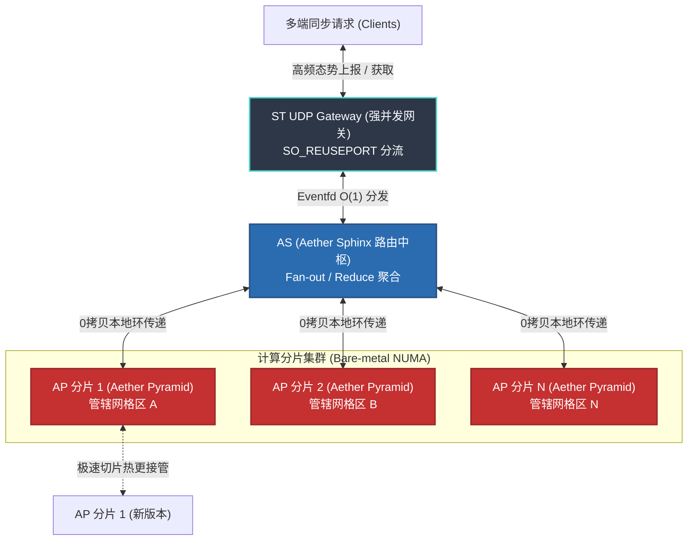
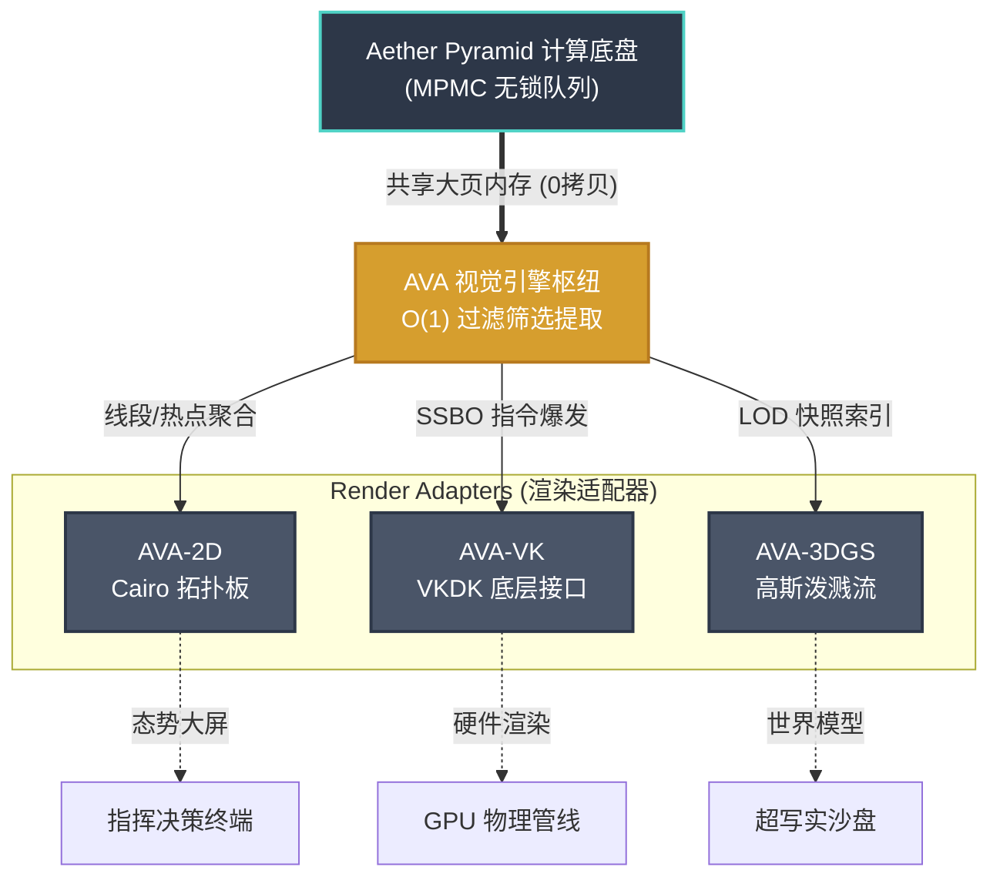
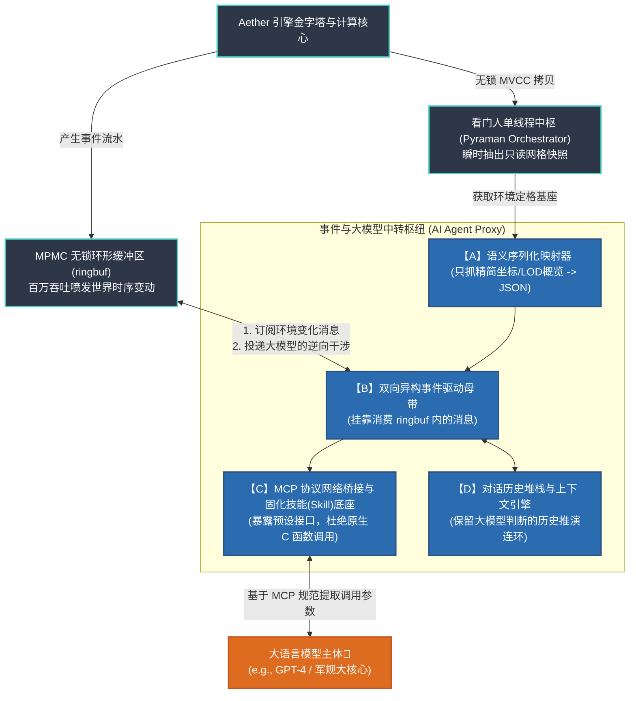

# Aether 时空内存引擎 - 完整技术白皮书

> 本文档由各分子文档合并生成，专供 NotebookLM / 大语言模型深度阅读与解析使用。

---


<!-- ============================================== -->
<!-- 文档来源: docs/01_philosophy/01_process_philosophy.md -->
<!-- ============================================== -->

---
title: 万物皆事件：Aether 引擎的底层设计逻辑
description: 从工程痛点出发，由浅入深解析 Aether 如何基于怀特海过程哲学，构建其事件驱动的核心计算模型。
sidebar_position: 1
---

# 万物皆事件：Aether 引擎的底层设计逻辑

**技术白皮书 | 版本 1.1 | 2026年3月**

在构建分布式实时空间网格服务时，挑战通常不只来自算力，更来自底层**设计逻辑**是否与真实业务过程一致。

本文从工程问题出发，说明 Aether (æ) 引擎的设计目标、其在高频空间推演中要解决的关键矛盾，以及"万物皆事件"这一事件驱动建模的技术基础。

---

## 1. 痛点：传统引擎中的并发瓶颈

在目前主流的商业引擎（如 Unity、Unreal）或传统的后端服务架构中，底层的数据模型几乎都根植于一个理所应当的观念：**“实体优先”**（Entity-First）。

按照这种观念，世界是由一个个持久不变的“实体”构成的（比如一架无人机、一栋大楼）。当实体发生移动或受损时，系统会通过“更新函数 (Update)”去临时修改这个实体的状态字段。时间与空间，只被当作装载这些实体的独立“容器”。

但在超大规模并发推演中，这种设计会持续暴露出结构性问题：
- **状态与过程割裂，无法溯源因果**：因为每一次系统 Tick 只是用新状态覆盖老状态（快照），所以如果一架飞机坠毁，系统无法从最后的静态参数里自然回放它坠毁的全因果链。
- **并发锁竞争 (Lock Contention)**：当多个模块在同一时刻修改同一实体状态时，系统需要上锁（Mutex）协调访问，吞吐会随锁竞争显著下降。
- **不确定的内存行为**：实体反复创建与修改依赖底层内存回收机制（GC 或 `malloc/free`），在关键任务场景中可能引入不可预测抖动。

为应对高并发场景下的“状态冲突、锁争用与不可追溯”三类问题，Aether 在建模层面做了结构性调整。

---

## 2. Aether 的答案：“状态即过程”与“万物皆事件”

Aether 采用过程化建模思路：系统中的“无人机”或“风暴”等对象，不被视为可随意改写的静态块，而是由连续事件在时空中累积形成的状态结果。

因此，Aether 在数据结构层面采用如下约束：
- **引擎中不直接暴露可任意改写的实体内核状态。**
- 底层调度器的基础处理单元为 **事件 (`event_t`)**。
- 一条“移动指令”是一个事件，一次“雷达扫掠”也是一个事件。当这架无人机移动了 10 米，并不是它的实体坐标被改写了，而是系统在连续这几毫秒内接连产出了 100 个微小的 `[相对位移事件]`。

通过将模块通信统一为事件写入，各子系统可减少共享可变状态带来的互锁。当需要查询无人机当前位置时，系统通过结算对应事件序列得到当前状态。

---

## 3. 追根溯源：来自“怀特海过程哲学”的降维赋能

“万物皆事件”的工程直觉，与 **阿尔弗雷德·诺思·怀特海（A.N. Whitehead）过程哲学（Process Philosophy）**中的若干概念可形成方法论对应。

相比传统“实体优先”叙事，过程哲学强调“存在在生成中展开”。Aether 将这一思路映射为可执行的 C 语言内核机制：

| 工程问题 | 怀特海的哲学视角 | Aether 的工程实现 |
| :--- | :--- | :--- |
| **减少共享可变状态冲突** | **现实实有 (Actual Entity)**：基本单位可理解为不断生成的事件过程。 | **时间轮事件流 (`event_t`)**<br>引擎以事件为基础单位，通过无锁环形队列 (MPMC) 进行并发投递与消费。 |
| **建立可追踪因果链** | **摄入 (Prehension)**：后续事件吸收前序事件影响，形成因果承接。 | **ECS 组件系统**<br>组件承载跨事件阶段的状态痕迹，事件 A 写入、事件 B 读取，形成可追踪接力。 |
| **保证历史可回放与可审计** | **客观不朽 (Objective Immortality)**：完成事件可视为不可更改的历史材料。 | **底层内存池 (`memarena`)**<br>顺序内存记录配合事件日志回放，可重建指定时刻状态，满足审计与复盘需求。 |
| **让时空索引随计算负载演化** | **广延连续体 (Extensive Continuum)**：时空从关系与距离中被定义，而非先验静态容器。 | **动态体素金字塔 (Pyramid Index)**<br>空间索引根据事件分布动态展开，按需细化网格层级。 |

---

## 4. 架构选择带来的工程收益

将过程化建模落实到 C 语言调度器，目的不是概念化叙事，而是让系统行为可解释、可验证、可治理。对应地，Aether 在工程侧主要获得三项收益：

### 4.1 可审计性 (Auditability) 与回放能力
既然当前状态由历史事件累积而成，系统即可基于事件日志做时间回放。在国防或航空等高合规场景中，这种能力可用于事故复盘与责任边界分析，通常比单次快照更易定位因果链。

### 4.2 无锁的高效并发 (Lock-free Concurrency)
事件中枢（基于分层时间轮与 MPMC）降低了模块间耦合。物理网格检测、AI 决策下发与前端刷新可并行投递 `event_t`，减少对共享可变状态的争用。根据既有基准，事件流处理峰值可超过 1,000,000 req/s（结果受硬件与负载模型影响）。

### 4.3 低抖动的实时能力 (Hard Real-Time)
由于不依赖高频对象分配与回收，底座采用 `memarena` 内存竞技场，以降低碎片化与 GC 抖动风险。在基准环境下，单次分配可接近 $8\,ns$ 量级；实际性能需以部署硬件、编译参数与运行负载为准。

---

## 5. 结论

在大规模时空系统建设中，架构理念并非叙事包装，而是直接决定可维护性、可验证性与系统上限的底层约束。

Aether 没有采用“实体直接改写”作为唯一中心，而是以事件流作为主干表达状态演化。该路径在并发控制、审计回放与跨模块协同上提供了更清晰的工程边界，也为后续服务化与生态集成提供了稳定基础。


<!-- ============================================== -->
<!-- 文档来源: docs/01_philosophy/02_ontology_paradigm.md -->
<!-- ============================================== -->

---
title: Aether 时空本体论：基于实时世界模型的事件驱动架构
description: 说明 Aether 如何通过时空本体建模，将底层数据组织为可推理、可执行的业务语义层，并以行业实践作为方法印证。
sidebar_position: 2
---

# Aether 时空本体论：以行业实践印证的数字世界模型

**技术白皮书 | 版本 1.1 | 2026年3月**

如果数据库中存有十万条包含经纬度和速度的 JSON 记录，系统是否就能理解低空空管或无人机物流的业务语义？

答案是否定的。

传统数据系统擅长存储与查询，但并不天然具备对现实业务关系的语义理解能力。若要让机器，尤其是大语言模型，参与城市级调度或复杂工业协同，系统需要的不只是 `SELECT * FROM table`，还需要一套可计算、可约束的业务语义模型。

在计算机科学语境中，这套模型通常被称为 **本体论 (Ontology)**。

---

## 1. 印证之路：来自 Palantir 的成功启示

在 Aether 的高层抽象设计中，我们并非从零开始定义概念，而是参考了行业中已经验证过的方法路径。Palantir 在防务与企业场景中的平台实践，为这一路径提供了具有参考价值的外部印证。

过去十余年中，Palantir 在战场信息协同、公共卫生响应与航空制造协同等复杂场景持续投入。公开资料显示，其平台能力的关键组成之一是 **Palantir Ontology**：将底层数据映射为可关联、可治理、可执行的业务对象体系。

其核心思路可概括为：**将分散的数据表映射为具备语义关联、治理约束与可执行动作的业务对象。** 例如在防务类场景中，可将雷达信号抽象为目标对象，并与禁飞区域建立拓扑关系，进而触发对应的处置动作。

Aether 将这一范式引入高频空间计算场景，形成了全实时的 **Aether 时空本体模型 (Spatiotemporal Ontology)**。

---

## 2. 构建-控制-反馈：AE 时空本体闭环

AE 的全实时时空本体模型，可由“构建-控制-反馈”三个环节组成闭环。该设计不再将数据平台限定为被动存储层，而是将语义建模、业务执行与状态回流纳入统一运行框架。

### A. 构建（认知映射）

AE 基于多维空间格网与底层组件系统，将传感器坐标与数据流实时转换为 LLM 与业务系统可读取的业务语义：
- **业务实体 (Business Entities)**：例如拥有电量、载荷、任务状态等属性的无人机对象。
- **空间拓扑关联 (Spatial Topology Relationships)**：例如伴飞、侵入、汇聚、脱离等实体间的动态关系。

这一环节的目标，是建立稳定且可计算的认知映射层。

### B. 控制（物理干预）

AE 在引擎中预定义符合物理约束与业务规则的行动操作（Action Types）。当上层决策生成后，系统可通过业务反向控制（Write-back）机制向外部物理节点下发指令，例如：
- 调拨航向
- 冻结空域
- 调整任务优先级

由此形成从数字决策到物理执行的闭环链路。

### C. 反馈（时空流转）

现实世界的高频变化可被 AE 统一转化为标准化微事件流（Events）。依托无锁事件总线（MPMC）与原子快照机制，引擎可持续处理反馈流，并维持时空世界模型与物理状态的一致性更新，同时支持：
- 全态数据审计能力
- 任意时点回放与“时光倒退”复盘能力

通过这一闭环，AE 不仅提供推演能力，也为 AI 介入现实业务流程提供了标准化执行语法。

---

## 3. Aether 如何构建“三层本体架构”？

Aether 对业务终端与 AI 模型暴露的是一套三层世界模型，用于回答“是什么、能做什么、发生了什么变化”三个核心问题。

### A. 语义层 (The Semantic Layer) —— 解决“世界是什么？”
Aether 基于底层网格与组件系统，将输入数据组织为可被业务与 AI 共享理解的语义对象：
- **万物皆对象 (Objects)**：一条从 MQTT 传来的传感器消息，被 Aether 提纯成了一个拥有载重、剩余电量、当前风阻系数的实体 ID。
- **空间链接 (Links/Relationships)**：利用金字塔格网，Aether 建立起了实时的动态关系——比如不仅知道你在哪，而且通过计算直接标记出“无人机 A 正在【伴飞】无人机 B”，或者“车辆 C 已经【驶入】拥堵地段”。

### B. 动力层 (The Kinetic Layer) —— 解决“能做什么？”
动力层定义行动类型（Action Types）并约束其执行条件：
- **定义行动**：在 Aether 中，用户除了写查询流，更能向底座注入像“强制调拨航向”、“冻结此空域”等动作。
- **业务反向控制 (Write-back)**：Aether 在推理出避让操作后，这套动力层可以直接与外部真实的 SAP 或无人机地面控制站握手，实现从“数字世界的模拟推演”向“物理世界的实际拉动”闭环。

### C. 动态层 (The Dynamic Layer) —— 解决“发生了什么变化？”
现实状态持续变化，动态层负责记录并传播这些变化：
- 如前面章节《万物皆事件》所述，Aether 所有的本体跃迁均通过无锁事件总线（MPMC）进行流转。
- 借由原子快照技术，确保了分布式实时空间网格服务与物理现实间毫秒级的状态一致性，且能随时为业务全态执行"时空倒退"复盘。

---

## 4. 终极远景：为 AI 铺设“思考的轨道”

Aether 采用本体范式的目标，是为下一阶段的 AI 原生集成提供稳定中间层。

当前大语言模型（LLMs）具备较强推理能力，但在低空空管、重型制造等高约束行业中，仍缺少可直接执行的业务语境与操作边界。

Aether 时空本体可作为算力与物理世界之间的中间层语境：
1. 它将复杂的坐标求交直接降维成了“在谁内部 / 即将撞击”的语义逻辑；
2. 它提供明确的、合乎物理法则的操作把手（`ae_action`）；
3. AI 代理可基于本体定义读取实时态势，并通过标准化行为事件触发业务执行。

当引擎同时提供算力与可执行语义时，空间智能系统才具备持续落地的工程基础。


<!-- ============================================== -->
<!-- 文档来源: docs/01_philosophy/index.md -->
<!-- ============================================== -->

---
title: Aether 引擎：设计原则与架构导读
description: 阐述 Aether (æ) 引擎在时空计算、事件驱动与多维格网方面的设计原则
sidebar_position: 0
---

# Aether 引擎：设计原则与架构导读 (Design Principles)

Aether (æ) 引擎面向大规模、高动态的三维时空推演场景，提供低延迟、可审计的分布式世界模型底座。不同于以渲染为核心的 GIS 平台或游戏引擎，Aether 更关注底层空间建模、事件驱动与内存访问效率。

---

## 1. 核心准则：全量事件驱动 (Event-driven Architecture)
系统采用“一切状态皆事件”的异步流体系机制：
- **状态即反馈**：实体的位变、冲突、属性更迭均被抽象为标准的事件包 (Event Packet)。
- **O(1) 级调度**：借助内置时间轮 (Timing Wheel) Pyraman 调度器，系统在目标配置下可用固定复杂度处理高并发触发器。
- **确定性时序**：通过原子状态机维护事件的先后关系，在多线程环境中保持可复现的执行顺序。

---

## 2. 三维空间逻辑：多维金字塔格网 (Spatiotemporal Voxel Grid)
Aether 通过金字塔式的分层格网构建环境拓扑：
- **分区回调 (Region Callback)**：金字塔逻辑根据空间密度动态调整索引深度，仅在有实体或有计算任务的区域开辟精细格网。
- **动态 LOD**：支持全城级 (20km+) 宏观态势与局部 (10cm 级) 精细碰撞在同一坐标系下并行计算。
- **空间独立性**：各计算分片 (Shard) 进程间物理隔离，通过共享内存进行非阻塞数据交换。

---

## 3. 面向认知集成：AI 模型与大模型适配
系统架构在设计阶段即考虑与 AI 推理侧的解耦协同：
- **增量更新机制 (Incremental Updates)**：模型仅需在初次接入时获得完整的空间快照。后续通过 MPMC 管道接收差量信息（如 `ENTITY_MOVE` 事件），有效降低了数据传输负载。
- **计算解耦保护 (Computation Decoupling)**：布尔计算、雷达交叉探测等密集计算在底层的 C 计算域完成，仅向外输出语义化的状态副本，减少了 AI 决策层的冗余计算负担。

---

## 4. 坐标系融合规范 (Geospatial & Cartesian Integration)
Aether 提供原生双坐标系转化能力：
- **GIS 模式**：基于经纬度与相对高程，自动对齐 WGS84 或国家坐标系，适用于宏观地形。
- **工程模式**：基于笛卡尔三维坐标，支持局部室内、封闭测试场的高精度向量运算。
- **跨尺度映射**：支持将宏观环境事件（如气象触发）映射为局部实体的业务交互事件。

---

## 5. 架构特性对比
以下为 Aether (AE) 引擎与 Unreal/Unity 等通用图形渲染引擎在核心层的功能界线：

| 评估维度 | Aether (AE) 计算内核 | 通用渲染引擎 (UE/Unity) |
| :--- | :--- | :--- |
| **主引擎逻辑** | 物理推演、空间索引、事件决策 | 图形渲染、光影效果、视觉交互 |
| **内存管理** | 静态分配、Arena 连续内存池 | 动态堆栈管理、GC 垃圾回收机制 |
| **部署形态** | 纯 C 动态库、物理原生部署 | 多平台 Runtime 封装环境 |
| **性能指标** | 在目标配置下可实现微秒级延迟控制 | 以视觉帧率 (FPS) 稳定性为主要目标 |

---
**[注：本系统定位为“空间认知与计算内核”，渲染与业务管理通常通过适配层集成。]**
---

## 6. 与业界方案的定位区别 (Market Positioning)

在空间计算领域的生态链中，Aether 服务于特定的"实时推演与控制"中间层。为避免与相邻方案的定位混淆，下表阐述了三类主流系统的差异：

| 系统类型 | 代表产品 | 主要职责 | 设计权衡 | Aether 的区别 |
| :--- | :--- | :--- | :--- | :--- |
| **空间数据引擎** | ESRI SDE、PostGIS、OGC GeoServer | 地理数据的存储、索引、属性查询 | 面向离线或准实时的查询响应 | 不承载持久化存储；全内存实时计算 |
| **可视化渲染服务** | Cesium、3DTiles、ArcGIS Online | 网络分发、前端渲染管线、交互体验 | 面向浏览器端的视觉效果与帧率稳定性 | 不负责渲染；专注状态推演与事件驱动 |
| **分布式实时空间网格服务** | **Aether Server** | **百万级实体的毫秒级物理推演、事件调度、多actor协同决策** | **无锁并发、O(1) 调度、确定性执行** | **高频决策反馈、AI中间件、工业场景适配** |

Aether 在架构上介于数据存储层与前端展示层之间，为以下用户群体提供核心价值：
- **LLM Agent 框架**：通过增量事件流快速感知环境变化，提升决策质量。
- **工业仿真系统**：满足千万级物理对象的实时物理推演需求。
- **无人系统编队管控**：提供毫秒级的冲突避免与协同决策能力。
- **地理信息实时处理**：突破 GIS 系统的"准实时"限制，实现纯实时的空间事件驱动。

---


<!-- ============================================== -->
<!-- 文档来源: docs/02_quickstart/index.md -->
<!-- ============================================== -->

---
title: 快速开始：从 Aether Kernel 到 Aether Server 部署架构
description: 说明 AE 计算内核与 Aether Server 分布式架构的边界，并给出从库级集成到集群部署的实施路径。
sidebar_position: 2
---

# Aether 引擎：核心内核与 Aether Server 部署指南

在将 Aether (ae) 用于高频时空计算之前，需要先区分两类架构形态：位于底层的 **Aether Kernel（计算内核）**，以及对外提供网络与集群能力的 **Aether Server（分布式服务层）**。

本指南用于澄清集成边界，并提供首批部署的标准流程。

---

## 1. 架构边界定义 (Architecture Boundaries)

### 1.1 Aether Kernel (计算内核库 `libae.so`)
Aether Kernel 是一套以 C 语言实现的高性能时空计算库，面向数学计算与内存管理。其核心组件包括：
- **`memarena` 内存竞技场**（彻底摒弃 `malloc`/`free` 的 O(1) 预分配策略）
- **Pyraman 看门人中枢**（执行单核写权限，防范多线程死锁）
- **无锁事件环形队列 (MPMC `ringbuf`)**
- **空间计算网格与 ECS 数据列**

**边界与定位：** 内核不包含网络通信模块（如 TCP/UDP Socket），也不负责服务发现与微服务编排。它主要处理坐标对齐、布尔运算与空间拓扑推理。

### 1.2 Aether Server (分布式服务算网)
为承载大规模并发接入场景，Aether 在内核之上提供了 **Aether Server**。该服务层通过硬件亲和性配置与高效 I/O 模型，支持跨节点协同计算，是生产环境的实际部署形态。

---

## 2. 方式一：集成 Aether Kernel (内嵌计算能力)

适用于网络 I/O 路径较短、业务拓扑相对简单的嵌入式场景，或需要将空间计算能力嵌入既有后端系统的场景。

### 2.1 基础环境构建
内核依赖标准的 C11 环境。
```bash
# 引用头文件，将业务逻辑与 aether_core 动态库链接
gcc my_collision_plugin.c -laether_core -O3 -o my_standalone_engine

# 提升进程实时级别并启动
chrt -f 99 ./my_standalone_engine 
```

### 2.2 核心初始化生命周期
在纯内核架构中，通常由主循环显式驱动计算流程：
1. **注入内存池 (`memarena_init`)**：获取物理内存块的起始页指针，挂起大页 (HugePages) 映射。
2. **初始化时空索引**：创建包含 LOD 参数的金字塔格网系统，指定 Hilbert 填充曲线与初始分辩率。
3. **注册事件钩子 (Event Hooks)**：使用 `dlopen/dlsym` 或直接注册回调函数，将外部的防撞插件逻辑挂载至 `ringbuf`。
4. **推进时钟节拍 (Tick-Tock)**：执行高精度时钟逻辑，驱动事件派发器消费待处理数据。

---

## 3. 方式二：部署 Aether Server (构建集群网)

该方式适用于大规模并发场景（如区域级无人系统统一管控）。在该模型下，开发者通常不再直接调用 `libae.so` 管理内存，而是通过分布式 Aether Server 提供统一能力。

### 3.1 核心服务组件拆解
标准的 Aether Server 集群通常由三类进程角色组成：

#### 1. 强并发接入层：ST UDP Gateway
在高频传感器接入场景中，可采用基于 **State Threads (ST)** 的 UDP 网关实现。
- **调度机制**：配合 `SO_REUSEPORT` 进行报文分流，使网卡流量可在多处理路径间均衡派发。具体时延与上下文切换指标取决于硬件、内核参数与负载模型。

#### 2. 分布式推演节点：AP (Aether Pyramid)
AP 节点便是包裹了 Aether Kernel 的物理实例执行体。
- **算力切分**：集群在逻辑上划分空间区域，每个 AP 进程负责局部空间分片（例如某一地理体素范围）。
- **零拷贝通信**：通过与网关协同，AP 将自己池化内存中的事件投递窗口利用 `eventfd` 暴露给网络 Gateway 实现底层数据的零拷贝传输。

#### 3. 智能总线路由面：AS (Aether Sphinx)
在跨分片检索场景（例如目标穿越相邻 AP 边界）中，AS 作为协调中枢承担路由与结果汇总职责。
- **Map-Reduce 范式**：承接海量并行的 `Fan-out`（向多个相关 AP 抛出检索）并在 AS 层进行数据结果集的 `Reduce`（剔除重复边界实体，执行降噪汇总）。

### 3.2 高性能工业部署建议 (Deployment Standard)
启动 Aether Server 不应被当作普通微服务对待：
1. **审慎使用重虚拟化部署**：Aether Server 对 `NUMA` 绑定和实时调度策略较敏感。在低时延要求下，可优先评估裸金属（Bare Metal）部署。
2. **配置大页内存 (THP/HugePages)**：在大规模体素寻址场景中，大页可降低 TLB 抖动带来的开销。建议结合内核版本与负载特征进行压测后设定页宽策略。

---

## 4. 方式三：存量系统接入 (AE-EXT 协议适配层)

对于存量系统，核心诉求通常不是全栈重构，而是在既有可视化与 GIS 体系上平滑提升计算能力。此时可通过 Aether Server 的 **AE-EXT (Aether Extension)** 适配层接入。

### 4.1 核心对接逻辑
现有三维前端通常具有固定的寻址模式。AE-EXT 提供以下协议适配能力：

- **显式索引适配 (3DTiles/I3S)**：Aether 可根据空间体素变化生成包含 LOD（多细节层次）和包围盒信息的 `tileset.json`，供前端按标准 BVH 方式增量拉取动态数据。
- **隐式格网兼容 (OSGB)**：针对依赖固定编号规则的地信客户端（如 PagedLOD），AE-EXT 可兼容其格网目录逻辑，使客户端沿用原有寻址习惯读取实时计算结果。

**核心收益**：在多数场景下，前端改动可控制在较小范围。通过将资源 URL 指向 AE-EXT 节点，可将基于静态切片的 GIS 流程逐步迁移到动态空间计算管线。

---

## 总结
若目标是快速验证几何与拓扑能力，可优先集成 **Aether Kernel**；若目标是建设工业级分布式实时空间网格服务，建议采用 **Aether Server** 集群架构；对于存量业务系统，可通过 **AE-EXT** 进行渐进式接入。


<!-- ============================================== -->
<!-- 文档来源: docs/03_core_subsystems/00_mathematical_foundations.md -->
<!-- ============================================== -->

---
title: 底层数学工程原理：形式化建模与可计算性 (Mathematical Foundations)
description: Aether 引擎底层的 7 类数学基础及其工程映射方式。
sidebar_position: 0
---

# 数学原理与形式化建模 (Mathematical Foundations)

Aether (ae) 引擎并非停留在理论层面的数学抽象，而是将**集合论、图论、数理逻辑、泛函分析**等方法映射到工程实现中，形成“数据-逻辑-行动”的形式化链路。

以下为支撑 Aether 引擎运行的 7 类数学基础及其工程应用：

---

## 1. 集合论与实体建模 (Set Theory)
*   **数学基础**：定义全集 $U$ 为业务全空间，子集 $S_i$ 为具体的业务实体分类（如 $S_{truck}, S_{order}$）。
*   **AE 工程应用**：通过 **ECS (Entity Component System)** 实现。
    *   实体及其属性集 $P_i = \{(key, value)\}$。
    *   利用集合的**并、交、补运算**实现高效率的组件筛选与实体归纳。

## 2. 图论与空间拓扑关系 (Graph Theory)
*   **数学基础**：构建业务有向图 $G = (V, E)$，顶点集 $V$ 为业务实体，边集 $E$ 代表实体间的业务关系。
*   **AE 工程应用**：核心的 **æ Spatiotemporal Pyramid (时空网格索引)**。
    *   利用图论中的**最短路径、连通性分析、多层网格遍历**实现复杂的空间关系推理。
    *   处理“订单-货物-车辆-仓库”间的资源调度分配问题。

## 3. 映射与函数式转化 (Mapping & Functions)
*   **数学基础**：定义映射函数 $f: D \to P$，将来自不同数据源 $D$ 的原始数据映射为统一的业务本体属性集 $P$。
*   **AE 工程应用**：实现 **数据孤岛治理 (Data Integration)**。
    *   通过复合映射 $f = f_n \circ f_{n-1}$ 完成数据清洗、格式统一及语义化标注。
    *   确保业务层面的操作能通过逆映射回写至原始数据系统。

## 4. 谓词演算与推理基础 (Predicate Calculus)
*   **数学基础**：利用命题逻辑与合取、析取、蕴含，将业务规则转化为可计算的逻辑表达式。
*   **AE 工程应用**：**规则引擎与 AI 确定性推理**。
    *   例如：$Unfinish(o) \land Stock(y) \land Free(x) \to Transport(x, y)$。
    *   它是 Aether 为 LLM 大语言模型提供业务上下文及防幻觉推理的逻辑底座。

## 5. 离散事件动态系统 (DEDS)
*   **数学基础**：定义系统状态集 $X$ 及行动算子 $A$，状态转移满足 $X(t+1) = A_k(X(t))$。
*   **AE 工程应用**：**行动编排与状态快照 (Snapshot & Actions)**。
    *   将业务调度的可行性分析抽象为状态转移的可达性判定。
    *   确保每一条行动指令在系统物理规则内是合规且可预测的。

## 6. 特征表现与向量空间 (Vector Spaces)
*   **数学基础**：将业务实体/关系映射为高维向量空间 $R^n$ 中的特征向量。
*   **AE 工程应用**：**AI 感知与语义理解的中间件**。
    *   利用向量余弦相似度计算，使 AI 能够准确理解实体间的隐性业务关联。
    *   实体特征的向量化，解决了大模型在空间认知上 Context Token 溢出的问题。

## 7. 泛函分析与逻辑融合 (Functional Analysis)
*   **数学基础**：将不同来源的业务逻辑（规则、模型、优化器）抽象为函数空间中的泛函。
*   **AE 工程应用**：**多源异构模型集成 (Knowledge Integration)**。
    *   定义逻辑融合算子，对来自机器学习预测模型与基于规则的决策逻辑进行权重加权融合。
    *   利用变分法求解最优泛函，寻找成本与收益约束下的可行最优解。

---

## 核心数学特征总结

Aether 引擎的数学基础可概括为**核心业务的形式化建模**。通过上述 7 类方法，系统可将非结构化空间决策问题转化为**可计算、可自动化执行的推演过程**。


<!-- ============================================== -->
<!-- 文档来源: docs/03_core_subsystems/01_spatial_grid.md -->
<!-- ============================================== -->

---
title: 空间网格与回调机制
description: 说明金字塔层级、LOD 选择与几何映射在空间索引中的实现方式。
---

# 空间网格与体素化计算 (Spatial Grid)

> 🔗 **对应底层代码库：** `common/pyramid.h`, `common/pyramid2.c/h`, `common/pyramid3.c/h`, `common/pyramid4.c/h`

> Aether 的空间核心是一套多级网格索引结构，将世界坐标按尺度分级存储，用于降低遍历开销并支持细节层次 (LOD)。

## 1. 核心层级拓扑与参数映射
在 Aether 的金字塔定义中，层索引 `l` 从 0（最粗顶层）向下递增。
第 `l` 层的世界范围在每个维度被均分为 $2^{l+1}$ 份。
以 2D 为例，网格数量依层级呈指数级增长：第 0 层 4 个网格，第 10 层 4,194,304 个。网格坐标系与世界坐标系保持对齐。

系统支持不同维度的时空网格划分，并通过统一的**分区回调机制 (Partition Callback)** 处理跨维度映射：
- **2D 索引**：支撑底盘平面建图、UI 虚拟平面分布等基础二维场景。
- **3D 索引**：支撑三维世界地图、城市级立体建筑模型群落。
- **4D 索引**：在三维立体常数体系上进一步外拓时间维度。该架构直接用于统管时变对象（如载具物理重影位移、沉降状态的动态地形图幅）。支持系统级跨时延查询能力（例如处理类似请求：“拉取过去两小时内跨越此处三维坐标区间域的所有记录点位”）。

## 2. 自动层级选择算法 (Auto Level Selection)
插入图形时，Aether 并不要求死板的逐级检测，而是采用高阶统筹算法，计算图形外包矩形 (Extent) 在每一层覆盖的网格数 $c(l)$：
1. **逆向回溯**：从最底层向顶层遍历，记录 $c(l)$。当 $c(l) \le 4$ 时，进入判定。
2. **停止回溯条件**：若出现层索引 $m > n \ge l$ 且 $c(m) = c(n)$，表明网格覆盖数量首次停止减少，即确定 $n$ 为图形在金字塔中存储的最佳层级。
3. **顶层兜底**：若 $c(m) < c(n)$ 持续减少，则最终直接越区升至根节点第 0 层。

经过该算法后，图形占据的网格通常为 **1 个、2 个或 4 个**。对于覆盖 4 个网格的情况（例如图形位于坐标交界处导致的“假阳性网格”），可在视锥查询或碰撞阶段通过精确相交测试剔除。

## 3. 主实体与局部网格机制

在处理大跨度实体（如桥梁、长航线）时，Aether 采用“主实体 (Primary Entity)”与“局部网格 (Local Grid)”的两层表达机制，避免对几何体进行物理切割：

- **主实体（Primary Entity）**：存储对象唯一标识、类别、包围盒以及核心几何/属性信息，是对象在系统中的整体表达，并由系统维护**引用计数（Reference Count）**。
- **局部网格（Local Grid）**：指主实体在单个叶子网格上的占据登记。它对应一个叶子网格中的轻量级索引引用，仅表达“该主实体占据了当前网格”，自身不复制实体本体数据，也不表示一组子网格。

**总体与局部的关系**：主实体负责表达“这个对象是什么”，局部网格负责表达“这个对象在某一个叶子网格中的占据状态”。当一个大对象横跨多个叶子网格时，系统不会拆出多个子实体，而是保留一个主实体，并在多个叶子网格中分别登记对应的局部网格。因此，“主实体对应的空间占据网格集合”构成总体，“其中任一单个叶子网格上的登记”构成局部。

**局部触发，全局关联**：当调用 `pyramid_insert` 插入大图形，或在特定网格发生体素碰撞时，只需命中对应的局部网格登记，即可通过指针关联到主实体并完成全局分析。该机制可降低长跨度对象更新与检索过程中的冗余拷贝成本。

## 4. ID 逆向映射网络 (哈希桶基座复用)
为了极速响应引擎的更新与销毁事件，用户注入的 64 位 `real_id`（最高位 bit 63 保留做系统标志）必须能以 $O(1)$ 的时间复杂度逆向追踪到它所属的实体位置表。

- **基于格网的哈希追踪机制**：Aether 复用金字塔底层网格作为哈希数据桶。该设计利用格网的高基数特性，使哈希冲突保持在极低水平，保障了实体回查操作的 $O(1)$ 性能，在千万级规模下依然维持稳定的调度效率。

## 5. 多层架构的并发剥离界限
需要特别声明，金字塔底座本身：
> 不提供线程级并发加锁机制。

在整体架构中，空间数据的一致性保护职责由外部 **事件管理器** 与 **MPMC 无锁环形缓冲区** 统一调度。该分层方式可降低网格层的并发复杂度。

## 6. 体素计算与传统几何计算：融合架构范式
相较于传统引擎完全依赖高精度解析几何的方式，AE 的架构主张将“体素化离散计算”与“传统连续几何”分离，并基于各自优势建立共存调用关系：

- **体素化初筛 (Aether Grid)**：负责宏观结构感知，处理碰撞初筛、遮挡估计与高频对象迁移。
- **连续几何精算 (Traditional Geometry)**：负责高精度轮廓计算，如布尔裁剪、线型求交与矢量拓扑输出，可通过解耦接口接入 `libclipper` / `libtess2` 等库。

体素负责宏观筛选，解析几何负责边界精算。两者协同可在性能与精度之间取得工程平衡。

## 7. 架构剖析：空间索引库选型对照

与当前业界主流采用的四叉树 (Quadtree) 以及 R 树 (R-Tree) 相比，基于金字塔层级解决超大规模海量动态目标的差异化表现在于其结构映射机制：

| 特性维度 | Aether 金字塔索引 | 传统四叉树/八叉树 | R 树 (R-Tree) |
| --- | --- | --- | --- |
| **LOD 原生支持** | 层级自然对应细节空间跨度，自动具备剔除裁剪特性 | 需要额外去构建并维护多套并行的细节映射层 | 无直接的内置多层级 LOD 能力 |
| **动态坐标更新成本** | 借由 ECS 组件定位查引重刷，平推消耗锁定 **$O(1)$** | 频繁位置跨越会导致树重组爆发极高的时间开销 | 重构包裹树、拆页导致性能呈现震荡波谷 |
| **目标区域解构机制** | 特有**分区回调 (Partition Callback)**，自动裁解子级部分 | 将目标视作不可分割界限盒 (AABB Bounding Box) | 纯包裹，缺乏结构探视与拆分下发机制 |
| **实体生命域融合** | 每个网格单元实质作为一个 ECS 实体，实现原生逻辑连通 | 须通过外部逻辑 Handle 持有并关联构建跨域映射 | 绝对独立于 ECS 或主对象系统外挂执行 |


<!-- ============================================== -->
<!-- 文档来源: docs/03_core_subsystems/02_archetypeless_ecs.md -->
<!-- ============================================== -->

---
title: 无原型 ECS 与轻量内存池底座
description: 说明按类型分池存储架构及其在确定性内存访问上的收益。
---

# 无原型实体组件系统 (Archetype-less ECS)

> 🔗 **对应底层代码库：** `common/ecs.c/h`, `common/refcobj.h`

与开源界（如 `flecs`, `EnTT`）盛行的根据**原型 (Archetype) 匹配**进行实体连续迁移的做法不同。Aether 侧重于实现确定的内存行为，采用了扁平化的结构设计。

## 1. 内存原型迁移的开销约束
传统的基于 Archetype 的 ECS 在组件动态增删时，往往涉及对象在不同内存块间的迁移与拷贝。在高频并发场景下，这类非确定的内存行为会显著降低 CPU 缓存命中率并引入不必要的同步开销。

## 2. “按类型分池连续存储”布局 (Type-specific Pools)
Aether 为了确保确定的内存访问路径，采用扁平化存储架构：

- **组件按类型独立分池 (Contiguous Storage)**：在 `memarena` 内为各组件类型开辟独立数据池。该布局保证同类组件在物理内存中紧密排列，便于利用 CPU L1/L2 缓存预取机制。
- **掩码位实体管理 (Mask-bit Entity)**：通过为每个实体分配固定长度的位掩码 (Bitmask) 来判定组件装载状态。实体 ID 本身作为逻辑索引，组件的动态挂载与剥离仅涉及位运算，操作复杂度恒定为 **$O(1)$**。
- **引用计数与零拷贝复用 (Reference Counting)**：系统层级支持资源的引用计数管理。允许大量实体共享同一份大规模几何数据或拓扑组件，有效避免了逻辑属性的冗余拷贝。
- **基于稀疏集的关联迭代 (Sparse Sets)**：当组件密度较低（数据疏离）时，系统通过稀疏集 (Sparse Sets) 处理实体序列。迭代复杂度仅与有效载荷数 (Payloads) 正相关。

## 3. 内存布局与硬件级优化 (SIMD)
- 基于固定偏移量的指针直接寻址，消除动态查找开销。
- 采用 SIMD 指令集批量处理 `Transform Matrices` 与渲染指令，并结合 Cache Prefetching 提升数据吞吐效率。


<!-- ============================================== -->
<!-- 文档来源: docs/03_core_subsystems/03_event_timing.md -->
<!-- ============================================== -->

---
title: 事件总线与分层时间轮
description: 事件总线与分层时间轮的调度机制，以及其在高并发场景下的实现要点。
---

# 事件驱动架构：事件总线与高精度时间轮 (Event Bus & Timing Wheel)

> 🔗 **对应底层代码库：** `common/taskwheel.c/h`, `common/hitimer.c/h`, `common/timeapi.c/h`

该架构以事件为唯一调度载体。模块之间通过投递标准事件通信，而非直接跨模块阻塞调用。

在纯 C 环境中，这种方式有助于降低模块耦合度，避免在高并发路径上形成复杂的互相调用链。

## 0. 架构本源：基于发布/订阅的事件流水账 (Event Ledger)

Aether 将状态变更与状态读取统一抽象为 **事件 (Events)**，并通过发布/订阅模型解耦处理链路。

1. **统一投递缓冲池**：各模块将意图封装为标准 C 结构体并投递到公共缓冲池。
2. **发布/订阅分流**：依赖 MPMC (`ringbuf`) 做事件分发，消费方仅处理自己订阅的事件码（如 `ENTITY_MOVE`）。
3. **可回放链路**：事件序列天然具备可追溯性，可用于回放分析与问题复现。

## 1. 核心循环节拍拆解
文档建议使用类似 `libuv` 的模型：
- **第一步**：捕获纳米级高精度时间节点。
- **第二步**：检索层次化时间轮清理到期任务事件。
- **第三步**：通过原子轮询探查无锁环缓冲 (Lock-free MPMC) 内待处理。
- **第四步**：派发网格解构带来的海量数据组件更新。
- **第五步**：收尾并执行积压数据的 ECS 组件属性的脏清理同步 (Dirty Mask Cleaning)。

## 2. 事件描述：原子生命周期 (The Event Lifecycle)


Aether 引擎通过五个阶段对 `event_t` 的状态转移进行确定性管理：

1.  **创建 (Create)**：从 `memarena` 内存池分配空间，初始化时空戳与业务参数。
2.  **提交 (Submit)**：任务入列 MPMC 无锁缓冲区，并根据定时策略挂载至分层时间轮槽位。
3.  **调度 (Schedule)**：时间轮节拍 (Tick) 触发或总线轮询探测，事件进入处理链路。
4.  **执行 (Execute)**：调用业务处理器 (Handler) 对属性组件执行读写（实现“摄入”逻辑）。
5.  **结束 (Finish)**：执行完成后，其变动效果被固化（即进入客观存储状态），回收内存资源。

---

## 3. 层次化定时器结构的设计优势
事件总线使用多级时间轮架构，通常按标准配置部署 8 级嵌套结构（每层部署固定的 256 卡槽位）。
- **时间复杂度特性**：相较于 `Min-Heap`，时间轮在事件插入与到期检查上具有稳定复杂度特征，适合高频注册场景。
- **跨度管理能力**：可同时覆盖短周期与长周期任务调度。
- **事件句柄管理**：调度前可获得事件句柄，用于撤销（Cancel）、延后或重分组。

---

## 4. 事件队列边界条件与容错机制

在高并发场景中，事件队列可能面临溢出、超时与丢弃的情况。Aether 采用以下处理策略：

### 4.1 队列满时行为 (Overflow Handling)
- **默认策略**：MPMC 环形缓冲的容量为固定大小（典型值 2^20 = 100万个 slot），写入时如满则触发**背压通知**而非丢弃。
- **背压处理**：调用方收到背压信号后，可选择(1)等待消费方腾出空间 (2)丢弃降优事件 (3)向应用层报警。
- **建议配置**：在关键任务场景下，建议将队列容量预设为峰值吞吐×1.5秒，确保缓冲余量。

### 4.2 事件超时与释放 (Timeout & Expiration)
- **时间戳精度**：事件发表时记录纳秒级时戳（%llu ns）。Pyraman调度器可检测"陈旧事件"（超配置TTL），拒绝继续处理。
- **默认TTL**：通常配置为5秒。若应用侧生成的事件流超过此窗口仍未被消费，则进入过期清理队列。
- **清理策略**：过期事件会记入"丢弃计数器"供监控系统追踪，但**不会阻塞新事件投递**。

### 4.3 丢弃与重试策略 (Drop & Retry)
- **优先级丢弃**：若队列压力持续>85%，Pyraman会自动丢弃低优先级事件，保护高优事件通路。优先级标记在event_t.flags中定义（3bit）。
- **不可重试事件**：某些业务关键事件（如安全告警）标记`NO_DROP`标志，若无法入列则向应用层返回错误码ERR_QUEUE_FULL。
- **建议处理**：应用应定义清晰的降级策略——例如在告警队列满时，可舍弃"冗余告警"仅保留"首发告警"。

### 4.4 监控与告警指标
推荐应用侧暴露以下指标至遥测系统：
- `ae_eventq_depth_pct` — 队列深度百分比（水位）
- `ae_eventq_drop_count` — 丢弃事件计数（分优先级）
- `ae_eventq_overflow_alert` — 是否触发背压（布尔）
- `ae_event_max_latency_ns` — 事件从投递到消费的最大延迟（p99值）

## 4. 函数指针与上下文安全契约 (User Context Data)

```c
/**
 * @brief 空间体素状态更新事件通知回调函数。
 * 
 * @param event 包含发生坐标及触发因子的不可变事件数据状态。
 * @param user_data 开发者注入的自定义业务上下文地址。
 * 
 * @warning 该回调将在无锁队列的消费线程中由于事件触发而在独立的调度期中异步拉起。严禁阻塞式系统调用（如死锁互斥、原生阻塞 I/O）。
 */
typedef void (*voxel_update_cb_t)(const voxel_event_t *event, void *user_data);
```

所有权应由调用方明确管理，避免 `user_data` 指向已销毁的栈内存或已回收地址。


<!-- ============================================== -->
<!-- 文档来源: docs/03_core_subsystems/04_concurrency_and_memory.md -->
<!-- ============================================== -->

---
title: 并发控制与内存管理
description: MPMC 环形缓冲与 Arena 内存分配器的设计与实现解析
sidebar_position: 4
---

# 并发控制与内存管理 (Concurrency & Memory Management)

> 🔗 **底层实现参考：** `common/ringbuf.c/h`, `common/memarena.c/h`, `common/mmaphuge.c/h`

在高并发时空计算场景下，传统的互斥锁与内存碎片化是主要的性能瓶颈。Aether 通过 **MPMC 无锁队列 (控制流)** 与 **Arena 内存池 (数据流)** 的解耦设计，构建高性能的数据同步总线。

## 1. 并发模型：MPMC 无锁环形缓冲区 (ringbuf)
系统通过无锁逻辑提升吞吐量并降低调度延迟：
*   **多生产者多消费者模型**：支持多个网格系统线程并发投递事件。核心依赖 C11 标准原生的原子操作（Compare-And-Swap）与强内存顺序语义（Acquire/Release）。
*   **避让策略 (Backoff Strategy)**：针对高并发下的写冲突，采用指数退避算法与 `pause` 汇编指令，降低原子操作对系统总线的占用开销。
*   **低锁竞争设计**：事件状态流基于槽位掩码状态机维护，降低传统锁竞争带来的阻塞与死锁风险。

## 2. 调度逻辑：Pyraman 看门人中枢与快照机制
为解决多线程频繁读写金字塔索引导致的一致性问题，Aether 采用 **Pyraman 看门人中枢 (Pyraman Orchestrator)** 模式：
*   **写权限收拢**：系统将金字塔拓扑的修改权限收拢至 Pyraman 所在的单核心线程。外部所有的修改请求均转化为事件流，通过 MPMC 队列进行序列化处理。
*   **任务优先级控制**：调度器按固定顺序轮询任务：**1. 外部事件队列 -> 2. 内部拓扑调整 -> 3. 定时器触发**，确保计算任务的确定性。
*   **一致性快照 (Snapshot)**：在处理读取请求时，Pyraman 会利用内存连续性瞬时派生只读副本。

## 3. 内存分配器：Arena 存储架构
Aether 核心路径通常避免直接使用泛用型 `malloc`/`free`，并将计算对象纳入定制化 **Arena (memarena)** 管理，以提升数据局部性与检索效率：

*   **反向尾栈分配器 (Tail-stack)**：内存块不设前端头部，分配记录存于块末端。在目标硬件上可获得较低分配/释放开销。
*   **连续内存视图**：依赖物理地址的绝对连续性，支持引擎在非阻塞状态下生成全局空间快照，为外部渲染或 AI 解析提供一致的数据输入。
*   **透明大页支持 (HugePages)**：集成基于 `mmap` 的 2MB/1GB 大页支持，降低高频空间吞吐时的 TLB (转换检测缓冲区) 缓存失效。
*   **零拷贝传输 (Zero-copy)**：由于地址空间连续，系统支持将内存数据直接映射至显存或网络接口，避免冗余的反序列化过程。

### 内存管理库性能对照 (示例基准)
| 评估指标 | memarena (Aether) | jemalloc | tcmalloc |
| --- | :--- | :--- | :--- |
| **基准单次分配用时** | **$\approx 8 ns$** | $\approx 12.3 ns$ | $\approx 9.8 ns$ |
| **回收机制** | 标记回退与指针重置 | 线程缓存储备合并 | 线程级数据缓存 |
| **异构空间映射** | 支持（显存/映射文件） | 需系统堆支持 | 基于常规堆区 |
| **内核代码规模** | < 1,000 行 (纯 C) | > 25,000 行 (复合结构) | > 18,000 行 |

> 注：上述数据用于说明实现特征，具体性能结果受硬件、编译参数与负载模型影响。

## 4. 内存所有权语义 (Memory Ownership)
在 C 环境下进行无锁交互，需严格遵守生命周期语义契约：
*   **分配持有 (Allocate & Own)**：通过 `sys_arena_alloc()` 获取的对象，调用方需在业务循环结束时通过水位线回撤统一释放。
*   **借用引用 (Borrow Reference)**：只读传递指针（如 `const entity_t *e`），禁止在接收端执行释放逻辑或将其地址逃逸至全局作用域。
*   **转移消费 (Transfer Ownership)**：对象在调用接口（如 `system_consume(data_t *d)`）后，其生命周期逻辑终止，原持有方不可再访问。


<!-- ============================================== -->
<!-- 文档来源: docs/03_core_subsystems/index.md -->
<!-- ============================================== -->

---
title: 核心子系统内核
description: 定义核心计算内核的组成与边界，并说明其与服务层的职责分离。
sidebar_position: 1
---

# 核心子系统内核 (Core Engine Kernel)

本目录下的四类机制（空间网格、无原型 ECS、事件时序、并发与内存）共同构成 Aether 的底层 **计算内核 (Kernel)**。

需要明确的是，这四项机制本身并不是可直接对外调用的应用服务。它们位于系统底层，主要负责以下基础能力：
- 物理内存分配与大页管理。
- 高并发场景下的无锁队列调度。
- 实体坐标的离散体素化计算。
- 微秒级事件流的时序推进与消费。

**内核边界**：
Aether 计算内核不包含网络协议栈实现、业务处理分析逻辑与可视化交互组件。

在实际交付中，这套运算内核通常封装为独立的 Aether Server 服务，再通过网络接口向低空管控系统、LLM 代理与前端应用提供能力。


<!-- ============================================== -->
<!-- 文档来源: docs/04_api_reference/01_plugin_abi_integration.md -->
<!-- ============================================== -->

---
title: 业务插件 API 与 ABI 集成规范
description: 说明上层行业应用如何通过动态库与 C ABI 接口挂载业务逻辑，实现“核心引擎 + 业务插件”的部署模式。
sidebar_position: 1
---

# 业务插件 API 与 ABI 集成规范 (Business Plugin Integration)

Aether (ae) 的架构要求核心引擎保持通用性，不直接承载“航路审批”“载荷限制”等行业规则。对于低空管控等商用场景，推荐采用 **“核心引擎 + 业务插件 (Core Engine + Business Plugins)”** 的交付模式。

## 1. 赋予业务开发者的核心价值 (Developer Value Proposition)
“数据结构不可知论 (Data Structure Agnosticism)” 在插件体系中的体现如下：

- **Bring Your Own Data/Algorithm**：业务侧可沿用既有 C++/Rust 数据结构与算法，无需继承引擎内部基类。引擎仅依赖 64 位 ID、包围盒与标准事件结构。
- **并发能力复用**：插件聚焦业务判定逻辑，空间初筛与事件分发由金字塔索引与 MPMC 总线承担。
- **代码边界隔离**：业务算法可通过 `.so` / `.dylib` 以二进制形式接入，降低源码耦合与交付边界冲突。

## 2. 动态库注入与动态符号解析 (Dynamic Loading)

为隔离核心态与业务态，Aether 在运行时加载包含业务逻辑的动态链接库（Linux 下 `.so`，macOS 下 `.dylib`）。

- **动态加载接口**：引擎通过 `dlopen()` 于冷启动或热更时将外部业务插件库挂载进主存。
- **纯 C ABI 入口 (Pure C ABI)**：无论插件使用 C、C++ 或 Rust 编写，对外生命周期入口（如 `plugin_init`, `plugin_step`, `plugin_shutdown`）都应使用 `extern "C"`，避免 C++ Name Mangling 造成符号解析失败。
- **函数指针注册**：通过 `dlsym()` 获取的函数指针统一注册到钩子数组（Hook Array），并在调度周期内按规则调用。

## 3. 事件驱动钩子与订阅机制 (Event-Driven Hooks)

Aether 的插件交互采用事件驱动模型。外部插件通过订阅 `ringbuf`（MPMC 无锁环形缓冲区）上的事件标签参与业务处理：

- **订阅特定状态通道**：插件可以通过 API（形如 `ae_subscribe_event(EVENT_WEATHER_UPDATE, weather_handler_cb);`）接管自己关注的具体业务流。
- **执行行业算法**：例如天气事件触发后，防撞插件可基于只读快照进行航路规划，并将结果以“修改事件（Mutation Events）”回写主引擎。
- **故障隔离**：业务逻辑在插件回调中执行。若回调异常，可通过故障隔离机制与调度隔离策略降低对核心计算链路的影响。

## 4. 内存所有权不可越界 (Memory Boundary Enforcement)

这是 API 集成规范中的关键约束：插件只读取引擎授予的数据视图，不直接接管其内存所有权。

在将系统状态通过引用的方式传递给插件（如 `void flight_check(const ae_snapshot_t* snap)`）时：
1. **必须修饰为 `const`**：所有传递给业务端插件的指针必须强制指向恒定常量操作，彻底杜绝插件层直接通过修改指针内容改变引擎内存。
2. **禁止直接释放引擎内存**：插件接收的实体指针生命周期由底层 `memarena` 管理。插件不应对其调用 `free()`，也不应将其长期缓存到全局静态变量。
3. **隔离分配的原则**：如果业务插件计算航线需要动态开辟大量的缓存节点，它必须使用自身代码里的系统堆 `malloc` 或是请求引擎为它单开一个临时的 `memarena` 挂载点。计算结束后必须自行兜底擦洗，永远不得污染基础引擎库池。

## 5. 商业交付边界

这套 ABI 规范不仅用于技术解耦，也支撑商业交付边界：
引擎本体可按统一 SDK 交付，业务方在接口约束内以闭源插件实现差异化规则，从而保持职责边界与协作稳定性。


<!-- ============================================== -->
<!-- 文档来源: docs/04_api_reference/02_ae_ext_interoperability.md -->
<!-- ============================================== -->

---
title: "02. AE-EXT 协议适配层 (Interoperability)"
description: "兼容存量资产 (Cesium/ArcGIS/OSGB) 的 Aether 实时数据接入方案"
---

# AE-EXT：异构客户端协议映射与适配

## 1. 业务背景：兼容存量资产，降低迁移成本
在实际工程实践中，企业用户通常拥有基于 Cesium (3DTiles)、ArcGIS (I3S) 或 PagedLOD (OSGB) 的成熟业务系统。AE-EXT 的目标是在不更改客户端核心逻辑的前提下，实现 Aether 动态空间数据的高效分发。

---

## 2. 核心架构：协议合成器 (Protocol Synthesizer)
AE-EXT 是位于 Aether Server 与外部网络间的协议转换层，具备时空感知映射能力。

### 2.1 显式寻址适配 (Explicit Addressing Adapter)
*   **适用对象**：3DTiles, I3S
*   **技术细节**：AE-EXT 实时观测 Aether 核心格网状态，动态生成 `tileset.json` 索引。客户端发起的 Bounding Volume 寻址请求，将直接映射至 Aether 内存中的 Voxel 节点。
*   **收益**：基于 Cesium 等标准协议的前端系统，仅需通过修改数据源 URL 即可接入 Aether 实时数据流。

### 2.2 隐式寻址回归 (Implicit Addressing Adapter)
*   **适用对象**：OSGB, PagedLOD 类传统客户端
*   **技术细节**：针对对寻址逻辑有严格预定义要求的协议（如特定的格网编号规则），AE-EXT 采用 **Profile (预设配置)** 模式。通过模拟物理文件的目录偏移与命名逻辑，确保客户端能按照固有规则读取 Aether 动态引擎数据。

---

## 3. 自动化配置流程 (Automatic Configuration)
AE-EXT 提供 Profile (预设) 机制，旨在批量解决不同厂商、不同标准的数据接入配置。

### 3.1 预设重用机制 (Profile Reuse)
针对特定客户端（如某品牌 OSG 浏览器）的寻址规则仅需编写一次 Profile。后续同标准的图层仅需在元数据中声明 Profile ID 即可实现兼容。

### 3.2 坐标元数据解析 (Metadata Ingestion)
对于导入的静态底图数据，AE-EXT 支持：
*   **自动提取**：自动读取 `metadata.xml` 等标准元数据文件，提取坐标偏移与投影系统。
*   **精度对齐**：系统自动完成 Aether 全局坐标系与局部工程坐标系的映射。在标准配置下，可达到厘米级空间位置一致性。

---

## 4. 性能指标 (Performance Metrics)
AE-EXT 与 Aether 核心共享内存空间，协议封装过程低延迟且非阻塞：
*   **单次寻址延迟**：平均增加耗时约 **0.8ms ~ 2.4ms**。
*   **系统吞吐损耗**：在基准压测条件下，对核心引擎计算吞吐的附加开销可控制在 **< 0.1%**。
*   **并发承载**：单节点 AE-EXT 可稳定承载 5000+ 客户端的高频异步请求。

---

**[注：本文档仅包含工程事实与数据指标]**


<!-- ============================================== -->
<!-- 文档来源: docs/04_api_reference/index.md -->
<!-- ============================================== -->

---
title: API参考手册与结构体字典
description: Aether 引擎 API 规范、内存所有权定义与并发调用约束。
sidebar_position: 4
---

# API 参考手册与结构体字典 (API Reference Dictionary)

Aether 底层 API 采用明确的内存所有权约定。为确保接口调用的安全性与一致性，所有对外 C 接口均建议遵循 Doxygen 标注规范，以便进行自动化文档生成与静态分析。

## 1. 结构化标签系统 (Standard Tags)
所有头文件中的函数与结构体需按照以下标准维护：
- **@brief**：描述函数或数据结构的具体数学功能或计算逻辑。
- **@param**：定义输入输出参数。涉及指针（如 `void *user_data`）时，需注明生命周期归属。
- **@return**：定义返回值标准及错误代码含义。
- **@warning**：标注线程安全性、可重入性以及非阻塞约束。
- **@see**：关联相关的设计说明或架构约束章节。

---

## 2. 核心引擎回调钩子 (Core Callbacks)

开发人员可通过引擎钩子函数注入业务逻辑。按功能分类如下：

### 2.1 空间索引与生命周期 (Index & Lifecycle)
- **`partition_filter` (分区裁剪回调)**：用于判定复杂实体（如长距离线性对象）在金字塔网格中的切分策略，确立 LOD 子节点的存储分布。
- **`data_free_cb` (内存释放回调)**：挂接于引用计数系统。当实体的子节点被剔除且引用归零时，触发主内存块的安全释放逻辑。

### 2.2 广域体素查询 (Voxel Query)
- **`pyramid_query` (范围查询回调)**：实现空间选框功能。用于检索指定界限内的候选对象列表，支持包含假阳性 (False Positives) 在内的粗选过滤。
- **`overlap_occupancy_cb` (体素占用判定回调)**：在网格层次对比占用状态，适用于低功耗场景下的避障初选与大规模遮挡剔除分析。

### 2.3 精密空间演算 (Precise Computation)
- **`polygon_intersection_test` (求交测试回调)**：对初选结果进行几何求交验证，通过数学拓扑公式计算精确边界冲突。
- **布尔运算/三角化回调**：封装外部几何内核接口。支持多边形裁剪、打洞以及面向渲染层的三角形索引生成。

---

## 3. ABI 集成规范 (Integration Standards)

Aether 通过标准的 C 语言 ABI 确保计算底座与业务逻辑的物理隔离。

- **业务插件 API 与 ABI 集成规范**：阐述上层业务动态库（`.so`/`.dylib`）如何遵循事件钩子（Hooks）标准，无损注册至引擎主循环，实现业务能力的平滑扩展。详情参见：**[业务插件集成规范](./01_plugin_abi_integration.md)**。
- **AE-EXT 协议适配器与存量资产接入**：面向存量 Cesium/ArcGIS 系统，提供动态 3DTiles 合成与 OSGB 隐式格网回归能力。详情参见：**[AE-EXT 协议适配器](./02_ae_ext_interoperability.md)**。

---

## 4. E2E 集成示例：简易碰撞检测插件

以下示例展示如何编写一个完整的业务插件，从注册钩子、投递事件、到消费结果的全流程。

```c
#include <aether/core.h>
#include <stdio.h>
#include <stdint.h>

// 业务上下文结构
typedef struct {
    uint32_t collision_count;
    ae_handle_t pyramid_handle;
} collision_ctx_t;

// 1. 事件消费回调：被 Pyraman 调度器自动触发
void on_entity_move_event(const ae_event_t *evt, void *user_data) {
    collision_ctx_t *ctx = (collision_ctx_t *)user_data;
    
    // 解析事件payload
    uint64_t entity_id = evt->entity_id;
    ae_coord3d_t new_pos = evt->position;
    
    // 调用Aether金字塔API做范围查询
    ae_query_result_t result = ae_pyramid_query(
        ctx->pyramid_handle,
        &new_pos,
        10.0f,  // 查询半径 10m
        AE_QUERY_ENTITIES_ONLY
    );
    
    // 逐个检查返回的候选实体
    for (uint32_t i = 0; i < result.count; i++) {
        uint64_t candidate_id = result.entities[i].id;
        
        // 精确求交测试
        if (candidate_id != entity_id) {
            ae_polygon_intersection_test(
                ctx->pyramid_handle,
                entity_id,
                candidate_id
            );
            
            if (/* 碰撞发生 */) {
                ctx->collision_count++;
                printf("Collision detected: %lu vs %lu\n", 
                       entity_id, candidate_id);
            }
        }
    }
    
    ae_query_result_free(&result);
}

// 2. 插件初始化入口（由引擎dlopen调用）
int ae_plugin_init(ae_engine_t *engine, void *config) {
    collision_ctx_t *ctx = (collision_ctx_t *)malloc(sizeof(*ctx));
    ctx->collision_count = 0;
    ctx->pyramid_handle = ae_pyramid_acquire(engine);
    
    // 3. 向引擎注册事件钩子
    ae_event_hook_t hook = {
        .event_type = AE_EVENT_ENTITY_MOVE,
        .callback = on_entity_move_event,
        .user_data = ctx,
        .priority = 10  // 中等优先级
    };
    
    uint32_t hook_id = ae_register_hook(engine, &hook);
    if (hook_id == 0) {
        fprintf(stderr, "Failed to register hook\n");
        free(ctx);
        return -1;
    }
    
    printf("Collision plugin initialized (hook_id=%u)\n", hook_id);
    return 0;  // 返回0表示成功
}

// 4. 插件清理出口
int ae_plugin_fini(ae_engine_t *engine) {
    collision_ctx_t *ctx = (collision_ctx_t *)ae_plugin_get_context(engine);
    printf("Total collisions detected: %u\n", ctx->collision_count);
    free(ctx);
    return 0;
}
```

### 编译与部署
```bash
# 以共享库方式编译插件
gcc -shared -fPIC -O3 collision_plugin.c -o libcollision.so -laether_core

# 在应用启动时动态加载
ae_engine_t *engine = ae_engine_create(...);
ae_plugin_load(engine, "./libcollision.so", NULL);
ae_engine_run(engine);  // 此后插件钩子会被自动触发
```

### 数据流
1. **投递阶段**：当外部系统（如MQTT、UDP网关）检测到实体移动时，构造`AE_EVENT_ENTITY_MOVE`事件并向 MPMC 队列投递
2. **调度阶段**：Pyraman 时间轮根据事件时戳触发
3. **执行阶段**：`on_entity_move_event` 被调度器在独立执行线程中异步拉起
4. **结果**：碰撞计数累积至上下文，可通过 HTTP 端点或 Prometheus 暴露供外部监控系统查询


<!-- ============================================== -->
<!-- 文档来源: docs/05_benchmarks/01_performance_metrics.md -->
<!-- ============================================== -->

---
title: 核心性能指标与基准复现
description: Aether 引擎的核心性能指标（网格寻址吞吐、ECS演化）与精确的基准测试复现方法。
sidebar_position: 5.1
---

# 核心性能指标与基准复现 (Core Performance Metrics & Benchmarking)

## 1. 核心性能指标概览 (Core Performance Metrics)

Aether 的内核性能与 Pyraman 调度策略、memarena 内存访问效率密切相关。以下数据为实验室环境基准结果。

### 1.1 空间网格寻址吞吐 (Grid Access Throughput)
*   **指标描述**：单线程下对多级金字塔网格进行并发读取与状态更新的能力。
*   **实测数据**：在基准条件下，吞吐率可达到 **800 万次/秒** 以上；在集群环境下，通过只读快照副本分发可支持更高并发查询规模。
*   **性能因素**：缓存热度、NUMA节点亲和性与编译优化等级对此指标影响显著。若条件偏离基准表规范，应在同环境下重新压测。

### 1.2 物理对象动态演化 (ECS Evolution)
*   **指标描述**：海量实体对象在大规模格网中的状态迁徙与碰撞反馈频率。
*   **实测数据**：在基准条件下，单节点支持 **200,000+** 动态目标实时演化，全量刷新频率可达到 **100Hz** 以上。
*   **性能因素**：实体的平均组件数、碰撞检测复杂度与事件处理链路长度会直接影响此指标。

---

## 2. 基准测试复现条件 (Benchmarking Prerequisites)

为确保性能评估的可重复性与可比较性，在复现以下性能数据时，建议按如下清单精确配置测试环境：

### 2.1 硬件与系统配置
| 配置项 | 推荐规范 | 备注 |
|:---|:---|:---|
| **处理器型号** | Intel Xeon Gold 6348 或 AMD EPYC 7513 | 单核2.6GHz+，至少24核 |
| **内存配置** | 256GB DDR5、启用大页(HugePages) 2MB | `echo 1024 > /proc/sys/vm/nr_hugepages` |
| **编译参数** | GCC 11+, `-O3 -march=native -flto` | 启用链接时优化，关闭ASLR |
| **事件结构体大小** | sizeof(event_t) = 128 bytes | 若自定义扩展需重新基准测试 |
| **NUMA策略** | `numactl --localalloc` | 单NUMA节点内测试 |
| **在线程调度** | `SCHED_FIFO` 优先级 80+ | 需root权限、隔离专属核心 |

### 2.2 负载模型与测试规范
| 项目 | 规范 | 说明 |
|:---|:---|:---|
| **读写分布** | 50% 读 / 50% 写 | 缓存热度模拟，详见下方"负载描述" |
| **测试持续时间** | ≥ 60秒（排除warm-up） | 前10秒数据废弃 |
| **工作集热度** | L3缓存热工作集 (<35MB) | 网格节点与事件缓冲均在缓存范围内 |
| **冷工作集性能降级** | 约 40-60% | 数据集超过L3大小时的预期吞吐衰减 |

**说明**：上述吞吐指标基于"热工作集"场景（网格节点与事件缓冲均位于L3缓存范围内）。当数据集超过L3大小时，吞吐会下降至约40-60%。对于跨NUMA或冷工作集场景，建议在实际部署环境中进行本地压测。

---

> 相关文档：[部署方案与专项场景](./02_deployment_capacity.md)  
> 返回到 [性能基准与硬件分级指南](./index.md)


<!-- ============================================== -->
<!-- 文档来源: docs/05_benchmarks/02_deployment_capacity.md -->
<!-- ============================================== -->

---
title: 部署方案与专项场景
description: Aether 引擎的专项场景适配与硬件部署分级指南，涉及工业、VR/AR、协议转换等场景。
sidebar_position: 5.2
---

# 部署方案与专项场景 (Deployment Plans & Specialized Scenarios)

## 3. 专项场景基准 (Scenario-Based Benchmarks)

### 3.1 工业指令流与航天测绘 (Mission-Critical Systems)
AE 采用纯 C 实现并避免 GC 路径。配合非阻塞队列，在边缘设备上可提供可预测的时序行为，适用于对确定性有要求的测绘与指令流场景。

### 3.2 高斯泼溅与实时体积分析 (3D Gaussian Splatting)
针对高斯椭球运算，AE 通过空间金字塔建立多分辨率索引 (LOD)。结合"原子快照读"机制向渲染池下发只读副本，可为 VR/AR 场景提供较稳定的坐标计算基础，并降低复杂锁竞争引发的时序抖动。

### 3.3 动态协议转换性能 (Interoperability Performance)
针对 AE-EXT 协议适配层实现的第三方协议封装性能：
*   **动态索引生成**：生成符合 3DTiles / OSGB 寻址规则的索引头部，单次响应平均耗时 **< 2.4ms**。
*   **吞吐损耗**：在基准压测条件下，由于共享 memarena 内存，协议转换层对核心推演链路的附加开销可控制在 **< 0.1%**。

---

## 4. 硬件部署分级与网格容量预测 (Hardware Deployment Tiers)

基于 Aether 核心寻址逻辑，针对 **20km × 20km × 1500m**（约 6,000 亿 $m^3$）低空管控场景进行容量推演：

### 4.1 内存资源与基础容量对照表
| 内存规划 (RAM) | 全量格网能力 (1 Byte/Voxel) | 极限覆盖精度 (1 bit / Voxel) | AE 稀疏策略下最大精度 |
| :--- | :--- | :--- | :--- |
| **16 GB** | 约 171 亿个 | 3.27 米 | 局部支持 10cm 级精细计算 |
| **64 GB** | 约 687 亿个 | 2.06 米 | 局部支持 5cm 级精细计算 |
| **128 GB** | 约 1,374 亿个 | **0.81 米 (次米级)** | 全区域多级亚米级管控 |
| **512 GB+** | 约 5,500 亿个 | 空间宽裕 | 跨城级 (Multi-City) 全量底座 |

### 4.2 典型部署设备选型建议

*   **Tier 1: 边缘微节点 (16G - 32G RAM)**
    *   **代表机型**：Intel NUC, 各类嵌入式工控网关。
    *   **业务场景**：单起降场动态管控、5km 半径核心空域高频碰撞监测。
*   **Tier 2: 高性能边缘计算站 (64G - 128G RAM)**
    *   **代表机型**：Minisforum 395max, Apple M4 Studio。
    *   **业务场景**：南山区级 (20km 级) 实时动态低空中心、超高频协议转换中继、战术级指挥终端。
*   **Tier 3: 数据中心机架服务器 (256G - 2TB+ RAM)**
    *   **代表机型**：标准 2U 服务器 (Dell PowerEdge, Inspur, 华为 Taishan)。
    *   **业务场景**：全市级全量高精底座、数万级并发客户端 (Cesium/OSGB) 的高频反向代理分发。

---

> 相关文档：[核心性能指标与基准复现](./01_performance_metrics.md)  
> 返回到 [性能基准与硬件分级指南](./index.md)


<!-- ============================================== -->
<!-- 文档来源: docs/05_benchmarks/index.md -->
<!-- ============================================== -->

---
title: 性能基准与硬件分级指南
description: Aether 引擎在不同规模数据集与硬件平台下的基准表现与部署分级建议。
sidebar_position: 5
---

# 性能基准与硬件分级指南 (Benchmarks & Deployment Matrix)

Aether 的性能特征由多个因素决定：核心寻址算法（Pyraman 调度策略）、内存访问效率（memarena 连续内存池）、以及部署环境（硬件配置、编译参数）。本章分为两部分阐述：

## 📊 核心性能指标与复现方法

[**详见 01_performance_metrics.md**](./01_performance_metrics.md)  
涵盖两大核心指标（网格寻址吞吐、ECS演化）与基准测试复现的硬件配置、负载模型规范。适合**性能优化工程师**与**压测人员**查阅。

---

## 🏗️ 部署方案与专项场景

[**详见 02_deployment_capacity.md**](./02_deployment_capacity.md)  
包含三大专项场景（工业指令、高斯泼溅、协议转换）与三阶硬件部署分级（边缘微节点、边缘计算站、机架服务器）的容量预测。适合**架构师**与**部署规划者**查阅。

---

## 🎯 快速参考

| 用户角色 | 关键指标 | 推荐阅读 |
| :--- | :--- | :--- |
| **性能优化工程师** | 单线程吞吐、缓存命中、NUMA亲和性 | 01_performance_metrics.md §2 |
| **系统集成师** | 部署规模、内存容量、硬件分级 | 02_deployment_capacity.md §4 |
| **应用开发者** | 专项场景适配（工业、VR/AR、协议转换） | 02_deployment_capacity.md §3 |
| **架构评审员** | 全景对标、可扩展性建议、成本优化 | 本页 + 两份详细文档 |


<!-- ============================================== -->
<!-- 文档来源: docs/06_service_and_toolchains/01_aether_server/01_server_architecture.md -->
<!-- ============================================== -->

---
title: Aether 服务体系架构
description: 基于 libae.so、Aether Pyramid 与 Aether Sphinx 构建的分布式实时时空计算平台
sidebar_position: 1
---

# Aether 服务体系架构 (Aether Service Architecture)

Aether 服务端架构是一套实时时空计算平台。系统设计遵循**性能优先、时延可控、模块化更新**原则。通过 C 语言与 State Threads 协程模型，将计算核心与网络 I/O 解耦，并基于大页共享内存 (HugePages Shared Memory) 构建高性能 IPC（进程间通信）链路。

---

## 1. 核心组件矩阵 (Core Components)

整个服务端架构由四个解耦的技术模块构成：核心计算库、计算分片进程、路由控制面与并发网关。

### 1.1 `libae.so` — 基础运算核心 (Atomic Core)
纯 C 实现的底层动态库，封装空间索引与数据模型。作为 Aether 所有组件的共用底层，AP（计算节点）与 AS（路由节点）均链接此库：
* **实体与组件 (ECS 框架)**：数据在内存中以紧凑数组排列，优化 L1/L2 缓存访问。
* **金字塔时空结构引擎**：实现多维空间切片，处理 AOI 查询与空间冲突计算逻辑。
* **时序与并发基础设施**：内置时间轮格式调度器；提供大页环形缓冲队列 (ringbuf) 与原子操作接口。

### 1.2 Aether Pyramid (AP) — 单节点计算分片引擎
**职能描述**：其核心逻辑由 **Pyraman 看门人中枢 (Pyraman Orchestrator)** 驱动，负责执行分片内的状态计算。每个 AP 实例利用独立的物理核心运行：
* **结构封装**：单进程模式运行 `libae.so`，减少协议解析栈对计算主线的干扰。
* **IPC 缓冲区隔离**：每个 AP 拥有独立的 `Request ringbuf`（入站请求）与 `Result ringbuf`（结果回传），确保进程间无资源竞争。
* **信号唤醒逻辑**：利用 `eventfd` 进行 CPU 唤醒，降低空闲周期的系统负载。

### 1.3 Aether Sphinx (AS) — Pyraman 拓扑路由管理
**职能描述**：管理 AP 集群的拓扑分布与请求重定向。
* **分片映射账本**：维护“空间范围 → AP 进程 ID”的全局映射表。
* **边界聚合协调**：处理跨界查询。当查询范围涉及多个 AP 分片时，AS 将返回关联的 AP 列表，并在网关层进行指令分发。

### 1.4 ST UDP — 高并发接入网关
**职能描述**：处理网路并发接入与数据包预处理。
* **多进程部署**：支持根据核心数进行多实例部署，利用内核 `SO_REUSEPORT` 实现请求均衡。
* **协程处理模型**：基于 State Threads 进行异步 I/O 轮询，同时监管外部 UDP 流量与内部 AP 发出的 `eventfd` 结果通知。

---

## 2. 流式交互与数据管道 (Data Pipeline)

### 2.1 单分片交互流程 (Single-shard Path)
1. UDP 网关解析客户端请求。
2. 根据坐标判定目标 AP。若缓存未命中，则向 AS 查询。
3. UDP 网关将请求压入目标 AP 的 `Request Ringbuf`，并通过 `eventfd_write` 唤醒该进程。
4. AP 进程完成实体更新或 AOI 探测，将结果压入 `Result Ringbuf` 并通知网关。
5. UDP 网关读取结果并返回给客户端。

### 2.2 跨分片聚合逻辑 (Cross-shard Aggregate)
1. 针对超大范围探测请求，UDP 网关向 AS 获取覆盖该范围的 AP 列表。
2. 采用扇出 (Fan-out) 模式向关联 AP 发送并行计算指令。
3. 收集各分片回调后进行规约 (Reduce) 滤重，合成完整全图态势。

---

## 3. 系统伸缩与维护 (Scaling & Hot-swapping)

### 3.1 基于物理隔离的确定性扩容
相较于复杂的动态负载均衡算法，Aether 采用物理网格切分与资源绑定实现扩容：
* 局部密度过高时，在管理面细化网格精度，并为新切分的地块分配独立的 CPU 核心与 AP 进程。
* 接入层通过横向增加独立 UDP 网关进程应对突发流量。

### 3.2 逻辑热更与平滑演进 (Graceful Updates)
利用共享内存边界，系统可实现无中断版本更迭。新版 AP 启动后接管路由，旧版 AP 继续处理队列中剩余的事务，处理完毕后自动退出。

---

## 5. 分布式一致性与容故机制 (Distributed Consistency & Fault Tolerance)

### 5.1 事件序列跨网络的因果序保证

Aether 的事件流基于全局时钟与逻辑向量时钟（Vector Clock）维护跨节点的因果关系：

- **物理时钟同步**：集群内所有 AP 与 AS 通过 PTP（精密时间协议）同步至±100μs 精度。每个事件投递时携带发生时间，消费端可验证因果序。
- **因果序验证**：若跨 AP 查询中发生"时间戳倒序"（后来的事件反而早于前序），系统会在 AS 层进行局部重排序并记入审计日志。
- **约束**：Aether 保证单分片内的事件序绝对一致；跨分片场景下，只保证"发生-于（happens-before）"关系的相对顺序正确。业务层若需全序，应在 AS 层通过分布式锁机制实现。

### 5.2 故障转移与数据恢复

#### 场景1：单个 AP 进程崩溃
- **检测**：AS 通过周期性心跳（heartbeat）检测，TTL 设为 3 秒。若无响应则标记该 AP 为故障。
- **转移流程**：
  1. AS 从故障 AP 的 MPMC 缓冲中读取未消费的 Request，转发至备用 AP。
  2. 新 AP 通过快照恢复上一检查点的状态（快照周期默认 30 秒）。
  3. 重放快照之后的事件日志至故障时刻。
- **数据丢失**：最后一个快照之后、故障时刻之前的事件可能丢失，但最多约30秒的数据。建议应用层对关键数据启用双写（primary AP + 外部持久化存储）。

#### 场景2：AS 路由器故障
- **冗余**：通常部署 2-3 个 AS 实例，采用主从模式。AS-Primary 失败时自动切换至 AS-Backup。
- **转移时间**：约 2-5 秒（检测 + 状态同步 + 路由表重建）。
- **跨 AP 查询影响**：短时间内跨分片查询会返回 `ERR_AS_UNAVAILABLE`，调用方应重试。

### 5.3 网络分区场景 (Network Partition Handling)

当集群被网络分区分割为两个独立子集时，Aether 采用以下策略：

- **分区检测**：若任意 AP 无法与 AS 通信超过 5 秒，自动进入"孤立模式"。
- **孤立模式行为**：
  - **读操作**：继续处理本地查询请求（基于最后同步的快照）。
  - **写操作**：入列至本地事件缓冲但**不提交至全局日志**，标记为"待协调"。
  - **新请求**：返回 `ERR_PARTITION_DETECTED` 告知客户端系统处于降级模式。
- **愈合过程**：网络恢复后，AS 执行以下步骤：
  1. 校验各 AP 的事件序号范围，识别"分歧区间"。
  2. 采用最新的物理时钟为准，合并孤立 AP 的待协调事件。
  3. 若存在冲突（同一实体在两个分区内并发修改），记入"冲突日志"并返回应用层以决定处理策略。

**建议**：对于无法接受数据丢失的关键应用，建议在网分期间**停写只读**；或在应用侧实现多主（Multi-Primary）更新与冲突解决机制（如 CRDT）。

### 5.4 监控与可观测性

推荐暴露以下指标：
- `ae_cluster_ap_health`：各 AP 的心跳状态（在线/离线）
- `ae_snapshot_lag_sec`：最后快照至当前的延迟（秒）
- `ae_partition_detected`：是否检测到网络分区（布尔）
- `ae_event_replay_lag_ns`：故障恢复中事件回放进度（纳秒）
- `ae_cross_shard_query_fail_rate`：跨分片查询失败率

---

## 4. 部署规范与技术边界 (Deployment Constraints)

### 4.1 物理原生部署原则 (Bare-metal Deployment)
**性能保证要求**：Aether 核心高度依赖底层 HugePages 共享内存以实现低延迟通信。
* **审慎使用重虚拟化**：标准 Docker/K8s 虚拟化层可能引入额外调度延迟。低时延场景建议优先采用宿主机部署，并启用实时调度策略（如 `SCHED_FIFO`）。

### 4.2 数据存储与持久化策略
* **内存主宰**：空间状态位图与实体动态主要存于内存。对于持久化需求，建议通过 Redis 等高性能 K-V 库进行异步快照存储。
*   **禁止热路径数据库访问**：计算主线内禁止直接同步调用 SQL 数据库，以避免不可控的 I/O 等待。

### 4.3 架构权衡 (Engineering Trade-offs)
1. **人才门槛**：开发团队需具备 C 语言系统级编程、Linux 内存管理以及无锁并发控制的实操能力。
2. **容灾逻辑**：系统侧重低延迟实时计算，极低概率下的硬件故障可能导致毫秒级的数据回弹，建议在业务层设计幂等逻辑。
3. **可观测性适配**：由于不依赖标准容器生态，需针对 `eventfd` 拥堵、环形队列水位等底层指标定制专向监控接口。


<!-- ============================================== -->
<!-- 文档来源: docs/06_service_and_toolchains/01_aether_server/02_double_pyramid_config.md -->
<!-- ============================================== -->

---
title: 双金字塔动态场解算域
description: 基于主备金字塔切换的高频动态数据（如气象、雷达）实时解算机制
sidebar_position: 4
---

# 动态解算域：双金字塔动态场读写 (Dynamic Fields Domain)

这是面向分布式时空计算场景与动态管控平台高频实时数据（如气象变化、传感器扫掠、目标跟踪）设计的核心**解算域**。与静态资源和离线规划不同，这类数据生命周期较短且更新频繁，对传统计算管线中的锁争用（Lock Contention）提出了更高要求。
这类数据（如分钟级乃至秒级的雷达扫掠、动态微气象、无人机群低空实时信标流）具有极高的更新频次。如果在同一个体素网格空间内频繁进行并发的读写操作，必将引发惨烈的锁争用（Lock Contention），从而拖垮整个引擎的高性能计算能力。

为降低高频动态数据带来的读写冲突，Aether 在空间分析管线中引入了 **“双金字塔 (Double Pyramid)”** 动态解算架构。其本质是空间状态级别的读写分离与无锁原子切换。

## 1. 架构本质与核心组件

双金字塔架构在底层内存中同时维护着两套物理隔离且互为镜像的体素空间金字塔结构：

- **主金字塔 (Active Pyramid)**：当前生效的只读系统状态。专注于向外的所有计算请求，包括：宏观避障计算、各类寻路算法判定，以及向外部呈现（如向 `git-city` Node.js 三维快速体素渲染库输出当前帧的体素结构）。
- **备用金字塔 (Standby Pyramid) 或暗区 (Dark Side)**：位于后台，专门用于接收新的事件驱动数据。当天气流、人流或移动障碍物数据涌入时，引擎在该私有空间执行体素化网格写入，尽量减少对前端查询链路的干扰。

## 2. PING-PONG 级原子切换机制

双金字塔的精髓在于**切换的瞬间**。为了保证计算和对外输出的“极速且无缝”，系统不采用任何数据拷贝。

1. **并行推演**：前台基于 Active 面进行复杂的寻路和渲染调度；后台 Standby 面默默完成下一时空帧的体素质变。
2. **指针交换 (Pointer Swap)**：当 Standby 面的动态数据落盘完毕（一个 Tick 世代结束），Aether 在底层仅通过一个 C 语言级别的原子指针交换操作（Atomic Pointer Swap），以 $O(1)$ 的开销瞬间互换主备金字塔的引用指向。
3. **状态翻转**：原本的 Standby 网格瞬间成为新的 Active 状态开始服务前端查询；而原本老旧的 Active 网格则退居二线成为全新的 Standby，并立即被执行内存重置（或者增量擦除），准备迎接下一轮事件写入。

### 2.1 写屏障与事件排队协议 (Write Barrier & Event Queuing)
在执行 `Pointer Swap` 的微秒级瞬间，为了应对极高频的 MPMC 事件涌入，Aether 实施了以下屏障机制：
- **原子切换屏障 (Atomic Barrier)**：利用 CPU 的 `mfence` 或 `stdatomic` 指令确保指针交换的可见性。在交换发生的极其短暂的时间窗内，进入的事件会被暂时挂起在 `ringbuf` 的尾部。
- **双写锁定 (Double Write Lock)**：若业务要求极低时延，引擎可配置为在切换边缘周期内执行“双向同步写入”。
- **内存屏障 (Memory Fence)**：确保在 Standby 变为 Active 之前，所有的后台写入操作已完全持久化到高速缓存行 (Cache Line)，避免读到非法碎片。

## 3. 计算与可视化渲染的深度解耦

这套极核管线在低空管控等场景中有着明确的工程价值界定——**只计算，不渲染**。

Aether 服务器本身是一个无头（Headless）状态计算器。借助 Active Pyramid 的固化状态，引擎可提取结构化体素或拓扑状态数据，并通过约定的序列化协议输出给外部渲染引擎（如基于 JavaScript/WebGL 的 `git-city`）。

通过这种解耦架构：
- Aether 始终保持极小的内存驻留与高效的 C 语言原生吞吐量。
- 外部渲染库（如 `git-city` 等）可充分发挥其三维体素高效渲染性能，无需承担底层体素化数学的计算开销。
- 二者通过双金字塔的主动刷新（Flush）机制实现高效同步。

## 4. 业务应用场景

该管线是支持低空空域数智化平台与国家级科研课题的核心支撑架构：
- **实时航线规避**：气象云团、临时禁飞区等动态数据在 Standby 层秒级成型并完成原子切换，实时更新 Active 层的体素连通性快照。
- **群体突变响应**：高密度人流聚集事件可直接触发体素级预警状态更新，并在外部三维应用中实现预警区域的实时高亮，绕过复杂的 GIS 渲染流程，实现决策信息的直观呈现。


<!-- ============================================== -->
<!-- 文档来源: docs/06_service_and_toolchains/01_aether_server/index.md -->
<!-- ============================================== -->

---
title: Aether Server 集群与配置
description: AP 分片、AS 路由中枢与 ST UDP 网关的分布式架构及场景化配置说明。
sidebar_position: 0
---

# Aether Server 集群与部署配置 (Aether Server Cluster)

Aether 内核（`libae.so`）通常需要挂载到分布式服务网络，才能承载城市级或省级空域的碰撞检测与推演任务。

## 核心架构组件



本章节定义 Aether Server 在海量信标流场景下的算力切分方式与分布式拓扑（AP/AS/UDP 网关），并给出高频密集数据场景下的配置建议（如双金字塔备援模式）。


<!-- ============================================== -->
<!-- 文档来源: docs/06_service_and_toolchains/02_ava_visualization/01_cairo_2d_rendering.md -->
<!-- ============================================== -->

---
title: Cairo 2D 矢量渲染接入
description: 面向 GIS 平面图与宏观态势大屏的 2D 极速光栅化挂载范式
sidebar_position: 1
---

# Cairo 2D 渲染客户端：矢量图形栅格化脱耦引擎

对于军规级的二位态势图大屏、GIS 路网切片以及宏观交通沙盘，3D 漫游视角往往会因为透视关系丢失信息的准确性。此时，基于 `Cairo` 这类工业级 2D 矢量渲染库的轻量化接入，构成了 Aether 引擎生态中不可或缺的的第一层外部观察端。

## 1. 原型原理：纯净数组的高效平铺

在传统的 2D 渲染管线中，渲染器由于和逻辑强绑定，在每一帧都在遍历深不可测的控件树（UI Tree）或场景节点。
Aether 将基于 `Cairo` 的渲染从这类嵌套地狱中解救了出来。

- **线性内存抽取 (Linear Memory Extraction)**：在 Aether 的平坦组件系统中，所有的 2D 矩形块、线段数据坐标 (`x, y, width, height, rotation`) 都是由 `memarena` 分配在极其紧凑的一维数组中的。
- **快照交接**：由于 Pyraman 的只读快照机制，在执行 2D 绘制期间，Cairo 只需从头到尾进行 `for` 循环推进。没有任何指针跳转 (Pointer Chasing) 会引发 CPU L1 缓存刷新未命中的阻塞。

## 2. 工程接入流：无损零拷贝架构

引擎提供了针对 `Cairo` 等通用 2D 绘图接口的原生缓冲转换：

1. **ECS 视锥抓取**：外围渲染循环线程主动提交屏幕对应的地理摄像机边界（例如某城市经纬度方框）。
2. **金字塔瞬间拆包**：引擎底层的 2D/3D 金字塔，通过 O(1) 的定址算法只抛出包含在此经纬度框内的组件 ID 列表。
3. **原生函数绘制挂载 (Graphics Context Plotting)**：通过连续内存映射，提取颜色、线宽信息供 `cairo_fill` 和 `cairo_stroke_preserve` 等 API 高速调用绘制。所有步骤绝不占用主时间轮的时间配片。

## 3. 回调集成与传统算法增强 (`libclipper` 联动)

如果界面需要高精度布尔绘制（如绘制被地块裁切后的湖泊轮廓），可直接使用 Aether **连续几何侧管线 (Analytic Topology)** 返回的结果集（例如切分后的多边形局部片段条目）。此时 Cairo 主要负责按切分点位执行填色渲染，从而将高负载几何计算与渲染流程解耦。


<!-- ============================================== -->
<!-- 文档来源: docs/06_service_and_toolchains/02_ava_visualization/02_vulkan_3d_rendering.md -->
<!-- ============================================== -->

---
title: VKDK (Vulkan Dev Kit) 与 3D 渲染架构
description: AVA 视效工具链核心组件：基于 Data-Oriented 理念与 VRAM 直写间接绘制的高性能 3D 渲染中间件
sidebar_position: 2
---

# VKDK (Vulkan Dev Kit)：面向极限吞吐的 3D 渲染开发包

Aether (æ) 引擎在内核层剥离了重度内置渲染器，因此在对接 Vulkan 这类底层图形 API 时，更容易建立贴近硬件的数据通路。

为此，AVA 工具链提供了面向三维表现层的标准组件：**VKDK (Vulkan Dev Kit)**。

## 1. 为什么设计 VKDK：Data-Oriented 渲染对接

传统面向对象 (OOP) 的渲染方式需要逐个游戏实体遍历：`Update()` -> 计算自身矩阵 -> 告诉 GPU `SetUniform()` -> 触发 `Draw()`。当空中飞行器与探测粒子数量突破百万，这种“挨个点名”的流程由于严重的 CPU 缓存未命中（Cache Miss）与通信开销，必然引发整个系统的性能悬崖。

VKDK 的 **面向数据 (Data-Oriented)** 模式与 Vulkan API 的底层设计较为一致：

- **ECS 组件池 (Component Pools)**：在 Aether 底层，位置、旋转等数据阵列全部是纯 C 语言的连续内存块（Struct of Arrays）。
- **SSBO 无缝映射**：连续阵列结构可直接适配 Vulkan / Direct3D 12 的 **SSBO (Shader Storage Buffer Object)**。
  
借助 VKDK，渲染时可避免逐对象序列化。引擎可通过内存映射（Memory Mapping）将 Aether `memarena` 中的变换矩阵批量写入显卡 VRAM，降低解析开销。

## 2. VKDK 的核心架构范式：无锁式批量间接绘制 (Indirect Drawing)

VKDK 提供给 Vulkan 显卡交互的最佳实践方案是 **“极简组装，间接爆发”**。其核心渲染管线如下：

1. **粗筛与快照提取 (Snapshot & Culling)**：VKDK 渲染线程通过 `ae_snapshot` API 获取短时间窗口内的只读快照。依托金字塔网格索引，可快速筛出摄像机视锥内可见实体 ID，减少冗余计算。
2. **GPU 绘制指令列装 (Command Assembly)**：将符合这批 ID 所对应的所有渲染参数（颜色、位置矩阵），通过 VKDK 特有的“扁平哈希层”极速打包装入 Vulkan 预分配好的连续内存区。
3. **`vkCmdDrawIndirect` 终极释放**：由 GPU 硬件依据传输过去的间接指令缓冲（Indirect Buffer），自主分发成千上万个几何体的并行渲染流。此时的 CPU 早已抽身，仅仅充当了“向硬件发射坐标账单的快递员”，绝不深陷繁琐复杂的渲染树重度遍历。

## 3. 异步解耦：避免双线竞争的只读协议

VKDK 作为挂载框架，其帧率波动通常不会直接阻塞 Aether 的物理计算主循环。

在这套体系内，若是 Vulkan 渲染侧因为某种重度的光线追踪着色器，导致视网膜渲染卡在 20 FPS，Aether 底层的事件循环依然会以千万级的高并发吞吐，坚定不移地跑在自己所在的 CPU 独立运算线程上。

因此，VKDK 被设计为“只读观测者”。它按渲染侧节奏持续拉取快照，物理帧（Tick）与渲染帧（Frame）保持解耦。


<!-- ============================================== -->
<!-- 文档来源: docs/06_service_and_toolchains/02_ava_visualization/03_gaussian_splatting.md -->
<!-- ============================================== -->

---
title: 3D 高斯泼溅技术外接
description: 基于点云 LOD 与时空体素原生的千万级高斯椭球投射架构
sidebar_position: 3
---

# 动态 3D 高斯泼溅 (Gaussian Splatting) 挂载管线

随着计算机视觉与数字基建中三维捕捉的发展，处理高达数万个乃至上亿规模动态变化的高斯椭球（Gaussian Splats）成了行业挑战。传统的网格拓扑已经远远满足不了对巨量辐射点与位置的高频重组，而这恰好是 Aether 引擎极其擅长的主场领域。

## 1. 结构优势：为点集天生准备的金字塔与 ECS

由于 3D Gaussian Splatting 的本质是一根脱离拓扑网联结、单纯靠中心坐标、旋转缩放与颜色透明度属性堆叠渲染出来的海量点阵，这就为 Aether 引以自傲的连续内存组件池（Archetype-less ECS）留足了表演空间：

- **万物皆属性**：每一个高斯椭球在体系内仅仅就是一个 64位的实名表象 `ID`，背后被抽出来的所有颜色（球谐函数系数）组件，都通过 `memarena` 铺排于高速并发内存内。无论是位置偏移，还是亮度淡变逻辑都可以由 O(1) 指针平移秒杀级遍历修改。
- **空间点云筛取**：高斯泼溅对于多视角的相机计算极度依赖空间分块。Aether 现成的三维体素金字塔天然就是所有椭圆集合的视锥体外围检测过滤网 (Culling Array)。只有处在金字塔摄像机射线内的 LOD 粗筛层节点才会被传输给 `OpenGL` 和显卡 Shader 管线处理。

## 2. LOD 的多级分片与硬件加速应对

传统 3D 渲染可通过剔除小多边形降低负载，而高斯点在远视距密集堆叠时会显著增加显卡压力。
当引擎集成 Gaussian Splatting 渲染时：

1. 利用 Aether 的 **多级自动 LOD 层级索引特性**：可以为大规模地形（如城市级的 LiDAR 点云数据转化）在插入阶段利用空间降噪法合并小的高斯点。将大尺寸的主基调斑点存放于金字塔低精度节点（Level 4），而微小的点则沉淀于细节深层。
2. 动态加载快照数据：基于当前 VR 头显或大屏的位置追踪快照，从引擎单线程生成的只读副本（不锁底盘内存池）平滑流转各级高斯渲染缓冲区。即使某帧在数千万粒子场景中出现抖动，下层核心事件流仍可保持独立时序推进。


<!-- ============================================== -->
<!-- 文档来源: docs/06_service_and_toolchains/02_ava_visualization/04_visual_debug_tools.md -->
<!-- ============================================== -->

---
title: 工具链支持：可视化调试巡检
description: 用于实时监控引擎网格分配与实体组件状态的诊断式渲染系统
sidebar_position: 4
---

# 工具链：可视化调试巡检客户端 (Visual Debug Toolchain)

在处理千万级实体引擎时，内存定位、哈希堆叠与异常网格追踪是常见难题。为此，Aether 提供了渲染客户端的特化分支：**引擎状态可视化调试诊断端**。

作为衍生前端，该调试系统将物理空间状态与底层数据流以 2D/3D 线框方式可视化。

## 1. 原型原理：绝不“观测坍塌”的调试纪律

在传统调试架构下，常见做法是暂停引擎或加锁后展开堆栈。这种方式在高并发系统中可能造成额外阻塞与级联影响。

**诊断探针的根本纪律——“快照抽取，无锁抽帧”：**
工具链与基于 Cairo 的 2D 监控屏幕本质上也是一种普通的被动 `Observer Client`。它从 Pyraman 那里夺走一个时刻副本后的任何绘制作图操作，都不会反作用于引擎的数据阵列。
这种无锁设计支持在线巡检，避免因附加调试标签显著影响主业务链路性能。

## 2. 诊断投影典型挂载：透视内部物理规则

这套独立的可视化系统往往会抽调引擎中特定的状态标志，为系统调优人员勾勒出金字塔和网格碰撞分布情况的红绿热力图：

### 2.1 网格与 LOD 体素全息展示
- **透明网格渲染**：利用线条框架直接勾勒金字塔所有级别的分割网孔位置以及其实际存在的区域重心。
- **空间容量热力报警**：针对分布在每一层各个槽区内的实体密集度（依据 `ID 回查映射链`的拉长值），可以实施深浅不同的警报颜色（如超高并发红圈、低活跃的蓝区），直观展示性能倾斜。

### 2.2 实体占据关系游联探测
- 可以通过点击或射线捕获特定网格中的对象标识，查看 `memarena` 中该实体的主实体记录与局部网格登记状态，并检查组件池化阵列的连续性，用于定位内存驻留异常。


<!-- ============================================== -->
<!-- 文档来源: docs/06_service_and_toolchains/02_ava_visualization/index.md -->
<!-- ============================================== -->

---
title: AVA 视效引擎与渲染客户端
description: Aether 的视觉引擎与渲染客户端架构，面向动态实体场景。
sidebar_position: 0
---

# AVA：Aether 世界的视觉引擎 (Aether Visualization Architecture)

## 核心架构与数据流



AVA（Aether Visualization Architecture）是 Aether 生态中的**视觉呈现与资源调度中枢**。它不仅是图形库，也承担 Aether 核心计算层与多类图形后端（SDK）之间的适配职责。

在系统分层中：
*   **Aether Core (AP)** 负责实体计算与时序推进（ECS、时间轮）。
*   **AVA** 负责观测、筛选与渲染任务编排。
*   **渲染 SDK (VKDK / Cairo / UE5)** 负责具体绘制。

---

## 1. 为什么需要 AVA？

### 1.1 传统方案的困境
*   **游戏引擎 (Unity/Unreal)**：渲染与逻辑强耦合，通常为静态场景设计，在高密度动态实体面前遍历开销极大。
*   **工业软件 (CAD/仿真)**：侧重精确度与离线渲染，无法实时响应 Aether 内部每秒百万级的“事件驱动”流。
*   **底层图形库 (Vulkan/OpenGL)**：需要开发者从零手搓场景管理，缺乏对 Aether 这种分布式内存布局的深度理解。

### 1.2 AVA 的核心逻辑：读数、筛选、派发
AVA 遵循**“被动观测者 (Passive Observers)”**原则。它作为一个高智商的“数据裁判”，主要负责：
*   **高效读数**：通过共享内存直接从 `Pyraman` 提取无锁的双金字塔（Active 面）副本，实现 **“零拷贝同步”**。
*   **智能筛选**：基于 Aether 本地的金字塔网格索引，实现 **O(1) 复杂度的极速剔除**，甚至能结合时间轮预测未来几帧的实体动量，提前预加载 LOD 资源。
*   **多端派发**：将精炼过的渲染意图，抛给最适合该场景的渲染 SDK 去执行逻辑表现。

---

## 2. AVA 在 Aether 生态中的位置（多后端架构）

```mermaid
graph TD
    AP_NODE[Aether Pyramid 计算底座] -- 共享内存/无锁快照 --> AVA_SCHED[AVA 视觉索引与调度中枢]
    
    subgraph Render_Adapters [AVA 渲染适配器 / 后端集成层]
        AVA_SCHED --> R1[AVA-VK (调用 VKDK / 重型3D)]
        AVA_SCHED --> R2[AVA-2D (调用 Cairo / 各式矢量态势)]
        AVA_SCHED --> R3[AVA-UE (嵌入虚幻 / 写实渲染插件)]
        AVA_SCHED --> R4[AVA-Web (WASM 编译 / WebGPU 监控终端)]
    end
    
    R1 --> GPU1[Vulkan / GPU]
    R2 --> Monitor[Vector Display / PDF / UI]
    R3 --> UE5[Unreal Engine 5 Subsystem]
    R4 --> Browser[Browser / Cloud Engine]
```

AVA 的核心价值在于：其渲染调度与 Aether 的事件驱动模型保持一致，可适配实体的创建、移动与销毁，并将变化分发到不同显示介质。

---

## 3. 核心能力

| 特性 | 技术细节 | 价值 |
| :--- | :--- | :--- |
| **海量实体渲染** | 基于金字塔索引的 O(1) 剔除 | 支持百万级动态实体同时上屏 |
| **实时数据同步** | 与 AP 直接通过 SHM 通信 | 同机延迟 < 1μs，跨机延迟 < 1ms |
| **智能 LOD 管理** | 结合时间轮预判运动趋势 | 避免每帧遍历，提前切换资源级别 |
| **同构推演** | 前端嵌入微型 Aether 内核 | 在网络抖动场景下保持连续补帧 |
| **跨平台支持** | 基于 VKDK (Windows/Linux/OS/Web) | 从重型桌面端到 WebGPU 巡航全覆盖 |

---

## 4. 应用场景与商业价值

AVA 让开发者能够用最少的代码，实现最高密度的实时可视化：
*   **无人机地面站**：实时显示数千架无人机的轨迹与避障可视化。
*   **金融可视化**：如“K线风云”，让战争、政策等事件通过 Aether 事件流实时反映在画面上。
*   **实时世界模型与空间智能**：支持亿级静态 + 动态实体渲染，赋能实时场景感知与智能决策。
*   **万人同服游戏**：计算在 AP，表现由 AVA 毫秒级呈现。

---

## 5. 具体集成技术细节

针对不同的渲染环境与业务精度，AVA 展开为以下具体实现分支：

*   **[5.1 Cairo 2D 矢量渲染接入](./01_cairo_2d_rendering.md)** —— 轻量化、高精度的 2D 地图与态势展示。
*   **[5.2 Vulkan 3D 渲染架构](./02_vulkan_3d_rendering.md)** —— 基于 VKDK 的重型 3D 性能底座。
*   **[5.3 动态 3D 高斯泼溅 (3DGS)](./03_gaussian_splatting.md)** —— 下一代写实级环境还原技术。
*   **[5.4 可视化调试巡检工具](./04_visual_debug_tools.md)** —— 针对 Aether 内存池与实体状态的“核磁共振”式透视。

---

## 6. 生态配套与商业模式

AVA 采取了**“底层技术开源，核心中枢商业化”**的生态布局，确保了开发者易于上手与商业价值的私有化。

| 层级 | 产品名称 | 交付形态 | 核心说明 |
| :--- | :--- | :--- | :--- |
| **开源底座** | **VKDK** | 源码 (MIT 协议) | 底层 Vulkan 图形 API 封装，用于建立行业技术口碑。 |
| **开源示范** | **AVAMap** | 源码 (MIT 协议) | 基于 AVA 的轻量级示例应用，展示如何快速连接 AP 并渲染世界。 |
| **商业核心** | **AVA SDK** | **闭源二进制 SDK** | 包含 Aether 无锁同步、金字塔索引过滤与高级 LOD 调度的中枢库。 |
| **生态扩展** | **资源/插件市场** | 市场抽成 (10%-30%) | 支持第三方开发者售卖渲染管线、后处理特效等增强组件。 |

---

> **结语**：AVA 不仅承担渲染输出，也承担计算结果到可视化语义的转换，是 Aether 服务化落地中的关键一层。


<!-- ============================================== -->
<!-- 文档来源: docs/06_service_and_toolchains/03_ai_integration/index.md -->
<!-- ============================================== -->

---
title: AI 代理集成与交互工作流
description: 面向 Token 管理与实体认知的双栈通信结构示例。
sidebar_position: 2
---

# 大语言模型 (LLM) 空间感知与交互工作流 (Prompt Framework)

本规范用于阐明 Aether (æ) 引擎如何作为“空间大脑”与外部的 LLM 进行通信。严格遵循 **按需加载 (LOD Pull)**、**只下发语义不传送坐标体素** 以及 **底层几何隔离计算 (Decoupled Geometry Math)** 的工程准则。通过建立此类工作流，可防止复杂的矢量拓扑数据结构将 LLM 的 Context 窗口撑爆，同时最大限度抑止由于注意力溢出导致的逻辑“幻觉”。

---

## 0. 事件驱动的 AI 代理结构图 (Agent Architecture)

要让大语言模型稳定参与分布式实时空间网格服务的决策，仅靠直接投喂 JSON 不足以支撑，需要在引擎外部构建独立代理中枢。



### 【代理架构的四大核心研发模块】
针对上述拓扑，研发侧需要实现以下功能模块：
1. **语义序列化模块 (Semantic Serializer)**：将 `Pyraman` 导出的 C 结构快照转换为语义级 JSON（如 `{"entity_102": {"type": "vehicle", "level": 3...}}`），避免直接传输大规模顶点数据。
2. **双向事件总线转接器 (Bi-directional Event Adapter)**：作为 `ringbuf` 消费方订阅关键事件（如 `CALCULATION_DONE`），并转换为模型可用提示。
3. **MCP 原子化技能层 (MCP Protocol & Skills)**：代理通信统一经由 MCP。对外暴露原子化、无状态能力（如索引获取、缓冲区查询），避免模型直接访问核心内存。
4. **外部状态机与上下文缓存 (State Machine Memory)**：多轮会话状态由外部代理层维护，Aether 聚焦原子计算与结果返回。
5. **无状态编排范式 (Stateless Orchestration)**：长链路任务的中间态由 MCP Server 与模型上下文承载，不在 Aether 内长期驻留。

---

## 阶段一：感知初始化与顶层宏观截断 (LOD Level 0-2)

在系统启动或大模型刚接入世界状态机时，不应向模型投喂千万级叶子节点数据，而是利用“金字塔”顶层提供高阶聚类信息字典构成的基线副本。

### **LLM 意图 (Prompt / Action)**
模型发起空间大盘概览请求，限定只读取金字塔顶层网络结构。
```json
{
  "action": "grid_macro_snapshot",
  "max_lod_depth": 2,
  "request_type": "entity_density"
}
```

### **Aether 返回基线 (Engine Target Output)**
得益于稀疏哈希表底座，未实例化的空网格直接不予序列化（Zero Padding）。只输出具备实体聚集的热点区块概况。
```json
{
  "status": "ok",
  "timestamp": 1782345600,
  "macro_sectors": [
    { "sector_id": "L2_X4_Y7", "entity_count": 5214, "event_heat": "high" },
    { "sector_id": "L2_X5_Y7", "entity_count": 12, "event_heat": "low" }
  ]
}
```
*此时，LLM 仅消耗了极少数 Token 即对整个虚拟空间的热点区域建立起完备认知。*

---

## 阶段二：焦点下探与局部精细拉取 (Attention Deep Dive)

当 LLM 根据阶段一的数据判定 `L2_X4_Y7` 区域存在异常并需要介入时，发起对该指定父层级网格范围的空间穿透查询。

### **LLM 意图 (Prompt / Action)**
发令引擎启动 `pyramid_query` 下游钩子。
```json
{
  "action": "pyramid_query",
  "target_sector": "L2_X4_Y7",
  "entity_class_filter": ["agent", "vehicle"],
  "radius_meters": 500
}
```

### **Aether 返回基线 (Engine Target Output)**
引擎利用看门人单线程中枢 (Pyraman Orchestrator) 瞬时切分出无锁副本，精准投递指定圆周内的实体状态属性包。
```json
{
  "sector": "L2_X4_Y7",
  "entities": [
    { "real_id": 10245, "type": "vehicle", "velocity_vector": [15.2, 0, 0] },
    { "real_id": 10246, "type": "agent", "state": "idle" }
  ]
}
```

---

## 阶段三：规避浮点灾难，委托硬件级别拓扑计算 (参见本章第 4 节：空间分析管线)

当 AI 在阶段二发现了两架逼近的无人机时，它将通过调用本地预设的 Skill (MCP Tool)，把**深度的空间几何裁切与布尔运算**直接抛给 **本章第 4 节 (Spatial Analysis Pipelines)** 中的底层连续几何管线进行原生处理。

### **LLM 意图 (Prompt / Action)**
大模型不对空间关系作自我演算（如推演实体距离、碰撞可能），直接发出逻辑意图验证。
```json
{
  "action": "math_delegate_intersection",
  "parameters": {
    "subject_id": 10245,
    "target_id": 10246,
    "predict_time_window_sec": 3.0
  }
}
```

### **Aether 返回基线 (Engine Target Output)**
引擎利用网格的 $O(1)$ 查找迅速计算，上抛唯一的极简布尔结论。
```json
{
  "result_event": "imminent_collision",
  "time_to_impact": 1.2,
  "confidence": 1.0
}
```
*大模型接收后即可直接执行业务逻辑判断：“发出避让指令动作”，而未碰触一行三角剖分或射线求交测试公式。*

---

## 阶段四：自然轮次交互下的增量事件流维系 (Incremental Event Sync)

进入平稳维持期之后，LLM 不再执行全量轮询 (Polling)，而是订阅底座内的 MPMC 无锁环形缓冲区抛出的变化消息流。

### **Aether 异步推送 (Event Stream Push)**
```json
[
  { "time": 1782345601, "event": "ENTITY_MOVE", "id": 10245, "delta": [2.1, 0] },
  { "time": 1782345602, "event": "ENTITY_DESTROYED", "id": 10246 }
]
```
通过增量信息推送，模型可在长期交互中仅覆写变更状态，减少全量重投带来的时延抖动。

---

## 阶段五：具象化核实与可视化渲染出图 (参见本章第 2 节：AVA 视效引擎)

在实际业务中，干巴巴的 JSON 往往缺乏直接说服力。此时大语言模型可以联动 **本章第 2 节 (AVA Visualization)** 提供的视效工具链，生成直观的可视化图片。

### **LLM 意图 (Prompt / Action)**
大模型在作出“航线需要调拨”的决策后，请求外围渲染插件截取当前交汇点的画面快照以向人类用户佐证：
```json
{
  "action": "trigger_visual_render",
  "target_sector": "L2_X4_Y7",
  "renderer": "cairo_2d",
  "highlight_entities": [10245, 10246],
  "output_format": "png_base64"
}
```

### **Aether 返回基线 (Engine Target Output)**
底层的调度中枢将内存快照喂给 `Cairo` 或 `Vulkan` 节点，渲染器瞬间烘焙出一张只读的局部二维平面图或三维轴测图，并返回给大模型前端。
```json
{
  "status": "render_complete",
  "image_url": "data:image/png;base64,iVBORw0KGgoAAAANSUhEUgAAA...",
  "description": "已为您生成实体 10245 与 10246 当前的三维交汇预测截图。"
}
```
*通过挂载此类渲染工具，大模型不仅可执行计算协调，也可直接输出可视化结果用于业务沟通。*

---

## 阶段六：防溢出的极大规模结果集句柄透传 (Handle Delegation)

在高度复杂的空间链路（如“查出横跨浦东新区所有 50 万个商铺并出图”）中，传统 GIS 会将海量实体序列化为 JSON 返回给 AI 代理中继，再由代理转发给渲染器。在此模式下，巨大的网络 I/O 开销与序列化成本将瞬间引爆引擎与服务器网络极限（Serialize Hell）。针对此架构灾难，Aether 采取了**结果句柄锁与本地计算组装下推**的零搬运准则。

### 1. 引擎不抛数据，只发“提取凭证 (Token Handle)”
当大模型触及高载量区间检索时，Aether 会跳过序列化，在内部快照池生成结果试图（View），仅跨网络扔回一个 64 位整型的句柄编号。
```json
// Aether 返回大模型：避免了长达几十 MB 的巨型 JSON 文本溢出
{
  "status": "massive_query_completed",
  "result_count": 521478,
  "result_token": "VIEW_TOKEN_8F9A2C"
}
```

### 2. 算力节点内闭环，零内存拷贝机制
当大模型决策对该区域执行渲染（或几何拓扑分析等高负载复查）时，其发出的指令通过 MCP 句柄进行透传。由于渲染客户端 (如 Vulkan) 与 Aether 引擎共享统一内存地址空间，渲染器可直接通过主存引用绕过网络套接字传输，在主机物理内存内部实现 $O(1)$ 级的数据读取与着色计算。
```json
// LLM 仅传输此令牌指令让渲染器执行任务
{
  "action": "trigger_visual_render",
  "target_handle": "VIEW_TOKEN_8F9A2C"
}
```
**在该推演链路中，涉及大规模几何与拓扑数据可保持在物理主存内，避免高成本网络序列化与搬移。模型与代理通过句柄（Handle）机制调度，可提升高并发场景下的一致性与吞吐效率。**


<!-- ============================================== -->
<!-- 文档来源: docs/06_service_and_toolchains/04_spatial_analysis_domains/01_grid_and_voxel_computing.md -->
<!-- ============================================== -->

---
title: 离散格网计算域 (Grid Domain)
description: 标准化时空框架对接、地图代数架构与高阶地统计插值实现路径
sidebar_position: 1
---

# 离散格网计算域 (Grid Computing Domain)

在 Aether 处理数以亿计的空间对象查询与碰撞时，离散格网计算域是引擎的第一道感知防线。

**核心哲学：标准无关与全量接驳 (Standard-Agnostic Mapping)**
Aether 引擎在底座层面不强制绑定单一格网系统。其架构核心是提供一套面向**“空间连续剖分 (Continuous Partitioning)”**的计算映射（Mapping）。只要满足几何拓扑连续性要求，即可映射至 Aether 执行加速。

---

## 1. 离散格网映射机制 (Standard Mapping)

AE 引擎通过降维编码技术，将复杂的多维格网 ID 映射为 Aether 内部的 64 位金字塔序列，实现空间连接（Spatial Joins）的指数级加速。

### 1.1 空间填充曲线与降维编码 (Space-Filling Curves)
任何格网系统的核心在于如何保持**空间局部性 (Spatial Locality)**，即地理邻近的点在内存索引上也邻近：
- **Z-Order (Morton) 编码**：交错经纬度二进制位生成 Z-value。虽然位运算开销极低，但在空间过渡时会产生剧烈的“突变 (Jumps)”，导致边缘相邻但索引值差异巨大，引发范围查询中的“BIGMIN”性能衰退。
- **Hilbert (希尔伯特) 曲线**：Aether 存储层常用方案。作为连续遍历机制，其单元格跳转通常落在物理相邻网格，可缓解突变效应并提升局部搜索性能。

### 1.2 主流格网协议兼容性
- **国家级重点实验室标准 (前瞻适配)**：原生支持由**国家级重点实验室**制定的三维正方体空间剖分格网。该规范作为国家强制标准的底层，Aether 完成了对其编码规则的原生加速。
- **GeoSOT (地球剖分格网)**：兼容GeoSOT 全球等经纬剖分体系，支持基于“度、分、秒”逻辑的二进制剖分映射。
- **S2 / H3 插件**：
    - **S2 (Google)**：基于二次变换投影 (Quadratic projection) 的球面立方体映射。
    - **H3 (Uber)**：正二十面体展开架构。利用六边形“单邻接类”特性（到所有邻居中心点距离相等）支持卷积操作。注：H3 采用 Aperture 7 系统，子格网边界会略微超出父格网，存在面积残差。

---

## 2. 地图代数框架 (Map Algebra)

Aether 严格实现了 Dana Tomlin 定义的四大核心空间算子上下文，用于处理气象、高程等连续空间场数据：

### 2.1 局部算子 (Local Operations)
针对独立像元位置执行点对点计算。包含算术（加减乘除）、逻辑（阈值重分类）以及三角函数模型。用于 NDVI 提取、多源危险地图叠加等。

### 2.2 邻域/焦点算子 (Focal Operations)
通过滑动几何核 (Kernel) 计算中心像元新值。
- **微地形衍生算法 (Horne Method)**：在 $3 \times 3$ 窗口计算 X、Y 方向高程偏导数 ($\partial z/\partial x, \partial z/\partial y$)，通过勾股定理求得坡度 (Slope) 与坡向 (Aspect)。
- **卷积滤波**：实现平滑 (FocalMean)、高通滤波与热点统计。

### 2.3 区域算子 (Zonal Operations)
基于掩膜 (Mask) 进行离散区域聚合。调度器汇总具有相同 Zone ID 的像元值，应用统计公式（如 ZonalMean）将结果回写至该区域。

### 2.4 全局与增量推演算子 (Global & Incremental)
- **成本距离 (Cost Distance)**：基于推扫式 (Pushbroom) 或类 Dijkstra 的栅格波面扩展算法，评估物理摩擦力表面下的最小累积通行成本。
- **元胞自动机 (CA)**：推演城市蔓延或森林火灾。结合转换规则 (Transition Rules)、焦点效应与随机微扰项进行动态空间异质性仿真。

---

## 3. 空间表面插值算法 (Spatial Interpolation)

### 3.1 自适应反距离权重 (Adaptive IDW)
坚守“距离衰减”原则。Aether 通过 **KD 树优化** 进行 $k$-最近邻 ($k$-NN) 搜索。
$$Z(x) = \frac{\sum_{i=1}^{n} \frac{Z_i}{d_i^p}}{\sum_{i=1}^{n} \frac{1}{d_i^p}}$$
为规避非真实的“牛眼效应 (Bull's eye effect)”，系统自动调整幂指数 $p$ 并通过多核并行显著降低大范围插值的延时。

### 3.2 克里金地统计插值 (Kriging)
最佳无偏线性估计算法，相比 IDW 能更精准反映趋势并抑制牛眼效应。
- **变异函数拟合 (Semivariogram)**：分析块金效应 (Nugget)、基台值 (Sill) 与变程 (Range)。
- **矩阵求解**：通过求解包含拉格朗日乘子的线性方程组得到最优权重。
- **风险量化**：除了预测面，Aether 还会输出**预测方差面 (Kriging Variance)**，量化各区域结果的不确定性风险。
- **工程加速**：结合高性能数学计算库 (BLAS/LAPACK) 与 GPU 并行化，处理 $O(n^3)$ 复杂度的求逆矩阵挑战。

---

## 5. 层级一致性与跨尺度聚合 (LOD Consistency)

针对国家级课题或 GeoSOT 等具有严格层级体系的格网，Aether 在执行空间降采样 (Downsampling) 或多尺度分析时，实施以下几何一致性协议：
- **面积残差修正 (Area Residual Correction)**：在从高分辨率（如 Level 20）向低分辨率（如 Level 16）聚合时，针对球面投影带来的单格网面积差异，应用加权平均算子。
- **拓扑稳定性验证**：确保在 LOD 切换过程中，关键点位的“包含关系 (Containment)”逻辑不因浮点截断导致假阴性。
- **父子格网编码的一致性快照**：支持基于前缀匹配的 $\mathcal{O}(1)$ 复杂度的跨层级实体统计。


<!-- ============================================== -->
<!-- 文档来源: docs/06_service_and_toolchains/04_spatial_analysis_domains/02_classical_spatial_computing.md -->
<!-- ============================================== -->

---
title: 经典空间计算域 (Classical Domain)
description: Martinez-Rueda 裁切、Bentley-Ottmann 扫描线与高鲁棒数值计算机制
sidebar_position: 2
---

# 经典空间计算域 (Classical Spatial Computing Domain)

Aether (æ) 引擎将“粗颗粒碰撞预警（体素感知）”与“高精度轮廓解析”进行分层处理。经典空间计算域用于地理测绘与法定边界等高精度运算场景。

---

## 1. 多边形布尔运算核心 (Polygon Boolean Operations)

AE 引擎直接封装了以 `Martinez-Rueda-Feito (MRF)` 与 `Vatti` 为代表的巅峰级多边形运算机制。

### 1.1 Martinez-Rueda-Feito (MRF) 算法
这是 Aether 布尔运算的核心首选算法。相比于 Weiler-Atherton 的点级跟踪，MRF 实现的是更为稳健的**线段级 (Segment level)** 处理，时间复杂度为 $\mathcal{O}((n+k)\log n)$。
- **线段打断与交点计算**：利用扫描线寻找所有线段交点，并在交点处精确打断。
- **填充状态标注 (Fill Annotations)**：对每个打断后的线段赋予严密的拓扑标记，记录该线段的“左侧”与“右侧”是否被多边形 A 或 B 的内部所填充。基于奇偶校验规则，即使是深度嵌套的孔洞也能精准识别。
- **逻辑过滤与重建**：根据 Union, Intersection 等布尔规则提取有效边，重连多边形轮廓。
- **架构优势**：原生无缝处理多部件多边形 (Multipolygons)、自交几何体。

### 1.2 Vatti 扫描束算法 (Scanbeam Clipping)
作为特定的高容错底层组件，Vatti 算法通过垂直切片出的**扫描束 (Scanbeams)** 将复杂的多边形降维为单调线段。其对自交与空洞的极度宽容，使其成为数据清洗阶段的理想选择。

### 1.3 拓扑退化治理与修复 (Topology Repair for Degenerate Cases)
在处理真实地理数据时，共线 (Collinear)、重合点及方向相反的重叠边是算法崩溃的主因。Aether 实施了以下修复策略：
- **重合边合并 (Coincident Edge Overlap)**：在 MRF 标注阶段，若探测到两条边完全重叠且方向相反，系统会自动执行“空洞消除”逻辑。
- **狭缝多边形剔除 (Sliver Removal)**：通过设定极小面积阈值，在布尔运算后自动剔除由于浮点抖动产生的无物理意义的微小多边形（狭缝）。
- **坐标点吸附 (Snapping)**：内置稳健的 $k$-d Tree 索引，在毫秒级内完成对极小公差（Tolerance）范围内的顶点强制对齐，从源头闭合拓扑缺口。

---

## 2. 离散线段求交：Bentley-Ottmann 扫描线

处理数百万量级的线段交点是所有布尔运算的前提。Aether 部署了 **Bentley-Ottmann 扫描线算法**。

- **核心运行机制**：
    - **事件优先队列 (Q)**：最小堆结构。存储所有线段左、右端点。扫描线离散停驻。
    - **扫描线状态树 (T)**：平衡二叉搜索树（红黑树）。按与扫描线交点的 $Y$ 坐标排序。
- **拓扑翻转 (Swap)**：当扫描线通过交点事件时，相邻两线段在状态树中的位置发生互换。
- **效率优势**：成功将 $T(n^2)$ 的暴力求交复杂度压缩至稳健的 $\mathcal{O}((n+k)\log n)$，k 为实际交点数。

### 2.1 数值鲁棒性保障 (Numerical Robustness)
针对浮点精度丢失引发的排序混乱或段错误，Aether 内核在执行底层判定时集成了 Jonathan Shewchuk 的**自适应精度稳健几何谓词 (Fast Robust Geometric Predicates)**。
- 采用浮点扩展 (Floating-point expansions) 技术（如 double-double 或 double-quad 组合表达）。
- 无需高代价多精度包，即可在极端共线或三线交汇场景下提升一致性，保障 Bentley-Ottmann 扫描线状态树的拓扑排序稳定性。

---

## 3. 包含测试与环路判定 (PIP: Point-in-Polygon)

在电子围栏触发场景中，Aether 放弃了脆弱的射线投射法，采用 **Dan Sunday 非零环绕数优化算法 (Non-Zero Winding Number)**。

- **算法机制**：计算多边形边界围绕待测点旋转的总度数。若环绕数（Winding Number, WN）不为 0，则在内部。
- **工程优化**：Dan Sunday 改良版无需反三角函数运算。只需将射线分为两个向度，判断线段是从射线下方跨越（+1）还是上方向下方跨越（-1）。
- **计算性能**：通过简单的符号比较和二维叉积（Cross-product 映射）判断点与线段左右关系。配合 MBR/R*Tree 的 Broad-phase 过滤，在 Narrow-phase 实现极速实时的感知。

---

## 4. 算法性能矩阵对照

| 算法 | 操作级别 | 核心机制 | Aether 架构应用建议 |
| --- | --- | --- | --- |
| **Martinez-Rueda** | 线段级 | 扫描线 + 填充标注 | **核心首选**。支持复杂孔洞、多部件与自交。 |
| **Vatti** | 扫描束 | 空间水平切片 | **后备选型**。对脏数据极度包容。 |
| **Bentley-Ottmann** | 线段求交 | BST 状态树 + 事件堆 | **底层基石**。配合 Shewchuk 稳健谓词。 |
| **Dan Sunday WN** | 包含判定 | 环绕数计算 | **感知模块**。适合处理自交多边形检测场景。 |


<!-- ============================================== -->
<!-- 文档来源: docs/06_service_and_toolchains/04_spatial_analysis_domains/03_spatiotemporal_knowledge_graph.md -->
<!-- ============================================== -->

---
title: 空间知识图谱与推理域 (SKG Domain)
description: DE-9IM、RCC8 逻辑推理、Spatial PageRank 与基于密度的群体模式发现 (HDBSCAN)
sidebar_position: 3
---

# 空间知识图谱 (SKG) 与关系推理域

当 Aether (æ) 引擎完成离散格网预过滤（管线 1）与经典空间计算（管线 2）后，空间计算进入更高层的**空间知识图谱 (SKG) 推理域**。

---

## 1. 核心方法论：空间拓扑与方位推理

Aether 设计中，实体关系通常不直接依赖坐标值查询，而通过“A 在 B 内部”或“A 位于 B 的东北方向”等语义谓词表达。

### 1.1 维度扩展的九交模型 (DE-9IM)
DE-9IM 是描述两个空间几何体（点、线或区域）拓扑关系的标准数学模型。
- **矩阵生成**：计算两个几何体 $a$ 和 $b$ 的内部 ($I$)、边界 ($B$) 和外部 ($E$) 之间的交集并评估其维度 ($\{-1, 0, 1, 2\}$)。
- **谓词映射**：根据生成的 $3 \times 3$ 矩阵模式掩码 (Masks) 推导出标准化的布尔谓词。如 `ST_Within` 的掩码为 `T*F**F***`（内部相交，且 A 的内部和边界不可与 B 的外部相交）。
- **底座定位**：Aether 空间实名制的基础，拓扑关系具有旋转、平移和缩放不变性。

### 1.2 区域连接演算 (RCC8) 与组合表推理
Aether 处理空间图谱稀疏性的核心逻辑。
- **逻辑推断**：RCC8 提供 DC, EC, PO, EQ, TPP, NTPP, TPPi, NTPPi 等 8 种联合穷尽且两两互斥的逻辑模型。
- **组合表推理 (Composition Table)**：通过路径一致性 (Path-Consistency) 推断隐含关系。已知 A 在 B 内 (NTPP)，B 与 C 不相交 (DC)，则 A 与 C 必然不相交 (DC)。这种基于纯逻辑的推导无需底层坐标，大幅减少存储压力。

### 1.3 空间方位关系模型 (Directional Models)
- **锥形方向模型 (Cone-shaped direction)**：以参考对象质心为原点，将 2D/3D 空间划分为放射状圆锥区域（如八方向）。量化目标对象落在各锥形区域内的面积比例。
- **矩形代数 (Rectangle Algebra, RA)**：基于 Allen 区间代数，将二维空间方位分解为 X 轴与 Y 轴的区间独立运算。Aether 通过双路径一致性 (Bipath-Consistency) 算法，将拓扑约束与方位约束的联合满足问题解耦为两个多项式时间可解问题。

---

## 2. 空间网络分析与图搜索

Aether 图谱本质上是带有地理坐标权重的图结构。引擎内构算法来识别网络枢纽与最优路径：

- **空间 PageRank (Spatial PageRank)**：
    - **权重机制**：将网络边视为转移概率，同时将距离衰减效应 (Distance-Decay) 与空间交互引力模型注入转移矩阵。
    - **PDE 关联**：PageRank 算子在无向图中等价于加权的拉普拉斯-贝尔特拉米 (Laplace-Beltrami) 算子。随机游走模型演变为包含反应-平流-扩散 (Reaction-Advection-Diffusion) 项的偏微分方程求解。
    - **应用**：用于电动汽车充电负荷重要性预测、物流枢纽选址评估。
- **自适应空间约束 A* 搜索**：评估函数 $f(n) = g(n) + h(n)$。
    - **权重重构**：引入非空间特征（地形坡度、禁飞区、实时拥堵）构成的动态权重。通过空间散列 (Spatial Hashing) 技术锁定检索区域，极大降低冗余扩展并加速在大规模地理网络中的收敛。

 ---

## 3. 实体对齐与多模态聚类

为了识别隐式的群体模式（如识别机群合围阵型），Aether 内嵌了基于密度的鲁棒聚合算法。

| 算法名称 | 核心驱动方案 | Aether 应用广度 |
| --- | --- | --- |
| **DBSCAN** | $\epsilon$ 邻域扫描 + MinPts 核心点 | 发现任意形状的实体聚集点，自动过滤异常值 (Noise)。结合空间索引，复杂度优化至 $\mathcal{O}(n \log n)$。 |
| **OPTICS** | 核距离与可达距离序列 | 在密度极度不均匀的空间内（市中心 vs 郊区），生成层次化的聚集树结构。 |
| **HDBSCAN** | 层次聚类稳定性概率 | 结合层次聚类和 DBSCAN 优势。通过计算互达距离 (Mutual Reachability) 并基于概率稳定性指标自动提取最优扁平簇。适用于识别轨迹纠缠模式。 |

### 3.2 空间词向量化 (Geospatial Embedding)
针对大语言模型 (LLM) 获取空间感知的挑战，Aether 实现了向量嵌入接驳层：
- **格网 ID 向量化**：将基于国家级课题/GeoSOT 的离散格网 ID 映射为多维稠密向量 (Embedding)。通过余弦相似度计算，LLM 可以在无需坐标运算的情况下判定空间邻近性。
- **由语义到向量的检索**：支持将实体间的拓扑关系（如 Within, Joins）与空间属性融合编码。在大规模 RAG（检索增强生成）场景下，为 LLM 提供具备物理常识的空间上下文索引。

---

## 4. 时空演化图谱交互 (Event Causality Graph)

Aether 的图谱不是静态的，而是基于 MPMC `ringbuf` 事件流构建动态因果网络。
- **蝴蝶效应回溯**：通过分析底层时序事务日志 (Transaction Logs)，实现对空域事件的穿透回溯。例如：雷达异常 (Anomaly) $\rightarrow$ 信号丢失 (Correlation) $\rightarrow$ 安全告警 (Causality)。
- **全态回流**：正是这条高端推理管线，确立了 Aether 从“单纯坐标映射库”步入“空间大脑推演核心”的本质跨越。


<!-- ============================================== -->
<!-- 文档来源: docs/06_service_and_toolchains/04_spatial_analysis_domains/index.md -->
<!-- ============================================== -->

---
title: 空间分析计算域
description: 离散格网架构、Martinez-Rueda 裁剪算子与时空知识图谱推理框架。
sidebar_position: 0
---

# 空间分析计算域 (Spatial Analysis Domains)

Aether (æ) 引擎通过统一时空底座，覆盖从底层碰撞检测、几何计算到高阶 AI 推理的空间计算需求。为保证执行效率与职责边界，Aether 按计算复杂度和业务诉求将能力划分为三条相互独立、层层递进的**计算域 (Domains)**。

## 协奏逻辑：数据流向与处理域


---

## 1. [离散格网计算域：高速感知与对齐](./01_grid_and_voxel_computing.md)
这是最贴近 Aether 物理内存基础的执行域。它负责绝大多数海量实体的初始广域状态判别与数据对齐。
- **核心机制**：集成离散全球格网系统 (DGGS, S2/H3) 以及地图代数 (Map Algebra) 框架。通过 Hilbert 填充曲线锁定 $\mathcal{O}(1)$ 的定址开销，直接接管 $99\%$ 的宏观过滤请求。
- **典型应用**：雷达视域模拟、区域离散化重分类、多源栅格图层叠加分析。

## 2. [经典空间计算域：精密拓扑判定](./02_classical_spatial_computing.md)
此计算域面向高精度拓扑判定，负责处理矢量坐标基元（点、线、多边形）的解析几何运算。
- **核心机制**：对焦点区域利用 **Martinez-Rueda-Feito (MRF)** 布尔裁剪算法进行求交，并通过自适应精度几何谓词降低浮点误差风险。
- **典型应用**：法理级地块归属校验、精密电子围栏判定 (PIP Winding Number)、多边形布尔裁剪。

## 3. [知识图谱推理域：时空关系挖掘](./03_spatiotemporal_knowledge_graph.md)
该领域在点线面计算结果之上，进一步基于海量 **事件事务日志 (Transaction Events)** 执行关系链推理。
- **核心机制**：实现基于 **DE-9IM** 的拓扑关系生成与 **RCC8** 逻辑推理，同时整合 **Spatial PageRank** 权重算法与 **HDBSCAN** 密度聚类。
- **典型应用**：兵棋推演中的合围意图识别、路网拥堵的因果链溯源。

---

**各域协作机制**：
**离散格网域**利用时空索引实现对冗余假阳性数据的预过滤 (Pre-filtering)；**经典几何域**在格网语义之上提供高精度的解析计算支持；而**知识图谱域**则在异构物理数据之上封装出语义级逻辑关联。


<!-- ============================================== -->
<!-- 文档来源: docs/06_service_and_toolchains/05_ae_ext_interoperability.md -->
<!-- ============================================== -->

---
title: "02. AE-EXT 协议适配层 (Interoperability)"
description: "兼容存量资产 (Cesium/ArcGIS/OSGB) 的 Aether 实时数据接入方案"
---

# AE-EXT 文档入口（已归并）

为避免多处副本产生版本漂移，AE-EXT 的唯一维护文档已统一至：

- [API 参考：AE-EXT 协议适配层](../04_api_reference/02_ae_ext_interoperability.md)

本页保留为兼容入口，不再承载独立内容更新。


<!-- ============================================== -->
<!-- 文档来源: docs/06_service_and_toolchains/index.md -->
<!-- ============================================== -->

---
title: 服务封装与配套工具链
description: Aether 服务化形态及配套工具链的架构导读。
sidebar_position: 6
---

# 服务封装与配套工具链 (Service Integration & Toolchains)

如 `03_core_subsystems` 所述，Aether 引擎代码首先是一套底层计算内核。面向外部团队交付时，通常需要将内核封装为可独立运行的基础服务节点，以屏蔽底层指针与内存管理细节。

Aether 的服务化体系可分为“核心服务进程层 + 紧耦合扩展层”：
* **核心服务进程层（Aether Server）**：以 ST UDP Gateway、AP（Aether Pyramid）与 AS（Aether Sphinx）为主，负责接入、计算与路由。
* **紧耦合扩展层（默认同部署）**：以 AVA（Aether Visualization）为代表，负责将高吞吐数据转换为可视化结果。当前保持为扩展层，后续可按版本演进并入核心进程集合。

---

## 1. Aether Server 核心算网矩阵

基于 `libae.so` 与 State Threads 搭建的无锁、零拷贝架构，承载着低空大动态 UTM (无人机交通管理系统) 等时空骨干的核心计算流转。

* **[1.1 Aether Server 服务架构核心总结](./01_aether_server/index.md)**

## 2. 周边配套生态与工具链 (Toolchains & Ecology)

一旦 Aether 被升级为“基础服务节点”，就必须配备一套成熟的外围工具链生态来保障其持久性与业务扩展能力：

* **[2.1 AVA 视效引擎与渲染客户端](./02_ava_visualization/index.md)**
  产品矩阵之“眼”，承接高频事件推送以进行优雅的 UI/3D 渲染表现与监控态势打通。
* **[2.2 大语言模型 (LLM) 空间感知集成](./03_ai_integration/index.md)**
  面向“空间大脑”愿景，探讨如何利用 MCP 协议与 LOD 策略将 Aether 的时空能力透传至 AI 决策层。
* **[2.3 空间分析计算域 (Spatial Analysis Domains)](./04_spatial_analysis_domains/index.md)**
  涵盖离散格网计算、经典空间几何、时空知识图谱以及双金字塔动态场读写四大算法域。
* **[2.4 AE-EXT 协议适配器与存量资产接入 (Interoperability)](../04_api_reference/02_ae_ext_interoperability.md)**
  面向存量 Cesium/ArcGIS 系统，提供动态 3DTiles 合成与 OSGB 隐式格网回归能力，实现平滑升级。
* **空间数据导入引擎 (Data Importers / ETL)**
  负责清洗超大规模外部地形、空域、限制区离线数据，生成 AP 直接加载的快照阵列表。
* **运维水位总控台 (Ops & Monitoring)**
  提供物理主存水位、`eventfd` 消息积压、透明大页占用等内核级监控指标的可视化。


<!-- ============================================== -->
<!-- 文档来源: docs/88_visual_identity/01_brand_identity.md -->
<!-- ============================================== -->

---
title: 品牌与识别规范 (Brand & Identity)
description: Aether 引擎的官方视觉符号识别手册与 æ 连字标准
sidebar_position: 1
---

# 品牌与识别规范 (Brand & Identity)

Aether (æ) 引擎的视觉识别系统是其“物理世界格点化”核心哲学的符号缩影。

## 1. 核心标识：格点连字 (The Grid Ligature)

标识核心基于古英语连字 **`æ` (Ash Ligature)**，通过极简的 **7x5 离散网格** 比例建模。它象征着 Aether 作为“时空媒介”将离散的运算（Algorithms）与连续的环境（Environments）无缝耦合。

### 视觉资产 (Standard Assets)
*   **矢量图标 (Official)**: [logo.svg](./assets/logo.svg)
*   **预览图**: 
*   **设计源文件**: [logo.ai](./assets/logo.ai)

### 官方 ASCII 签名 (Standard Variant)
用于控制台输出、核心代码 Header 记录。基于 13x5（或等比扩展 7x5）的格点逻辑：

```text
  ████  ████
       █     █
 █████████████
 █     █     
  ████  ████
```

---

## 2. 设计规范

这套标识的核心在于 **143.26 单位** 的基础正方形网格（Grid Unit）。

*   **比例控制**：标识整体宽高比为 **7:5** (1002.84 / 716.31)。
*   **构造细节**：
    *   通过正方形格点的有序堆叠形成 `a` 与 `e` 的融合体。
    *   中心有一条贯穿各层、代表“时空一致性”的实体中轴线 (Crossbar)。

---

## 3. 色彩与应用场景

为了保持底层、高性能且及其克制的工程感，Aether 仅使用二元高对比度配色：

| 元素 | 颜色 | 建议环境 |
| --- | --- | --- |
| **Grid Black** | #000000 | 浅色文档、源码打印、浅色网页背景 |
| **Pure White** | #FFFFFF | 深色 IDE (Dark Mode)、终端控制台 |

### 应用指南
1.  **代码注释头**：建议每个核心子系统入口文件包含此 ASCII 签名。
2.  **CLI 欢迎语**：引擎 `init` 成功后应输出标准 Logo，代表系统物理空间已就绪。
3.  **禁止行为**：严禁对 Logo 进行非等比拉伸、阴影羽化或添加彩色渐变。


<!-- ============================================== -->
<!-- 文档来源: docs/88_visual_identity/index.md -->
<!-- ============================================== -->

---
title: 视觉资产与识别规范
description: 存放 Aether 引擎生态涉及的品牌 Logo、UI 基线规范、配色、周边资产等设计物料
sidebar_position: 88
---

# 视觉识别系统 (Visual Identity & Assets)

此文档域（Domain）用于集中存放与维护 Aether 引擎品牌体系、外围 UI/UX 组件以及宣传物料的设计规范。

基于 Aether “底层剥离”的极客调性，视觉体系同样旨在传达：**极致的网格化、工程纪律、纯净无锁**。

---

## 目录索引 (Directory)

- [品牌与识别规范](./01_brand_identity.md)：包含引擎核心 Logo 的构造法、色值与禁止事项等。

---

### 未来资产规划入列 (Upcoming Assets)

未来该区域还用于逐步录入以下细分视觉资产资料：
1. **控制台 UI/UX 风格规范**：Web 前端与AVA诊断面板的色彩系统与字体规范。
2. **三维可视化渲染预设**：配套的默认白模渲染、热力图着色预设参数库。
3. **架构拓扑图标库**：用于绘制开发者说明文档的架构节点（AP/AS节点）通用 SVG 组件。


