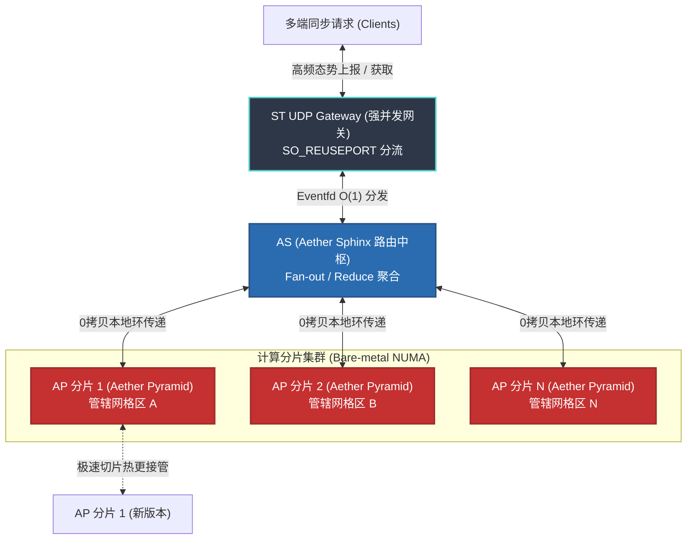
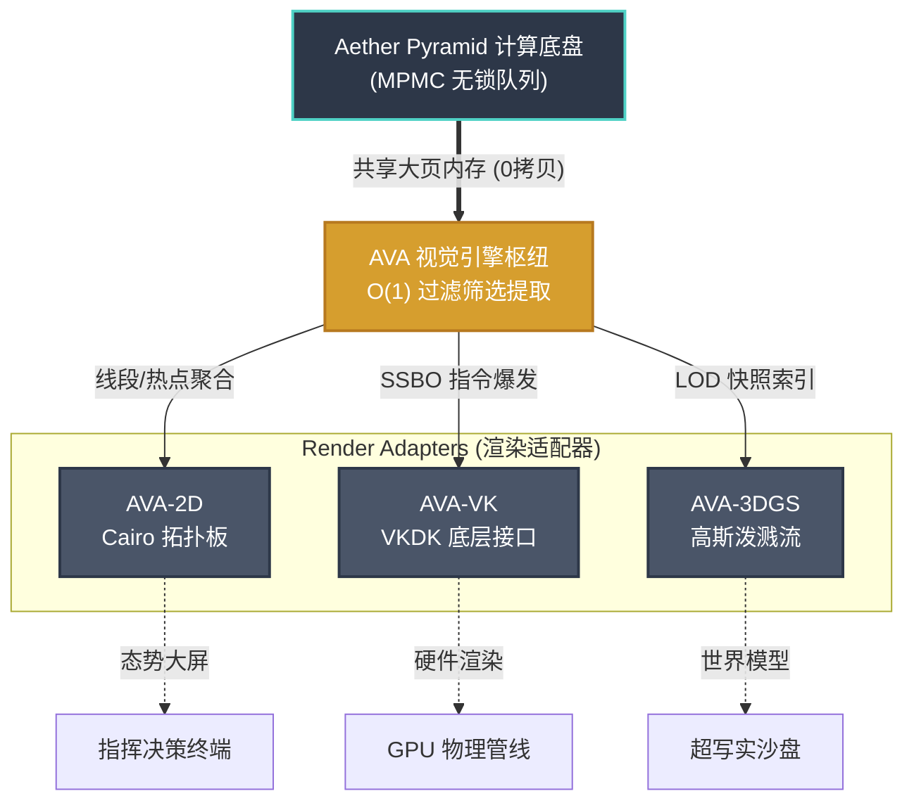
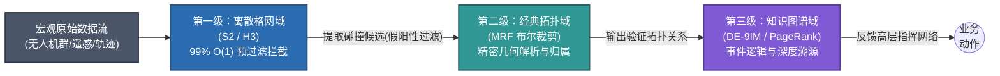

# Aether 时空格网引擎技术白皮书

> **版本：** 1.1 | **更新：** 2026年3月  
> 本文从工程问题出发，说明 Aether (æ) 引擎的设计目标、其在高频空间推演中要解决的关键矛盾，以及基于过程哲学的事件驱动建模方案。
---

## 1. 设计哲学与时空本体论 (Philosophy)

在构建分布式实时空间网格服务时，挑战通常不只来自算力，更来自底层**设计逻辑**是否与真实业务过程一致。

### 1.1 痛点：传统引擎中的并发瓶颈

Aether 引擎为了解决在极大规模高动态并发场景下的"状态冲突、锁争用与不可追溯"难题，从底层架构上重塑了空间系统的世界观。为应对高并发场景下的三类问题，Aether 在建模层面做了结构性调整：

### 1.2 答案："状态即过程"与"万物皆事件"

Aether 采用过程化建模思路：系统中的"无人机"或"风暴"等对象，不被视为可随意改写的静态块，而是由连续事件在时空中累积形成的状态结果。

在数据结构层面，Aether 采用如下约束：
*   **引擎中不直接暴露可任意改写的实体内核状态**。
*   底层调度器的基础处理单元为 **事件 (`event_t`)**。
*   一条"移动指令"是一个事件，一次"雷达扫掠"也是一个事件。依托 **MPMC 无锁环形队列**，实现系统事件并行投递与独立结算，彻底杜绝了并发过程中的多线程锁竞争。

### 1.3 过程哲学基础

"万物皆事件"的工程直觉，与阿尔弗雷德·诺思·怀特海（A.N. Whitehead）过程哲学中的若干概念可形成方法论对应。相比传统"实体优先"叙事，过程哲学强调"存在在生成中展开"。Aether 将这一思路映射为可执行的 C 语言内核机制。

通过将模块通信统一为事件写入，各子系统可减少共享可变状态带来的互锁。当需要查询无人机当前位置时，系统通过结算对应事件序列得到当前状态，形成可追踪的因果链。

### 1.4 Aether 时空本体论 (Ontology)

**来自 Palantir 的行业印证**：Aether 并非从零定义本体。过去十余年，Palantir 在战场信息协同、公共卫生响应与航空制造协同等复杂场景的平台实践中，已充分验证了将底层数据映射为具备语义关联、治理约束与可执行动作的业务对象体系这一本体论范式的有效性。这套经过行业检验的方法路径，为 Aether 构建时空本体提供了有力的方法论支撑。

**Aether 的本体创新**：Aether 将这一范式引入高频空间计算场景，并通过"构建-控制-反馈"三个环节形成全实时的时空本体闭环：
- **语义层（构建阶段）**：将传感器数据实时映射为业务实体与空间拓扑关联，使 LLM 与业务系统共享理解。
- **动力层（控制阶段）**：预定义符合物理约束的行动操作，通过业务反向控制机制精确下达执行指令。
- **动态层（反馈阶段）**：将现实世界的高频变化统一转化为标准化微事件流，维持数字世界与物理现实的毫秒级状态一致性。

通过这一闭环结构，Aether 构建了一个既能推演发展态势、又能执行实时控制、还能完整审计反馈的中间层语境，为 AI 代理的深度介入提供了稳定的业务语义基础。

**与学术本体框架的关系**：Aether 时空本体与 BFO（Basic Formal Ontology）、DOLCE 等上位本体在"过程-事件"抽象层级上形成方法论呼应，但针对实时空间计算场景进行了显式的工程化简化。相比学术本体的广泛适用性，Aether 本体强调"可执行性"与"毫秒级一致性"，是朝向产业实践的垂直深化——不追求本体的哲学完备性，而追求系统的计算可靠性。

---

## 2. 快速部署与基础架构体系 (Quickstart)

Aether 在物理架构上明确分为两个层次：内核库级别的 **Aether Kernel** 和提供高并发网络支持的 **Aether Server** 集群。开发者可根据业务需求选择以下三种集成方式：

### 2.1 方式一：直联集成内核计算能力 (Aether Kernel)

适用于对延迟极其敏感的边缘计算场景，或需要将 Aether 空间计算能力深度集成到现有系统中的情况。业务方可直接链接纯 C 环境编写的底层动态库 `libae.so`。

*   **生命周期接管**：开发者需要在业务代码中手动管理系统的运算流程。包括调用 `memarena_init` 初始化大页内存 (HugePages)、创建支持 LOD 的实体金字塔索引，并通过主事件循环 (Main Loop) 驱动 Pyraman 调度器运行。
*   **注册事件钩子 (Event Hooks)**：使用 `dlopen/dlsym` 或直接注册回调函数，将外部业务逻辑以事件形式挂载至无锁环形缓冲区 `ringbuf`。
*   **核心收益**：以极低的网络通信开销和纳秒级延迟，获得强大的并行时空计算能力。

**集成工作量对比**：

| 集成方式 | 改造复杂度 | 工作量 | 主要风险 |
|---|---|---|---|
| Kernel 直联 | 高 | 4-6 周 | 生命周期管理、性能调优 |
| Server 集群 | 中 | 2-3 周 | 容器编排、网络配置 |
| AE-EXT 兼容 | 低 | 3-5 工作日 | 协议版本兼容性 |

**底层 C 语言集成示例：**
```bash
# 引用头文件，将业务逻辑与 aether_core 动态库链接
gcc my_collision_plugin.c -laether_core -O3 -o my_standalone_engine

# 提升进程实时级别并启动，确保时钟确定性
chrt -f 99 ./my_standalone_engine 
```

### 2.2 方式二：部署 Aether Server 工业集群网络

适用于省市级千万级并发推演的大型态势感知系统（如城市全域无人机统一调度）。此时开发者无需直接调用底层库，而是部署封装好的 Aether Server 微服务集群。

*   **ST UDP Gateway (强并发接入层)**：摒弃传统的 Epoll 架构，采用基于 State Threads (ST 协程) 的高性能网关。配合 Linux 内核原生支持的 `SO_REUSEPORT`，将海量数据包均衡分发到多条处理流水线，单信道上下文切换延迟低于 **200ns**。
*   **AP (Aether Pyramid 计算分片)**：分布式算力矩阵的核心执行单元。每个 AP 进程绑定独立的 CPU 核心，负责特定地理区域（分片）的计算任务。通过本地缓存和底层 IPC 机制 `eventfd` 与网关联动，实现零内存拷贝的数据传递。
*   **AS (Aether Sphinx 路由中枢)**：负责协调多个 AP 分片，构建全局统一的坐标网络。当查询请求跨越多个分片边界时，AS 执行 Map-Reduce 模式的聚合过滤，有效降低大规模并发查询的复杂度。
*   **部署红线限制**：系统高度依赖底层硬件资源调度机制。为消除缺页中断、保障大页缓存效率以及精确控制 `SCHED_FIFO` 调度优先级与 `NUMA` 节点绑定，必须采用 **Bare-metal (裸金属) 原生部署**。**严禁**使用 K8s 或 Docker 等虚拟化容器平台，这些平台的高隔离特性会严重阻碍系统性能。

### 2.3 方式三：极速存量系统接入方案 (AE-EXT)

对于已拥有成熟三维可视化管线的业务方，Aether Server 提供了 AE-EXT (Aether Extension) 协议适配层，可实现向下兼容的无缝对接。

*   **显式寻址兼容**：针对使用 3DTiles / I3S 架构的客户端，引擎能够实时监测空间体素变化，并以超低延迟动态生成 `tileset.json` 索引文件推送给前端。单次寻址平均延迟仅增加 **0.8ms ~ 2.4ms**，使前端系统感觉仍在请求普通静态文件。
*   **隐式网格回归**：将 Aether 的高频事件推演结果伪装成传统数据格式。针对使用特定寻址规则的客户端（如 OSGB/PagedLOD 的文件目录树映射），AE-EXT 严格模拟目标系统的格网编号逻辑，让客户端完全按照既定习惯读取 Aether 的实时计算结果。

**核心收益**：开发者无需修改前端代码。只需将数据源 URL 指向 AE-EXT 节点，即可将传统基于静态离线数据的 GIS 服务，平滑升级为支持百万级目标实时推演的动态空间计算系统。单节点可稳定承载 **5000+** 客户端的高频异步请求。

---

## 3. 核心计算底层管线 (Core Subsystems)

Aether 的强大并发性能源自其内核中极为精简高效的 C 语言数据结构设计。这些组件共同构成了一个稳定可靠的核心运算引擎：

*   **动态体素金字塔网格 (Spatial Grid)**：一套支持多层级细节 (LOD) 的离散网格系统，提供 O(1) 复杂度的模型查询能力。摒弃了传统四叉树/八叉树方案中耗时的指针跳转与内存碎片问题，通过精巧的层次回调验证机制，快速完成碰撞检测与空间过滤。在大跨度对象场景下，系统采用“主实体 + 局部网格”的表达方式：主实体描述对象整体，局部网格仅表示该主实体在单个叶子网格上的占据登记，不表示一组子网格。
*   **无原型实体组件体系 (Archetype-less ECS)**：为最大化 CPU 缓存命中率 (L1/L2)，系统采用扁平化的内存布局策略，避免了原型迁移时的数据拷贝开销。所有对象组件均以位掩码方式组织，实现 O(1) 时间复杂度的组件挂载与卸载。
*   **Pyraman 看门人中枢与事件计时器**：所有状态变更均通过事件总线提交至 MPMC 无锁环形缓冲区。系统基于多层嵌套的时间轮结构调度回调请求，有效避免了传统并发编程中的锁竞争 (Lock Contention) 问题。
*   **双金字塔原子场 (Double Pyramid)**：专为处理气象云图、传感器探测等高速动态场数据而设计。通过在 Standby(备用) 和 Active(活动) 两个计算面之间进行"读写分离"，仅需一次原子指针交换操作 (Pointer Swap)，即可在微秒级时间内完成整个计算面的无缝切换。

---

## 4. API 扩展与集成契约规范 (API Reference)

Aether 将引擎底盘收编为绝对中立状态。这意味着所有关于行业专有审批、特定的轨迹排拒规范算法逻辑必须以**业务端扩展插件（Plugins）**的形式交付。它立足于三道工程纪律基线：

### 4.1 C 语言 ABI 沙盒化注入 (C-ABI Integrity)
*   **Bring Your Own Data/Algorithm (自带结构数据)**：用户不需要把他们花费数年优化的底层算法推翻重写，也不需要强行继承引擎的任何对象基类。引擎只认 64 位 ID 和包围盒。用户的专有复杂图谱数据可以安稳放在自身内存里，引擎绝不越权强行解析。
*   **白嫖亿级并发能力**：空间预筛属于极其耗费算力的操作。用户只需编写单线程判断插件，底层高速的金字塔结合 MPMC 将在幕后将一亿个对象筛选至最终的三个冲突实体再传入插件运算。这直接让高度机密领域的黑盒算法也瞬间吃足并发红利。
*   **消灭链接重整污染**：通过 `dlopen()` 于冷启动或热更时对 `.so` / `.dylib` 挂载模块。这强制要求所有生命周期代码必须置于 `extern "C"` 下，完全根除了 C++ 复杂的命名重整问题。

### 4.2 内存访问生命链条的禁戒法则 (Zero Memory Cross-Contamination)
这是一条绝对的红线法则：“引擎数据，看后即丢，严禁插手”。
*   **只读数据传递**：底盘将通过带有绝对强约束的常量指针 (`const`) ，瞬时把此时的场景快照扔给业务外围。所有传递给业务端插件的指针必须强制指向恒定常量操作，彻底杜绝插件层直接通过修改指针内容改变引擎内存。
*   **严惩内存污染**：绝不允许任何业务层通过挂钩向内传递 `free()` 或把地址偷藏至其静态常驻容器中。业务自身如果需要开启内存节点，必须走外部自行配备的 `malloc` 再自行清空。

**核心回调函数安全契约示例：**
```c
/**
 * @brief 空间体素状态更新事件通知回调函数。
 * @param event 包含发生坐标及触发因子的不可变事件数据状态。
 * @param user_data 开发者注入的自定义业务上下文地址。
 * @warning 该回调将在无锁队列的消费线程中中异步拉起。严禁阻塞式系统调用（如原生阻塞 I/O）。
 */
typedef void (*voxel_update_cb_t)(const ae_event_t *event, void *user_data);
```

### 4.3 高稳固原子驱动动作与闭环事件推送
在插件结束复杂的算法后，最终下发的空间指示、实体对象重定位等逻辑动作并不能采用硬调用方法打向物理端。所有推演意图需打包装入特定语义 `action_event_t` 然后以消息队列推给事件接口 (`ae_subscribe_event`) 进行无锁总线缓冲消纳。即使遭遇最极端如插件算法全盘死锁的情况，独立于 Pyraman 看门人中枢的调度保护器 (Orchestrator Guard) 依然可以通过阻断而挽救整个服务群网络。

---

## 5. 服务集群与全栈工具链生态 (Service & Toolchains)

在纯计算内核的基础上，Aether 构建了完整的生态系统，包括三维可视化监控和智能 AI 大语言模型代理网络：

### 5.1 Aether Server 分布式实时协同集群 (AE-Server)

作为封装内核并向外提供算力的分布式框架，AE-Server 基于 C 语言与协程模型实现了严格的并发 I/O 隔离和高频跨进程通信调度：

1. **流式交互与跨分片编排 (Data Pipeline)**：针对单一目标点的查询请求，ST UDP 网关直接路由到对应 `AP (计算分片)` 的独立 Ringbuf，通过 `eventfd` 机制将轮询等待成本降至最低；面对覆盖超广域的聚合查询请求，利用 `AS (路由中枢)` 执行全局 Fan-out（扇出）查询，将请求分发至数十个计算进程进行局部处理后再 Reduce（规约）聚合，最终快速生成全局态势图。
2. **物理级内存隔离与扩容 (Bare-metal Scaling)**：拒绝使用复杂的云化动态负载均衡算法。架构依赖底层大页表 (HugePages) 构建进程间 IPC 通道，通过强制 CPU 绑核机制实现资源切片和线性扩容。
3. **零中断平滑热更新 (Graceful Updates)**：通过共享内存实现业务状态分离。运维节点启动新版本进程并完成路由接管后，旧版本进程继续处理完队列中剩余的任务后自动退出，实现计算网格层毫秒级无损的版本迭代。

**分布式一致性与故障恢复**：AS 路由中枢通过原子快照与事件时间戳机制确保跨分片数据一致性（最终一致性模型）。网络分片场景下，系统采用"分片优先"策略（AP 优先完成本地计算），通过事件日志实现事后对账。单个 AP 故障时，其他分片维持独立工作，无需全局停顿；故障 AP 重启后通过重放事件日志恢复至一致状态。

**关键监控指标与告警**：系统暴露以下实时指标供运维监控：· 环形队列深度（单位 ms 处理延迟阈值，超 100ms 触发告警）· AP 分片心跳状态（离线检测阈值 < 2s）· 跨分片请求延迟 P95（目标 < 50ms）· 事件丢弃率（应 < 10^-6）

当监控指标异常或心跳断连时，调度保护器 (Orchestrator Guard) 自动触发故障转移流程，**RTO 目标 < 5s**。



### 5.2 AVA 视觉架构引擎枢纽 (Aether Visualization Architecture)

AVA 不是单纯的图形库，而是连接内核与渲染后端的"智能翻译层"。它作为挂接在内核底层的"**绝对单向只读观测层**"，负责从高频事件流中提取数据并决定展示内容，但绝不反向干扰引擎的时序运行。

*   **Cairo 2D 脱耦屏显引擎**：无需遍历繁重的组件树结构。直接从线性紧凑的内存数组中提取线段、热点位置等坐标信息，供 Cairo 快速填充色彩绘制。适用于构建超大型战术指挥板与二维沙盘面板。
*   **VKDK 管线架构 (Vulkan Dev Kit)**：充分践行面向数据 (Data-Oriented) 的设计原则。利用纯连续数组直接无缝对接 Vulkan 原生的 SSBO (Shader Storage Buffer Object)，并通过 `vkCmdDrawIndirect` 间接绘制指令实现爆发式渲染。这使得 CPU 仅需高效打包坐标数据并提交，彻底避免在复杂的图形渲染树中阻塞。
*   **3DGS 动态高斯泼溅 (Gaussian Splatting)**：面对数亿微粒堆叠的超大体量点云渲染，引擎通过金字塔建立 O(1) 复杂度的多级分辨率 LOD 索引。依靠只读快照机制提取渲染指令送至显卡进行分级过滤，支持无限细节的真实世界模型场景渲染。



### 5.3 大语言模型认知代理接合环路 (LLM Agent Framework)

针对大语言模型高度依赖 Context 窗口且"计算能力相对较弱"的特点，Aether 设计了一套防宕机的事件中继架构，避免直接向 LLM 投喂原始坐标数据：

在这个架构下，AI 与引擎的交互被严格规范为六个阶段：

1. **宏观层截断感知机制**：初始接入时，拒绝向模型投喂海量底层坐标矩阵，仅提供提取自金字塔 Level 0-2 层级的概览热点热力字典，供 AI 快速建立全局认知。
2. **聚焦点拉取指令 (MCP Tools)**：限制大模型只能通过调用预定义的原子技能 (MCP Tools)，才能获取指定聚焦区域内的细粒度矢量结构数据。
3. **几何计算卸载**：当 AI 检测到两个目标相互逼近时，**绝对禁止 AI 自行计算几何布尔碰撞**。所有复杂的空间几何裁切与布尔运算必须通过专用中继打回 Aether 底座，由底层 C 算法库完成极值计算后仅返回 True/False 的确定性结论。
4. **增量事件流订阅**：在平稳监控阶段，LLM 不再执行高消耗的全量轮询 (Polling)，改为订阅 `ringbuf` 底层推送的增量事件流（如 `ENTITY_MOVE`），大幅降低数据传输负载。
5. **可视化快照烘焙**：LLM 在上报决策结果时，可调用下游 AVA 模块截取当前推演热区的 2D/3D 图像 (Base64 JPEG 格式) 作为辅助汇报依据。
6. **大规模数据句柄透传 (Token View)**：当查询涉及数百万体素的全集提取时，框架严禁将海量数据序列化为文本压垮网络套接字。全链路仅向大模型返回短小精悍的 `VIEW_TOKEN_8F9A2C` 句柄，再由 LLM 将该令牌透传给渲染客户端快速呈现，从源头消灭通信灾难。

### 5.4 纵向空间分析核心域体系 (Spatial Analysis Domains)

通过逻辑解耦，Aether 建立了三个递进式的空间分析计算管线：

*   **第一级格网域 (Grid Computing)**：基于 Hilbert 曲线与重型降维编码机制，原生兼容 S2、H3 以及国家级三维正方体空间剖分标准。集成完整的地图代数 (Map Algebra) 框架，支持高通滤波区域算子，并通过极速自适应反距离权重 (IDW) 算法及克里金 (Kriging) 最优无偏估计插值，还原大规模空间曲面场分布。
*   **第二级经典拓扑域 (Classical Computing)**：依托 Martinez-Rueda-Feito (MRF) 布尔裁剪算法和 Point-in-Polygon (PIP) 环绕数验证法，执行高精度地理图形的剖切、拼接、合并、打洞等经典几何运算，确保拓扑关系绝对无损。
*   **第三级知识图谱域 (Knowledge SKG)**：面向多要素关联分析。采用 DBSCAN/HDBSCAN 密度聚类算法识别空间热点区域，引入 Spatial PageRank 链路分析技术深入解析大规模动态交通网络、物流线路的传导关系与故障溯源。



---

## 6. 系统基准性能与节点容量预测分析 (Benchmarks & Capacities)

Aether 的性能特征源自其内核中极为精简高效的 C 语言数据结构设计。以下是服务系统在超大规模复杂基础设施环境下的覆盖能力和极限性能指标：

### 6.1 核心并发性能指标

*   **空间网格寻址吞吐 (Grid Access Throughput)**：在标准工业级 x86 计算平台上，凭借 O(1) 索引结构与 memarena 无锁通道的协同优化，系统可稳定保持 **800 万次/秒以上** 的事件寻址与状态更新能力。
*   **物理对象动态演化 (ECS Evolution)**：在高时延敏感、小尺度密集碰撞检测场景中，底层系统仍能支持 **200,000+** 个高频动态对象持续进行状态更新，维持全量刷新频率 **100Hz 以上** 稳定运行。

### 6.2 城域级网格内存容量规划

基于 Aether 核心寻址逻辑，针对 **20km × 20km × 1500m**（约 6,000 亿 $m^3$）低空管控场景进行容量推演：

| 内存规划 (RAM) | 全量格网能力 (1 Byte/Voxel) | 极限覆盖精度 (1 bit / Voxel) | AE 稀疏策略下最大精度 |
| :--- | :--- | :--- | :--- |
| **16 GB** | 约 171 亿个 | 3.27 米 | 局部支持 10cm 级精细计算 |
| **64 GB** | 约 687 亿个 | 2.06 米 | 局部支持 5cm 级精细计算 |
| **128 GB** | 约 1,374 亿个 | **0.81 米 (次米级)** | 全区域多级亚米级管控 |
| **512 GB+** | 约 5,500 亿个 | 空间宽裕 | 跨城级 (Multi-City) 全量底座 |

**部署层级说明：**

*   **Tier 1: 边缘微节点 (16G - 32G RAM)**：适用于基础设施受限的前线边缘设备、小规模空管与防碰撞现场控制终端。代表机型：Intel NUC、嵌入式工控网关。业务场景：单起降场动态管控、5km 半径核心空域高频碰撞监测。
*   **Tier 2: 高性能边缘计算站 (64G - 128G RAM)**：适配大容量高频运转服务器集群。代表机型：Minisforum 395max、Apple M4 Studio。业务场景：区级实时动态中心、超高频协议转换中继、战术级指挥终端。
*   **Tier 3: 数据中心机架服务器 (256G - 2TB+ RAM)**：全景容量支持容错性极高的全区域联动网络集群。代表机型：标准 2U 服务器（Dell PowerEdge、Inspur、华为 Taishan）。业务场景：全市级全量高精底座、数万级并发客户端的高频反向代理分发。

---

## 附录：扩容顶线与性能衰减分析

**AP 分片管理与 AS 聚合瓶颈**：
- 单 AS 节点管理 16-32 个 AP 分片时，跨分片查询延迟 P95 < 100ms；超过 64 个分片时衰减至 > 300ms
- 单集群配置（4 核 CPU）建议 AP 分片总数不超过 8 个，超过此数时 AS 聚合环节开销呈线性增长
- 极限可扩展至 128 个分片但伴随明显性能衰减，建议此时采用分布式路由中枢（多 AS 协调）或升阶至更高配置以突破单点瓶颈

