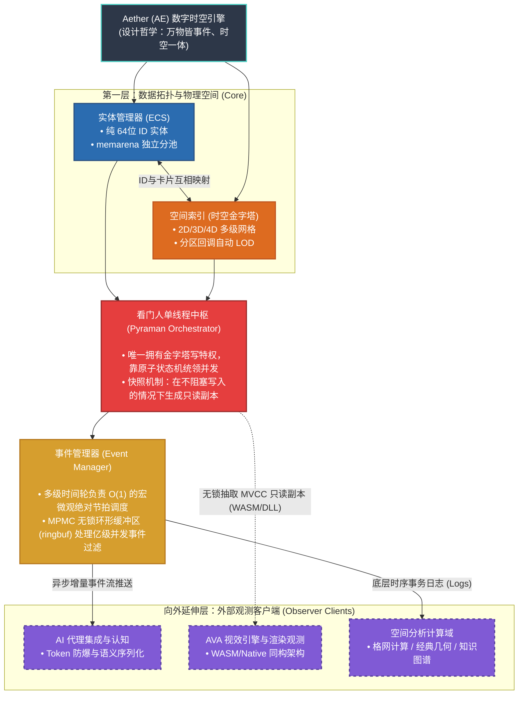

# 概念总览与架构哲学 (Conceptual Overview)

> 核心价值观：“极简、透明、可控”
> 本节不涉及具体的 C 语言指针与并发代码，着重阐释基于此打造的 Aether (AE) 作为 **“底层世界模型索引器 (World Model Indexer)”** 的工程蓝图。

## 1. 顶层定位：高性能零依赖的时空内存引擎 (Spatiotemporal In-Memory Engine)

在业界对“引擎”一词的探讨中，许多开发者容易将 AE 与传统商用闭源引擎作平级对标，或者将其等同于传统磁盘型空间数据库（如 PostGIS），这实则是一种严重的层级错位。 传统游戏引擎往往是封装了材质、动画与垃圾回收的“生产平台管线”，而传统空间数据库在面对极高频并发计算时往往受限于磁盘 I/O。AE 的生态位是一个极其克制、不包含任何渲染绘制代码且**完全基于内存的高并发纯物理时空计算引擎**。

- **信创与极简部署**：引擎核心保持零第三方依赖，纯 C 语言铸造。这种极端极简主义赋予了 Aether 跨平台的绝对自由，极其轻量，能够无缝融入当前国家级“信创（IT Application Innovation）”操作环境与微型边缘计算节点。
- **低空经济的核心底盘**：在“国家级重点实验室”等国家级重点课题（低空数智管控平台）中，AE 作为时空底座，全权接管包含 DEM 地形、航路、禁飞区、动态雷达气象流等海量多维“低空航图”数据的体素化吞吐，为飞行任务的高频审批与实时动态避障提供微秒级的内存计算支撑。
- **剥离视觉的观察者模式**：渲染引擎（不论是底层的 Vulkan，还是外置前端轻量级的 WebGL 库）在 AE 面前仅仅是一个通过快照接口读取数据的**观测客户端 (Observer Client)**。
- **拥抱 AI 的核心空间原语**：大模型 (LLM) 缺乏原生视觉感，但极度敏锐于离散金字塔网格。在 AE 架构中，大模型问答网络与图形渲染引擎是绝对平级的挂件，它们都仅仅是依赖时空图谱的**认知解读端 (Cognition Client)**。

## 2. 统一时空观：底盘与外挂管线协同图

AE 宇宙所有的物理规则推演与基础数据流转，全部被凝练成了底部 **5 个绝对解耦的内环大核心**，并以此向外衍生出 **3 大外部观测客户端 (Observer Clients)**：

### 1) 空间存放处：时空金字塔 (Spatial Index)
系统底层的“体素化”骨架，提供多层微观网格量化筛网 (2D/3D/4D)。无论对象大小皆有归属。这种被严格离散化的物理坐标格网，脱离了纯视觉光影范畴，天然地成为了**切合大模型 AI 进行空间实体认知、推理与寻路状态抽样的底层原生结构**。

### 2) 物体属性库：实体管理器 (ECS)
在世界层面彻底抛弃 OOP 的继承血统，物质只表现为一个被抽离的“纯粹 64位 ID”。所有附着于它的坐标、运动与生命数据，被水平拆解为“组件”，由自研 `memarena` 内存池按纯值类型在系统物理内存深处铺陈连通，以榨干多核缓存命中率。

### 3) 交通警察：看门人单线程中枢 (Pyraman Orchestrator)
系统独创的极限读写隔离屏障。在世界线上唯一拥有金字塔物理层真·写入特权的，仅有 Pyraman 单核线程。这从根源上斩断了各种锁争抢引发的树状死锁灾难。所有非此线程内的请求皆转为排队事件；而向外的环境输出探测，则依赖底层的**原子多版本快照机制 (MVCC Snapshot)**，无阻塞地扔出一份平行宇宙数据给外部的渲染与大模型探针。

### 4) 系统心脏节拍器：事件管理器 (Event Manager)
引擎的血管里流淌的只有**“事件”**。物理碰撞、AI 下达的全局指令，全数以指令包入列。它们借助**多级高精度时间轮**来精准执行微秒级的滴答节拍，并通过每秒亿级并发吞吐量的**MPMC 无锁环形缓冲区 (ringbuf)** 安全发往目标总线口。

### 5) 表现层与计算分析侧：由“服务与工具链”统一收口的生态观测端 (Observer Clients)
AE 只对极速且绝对正确的数据真相负责。由其底层快照管道倾泻而出的时空副本流，为外部世界留下了极其宽广的扩展纵深（这也是本文档 **第 6 卷（服务与工具链）** 独立展开讲解的核心分工）：
- **AVA 视效引擎与渲染客户端 (Aether Visualization)**：诸如基于 WASM 的 Web 监控、VR 高斯泼溅前端等，全数被判定为绝对被动即插即用的专门影像投射器，它们仅靠从主存异步提取快照绘制画面，绝不干涉空间碰撞判定与系统回溯。
- **AI 代理集成与分析域 (AI & Spatial Analysis Domains)**：诸如执行离散格网计算、经典空间几何判定或以大模型 (LLM) 推演算法构建的知识图谱关系层。均作为各自独立的逻辑演算外设，悬浮在时空引擎物理底座之外，按需消耗底层释放出的数据结论。

## 3. 核心设计哲学溯源

AE 引擎的底层架构并非围绕各类应用层功能（如材质流或地形系统）去作被动堆加，而是从底向上去构建出一套统一的物理规则世界观：

- **时空一体，重塑底层骨架 (Spatiotemporal Anatomy)**
  在基础定义上，引擎抛弃了传统三维引擎极其复杂的场景图派生树结构 (Scene Graphs)。系统将“空间”定义为覆盖多维架构的时空金字塔网格定位（2D/3D/4D），将“时间”锁定为纳秒级多层时间轮（Timing Wheel）的心跳节拍。空与时的坐标闭环，将复杂的空间实体关联问题降维为纯数学尺度的网格离散化处理，重塑了业务处理的数据骨架。
- **万物皆事件，让衍生状态自发运转 (Universal Event Driven)**
  传统的直接模块横向函数调用链（Function Calls）在内核中被彻底禁止。引擎视一切改变世界状态的行为（甚至仅是对网格局部的“观察查询”请求）为“事件”。借由百万级并发吞吐的无锁 MPMC 环形缓冲总线进行管道分发，使得模块仅凭订阅而非直接干涉执行。此举不仅在架构根源上斩断了交叉多线程带来的死锁塌方，还令一切系统运转状态变为了绝对可序列化的流水线（Transaction Log），从而天然具备了 **全态仿真回滚与时光回溯 (Snapshot Replay & Rollback)** 的极佳工程基础。
- **极简与业务解耦：去渲染核心化 (Coreless Decoupling)**
  作为一款运行时“引擎”，AE 最反直觉的特性是其架构内部彻底封死了所有的图形管元绘制代码。它退居幕后，只负责回答“在何时、何地、存在何种数据对象”这一唯一真理问题。这种纯净的时空底盘设计，使其借由看门人（Pyraman Orchestrator）向外界不断抛出无阻塞只读快照时，完全不再受制于外部消耗端（比如 Vulkan 显卡渲染器或是大模型推理节点）的技术栈更迭。这种剥离，保障了引擎内核在一切技术更替浪潮中保持着绝对的原生稳定性。
- **数据结构不可知论：零侵入式的扩展沙盒 (Data Structure Agnosticism)**
  在传统的空间系统（如 Unity 或 PostGIS）中，开发者往往被迫将自身复杂的业务对象序列化或强转为引擎规定的特定类和数据容器（如特定的 `Geometry` 或 `FVector`），这种削足适履引发了极度高昂的内存拷贝与对象污染。Aether 在此确立了霸道的“盲盒边界”：引擎不对外部对象的业务数据结构做出任何假设，它只需要一个绝对精简的 64 位 ID 和一个粗糙的外包框 (AABB) 就足以驱动亿级吞吐的网格预筛选；一旦底层触发空间事件边缘碰撞，引擎绝不尝试去解析对象内容，而是仅仅将纯粹的 ID 指针抛回给业务插件的回调函数 (Plugin Callback)。这种极致的界限感，让航空、智驾或军工客户在接入极速网格索引的同时，保留了 **100% 的内存控制权与数据结构自主权**，彻底实现了“Bring Your Own Algorithm/Data”。

## 4. 双时空坐标系融合 (GIS + Game)
系统通过统一的底层时空索引提供两种平行坐标系的原生转化支撑，实现大环境与微观状态的事件交织：
- **GIS 模式**：基于经纬度与相对高程，金字塔逻辑自动贴合大地坐标系体系，适配数字孪生与全球级宏观地形架构需求。
- **Game 模式**：基于笛卡尔三维坐标系计算向量，支持区域室内、开放场景等局部精度要求极高的场景。
- **跨域联动**：宏观 GIS 天文/天气触发事件可通过事件系统直接下沉转化为微观 Game 实体关联交互事件，完成跨尺度仿真。

## 5. 架构特性对照规范
以下为 AE 索引流中枢设计相较于全量封装平台（如 Unreal / Unity）的底层技术实现界线对比：

| 底层维度 | Aether 时空中枢（纯 C 结构体系） | 传统商业引擎平台 |
| --- | --- | --- |
| **状态推进机制** | 纯事件驱动，所有变化归结为系统状态机内的独立因果序列 | 大量依赖模块化组件之间的显式函数直接调用与深层代码耦合 |
| **存储管控** | 布局结构 100% 透明，一切分配交由底层池 (`memarena`) 接管 | 内存由内部封闭封装管理，高频涉及会导致 GC (垃圾回收) 中断抖动 |
| **空间形态** | 原生覆盖 2D/3D 并在同框架底层伸展 4D 时延索引架构 | 在传统 3D 之外独立构建时间轴管理（类似 4D）往往会演变出极重的业务重算与录制层 |
| **内部并发控制** | 原子标志、状态机搭配无锁管道，并发负载始终控制在用户态 | 使用高代价抢占互斥锁与 OS 级繁重任务分发框架 |
| **关键任务审计性** | 满足纯 C89/C11，避开黑盒环境宏汇编依赖，可胜任高规格审计 (DO-178C) | 含庞杂的第三级抽象环境或隐藏依赖，安全审查链极度封闭 |

## 6. 大模型协同：上下文窗口灾难 (Context Overflow) 治理机制
在尝试将超大规模空间系统（如城市级孪生环境）的物理坐标直接接入大语言模型 (LLM) 进行感知与控制决策时，原生网格系的全量输出势必会导致大模型出现 Context Token 瞬间溢出，并引发由于注意力失焦产生的过度“幻觉”。Aether 架构在此复杂场景下表现出了天然的统筹治理能力，利用自身的结构特质将海量空间信息转化为浓缩后的 JSON 语义集：

- **LOD 宏观截断与按需下翻 (Pyramidal LOD Filtering)**：大模型初始化时不需要直接面临千万级的底端叶子节点。系统可以通过空间金字塔先为 AI 推送顶段宏观层（如 Level 2/3）的广域状态提要（例如提供类似“A区域实体激增，B区域稳定”的高阶抽象信息）。当大模型推理确认关注焦点时，再通过反向发起 `pyramid_query` 实施视角的微观化下探索取，达到空间上的 **按需加载机制**，大幅节省 Token 带宽。
- **天然的矩阵空洞剔除 (Sparse Storage Padding)**：得益于金字塔底结合哈希桶结构的极端稀疏特质，一切不存在映射实体的无效空旷网格和坐标天空，均在向大模型转化串行序列化时被底层结构自动忽略。这从物理层上避免了大量无意义的空间假阳性 (False Positives) 灌入 AI 前端。
- **时间侧的增量事件投喂 (Incremental Event Streams)**：借助引擎底座强大的“万物皆事件”流体系机制，LLM 模型除了在初次接入时获得一份完整的空间状态基线副本，后续持续消耗的全是由 MPMC 管道喷发而出、极度微小的确定性差量信息（如 `ENTITY_MOVE` 实体相对位移增量事件）。这完美复刻契合了如今主流会话模型的增量轮次理解机制，从源头消除了高频的无用全量数据回送重绘。
- **硬件计算隔离保护 (Computation Decoupling)**：引擎底端严控了物理计算界限。对于密集的解析测量（包括图形布尔计算、DGGS 降维、Kriging 插值、雷达穿透拦截），完全阻隔在底层的 C 代码计算域内部消化。最终上抛给大模型的仅仅是高纯度的语义结果快照。模型处理的只剩归纳性的执行结论集，无需在浮点坐标系的算力迷宫内徒耗自身推理能力。
