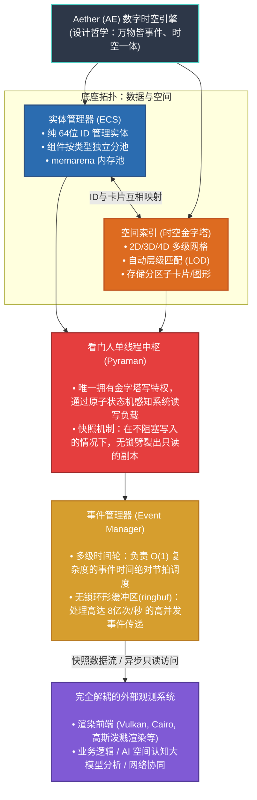

# 概念总览与架构哲学 (Conceptual Overview)

> 核心价值观：“极简、透明、可控”
> 本节不涉及具体的 C 语言指针与并发代码，着重阐释基于此打造的 Aether (AE) 作为 **“底层世界模型索引器 (World Model Indexer)”** 的工程蓝图。

## 1. 顶层定位：超越传统游戏引擎的“世界模型索引中枢”

在业界对“引擎”一词的探讨中，许多开发者容易将 AE 与传统商用闭源引擎作平级对标，这实则是一种严重的层级错位。 传统游戏引擎往往是封装了材质、动画与垃圾回收的“生产平台管线”，而 AE 的生态位是一个极其克制、甚至不包含任何渲染管线图元绘制代码的 **纯物理时空数据与事件索引基座**。

- **剥离视觉的观察者模式**：渲染引擎（不论是底层的 Vulkan，还是厚重的上层包装）在 AE 面前仅仅是一个通过快照接口读取数据的**观测客户端 (Observer Client)**。
- **拥抱 AI 的核心空间原语**：大语言模型 (LLM) 缺乏原生视觉与物理空间感，但极度敏锐于张量方式解析的离散金字塔网格。正因如此，大端 AI 网络与图形渲染引擎在 AE 的架构中是绝对平级的，它们都仅仅是挂接于时空图谱之外的**认知解读端 (Cognition Client)**。

## 2. 统一时空观：核心运转五层协同图

AE 宇宙所有的物理规则推演与数据流转，全部被凝练成了以下 5 个绝对解耦的大核心相互咬合：

### 1) 空间存放处：时空金字塔 (Spatial Index)
系统底层的“体素化”骨架，提供多层微观网格量化筛网 (2D/3D/4D)。无论对象大小皆有归属。这种被严格离散化的物理坐标格网，脱离了纯视觉光影范畴，天然地成为了**切合大模型 AI 进行空间实体认知、推理与寻路状态抽样的底层原生结构**。

### 2) 物体属性库：实体管理器 (ECS)
在世界层面彻底抛弃 OOP 的继承血统，物质只表现为一个被抽离的“纯粹 64位 ID”。所有附着于它的坐标、运动与生命数据，被水平拆解为“组件”，由自研 `memarena` 内存池按纯值类型在系统物理内存深处铺陈连通，以榨干多核缓存命中率。

### 3) 交通警察：看门人单线程 (Pyraman)
系统独创的极限读写隔离屏障。在世界线上唯一拥有金字塔物理层真·写入特权的，仅有 Pyraman 单核线程。这从根源上斩断了各种锁争抢引发的树状死锁灾难。所有非此线程内的请求皆转为排队事件；而向外的环境输出探测，则依赖底层的**原子多版本快照机制 (MVCC Snapshot)**，无阻塞地扔出一份平行宇宙数据给外部的渲染与大模型探针。

### 4) 系统心脏节拍器：事件管理器 (Event Manager)
引擎的血管里流淌的只有**“事件”**。物理碰撞、AI 下达的全局指令，全数以指令包入列。它们借助**多级高精度时间轮**来精准执行微秒级的滴答节拍，并通过每秒亿级并发吞吐量的**无锁环形缓冲区 (ringbuf)** 安全发往目标总线口。

### 5) 表现层与分析管线：完全解耦的观测客户端 (Observer Clients)
AE 只对极速且绝对正确的数据真相负责。由其底层快照管道倾泻而出的时空副本流，为外部世界留下了极其宽广的扩展纵深（这也是本文档 第 7 卷 与 第 8 卷 独立展开讲解的核心分工）：
- **显像与可视化端 (External Rendering Clients)**：诸如基于 Vulkan 的图形层、VR 高斯泼溅前端等，全数被判定为绝对被动的**即插即用显示客户端**，它们仅靠从主存异步提取快照投射画面，绝不干涉空间碰撞判定与系统回溯。
- **高阶空间分析管线 (Spatial Analysis Pipelines)**：诸如执行精细化拓扑挖孔裁剪的 `libclipper` 解析几何系统，或是以大模型 (LLM) 推演算法构建的 **关系语义知识大脑**，均作为各自独立的逻辑演算外设，悬浮在时空引擎物理底盘之外，按需消耗底层释放出的数据结论。

## 3. 核心设计原则溯源

Aether (AE) 的底层架构并非围绕上层业务需求被动堆砌，而是建立在以下基础工程准则之上：

- **确定性 优于 峰值性能 (Determinism > Peak Performance)**
  系统设计不以牺牲可预见性来换取极端的并发帧率。通过单线程看门人机制进行读写指令隔离，避免了多线程模型中常见的死锁与执行乱序。这种数学层面的确定性与纯粹性，符合高可靠安全认证（如 DO-178C 等标准）在航天或工业控制系统中的基本需求。
- **基于事件的解耦 (Events Over Calls)**
  剔除了跨模块之间的直接函数依赖与调用。时间调度、空间位移或状态轮转被统合为标准的事件序列。所有的系统状态转换演变为一条具有清晰因果关系的事件流，为底层的全状态录制、历史回退以及时序追踪分析提供原生支持。
- **结构化自洽模型 (Self-Consistent Base)**
  时间轮负责处理时序调度，空间金字塔承载坐标索引，事件队列驱动状态演进。各项核心基础设施基于基础物理逻辑进行最简定义，系统尽量避免为特定高层业务（如大逃杀海量实体、专属寻路）开辟特定的后门或开发打补丁代码，从而有效保障基础框架的长期稳定。

## 4. 双时空坐标系融合 (GIS + Game)
系统通过统一的底层时空索引提供两种平行坐标系的原生转化支撑，实现大环境与微观状态的事件交织：
- **GIS 模式**：基于经纬度与相对高程，金字塔逻辑自动贴合大地坐标系体系，适配数字孪生与全球级宏观地形架构需求。
- **Game 模式**：基于笛卡尔三维坐标系计算向量，支持区域室内、开放场景等局部精度要求极高的场景。
- **跨域联动**：宏观 GIS 天文/天气触发事件可通过事件系统直接下沉转化为微观 Game 实体关联交互事件，完成跨尺度仿真。

## 5. 架构特性对照规范
以下为 AE 索引流中枢设计相较于全量封装平台（如 Unreal / Unity）的底层技术实现界线对比：

| 底层维度 | Aether 时空中枢（纯 C 结构体系） | 传统商业引擎平台 |
| --- | --- | --- |
| **状态推进机制** | 纯事件驱动，所有变化归结为系统状态机内的独立因果序列 | 大量依赖模块化组件之间的显式函数直接调用与深层代码耦合 |
| **存储管控** | 布局结构 100% 透明，一切分配交由底层池 (`memarena`) 接管 | 内存由内部封闭封装管理，高频涉及会导致 GC (垃圾回收) 中断抖动 |
| **空间形态** | 原生覆盖 2D/3D 并在同框架底层伸展 4D 时延索引架构 | 在传统 3D 之外独立构建时间轴管理（类似 4D）往往会演变出极重的业务重算与录制层 |
| **内部并发控制** | 原子标志、状态机搭配无锁管道，并发负载始终控制在用户态 | 使用高代价抢占互斥锁与 OS 级繁重任务分发框架 |
| **关键任务审计性** | 满足纯 C89/C11，避开黑盒环境宏汇编依赖，可胜任高规格审计 (DO-178C) | 含庞杂的第三级抽象环境或隐藏依赖，安全审查链极度封闭 |

## 6. 大模型协同：上下文窗口灾难 (Context Overflow) 治理机制
在尝试将超大规模空间系统（如城市级孪生环境）的物理坐标直接接入大语言模型 (LLM) 进行感知与控制决策时，原生网格系的全量输出势必会导致大模型出现 Context Token 瞬间溢出，并引发由于注意力失焦产生的过度“幻觉”。Aether 架构在此复杂场景下表现出了天然的统筹治理能力，利用自身的结构特质将海量空间信息转化为浓缩后的 JSON 语义集：

- **LOD 宏观截断与按需下翻 (Pyramidal LOD Filtering)**：大模型初始化时不需要直接面临千万级的底端叶子节点。系统可以通过空间金字塔先为 AI 推送顶段宏观层（如 Level 2/3）的广域状态提要（例如提供类似“A区域实体激增，B区域稳定”的高阶抽象信息）。当大模型推理确认关注焦点时，再通过反向发起 `pyramid_query` 实施视角的微观化下探索取，达到空间上的 **按需加载机制**，大幅节省 Token 带宽。
- **天然的矩阵空洞剔除 (Sparse Storage Padding)**：得益于金字塔底结合哈希桶结构的极端稀疏特质，一切不存在映射实体的无效空旷网格和坐标天空，均在向大模型转化串行序列化时被底层结构自动忽略。这从物理层上避免了大量无意义的环境噪点灌入 AI 前端。
- **时间侧的增量事件投喂 (Incremental Event Streams)**：借助引擎底座强大的“万物皆事件”流体系机制，LLM 模型除了在初次接入时获得一份完整的空间状态基线副本，后续持续消耗的全是由 MPMC 管道喷发而出、极度微小的确定性差量信息（如 `ENTITY_MOVE` 实体相对位移增量事件）。这完美复刻契合了如今主流会话模型的增量轮次理解机制，从源头消除了高频的无用全量数据回送重绘。
- **硬件计算隔离保护 (Computation Decoupling)**：引擎底端严控了物理计算界限。对于密集的解析测量（包括图形布尔计算、雷达穿透拦截、相切判定），完全阻隔在底层的 C 代码管线闭环内部消化。最终上抛给大模型的仅仅是高纯度的语义结果快照（诸如 `{"event": "collision", "targets": ["id_1", "id_2"]}`）。模型处理的只剩归纳性的执行结论集，无需在浮点坐标系的算力迷宫内徒耗自身推理能力。
