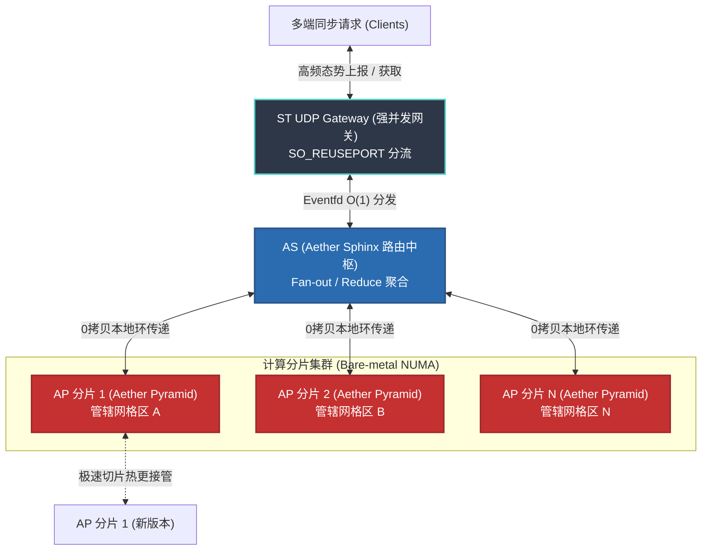

# Aether Server 集群与部署配置 (Aether Server Cluster)

纯粹的 Aether 内核（`libae.so`）必须被挂载在分布式的骨干网络上，才能面对宏大的城市级甚至省级空域物理防撞与推演。

## 核心架构组件

本章节详细定义了 Aether Server 应对海量信标流的算力切分、分布式拓扑架构（AP/AS/UDP网关），并提供了针对特殊情况（如遇到不可抗极高频密集流体场、雷达扫描等极端数据）时，**Aether Server 如何通过配置文件激活基于内核内存的高级处理策略（如双金字塔备灾模式）**。
