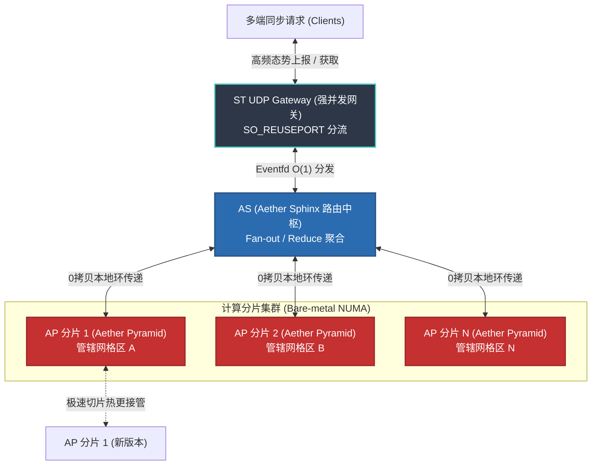

# Aether Server 集群与部署配置 (Aether Server Cluster)

Aether 内核（`libae.so`）通常需要挂载到分布式服务网络，才能承载城市级或省级空域的碰撞检测与推演任务。

## 核心架构组件

本章节定义 Aether Server 在海量信标流场景下的算力切分方式与分布式拓扑（AP/AS/UDP 网关），并给出高频密集数据场景下的配置建议（如双金字塔备援模式）。
