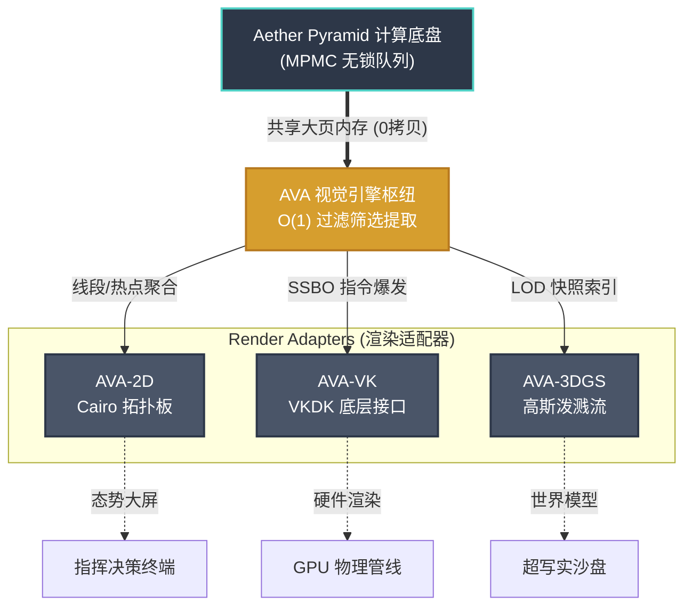

# AVA：Aether 世界的视觉引擎 (Aether Visualization Architecture)

## 核心架构与数据流



AVA（Aether Visualization Architecture）是 Aether 生态中的**视觉呈现与资源调度中枢**。它不仅是图形库，也承担 Aether 核心计算层与多类图形后端（SDK）之间的适配职责。

在系统分层中：
*   **Aether Core (AP)** 负责实体计算与时序推进（ECS、时间轮）。
*   **AVA** 负责观测、筛选与渲染任务编排。
*   **渲染 SDK (VKDK / Cairo / UE5)** 负责具体绘制。

---

## 1. 为什么需要 AVA？

### 1.1 传统方案的困境
*   **游戏引擎 (Unity/Unreal)**：渲染与逻辑强耦合，通常为静态场景设计，在高密度动态实体面前遍历开销极大。
*   **工业软件 (CAD/仿真)**：侧重精确度与离线渲染，无法实时响应 Aether 内部每秒百万级的“事件驱动”流。
*   **底层图形库 (Vulkan/OpenGL)**：需要开发者从零手搓场景管理，缺乏对 Aether 这种分布式内存布局的深度理解。

### 1.2 AVA 的核心逻辑：读数、筛选、派发
AVA 遵循**“被动观测者 (Passive Observers)”**原则。它作为一个高智商的“数据裁判”，主要负责：
*   **高效读数**：通过共享内存直接从 `Pyraman` 提取无锁的双金字塔（Active 面）副本，实现 **“零拷贝同步”**。
*   **智能筛选**：基于 Aether 本地的金字塔网格索引，实现 **O(1) 复杂度的极速剔除**，甚至能结合时间轮预测未来几帧的实体动量，提前预加载 LOD 资源。
*   **多端派发**：将精炼过的渲染意图，抛给最适合该场景的渲染 SDK 去执行逻辑表现。

---

## 2. AVA 在 Aether 生态中的位置（多后端架构）

```mermaid
graph TD
    AP_NODE[Aether Pyramid 计算底座] -- 共享内存/无锁快照 --> AVA_SCHED[AVA 视觉索引与调度中枢]
    
    subgraph Render_Adapters [AVA 渲染适配器 / 后端集成层]
        AVA_SCHED --> R1[AVA-VK (调用 VKDK / 重型3D)]
        AVA_SCHED --> R2[AVA-2D (调用 Cairo / 各式矢量态势)]
        AVA_SCHED --> R3[AVA-UE (嵌入虚幻 / 写实渲染插件)]
        AVA_SCHED --> R4[AVA-Web (WASM 编译 / WebGPU 监控终端)]
    end
    
    R1 --> GPU1[Vulkan / GPU]
    R2 --> Monitor[Vector Display / PDF / UI]
    R3 --> UE5[Unreal Engine 5 Subsystem]
    R4 --> Browser[Browser / Cloud Engine]
```

AVA 的核心价值在于：其渲染调度与 Aether 的事件驱动模型保持一致，可适配实体的创建、移动与销毁，并将变化分发到不同显示介质。

---

## 3. 核心能力

| 特性 | 技术细节 | 价值 |
| :--- | :--- | :--- |
| **海量实体渲染** | 基于金字塔索引的 O(1) 剔除 | 支持百万级动态实体同时上屏 |
| **实时数据同步** | 与 AP 直接通过 SHM 通信 | 同机延迟 < 1μs，跨机延迟 < 1ms |
| **智能 LOD 管理** | 结合时间轮预判运动趋势 | 避免每帧遍历，提前切换资源级别 |
| **同构推演** | 前端嵌入微型 Aether 内核 | 在网络抖动场景下保持连续补帧 |
| **跨平台支持** | 基于 VKDK (Windows/Linux/OS/Web) | 从重型桌面端到 WebGPU 巡航全覆盖 |

---

## 4. 应用场景与商业价值

AVA 让开发者能够用最少的代码，实现最高密度的实时可视化：
*   **无人机地面站**：实时显示数千架无人机的轨迹与避障可视化。
*   **金融可视化**：如“K线风云”，让战争、政策等事件通过 Aether 事件流实时反映在画面上。
*   **实时世界模型与空间智能**：支持亿级静态 + 动态实体渲染，赋能实时场景感知与智能决策。
*   **万人同服游戏**：计算在 AP，表现由 AVA 毫秒级呈现。

---

## 5. 具体集成技术细节

针对不同的渲染环境与业务精度，AVA 展开为以下具体实现分支：

*   **[5.1 Cairo 2D 矢量渲染接入](./01_cairo_2d_rendering.md)** —— 轻量化、高精度的 2D 地图与态势展示。
*   **[5.2 Vulkan 3D 渲染架构](./02_vulkan_3d_rendering.md)** —— 基于 VKDK 的重型 3D 性能底座。
*   **[5.3 动态 3D 高斯泼溅 (3DGS)](./03_gaussian_splatting.md)** —— 下一代写实级环境还原技术。
*   **[5.4 可视化调试巡检工具](./04_visual_debug_tools.md)** —— 针对 Aether 内存池与实体状态的“核磁共振”式透视。

---

## 6. 生态配套与商业模式

AVA 采取了**“底层技术开源，核心中枢商业化”**的生态布局，确保了开发者易于上手与商业价值的私有化。

| 层级 | 产品名称 | 交付形态 | 核心说明 |
| :--- | :--- | :--- | :--- |
| **开源底座** | **VKDK** | 源码 (MIT 协议) | 底层 Vulkan 图形 API 封装，用于建立行业技术口碑。 |
| **开源示范** | **AVAMap** | 源码 (MIT 协议) | 基于 AVA 的轻量级示例应用，展示如何快速连接 AP 并渲染世界。 |
| **商业核心** | **AVA SDK** | **闭源二进制 SDK** | 包含 Aether 无锁同步、金字塔索引过滤与高级 LOD 调度的中枢库。 |
| **生态扩展** | **资源/插件市场** | 市场抽成 (10%-30%) | 支持第三方开发者售卖渲染管线、后处理特效等增强组件。 |

---

> **结语**：AVA 不仅承担渲染输出，也承担计算结果到可视化语义的转换，是 Aether 服务化落地中的关键一层。
