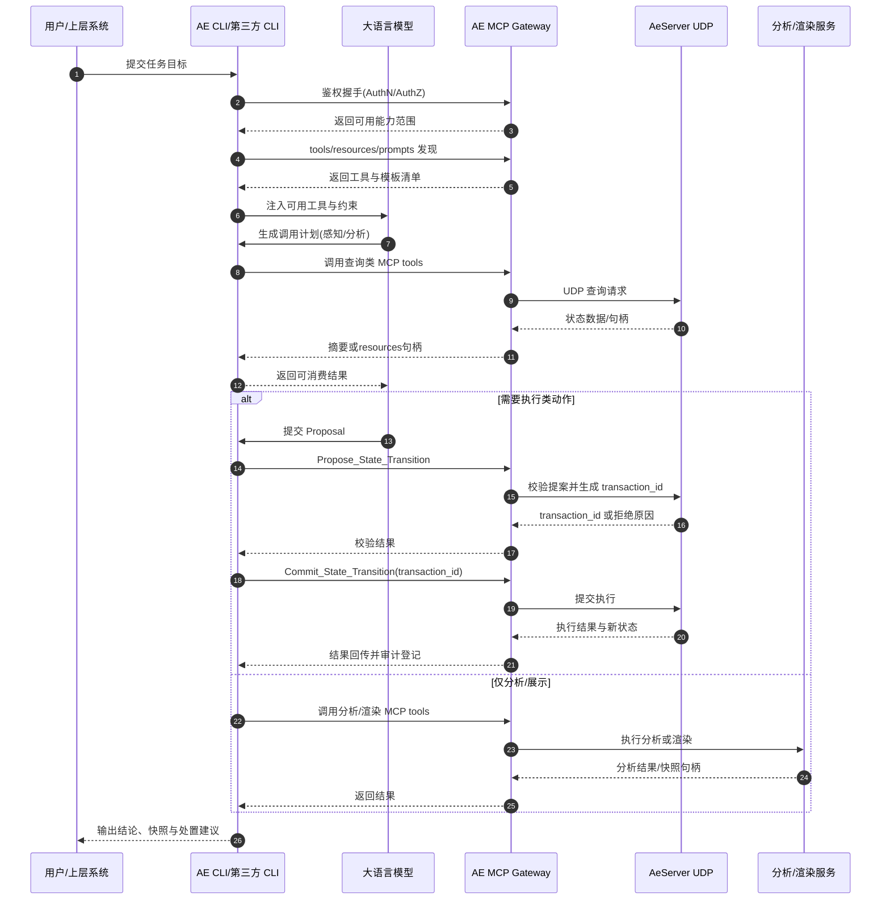

# 大模型接入 Ae 的软件架构

本章假设 AeServer 已发布并稳定运行。AeServer 的内部实现已在其他章节说明，这里不再展开。

本章只回答一件事：在这个前提下，还需要哪些软件，才能让大语言模型稳定访问 Ae 数据、调用 Ae 工具并执行受控操作。

## 1. 需要准备的软件

详见 [需要准备的软件](./01_software_stack.md)，以下为概要。

### 1.1 AE MCP Gateway

AE MCP Gateway 是 AeServer 面向大模型的关键适配层，负责把后端能力转换为标准 MCP 接口：

- 把查询与执行能力封装成 MCP **tools**。
- 把大结果集封装成 MCP **resources**，支持摘要、句柄、分页、流式四种返回形式。
- 把空间任务模板注册为 MCP **prompts**，供任何连入的 CLI 直接发现和调用。
- 自行执行身份验证（token / API key）与工具级权限控制，不依赖调用方 CLI 自行兜底。
- 对每个调用者按 Principal 记录审计日志，实施配额与速率限制。

Gateway 还需完成 UDP 同步封装：请求配对、超时重试与幂等保证都在 Gateway 层处理。


### 1.2 AE CLI（ Agent Runtime）

AE CLI 是 Aether 自己构建的 AI agent 运行时，也是 Gateway 的第一个官方 MCP 客户端。

职责：

- 管理用户会话与上下文记忆。
- 连接 Gateway，发现 tools / resources / prompts。
- 执行权限 hooks 与 Propose→Commit 执行状态机。
- 向用户呈现结果或驱动下游系统。


### 1.3 第三方 CLI 接入

由于 Gateway 遵循 MCP 标准协议，实现 MCP client 的第三方 CLI 通常可以在不改 Gateway 的情况下接入：

| CLI | 接入方式 |
|---|---|
| Claude Code | stdio / HTTP MCP client，官方支持完整 |
| Gemini CLI | stdio / HTTP MCP client，streaming 与 resources/read 需进行 capability negotiation |
| OpenClaw | stdio MCP client，依赖其自身 MCP client 实现版本 |

第三方 CLI 接入有以下前提：

- Gateway 自带 AuthN/AuthZ，第三方 CLI 只能调用其被授权的工具集合。
- 每次工具调用携带调用者身份（Principal），Gateway 写入审计日志。
- Gateway 对每个接入客户端实施配额与速率限制。

### 1.4 Skill 层

Skill 是把"常见空间任务模式"固化成可复用调用模板的能力包。

职责：

- 描述任务目标与约束（坐标系、bbox、最大记录数）。
- 约束工具调用顺序与输入输出边界。
- 在失败时提供标准恢复策略。

Skill 通过 MCP Gateway 注册为 `prompts`，AE CLI 和第三方 CLI 都能发现，不需要各自重新实现任务编排。Skill 与 MCP tool schema 版本绑定，Gateway 升级后 Skill 不会静默失效。


## 2. 接入后大模型能做什么

详见 [接入后大模型能做什么](./02_llm_capabilities.md)，以下为概要。

在上述软件齐备后，大模型通过任意一个接入的 CLI，可以稳定完成四类任务：

- **感知**：查询区域热度、实体状态、事件分布。
- **分析**：碰撞风险判断、轨迹预测、约束冲突识别。
- **执行**：提出状态变更，经校验后提交；控制实体状态；冻结空域。
- **表达**：触发渲染，生成截图或可视快照，输出任务解释与处置建议。

这些能力均通过 Gateway 暴露的工具完成，不由模型直接消费 UDP 协议或连接渲染引擎。

### 2.1 本地处理与服务端处理的分工


在实际接入中，确实会存在把数据拉到本地处理的需求，例如 Gemini + Google Maps JS Viewer 这类本地交互场景。建议采用以下分工：

- 小数据、短时间窗、以交互为主的任务：允许拉取到本地做可视化和轻量分析。
- 大数据、长时间窗、需要全局一致性的任务：留在服务端计算，只返回摘要或句柄。
- 任何会改写状态的操作：必须回到服务端走 Proposal/Commit 与审计链。

默认策略：

1. 先返回摘要与句柄，不做全量搬运。
2. 本地只缓存当前视窗或当前任务所需的数据切片。
3. 超过带宽或体量阈值时，强制切换为服务端计算 + 句柄回传。

## 3. 软件接入链路

```
用户 / 上层系统
        ↓
AE CLI  /  Claude Code  /  Gemini CLI  /  OpenClaw
        ↓
AE MCP Gateway（tools / resources / prompts，自带 AuthZ + 配额 + 审计）
        ↓
AeServer UDP                    分析服务  /  渲染服务
（时空状态真值与执行核心）        （高阶计算与视觉输出）
```

### 3.1 大语言模型接入时序图



## 4. 本章子文档导读

| 文档 | 回答什么 |
|---|---|
| [需要准备的软件](./01_software_stack.md) | Gateway、AE CLI、第三方 CLI、Skill 层各自的职责与实现要求 |
| [接入后大模型能做什么](./02_llm_capabilities.md) | 四类任务详解，以及本地与服务端处理的分工原则 |
