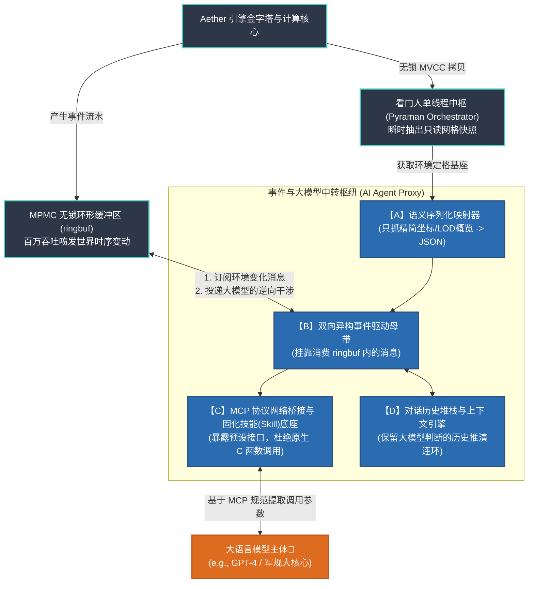

# 大语言模型 (LLM) 空间感知与交互工作流 (Prompt Framework)

本规范用于阐明 Aether (æ) 引擎如何作为“空间大脑”与外部的 LLM 进行通信。严格遵循 **按需加载 (LOD Pull)**、**只下发语义不传送坐标体素** 以及 **底层几何隔离计算 (Decoupled Geometry Math)** 的工程准则。通过建立此类工作流，可防止复杂的矢量拓扑数据结构将 LLM 的 Context 窗口撑爆，同时最大限度抑止由于注意力溢出导致的逻辑“幻觉”。

---

## 0. 事件驱动的 AI 代理结构图 (Agent Architecture)

要让大语言模型稳定参与分布式实时空间网格服务的决策，仅靠直接投喂 JSON 不足以支撑，需要在引擎外部构建独立代理中枢。



### 【代理架构的四大核心研发模块】
针对上述拓扑，研发侧需要实现以下功能模块：
1. **语义序列化模块 (Semantic Serializer)**：将 `Pyraman` 导出的 C 结构快照转换为语义级 JSON（如 `{"entity_102": {"type": "vehicle", "level": 3...}}`），避免直接传输大规模顶点数据。
2. **双向事件总线转接器 (Bi-directional Event Adapter)**：作为 `ringbuf` 消费方订阅关键事件（如 `CALCULATION_DONE`），并转换为模型可用提示。
3. **MCP 原子化技能层 (MCP Protocol & Skills)**：代理通信统一经由 MCP。对外暴露原子化、无状态能力（如索引获取、缓冲区查询），避免模型直接访问核心内存。
4. **外部状态机与上下文缓存 (State Machine Memory)**：多轮会话状态由外部代理层维护，Aether 聚焦原子计算与结果返回。
5. **无状态编排范式 (Stateless Orchestration)**：长链路任务的中间态由 MCP Server 与模型上下文承载，不在 Aether 内长期驻留。

---

## 阶段一：感知初始化与顶层宏观截断 (LOD Level 0-2)

在系统启动或大模型刚接入世界状态机时，不应向模型投喂千万级叶子节点数据，而是利用“金字塔”顶层提供高阶聚类信息字典构成的基线副本。

### **LLM 意图 (Prompt / Action)**
模型发起空间大盘概览请求，限定只读取金字塔顶层网络结构。
```json
{
  "action": "grid_macro_snapshot",
  "max_lod_depth": 2,
  "request_type": "entity_density"
}
```

### **Aether 返回基线 (Engine Target Output)**
得益于稀疏哈希表底座，未实例化的空网格直接不予序列化（Zero Padding）。只输出具备实体聚集的热点区块概况。
```json
{
  "status": "ok",
  "timestamp": 1782345600,
  "macro_sectors": [
    { "sector_id": "L2_X4_Y7", "entity_count": 5214, "event_heat": "high" },
    { "sector_id": "L2_X5_Y7", "entity_count": 12, "event_heat": "low" }
  ]
}
```
*此时，LLM 仅消耗了极少数 Token 即对整个虚拟空间的热点区域建立起完备认知。*

---

## 阶段二：焦点下探与局部精细拉取 (Attention Deep Dive)

当 LLM 根据阶段一的数据判定 `L2_X4_Y7` 区域存在异常并需要介入时，发起对该指定父层级网格范围的空间穿透查询。

### **LLM 意图 (Prompt / Action)**
发令引擎启动 `pyramid_query` 下游钩子。
```json
{
  "action": "pyramid_query",
  "target_sector": "L2_X4_Y7",
  "entity_class_filter": ["agent", "vehicle"],
  "radius_meters": 500
}
```

### **Aether 返回基线 (Engine Target Output)**
引擎利用看门人单线程中枢 (Pyraman Orchestrator) 瞬时切分出无锁副本，精准投递指定圆周内的实体状态属性包。
```json
{
  "sector": "L2_X4_Y7",
  "entities": [
    { "real_id": 10245, "type": "vehicle", "velocity_vector": [15.2, 0, 0] },
    { "real_id": 10246, "type": "agent", "state": "idle" }
  ]
}
```

---

## 阶段三：规避浮点灾难，委托硬件级别拓扑计算 (参见本章第 4 节：空间分析管线)

当 AI 在阶段二发现了两架逼近的无人机时，它将通过调用本地预设的 Skill (MCP Tool)，把**深度的空间几何裁切与布尔运算**直接抛给 **本章第 4 节 (Spatial Analysis Pipelines)** 中的底层连续几何管线进行原生处理。

### **LLM 意图 (Prompt / Action)**
大模型不对空间关系作自我演算（如推演实体距离、碰撞可能），直接发出逻辑意图验证。
```json
{
  "action": "math_delegate_intersection",
  "parameters": {
    "subject_id": 10245,
    "target_id": 10246,
    "predict_time_window_sec": 3.0
  }
}
```

### **Aether 返回基线 (Engine Target Output)**
引擎利用网格的 $O(1)$ 查找迅速计算，上抛唯一的极简布尔结论。
```json
{
  "result_event": "imminent_collision",
  "time_to_impact": 1.2,
  "confidence": 1.0
}
```
*大模型接收后即可直接执行业务逻辑判断：“发出避让指令动作”，而未碰触一行三角剖分或射线求交测试公式。*

---

## 阶段四：自然轮次交互下的增量事件流维系 (Incremental Event Sync)

进入平稳维持期之后，LLM 不再执行全量轮询 (Polling)，而是订阅底座内的 MPMC 无锁环形缓冲区抛出的变化消息流。

### **Aether 异步推送 (Event Stream Push)**
```json
[
  { "time": 1782345601, "event": "ENTITY_MOVE", "id": 10245, "delta": [2.1, 0] },
  { "time": 1782345602, "event": "ENTITY_DESTROYED", "id": 10246 }
]
```
通过增量信息推送，模型可在长期交互中仅覆写变更状态，减少全量重投带来的时延抖动。

---

## 阶段五：具象化核实与可视化渲染出图 (参见本章第 2 节：AVA 视效引擎)

在实际业务中，干巴巴的 JSON 往往缺乏直接说服力。此时大语言模型可以联动 **本章第 2 节 (AVA Visualization)** 提供的视效工具链，生成直观的可视化图片。

### **LLM 意图 (Prompt / Action)**
大模型在作出“航线需要调拨”的决策后，请求外围渲染插件截取当前交汇点的画面快照以向人类用户佐证：
```json
{
  "action": "trigger_visual_render",
  "target_sector": "L2_X4_Y7",
  "renderer": "cairo_2d",
  "highlight_entities": [10245, 10246],
  "output_format": "png_base64"
}
```

### **Aether 返回基线 (Engine Target Output)**
底层的调度中枢将内存快照喂给 `Cairo` 或 `Vulkan` 节点，渲染器瞬间烘焙出一张只读的局部二维平面图或三维轴测图，并返回给大模型前端。
```json
{
  "status": "render_complete",
  "image_url": "data:image/png;base64,iVBORw0KGgoAAAANSUhEUgAAA...",
  "description": "已为您生成实体 10245 与 10246 当前的三维交汇预测截图。"
}
```
*通过挂载此类渲染工具，大模型不仅可执行计算协调，也可直接输出可视化结果用于业务沟通。*

---

## 阶段六：防溢出的极大规模结果集句柄透传 (Handle Delegation)

在高度复杂的空间链路（如“查出横跨浦东新区所有 50 万个商铺并出图”）中，传统 GIS 会将海量实体序列化为 JSON 返回给 AI 代理中继，再由代理转发给渲染器。在此模式下，巨大的网络 I/O 开销与序列化成本将瞬间引爆引擎与服务器网络极限（Serialize Hell）。针对此架构灾难，Aether 采取了**结果句柄锁与本地计算组装下推**的零搬运准则。

### 1. 引擎不抛数据，只发“提取凭证 (Token Handle)”
当大模型触及高载量区间检索时，Aether 会跳过序列化，在内部快照池生成结果试图（View），仅跨网络扔回一个 64 位整型的句柄编号。
```json
// Aether 返回大模型：避免了长达几十 MB 的巨型 JSON 文本溢出
{
  "status": "massive_query_completed",
  "result_count": 521478,
  "result_token": "VIEW_TOKEN_8F9A2C"
}
```

### 2. 算力节点内闭环，零内存拷贝机制
当大模型决策对该区域执行渲染（或几何拓扑分析等高负载复查）时，其发出的指令通过 MCP 句柄进行透传。由于渲染客户端 (如 Vulkan) 与 Aether 引擎共享统一内存地址空间，渲染器可直接通过主存引用绕过网络套接字传输，在主机物理内存内部实现 $O(1)$ 级的数据读取与着色计算。
```json
// LLM 仅传输此令牌指令让渲染器执行任务
{
  "action": "trigger_visual_render",
  "target_handle": "VIEW_TOKEN_8F9A2C"
}
```
**在该推演链路中，涉及大规模几何与拓扑数据可保持在物理主存内，避免高成本网络序列化与搬移。模型与代理通过句柄（Handle）机制调度，可提升高并发场景下的一致性与吞吐效率。**
