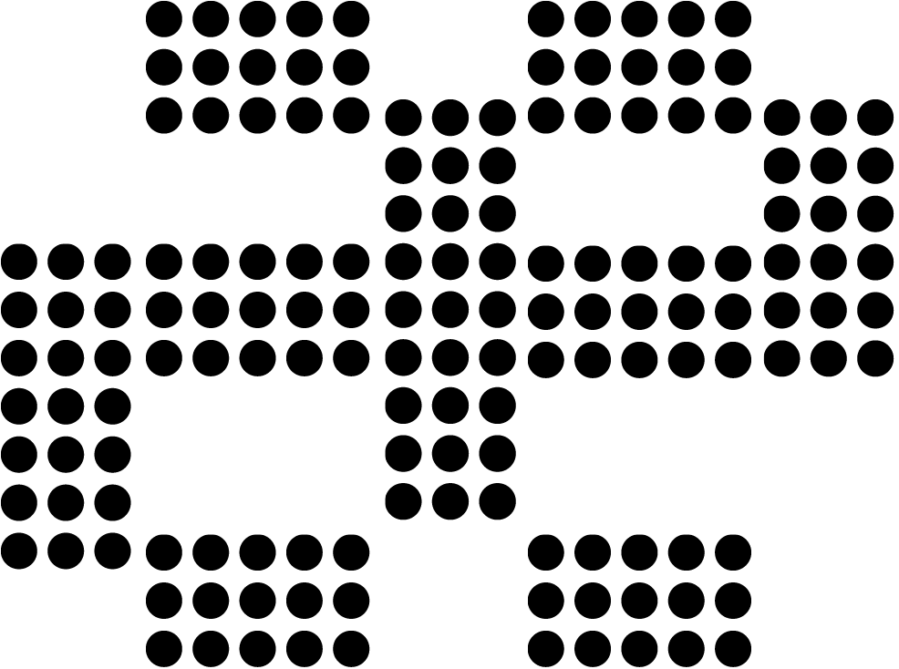
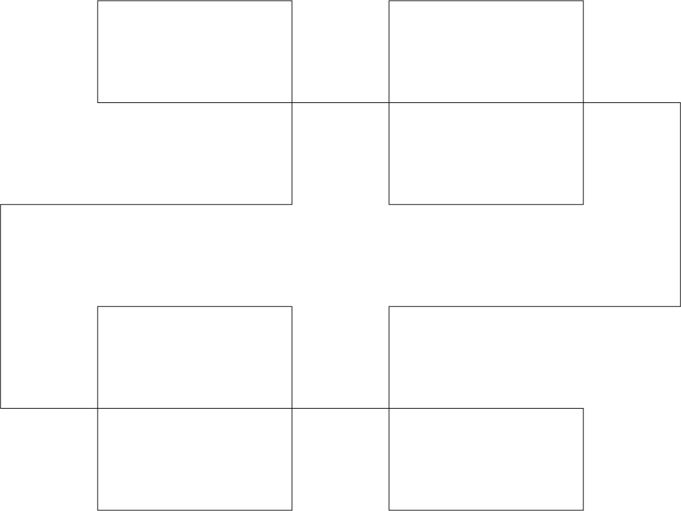
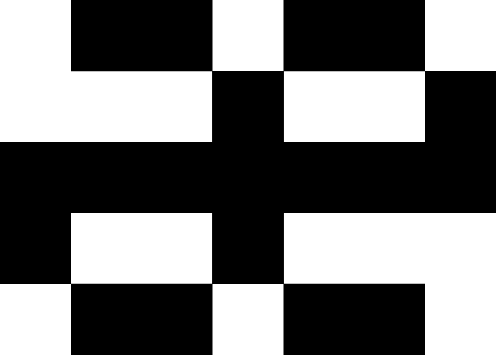

# 品牌与识别规范 (Brand & Identity)

Aether (æ) 引擎的视觉识别系统是其“物理世界格点化”核心哲学的符号缩影。

## 1. 核心标识：格点连字 (The Grid Ligature)

标识核心基于古英语连字 **`æ` (Ash Ligature)**，通过离散网格语法表达 Aether 作为“时空媒介”对离散运算（Algorithms）与连续环境（Environments）的耦合关系。

### 视觉资产 (V2 Styles)
当前提供三套 V2 风格（均为 `æ` 连字语义，不同视觉语气）：

*   **Style 0 - Solid Grid（主标建议）**
    *   矢量: [logo0.svg](./assets/logo0.svg)
    *   黑底浅字预览: 
    *   白底深字预览: 
*   **Style 1 - Dot Matrix（点阵版）**
    *   矢量: [logo1.svg](./assets/logo1.svg)
    *   黑底浅字预览: 
    *   白底深字预览: 
*   **Style 2 - Wireframe（线框版）**
    *   矢量: [logo2.svg](./assets/logo2.svg)
    *   黑底浅字预览: 
    *   白底深字预览: 

### V2 源工程文件 (Layer Source)
*   统一源文件: [logo1.ai](./assets/logo1.ai)
*   文件说明: 该 AI 文件包含全部 V2 Logo 版本，按图层组织。
*   使用建议: 后续改字重、节点密度、导出比例与多尺寸切图时，统一从该源文件取用并导出。

### 历史版本 (V1 Legacy)
> 备注：V1 因整体比例偏扁导致识别稳定性与跨场景适配较弱，现已弃用，仅作历史归档，不再用于对外发布物。

*   矢量图标: [logo.svg](./assets/v1/logo.svg)
*   预览图: 
*   设计源文件: [logo.ai](./assets/v1/logo.ai)

### 官方 ASCII 签名 (Standard Variant)
用于控制台输出、核心代码 Header 记录。基于 13x5（或等比扩展 7x5）的格点逻辑：

```text
  ████  ████
       █     █
 █████████████
 █     █
  ████  ████
```

---

## 2. 设计规范

V2 资产在保持统一高度的前提下，针对不同风格做了比例微调：

*   **统一高度基线**：V2 PNG 高度统一为约 **734 px**（导出差异在 1 px 内）。
*   **比例控制（按 SVG ViewBox）**：
    *   Style 0: `984.07 x 733.07`，约 **1.342:1**
    *   Style 1: `1002.84 x 732.07`，约 **1.370:1**
    *   Style 2: `984.07 x 733.07`，约 **1.342:1**
*   **构造细节**：
    *   均基于 `a/e` 连字的网格构型，不改变核心识别。
    *   差异主要体现在填充语法（实心 / 点阵 / 线框）与视觉密度。

---

## 3. 色彩与应用场景

为了保持底层、高性能且克制的工程感，Aether 使用二元高对比度配色：

| 元素 | 颜色 | 建议环境 |
| --- | --- | --- |
| **Grid Black** | #000000 | 浅色文档、源码打印、浅色网页背景 |
| **Pure White** | #FFFFFF | 深色 IDE、终端控制台 |

### 配色演进机制

当前以黑白高对比为核心基线。除主色外的功能色与强调色采用“逐步累积、版本化更新”策略：

1.  每次新增配色需标注用途（状态色 / 图表色 / 强调色）与适用场景。
2.  新增色值优先保证与黑底技术风格兼容，并通过可读性检查后再纳入规范。
3.  配色调整按版本记录，允许迭代优化，不要求一次性冻结完整色板。
4.  未进入规范的实验色，仅用于内部草图，不用于对外发布物。

### 风格语义模型

V2 三风格不是单纯造型变化，而是对应不同叙事语境：

| 风格 | 系统语义 | 视觉气质 | 推荐角色 |
| --- | --- | --- | --- |
| **Style 0 - Solid Grid** | 内核稳定态、基础设施可信基线 | 稳定、克制、官方 | 主标 / 默认品牌入口 |
| **Style 1 - Dot Matrix** | 运行态、采样态、并行节点活性 | 数据感、流动感、实时计算 | 封面主视觉 / 发布页首屏 |
| **Style 2 - Wireframe** | 设计态、规则态、架构可解释性 | 结构感、蓝图感、工程秩序 | 架构图底纹 / 技术宣言页 |

### 场景映射

| 场景 | 首选风格 | 次选风格 | 说明 |
| --- | --- | --- | --- |
| 官网首页 Hero | Style 1 | Style 0 | 强化“计算正在发生”的实时感 |
| 白皮书封面 | Style 1 | Style 0 | 与标题、网格透视背景组合效果最佳 |
| 架构蓝图页 | Style 2 | Style 0 | 配合同心圆/HUD 线框可读性更高 |
| API/开发文档页眉 | Style 0 | Style 2 | 保持清晰与一致，不干扰正文阅读 |
| 演示开场页（Keynote） | Style 1 | Style 2 | 运行态开场，设计态过渡到架构章节 |

### 组合建议

1.  **标题叠加策略**：大标题叠加 Logo 时，优先使用 Style 1 或 Style 2 作为背景层，避免与正文竞争视觉中心。
2.  **背景复杂度控制**：当页面已有高密度网格或 HUD 元素时，Logo 建议降低亮度或线重，保持主体文字可读。
3.  **单页单主语义**：同一页面建议仅使用一种主风格，不混用点阵与线框作为同级主视觉。

### 字体系统（微型英文标注）

为保证小尺寸英文字符在暗色技术画面中的清晰度，视觉系统引入像素字库 Silkscreen。

*   字库路径: [assets/Silkscreen/Silkscreen-Regular.ttf](./assets/Silkscreen/Silkscreen-Regular.ttf)
*   粗体路径: [assets/Silkscreen/Silkscreen-Bold.ttf](./assets/Silkscreen/Silkscreen-Bold.ttf)
*   许可文件: [assets/Silkscreen/OFL.txt](./assets/Silkscreen/OFL.txt)

推荐用法：
1.  适用对象：版本号、构建号、坐标标注、HUD 辅助标签、英文短注释。
2.  推荐字号：10-14 px（屏幕展示）；印刷导出建议转曲后再统一检查字距。
3.  字重策略：默认使用 Regular，只有在背景亮噪较强时才切换 Bold。
4.  语言范围：优先用于英文与数字小标注；中文正文与主标题仍使用常规正文字体体系。
5.  避免事项：不用于长段正文，不用于大标题，不进行描边和发光叠加。

### 应用指南
1.  **默认主标**：对外正式文档优先使用 Style 0（Solid Grid）。
2.  **语境化选型**：
    *   Style 1（Dot Matrix）用于强调“离散采样 / 数据点阵”语义。
    *   Style 2（Wireframe）用于结构示意、架构图、技术说明页。
3.  **代码注释头**：核心子系统入口文件可保留 ASCII 签名。
4.  **禁止行为**：严禁对 Logo 进行非等比拉伸、阴影羽化或添加彩色渐变。
