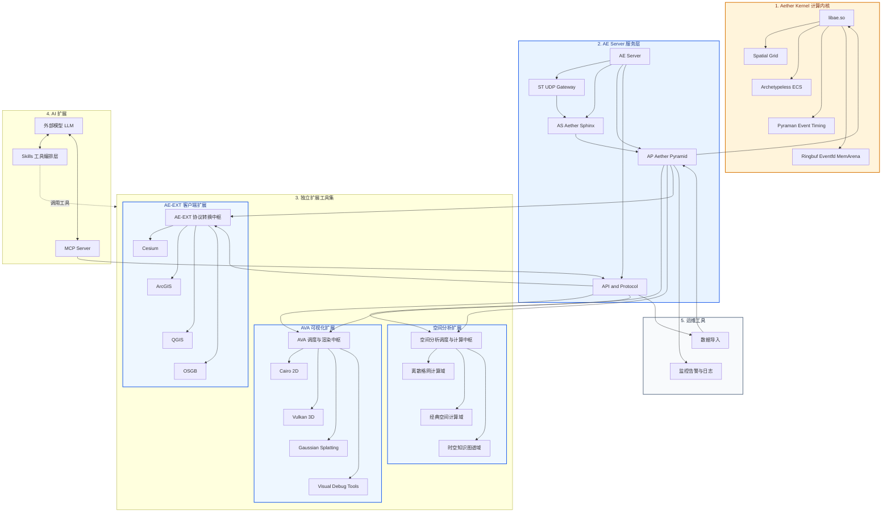

# Aether 核心与服务封装架构图

## 说明
- 只有两层：1 内核，2 服务。
- AE Server 负责把内核包起来并提供可运行服务。
- AP 进程链接内核后，Server 体系即可对外运行。
- 扩展模块是独立生态，不属于 AE Server 本体。
- AE Server 通过 API and Protocol 对接可视化、空间分析、客户端三大扩展。
- AI 侧采用外部模型 + MCP + Skills 的扩展结构，通过 Aether API 获取数据并调用扩展工具处理。
- 图中 `Skills -> 独立扩展工具集` 的虚线表示逻辑调用关系，实际执行链路仍通过 MCP/API。
- AVA 作为可视化中枢，从 AE Server 获取数据后分派到不同可视化引擎绘图。
- 空间分析扩展也采用同样模式：从 AE Server 取数后，由分析中枢分派到具体分析工具执行。
- 存量客户端扩展以 AE-EXT 为基础：从 AE Server 取数后完成协议转换，再下发到 Cesium/ArcGIS/QGIS/OSGB。
